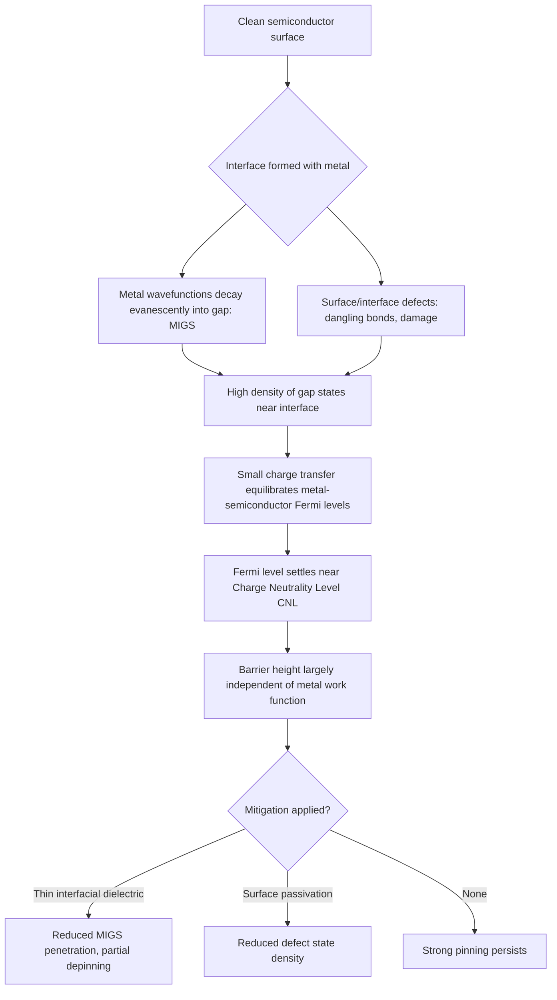

## Fermi Level Pinning

### Definition and Physical Origin

Fermi level pinning refers to the phenomenon in which the Fermi level at a metal-semiconductor interface becomes fixed at a specific energy position within the semiconductor bandgap, largely independent of the metal's work function. This behavior directly contradicts the predictions of the ideal Schottky-Mott model, which states that the Schottky barrier height should vary linearly with metal work function according to:

$$\phi_{Bn} = \phi_M - \chi_s$$

where $\phi_{Bn}$ is the barrier height for an n-type semiconductor, $\phi_M$ is the metal work function, and $\chi_s$ is the semiconductor electron affinity. In real interfaces, experimental barrier heights deviate substantially from this relation, and for many semiconductor systems (particularly covalent semiconductors like Si, Ge, and GaAs), $\phi_{Bn}$ shows only weak dependence on $\phi_M$. This insensitivity is the hallmark of Fermi level pinning.

### The Bardeen Model

The theoretical explanation was first proposed by Bardeen in 1947. Bardeen postulated the existence of a high density of localized electronic states within the semiconductor bandgap, physically located at the semiconductor surface (or interface), known as **Metal-Induced Gap States (MIGS)** or interface states.

**Key mechanism:**

- These interface states act as a charge reservoir with very high state density.
- Even a small amount of charge transfer into or out of these states (to align the Fermi levels of the metal and semiconductor) is sufficient to establish an equilibrium condition.
- Because the state density is so high, the Fermi level becomes "pinned" near the **charge neutrality level (CNL)** of these interface states, rather than being determined by the metal work function.
- The semiconductor surface's own electrostatics dominate the barrier formation, largely decoupling the barrier height from $\phi_M$.

In the fully pinned limit, the barrier height becomes:

$$\phi_{Bn} \approx E_g - \phi_0$$

where $E_g$ is the semiconductor bandgap and $\phi_0$ is the energy of the charge neutrality level measured from the valence band edge — a quantity that depends only on the semiconductor, not the metal.

### Origins of Interface States

**Metal-Induced Gap States (MIGS)**

- Arise intrinsically from the quantum mechanical tailing of metal wavefunctions into the semiconductor's forbidden gap at the junction.
- Even for a chemically "ideal," defect-free, abrupt interface, the wavefunction of electrons at the Fermi level in the metal decays evanescently into the semiconductor, creating a continuum of states within the gap near the interface.
- MIGS density and their charge neutrality level are intrinsic properties of the semiconductor band structure (derived from the complex band structure), explaining why different metals on the same semiconductor tend to pin near a similar barrier height.

**Extrinsic (Defect-Related) States**

- Dangling bonds from an unterminated semiconductor surface.
- Interface defects introduced during metal deposition (sputtering damage, ion bombardment).
- Interdiffusion, unintentional interfacial reaction layers (e.g., silicides, oxides).
- Contamination and native oxide remnants at the interface.

Both intrinsic (MIGS) and extrinsic (defect) mechanisms can contribute simultaneously, and disentangling their relative contributions is often difficult experimentally.

### Degree of Pinning: The Pinning Parameter S

A useful metric to quantify the strength of Fermi level pinning is the **pinning factor (slope parameter)** $S$, defined as:

$$S = \frac{d\phi_{Bn}}{d\phi_M}$$

- **$S = 1$**: No pinning — ideal Schottky-Mott behavior, barrier height fully tracks metal work function.
- **$S = 0$**: Complete (strong) pinning — barrier height is entirely independent of metal work function.
- **$0 < S < 1$**: Partial pinning — the common experimental case for most real semiconductor-metal systems.

**Representative behavior by material:**

- **Si, Ge, GaAs**: Strongly pinned, $S$ typically in the range of 0.05–0.3, indicating dominant MIGS/defect state influence.
- **Ionic/wide-gap semiconductors (e.g., SiO₂, some II-VI compounds, ZnO in certain preparations)**: Weaker pinning, $S$ closer to 1, because MIGS decay more rapidly (shorter decay length) into more ionic lattices with larger gaps.

The correlation between pinning strength and semiconductor ionicity was systematized empirically (Kurtin, McGill, Mead) and later given a physical basis by MIGS theory.

### Consequences for Device Design

- **Barrier height engineering limitations**: Because $\phi_{Bn}$ is pinned, simply choosing a metal with a different work function often fails to achieve the desired barrier height (high or low) for ohmic or rectifying contacts.
- **Ohmic contact formation**: Since pinning prevents work-function tuning from lowering the barrier sufficiently, ohmic contacts on strongly pinned semiconductors (e.g., n-GaAs, n-Si) are instead achieved through heavy doping at the interface to enable carrier tunneling through a narrow depletion region, rather than lowering the barrier itself.
- **Contact resistance**: Pinning-induced barrier heights that don't match the ideal design constrain minimum achievable specific contact resistivity in transistor source/drain contacts.
- **Reproducibility**: Sensitivity of interface state density to processing conditions (surface cleaning, deposition method, post-metallization anneal) means pinning behavior — and hence barrier height — can vary between fabrication runs unless interface chemistry is tightly controlled. [Inference: exact reproducibility figures are process-dependent and not universally quantifiable.]

### Mitigation Strategies

**Insertion of Ultra-Thin Interfacial Layers**

- Inserting a thin dielectric or wide-gap semiconductor layer (a few monolayers, e.g., $\text{Al}_2\text{O}_3$, $\text{MgO}$, or a wide-gap semiconductor buffer) between the metal and semiconductor can partially "depin" the Fermi level.
- The thin layer suppresses the exponential decay tail of the metal wavefunctions into the semiconductor, reducing MIGS density at the semiconductor surface and restoring partial work-function dependence.
- Trade-off: the interfacial layer must be thin enough to allow carrier tunneling for practical current conduction, typically on the order of 1 nm or less.

**Surface Passivation and Chemical Treatments**

- Sulfur passivation (e.g., $(\text{NH}_4)_2\text{S}$ treatment) on III-V semiconductor surfaces to saturate dangling bonds and reduce defect-state density.
- Hydrogen passivation of Si surfaces.
- These treatments primarily target the extrinsic (defect-related) component of pinning.

**Doping-Induced Dipole Engineering**

- Introducing a thin, heavily doped layer at the interface to modify the local band bending and effective barrier via tunneling, complementary to true depinning.

**Selection of Interface Orientation and Crystallography**

- Different crystallographic surface orientations and reconstructions can present different surface state densities and spatial distributions, offering some (limited) control over pinning behavior.

### Illustration: Band Diagram Comparison

<svg xmlns="http://www.w3.org/2000/svg" viewBox="0 0 900 420" font-family="Arial, sans-serif">
<text x="450" y="24" text-anchor="middle" font-size="16" font-weight="bold" fill="#222">Ideal vs. Pinned Schottky Barrier (svg_diagram)</text>

<text x="220" y="50" text-anchor="middle" font-size="13" fill="#333">Ideal (Schottky-Mott)</text>

<line x1="60" y1="90" x2="60" y2="360" stroke="#333" stroke-width="1.5" />

<line x1="60" y1="360" x2="380" y2="360" stroke="#333" stroke-width="1.5" />

<rect x="60" y="90" width="90" height="270" fill="#c9d6e3" stroke="#333" />
<text x="105" y="80" text-anchor="middle" font-size="11" fill="#333">Metal</text>
<line x1="60" y1="140" x2="150" y2="140" stroke="#555" stroke-width="1.5" />
<text x="20" y="144" font-size="10" fill="#555">E_F</text>

<path d="M150,160 C230,160 260,200 380,200" fill="none" stroke="#1a5fb4" stroke-width="2.5" />
<text x="385" y="200" font-size="10" fill="#1a5fb4">Ec</text>
<path d="M150,320 C230,320 260,300 380,300" fill="none" stroke="#c01c28" stroke-width="2.5" />
<text x="385" y="304" font-size="10" fill="#c01c28">Ev</text>
<line x1="150" y1="140" x2="150" y2="140" stroke="#555" />
<line x1="150" y1="140" x2="150" y2="160" stroke="#555" stroke-dasharray="3,2" />
<text x="158" y="152" font-size="10" fill="#000">phi_Bn (tracks phi_M)</text>

<text x="680" y="50" text-anchor="middle" font-size="13" fill="#333">Pinned (Bardeen / MIGS)</text>

<line x1="520" y1="90" x2="520" y2="360" stroke="#333" stroke-width="1.5" />

<line x1="520" y1="360" x2="840" y2="360" stroke="#333" stroke-width="1.5" />

<rect x="520" y="90" width="90" height="270" fill="`#c9d6e3`" stroke="#333" />

<text x="565" y="80" text-anchor="middle" font-size="11" fill="#333">Metal</text>

<line x1="520" y1="180" x2="610" y2="180" stroke="#555" stroke-width="1.5" />

<text x="480" y="184" font-size="10" fill="#555">E_F</text>

<g stroke="#888" stroke-width="1">
<line x1="612" y1="185" x2="618" y2="185" />
<line x1="612" y1="195" x2="618" y2="195" />
<line x1="612" y1="205" x2="618" y2="205" />
<line x1="612" y1="215" x2="618" y2="215" />
<line x1="612" y1="225" x2="618" y2="225" />
</g>
<text x="622" y="210" font-size="9" fill="#666">MIGS</text>
<path d="M610,190 C660,190 680,190 840,190" fill="none" stroke="#1a5fb4" stroke-width="2.5" />
<text x="845" y="194" font-size="10" fill="#1a5fb4">Ec</text>
<path d="M610,310 C660,310 680,310 840,310" fill="none" stroke="#c01c28" stroke-width="2.5" />
<text x="845" y="314" font-size="10" fill="#c01c28">Ev</text>
<line x1="610" y1="180" x2="610" y2="190" stroke="#555" stroke-dasharray="3,2" />
<text x="618" y="172" font-size="10" fill="#000">phi_Bn ≈ pinned at CNL</text>

<text x="450" y="395" text-anchor="middle" font-size="11" fill="#555">Left: barrier height varies with metal work function. Right: barrier height fixed near charge-neutrality level regardless of metal.</text>

</svg>

### Fermi Level Pinning Formation Process

### Key Points

- Fermi level pinning causes the Schottky barrier height to be largely independent of the metal work function, contrary to the ideal Schottky-Mott model.
- The Bardeen model attributes this to a high density of interface states (MIGS and/or defects) that act as a charge buffer.
- The pinning factor $S = d\phi_{Bn}/d\phi_M$ quantifies pinning strength, ranging from 0 (fully pinned) to 1 (unpinned).
- Covalent semiconductors (Si, Ge, GaAs) tend to be strongly pinned; more ionic materials tend to be less pinned.
- Mitigation includes ultra-thin interfacial dielectric layers, surface passivation, and heavy interface doping for practical ohmic contact formation.

### Related Topics

- Schottky-Mott rule and ideal metal-semiconductor junction theory
- Metal-Induced Gap States (MIGS) and complex band structure
- Charge neutrality level (CNL) calculation methods
- Schottky barrier height measurement techniques (I-V, C-V, internal photoemission)
- Ohmic contact formation via tunneling and heavy doping
- Interfacial dipole layers and depinning strategies
- Surface passivation chemistry for III-V semiconductors