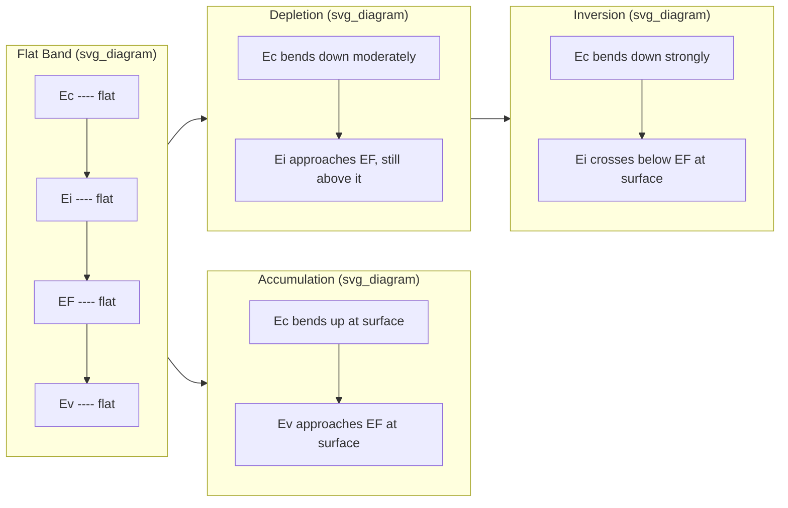

## MOS Energy Band Diagrams

### Overview

The MOS (Metal-Oxide-Semiconductor) energy band diagram is the foundational graphical tool for analyzing the electrostatics of the MOS capacitor. It plots electron energy $E$ as a function of position $x$ through the three-layer stack — metal (or polysilicon gate), oxide (typically $SiO_2$), and semiconductor (typically Si) — under an applied gate bias $V_G$. The diagram tracks how the conduction band edge $E_c$, valence band edge $E_v$, intrinsic Fermi level $E_i$, and Fermi level $E_F$ bend in response to the electric field established by the gate voltage, revealing the surface potential and the resulting charge state (accumulation, depletion, or inversion) at the semiconductor surface.

### Flat-Band Condition as the Reference State

**Key Points**

- The flat-band voltage $V_{FB}$ is the gate voltage at which the semiconductor bands are perfectly flat (no band bending), serving as the zero-reference point for all subsequent band diagram analysis.
- $V_{FB}$ is determined by the work function difference between the gate and semiconductor, plus contributions from fixed and trapped charges in the oxide and at the interface.
- The flat-band condition is expressed as:

$$V_{FB} = \phi_{MS} - \frac{Q_f}{C_{ox}}$$

where $\phi_{MS} = \phi_M - \phi_S$ is the metal-semiconductor work function difference, $Q_f$ is the effective oxide fixed charge (per unit area), and $C_{ox}$ is the oxide capacitance per unit area.

At flat band, $E_c$, $E_i$, and $E_v$ are horizontal lines throughout the semiconductor bulk and right up to the oxide interface — there is no band curvature and no net charge in the semiconductor.

### Building the Diagram: Reference Energy Levels

Before biasing, several reference levels must be fixed in the diagram:

- **Vacuum level** $E_{vac}$: the energy of a free electron just outside the material surface; this is the envelope that tracks electrostatic potential and bends continuously across all three regions under bias.
- **Work function** $\phi_M$ (metal) and $\phi_S$ (semiconductor): energy from $E_F$ to $E_{vac}$.
- **Electron affinity** $\chi$ (semiconductor) and $\chi_{ox}$ (oxide): energy from $E_c$ to $E_{vac}$.
- **Bandgap** $E_g$: separation between $E_c$ and $E_v$ ($1.12\,\text{eV}$ for Si at 300 K, $\sim 9\,\text{eV}$ for $SiO_2$).
- **Fermi level position** in the semiconductor bulk, set by doping:

$$E_i - E_F = kT \ln\left(\frac{N_A}{n_i}\right) \quad \text{(p-type)}$$

$$E_F - E_i = kT \ln\left(\frac{N_D}{n_i}\right) \quad \text{(n-type)}$$

The vacuum level continuity rule governs how the diagram is drawn: $E_{vac}$ must be a continuous (though slope-discontinuous at interfaces due to differing permittivities) curve, and all band edges are referenced to it via fixed offsets ($\chi$, $\phi$) that do not change with position or bias.

### Bending Mechanism Under Applied Gate Voltage

When $V_G \neq V_{FB}$, an electric field is established across the oxide and penetrates the semiconductor surface region. Because the semiconductor is not a perfect conductor, this field cannot be screened at a single plane — it decays over a finite depth, causing the bands to curve smoothly from their bulk values at $x \to \infty$ to shifted values at the oxide-semiconductor interface ($x = 0$).

The surface potential $\psi_s$ is defined as the amount of band bending at the surface, measured as the shift in intrinsic level:

$$\psi_s = \frac{E_i(\text{bulk}) - E_i(\text{surface})}{q}$$

Sign convention: $\psi_s > 0$ means bands bend **downward** near the surface (favorable for electrons); $\psi_s < 0$ means bands bend **upward** (favorable for holes).

Within the oxide, since it is treated as an ideal insulator with no charge (in the simplest model), the field is constant and the bands are **straight lines** (linear potential drop), not curved. This is a key visual distinguishing feature: oxide region → straight-line bending; semiconductor region → curved (parabolic near-surface, per the depletion approximation) bending.

### The Four Bias Regimes (p-type Substrate Example)

**Example**

For a p-type semiconductor substrate (majority carriers = holes, $E_F$ close to $E_v$ in the bulk):

1. **Flat Band** ($V_G = V_{FB}$): No bending. $E_c$, $E_i$, $E_v$ horizontal throughout.
2. **Accumulation** ($V_G < V_{FB}$, negative bias relative to flat band): Bands bend **upward** near the surface. $E_i$ moves further above $E_F$ at the surface, meaning $E_v$ moves closer to $E_F$ — hole concentration at the surface increases above the bulk value $N_A$. This is majority-carrier accumulation.
3. **Depletion** ($V_G$ slightly $> V_{FB}$, small positive bias): Bands bend **downward**. $E_i$ crosses closer to $E_F$, reducing the hole concentration at the surface below $N_A$, creating a depletion region of ionized acceptors ($N_A^-$) with negligible mobile carriers.
4. **Inversion** ($V_G \gg V_{FB}$, large positive bias): Bands bend down far enough that $E_i$ crosses **below** $E_F$ at the surface. This means $E_F$ is now closer to $E_c$ than to $E_v$ at the surface — the surface behaves as n-type even though the bulk is p-type. Electron concentration at the surface exceeds the bulk hole concentration.
   - **Threshold of inversion** is conventionally defined by the symmetry condition $\psi_s = 2\phi_F$, where $\phi_F = \frac{kT}{q}\ln(N_A/n_i)$ is the bulk Fermi potential — i.e., the surface electron concentration equals the bulk hole concentration ($n_s = N_A$).

For n-type substrate, all bending directions and inequality signs invert: accumulation occurs for $V_G > V_{FB}$ (downward-favoring-electrons becomes upward bending is reversed — bands bend downward for accumulation of electrons), and inversion (hole accumulation at surface) occurs for sufficiently negative $V_G$.

### Quantitative Relationship: Surface Potential and Band Edge Positions

At any position $x$ in the semiconductor, the local potential $\psi(x)$ (relative to bulk) shifts the bands rigidly together:

$$E_c(x) = E_c(\text{bulk}) - q\psi(x)$$

$$E_v(x) = E_v(\text{bulk}) - q\psi(x)$$

$$E_i(x) = E_i(\text{bulk}) - q\psi(x)$$

while $E_F$ remains **flat (constant with position)** throughout the semiconductor in thermal equilibrium (no current flow) — this is a defining feature of equilibrium band diagrams and a critical drawing rule: no matter how much $E_c$, $E_v$, $E_i$ bend, $E_F$ is drawn as one continuous horizontal line from deep bulk through the depletion region up to the surface.

The carrier concentrations at any point follow directly from the local separation between $E_F$ and the band edges:

$$n(x) = n_i \exp\left(\frac{E_F - E_i(x)}{kT}\right), \quad p(x) = n_i \exp\left(\frac{E_i(x) - E_F}{kT}\right)$$

This is why the band diagram is not just illustrative — it is a direct graphical encoding of local carrier density via the vertical distance between $E_F$ and $E_i$ (or $E_c$/$E_v$) at each $x$.

### Voltage Partitioning Across the Structure

The applied gate voltage divides between the oxide and the semiconductor:

$$V_G = V_{FB} + \psi_s + \frac{Q_s}{C_{ox}}$$

Equivalently, using $V_{ox}$ as the voltage dropped linearly across the oxide:

$$V_G = V_{FB} + V_{ox} + \psi_s, \qquad V_{ox} = -\frac{Q_s}{C_{ox}}$$

where $Q_s$ is the total semiconductor charge per unit area (depletion charge plus inversion charge, with appropriate sign). Graphically, $V_{ox}$ corresponds to the total vertical energy drop across the (straight-line) oxide region divided by $q$, and $\psi_s$ corresponds to the curved bending within the semiconductor. The band diagram is thus a direct visual accounting of how the terminal voltage splits between these two series elements.

### Diagram (Qualitative Band Bending Across Bias Regimes)

### SVG: p-type MOS Band Diagram at Inversion (svg_diagram)

<svg xmlns="http://www.w3.org/2000/svg" viewBox="0 0 720 380" font-family="Helvetica, Arial, sans-serif">
<text x="360" y="24" font-size="16" font-weight="bold" text-anchor="middle" fill="#1a1a1a">MOS Band Diagram — Strong Inversion, p-type Substrate (svg_diagram)</text>

<line x1="140" y1="50" x2="140" y2="340" stroke="#888" stroke-width="1" stroke-dasharray="4,3" />
<line x1="220" y1="50" x2="220" y2="340" stroke="#888" stroke-width="1" stroke-dasharray="4,3" />
<text x="90" y="45" font-size="12" text-anchor="middle" fill="#444">Metal</text>
<text x="180" y="45" font-size="12" text-anchor="middle" fill="#444">Oxide</text>
<text x="450" y="45" font-size="12" text-anchor="middle" fill="#444">Semiconductor (p-type)</text>

<path d="M 40 70 L 140 70 L 220 55 L 260 95 Q 320 130 700 130" fill="none" stroke="#999" stroke-width="1.5" stroke-dasharray="2,2" />
<text x="640" y="122" font-size="11" fill="#666">Evac</text>

<line x1="40" y1="150" x2="140" y2="150" stroke="#1a1a1a" stroke-width="2.5" />
<text x="60" y="144" font-size="11" fill="#1a1a1a">EF,metal</text>

<line x1="140" y1="95" x2="220" y2="175" stroke="#2b6cb0" stroke-width="2.5" />
<text x="150" y="90" font-size="10" fill="#2b6cb0">Ec,ox</text>

<path d="M 220 175 Q 260 195 700 260" fill="none" stroke="#2b6cb0" stroke-width="2.5" />
<text x="640" y="255" font-size="12" fill="#2b6cb0" font-weight="bold">Ec</text>
<path d="M 220 230 Q 260 260 700 305" fill="none" stroke="#38761d" stroke-width="2" stroke-dasharray="6,3" />
<text x="640" y="300" font-size="12" fill="#38761d" font-weight="bold">Ei</text>
<path d="M 220 285 Q 260 325 700 350" fill="none" stroke="#a61c1c" stroke-width="2.5" />
<text x="640" y="365" font-size="12" fill="#a61c1c" font-weight="bold">Ev</text>

<line x1="220" y1="292" x2="700" y2="292" stroke="#1a1a1a" stroke-width="2.5" stroke-dasharray="1,0" />
<text x="640" y="285" font-size="12" fill="#1a1a1a" font-weight="bold">EF</text>

<line x1="235" y1="50" x2="235" y2="340" stroke="#d97706" stroke-width="1" stroke-dasharray="3,2" />
<text x="238" y="60" font-size="10" fill="#d97706">surface (x=0)</text>
<text x="238" y="200" font-size="10" fill="#d97706">ψs = 2φF</text>

<circle cx="235" cy="273" r="4" fill="#d97706" />
<text x="245" y="270" font-size="10" fill="#d97706">Ei below EF → n-type surface</text>

<line x1="40" y1="360" x2="700" y2="360" stroke="#333" stroke-width="1" />
<text x="700" y="378" font-size="12" text-anchor="end" fill="#333">x (position) →</text>
<text x="30" y="200" font-size="12" fill="#333" transform="rotate(-90 30 200)" text-anchor="middle">Energy E</text>
</svg>

### Relation to Charge and Field Profiles

**Key Points**

- The **slope** of each band at any point is proportional to the local electric field: $\mathcal{E}(x) = \frac{1}{q}\frac{dE_c}{dx}$.
- The **curvature** (second derivative) relates to local charge density via Poisson's equation: $\frac{d^2\psi}{dx^2} = -\frac{\rho(x)}{\varepsilon_s}$.
- In the depletion approximation, charge density is treated as a uniform block of ionized dopants ($-qN_A$ for p-type) over depth $0 \le x \le W_d$, giving the bands a parabolic profile in that region, transitioning to flat (zero field, zero slope) in the field-free bulk.
- In the oxide, zero fixed charge (ideal case) means zero curvature — hence the strictly linear (straight) band segments across the oxide thickness $t_{ox}$.

This differential relationship is what allows the band diagram to be derived analytically: integrating Poisson's equation with boundary conditions (bulk neutrality at $x \to \infty$, field continuity via Gauss's law at the oxide-semiconductor interface) yields the classic depletion-width and surface-potential expressions used throughout MOS capacitor analysis, including the depletion charge relation:

$$Q_{dep} = -qN_A W_d = -\sqrt{2q\varepsilon_s N_A \psi_s}$$

### Practical Drawing Conventions

**Key Points**

- Always draw $E_F$ as perfectly flat across the entire structure in equilibrium — this is the single most common diagnostic check for a correctly drawn diagram.
- Oxide bands are straight lines (no curvature, since ideal oxide has no free or fixed charge in the basic model); semiconductor bands curve smoothly and asymptote to horizontal in the bulk.
- Band bending direction: downward bending near the surface always favors electron accumulation there; upward bending always favors hole accumulation there — this rule holds regardless of substrate doping type.
- The gap between $E_c$ and $E_F$ at the surface (versus in the bulk) is the direct visual indicator of surface carrier type and density — a shrinking $E_c - E_F$ gap signals movement toward electron accumulation/inversion.
- $E_i$ is typically drawn as a light dashed reference line since it has no direct physical carrier association but is convenient for reading off $\psi_s$ directly.

### Common Pitfalls

- **[Inference]** A frequent student error is bending $E_F$ along with the other bands; this is only correct under non-equilibrium (current-carrying, quasi-Fermi-level) conditions, not for a static biased MOS capacitor in DC equilibrium.
- Forgetting that the oxide segment must remain a straight line even when the semiconductor segment is heavily curved — mixing curvature into the oxide region misrepresents the zero-charge assumption of the ideal oxide.
- Sign confusion for n-type substrates: inversion for n-type occurs under negative $V_G$, with bands bending **upward** at the surface until $E_i$ rises above $E_F$ (p-type surface layer on n-type bulk) — the reasoning mirrors the p-type case with all signs reversed.

**Next Steps**

**Related Topics**

- MOS capacitor C-V characteristics (accumulation, depletion, inversion capacitance regimes)
- Depletion approximation and depletion width derivation
- Threshold voltage $V_T$ derivation from surface potential criterion
- Flat-band voltage and oxide charge (fixed charge $Q_f$, interface trap charge $Q_{it}$, mobile ionic charge $Q_m$)
- Poisson-Boltzmann equation in semiconductor surface space-charge region
- Strong vs. weak inversion and subthreshold behavior
- Polysilicon gate depletion effects on band diagrams
- Quantum confinement corrections to classical MOS band bending (inversion layer quantization)