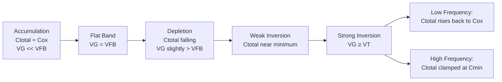

## Accumulation, depletion, and inversion regimes

### Overview

The three operating regimes of a MOS capacitor — accumulation, depletion, and inversion — describe the distinct charge states induced at the semiconductor surface as the gate voltage $V_G$ is swept away from the flat-band voltage $V_{FB}$. Each regime corresponds to a different sign and magnitude of surface potential $\psi_s$, a different dominant charge carrier at the surface, and a distinct capacitance behavior. Understanding these regimes is the physical basis for MOSFET operation, C-V characterization, and threshold voltage extraction.

### Reference Framework: Surface Potential and Bulk Fermi Potential

**Key Points**

- The bulk Fermi potential $\phi_F$ quantifies how far the bulk Fermi level sits from the intrinsic level, and sets the doping-dependent reference scale for all three regimes:

$$\phi_F = \frac{kT}{q}\ln\left(\frac{N_A}{n_i}\right) \quad \text{(p-type)}, \qquad \phi_F = -\frac{kT}{q}\ln\left(\frac{N_D}{n_i}\right) \quad \text{(n-type)}$$

- The surface potential $\psi_s$ measures the amount of band bending at $x = 0$ relative to the bulk, with sign convention: $\psi_s > 0$ for downward bending (favors electrons at surface), $\psi_s < 0$ for upward bending (favors holes at surface).
- All regime boundaries for a p-type substrate are defined in terms of $\psi_s$ relative to $\phi_F$, as summarized below.

### Regime Boundaries (p-type Substrate)

| Regime | Surface potential condition | Surface carrier state |
| --- | --- | --- |
| Accumulation | $\psi_s < 0$ | Hole concentration $p_s > N_A$ |
| Flat band | $\psi_s = 0$ | $p_s = N_A$ (bulk value) |
| Depletion | $0 < \psi_s < \phi_F$ | $p_s < N_A$, no significant electrons |
| Weak inversion | $\phi_F < \psi_s < 2\phi_F$ | Electron concentration $n_s$ growing but still $< N_A$ |
| Threshold (onset of strong inversion) | $\psi_s = 2\phi_F$ | $n_s = N_A$ (surface electron density equals bulk hole density) |
| Strong inversion | $\psi_s > 2\phi_F$ | $n_s \gg N_A$; surface behaves as n-type |

For n-type substrate, all inequalities and carrier labels invert (accumulation of electrons for $\psi_s > 0$, inversion to p-type surface for $\psi_s < -2|\phi_F|$).

### Accumulation Regime

**Key Points**

- Occurs when $V_G < V_{FB}$ for a p-type substrate (gate more negative than flat band).
- The applied field attracts majority carriers (holes) toward the oxide-semiconductor interface, increasing hole density above the bulk equilibrium value $N_A$.
- Bands bend **upward** near the surface; $E_v$ approaches $E_F$ at $x=0$.
- Surface hole concentration follows the Boltzmann relation:

$$p_s = N_A \exp\left(\frac{-q\psi_s}{kT}\right), \quad \psi_s < 0 \Rightarrow p_s > N_A$$

- Because accumulation charge is majority-carrier and responds essentially instantaneously to the AC signal (no minority-carrier generation/recombination delay), the accumulation-layer charge behaves like a thin conductive sheet very close to the interface.
- Capacitance in this regime approaches the oxide capacitance $C_{ox} = \varepsilon_{ox}/t_{ox}$ per unit area, since the semiconductor space-charge layer is extremely thin (Debye-length scale) and contributes negligible series capacitance.

**Example**

For $N_A = 10^{17}\,\text{cm}^{-3}$ and $\psi_s = -0.3\,\text{V}$ at $T = 300\,\text{K}$ ($kT/q \approx 0.0259\,\text{V}$):

$$p_s = 10^{17} \exp\left(\frac{0.3}{0.0259}\right) \approx 10^{17} \times e^{11.58} \approx 1.06 \times 10^{22}\,\text{cm}^{-3}$$

This illustrates the exponential sensitivity of surface carrier density to $\psi_s$ — a hallmark of all three regimes.

### Depletion Regime

**Key Points**

- Occurs for small positive $\psi_s$ ($0 < \psi_s < \phi_F$ for p-type), i.e., gate voltage slightly above $V_{FB}$.
- Bands bend **downward**, pushing holes away from the surface and exposing a region of fixed, ionized acceptor charge $N_A^-$ with negligible mobile carriers — the depletion region.
- Charge density in this region is well-approximated as a uniform space-charge block (**depletion approximation**): $\rho(x) = -qN_A$ for $0 \le x \le W_d$, and $\rho = 0$ beyond.
- Depletion width follows from solving Poisson's equation with this charge profile:

$$W_d = \sqrt{\frac{2\varepsilon_s \psi_s}{qN_A}}$$

- Depletion-layer (semiconductor) capacitance per unit area:

$$C_s = \frac{\varepsilon_s}{W_d} = \sqrt{\frac{q\varepsilon_s N_A}{2\psi_s}}$$

- The total MOS capacitance in this regime is the **series combination** of oxide and semiconductor depletion capacitance:

$$\frac{1}{C_{total}} = \frac{1}{C_{ox}} + \frac{1}{C_s(\psi_s)}$$

- As $\psi_s$ increases, $W_d$ grows and $C_s$ decreases, so $C_{total}$ decreases monotonically through this regime — the characteristic falling C-V curve segment used to identify depletion in measured data.
- Depletion width increases only up to a maximum value $W_{d,max}$, reached at the onset of strong inversion, because beyond that point additional band bending is screened by the rapidly growing inversion charge rather than further widening the depletion region:

$$W_{d,max} = \sqrt{\frac{4\varepsilon_s \phi_F}{qN_A}}$$

### Inversion Regime

**Key Points**

- **Weak inversion** ($\phi_F < \psi_s < 2\phi_F$): minority carrier (electron, for p-type) concentration at the surface grows exponentially with $\psi_s$ but remains below $N_A$; depletion charge still dominates the total semiconductor charge, and $W_d$ continues to expand slightly.
- **Strong inversion** (conventionally $\psi_s \ge 2\phi_F$): surface electron concentration $n_s$ equals or exceeds the bulk majority-carrier concentration $N_A$, and a thin, dense inversion layer of electrons forms right at the oxide interface — the surface is effectively converted from p-type to n-type.
- Surface electron concentration:

$$n_s = n_i \exp\left(\frac{\psi_s - 2\phi_F}{kT/q}\right) \cdot N_A \quad \text{(equivalently } n_s = \frac{n_i^2}{N_A}\exp\left(\frac{q\psi_s}{kT}\right)\text{)}$$

- **Threshold voltage** $V_T$ is defined as the gate voltage at which strong inversion begins ($\psi_s = 2\phi_F$):

$$V_T = V_{FB} + 2\phi_F + \frac{\sqrt{2q\varepsilon_s N_A (2\phi_F)}}{C_{ox}} = V_{FB} + 2\phi_F + \frac{Q_{dep,max}}{C_{ox}}$$

- Beyond threshold, essentially all additional gate voltage drops across the oxide (to supply the growing inversion charge) rather than further expanding $\psi_s$ or $W_d$ — this is the "pinning" of surface potential near $2\phi_F$ that underlies MOSFET strong-inversion behavior.
- Frequency dependence of the C-V curve is most pronounced in this regime: inversion charge is minority-carrier and must be supplied by thermal generation/recombination (slow, generation-lifetime-limited) or by diffusion from source/drain in a MOSFET. At **low frequency**, minority carriers can follow the AC signal, and $C_{total}$ rises back toward $C_{ox}$; at **high frequency**, they cannot respond, and $C_{total}$ stays clamped near its minimum value $C_{min}$ (set by $W_{d,max}$), producing the classic divergence between low-frequency and high-frequency C-V curves.

### Comparative Summary Table

| Property | Accumulation | Depletion | Inversion (strong) |
| --- | --- | --- | --- |
| $\psi_s$ sign/range | $\psi_s < 0$ | $0 < \psi_s < 2\phi_F$ | $\psi_s \ge 2\phi_F$ |
| Band bending | Upward | Downward (moderate) | Downward (strong) |
| Dominant surface charge | Majority carriers | Fixed ionized dopants | Minority carriers |
| Charge response speed | Fast (majority carrier) | N/A (fixed charge) | Slow (minority carrier, freq-dependent) |
| $C_{total}$ behavior | $\approx C_{ox}$ | Falls with $\psi_s$ | LF: rises to $C_{ox}$; HF: clamped at $C_{min}$ |
| Depletion width $W_d$ | $\approx 0$ | Grows with $\psi_s$ | Saturates at $W_{d,max}$ |

### Idealized C-V Curve Across All Regimes

### SVG: Capacitance vs. Gate Voltage Across Regimes (svg_diagram)

<svg xmlns="http://www.w3.org/2000/svg" viewBox="0 0 720 400" font-family="Helvetica, Arial, sans-serif">
<text x="360" y="24" font-size="16" font-weight="bold" text-anchor="middle" fill="#1a1a1a">MOS C-V Curve — Accumulation / Depletion / Inversion (svg_diagram)</text>

<line x1="80" y1="340" x2="680" y2="340" stroke="#333" stroke-width="1.5" />
<line x1="80" y1="60" x2="80" y2="340" stroke="#333" stroke-width="1.5" />
<text x="680" y="360" font-size="13" text-anchor="end" fill="#333">VG →</text>
<text x="45" y="200" font-size="13" fill="#333" transform="rotate(-90 45 200)" text-anchor="middle">C_total</text>

<line x1="80" y1="90" x2="680" y2="90" stroke="#999" stroke-width="1" stroke-dasharray="4,3" />
<text x="90" y="85" font-size="11" fill="#666">Cox</text>

<line x1="80" y1="270" x2="680" y2="270" stroke="#999" stroke-width="1" stroke-dasharray="4,3" />
<text x="90" y="285" font-size="11" fill="#666">Cmin</text>

<path d="M 100 95 L 220 95" fill="none" stroke="#1a5276" stroke-width="3" />

<path d="M 220 95 Q 300 110 380 260" fill="none" stroke="#1a5276" stroke-width="3" />

<path d="M 380 260 Q 460 130 620 95" fill="none" stroke="#1a7a3d" stroke-width="3" />
<text x="500" y="115" font-size="11" fill="#1a7a3d">Low Frequency</text>

<path d="M 380 260 Q 460 268 620 268" fill="none" stroke="#a61c1c" stroke-width="3" />
<text x="500" y="255" font-size="11" fill="#a61c1c">High Frequency</text>

<line x1="220" y1="60" x2="220" y2="340" stroke="#bbb" stroke-width="1" stroke-dasharray="2,2" />
<line x1="380" y1="60" x2="380" y2="340" stroke="#bbb" stroke-width="1" stroke-dasharray="2,2" />

<text x="150" y="320" font-size="12" text-anchor="middle" fill="#333">Accumulation</text>

<text x="300" y="320" font-size="12" text-anchor="middle" fill="#333">Depletion</text>

<text x="500" y="320" font-size="12" text-anchor="middle" fill="#333">Inversion</text>

<line x1="220" y1="340" x2="220" y2="350" stroke="#333" stroke-width="1.5" />
<text x="220" y="367" font-size="11" text-anchor="middle" fill="#333">VFB</text>
<line x1="380" y1="340" x2="380" y2="350" stroke="#333" stroke-width="1.5" />
<text x="380" y="367" font-size="11" text-anchor="middle" fill="#333">VT</text>
</svg>

### Physical Interpretation Notes

- **[Inference]** The precise sharpness of the transition between weak and strong inversion (i.e., how abruptly $n_s$ overtakes $N_A$) depends on doping concentration and temperature; the $\psi_s = 2\phi_F$ criterion is a widely used engineering approximation rather than an exact physical discontinuity, since carrier concentration varies continuously and exponentially with $\psi_s$.
- The low-frequency vs. high-frequency C-V divergence is a direct experimental signature used to distinguish true minority-carrier inversion response from deep-depletion artifacts (e.g., in pulsed C-V measurements where insufficient time is given for thermal generation to populate the inversion layer).
- **[Unverified]** Exact values of $C_{min}$ and the frequency threshold separating "low" from "high" frequency behavior are process- and temperature-dependent (governed by minority-carrier generation lifetime), and should be treated as device-specific rather than universal constants.

**Next Steps**

**Related Topics**

- MOS energy band diagrams (foundational band-bending mechanism underlying these regimes)
- Depletion approximation and Poisson's equation solution in MOS structures
- Threshold voltage $V_T$ derivation and body-effect dependence
- High-frequency vs. low-frequency vs. quasi-static C-V measurement techniques
- Deep depletion and non-equilibrium MOS capacitor behavior
- Flat-band voltage and its dependence on oxide charge
- Subthreshold conduction and weak inversion current in MOSFETs
- Debye length and its role in accumulation-layer charge screening