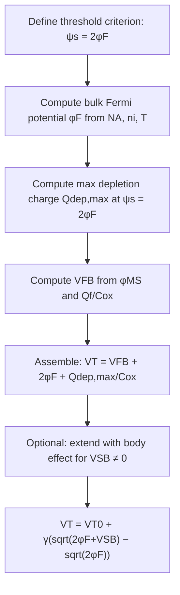

## Threshold voltage derivation

### Overview

The threshold voltage $V_T$ is the gate voltage at which the MOS capacitor surface reaches the onset of strong inversion, conventionally defined by the criterion $\psi_s = 2\phi_F$. Deriving $V_T$ requires accounting for every voltage drop between the gate terminal and the semiconductor bulk: the flat-band voltage (work function difference and oxide charge), the surface potential itself, and the voltage dropped across the oxide to support the depletion charge. This derivation is the single most important quantitative result in MOS capacitor physics, forming the direct bridge to MOSFET device operation.

### Starting Point: Gate Voltage Partition

**Key Points**

- The applied gate voltage divides among three physical contributions: the flat-band voltage, the voltage across the oxide, and the surface potential in the semiconductor:

$$V_G = V_{FB} + V_{ox} + \psi_s$$

- $V_{ox}$ is the voltage dropped linearly across the oxide, related to the total semiconductor charge $Q_s$ (per unit area) via the oxide capacitance:

$$V_{ox} = -\frac{Q_s}{C_{ox}}, \qquad C_{ox} = \frac{\varepsilon_{ox}}{t_{ox}}$$

- At threshold, $Q_s$ is dominated by the depletion charge at its maximum value $Q_{dep,max}$ (the inversion charge itself is taken as negligibly small exactly at the threshold definition point, growing rapidly only just beyond it).

### Step 1: Flat-Band Voltage

**Key Points**

- $V_{FB}$ accounts for the built-in work function difference between gate and semiconductor, plus any charge trapped in the oxide or at the oxide-semiconductor interface:

$$V_{FB} = \phi_{MS} - \frac{Q_f}{C_{ox}}$$

$$\phi_{MS} = \phi_M - \phi_S = \phi_M - \left(\chi + \frac{E_g}{2q} + \phi_F\right) \quad \text{(p-type substrate)}$$

- $\phi_M$ is the metal (or heavily doped polysilicon) gate work function, $\chi$ is the semiconductor electron affinity, $E_g/2$ locates the intrinsic level at midgap (approximately), and $\phi_F$ is the bulk Fermi potential defined below.
- $Q_f$ represents the effective fixed oxide charge (and, in a more complete treatment, separate terms for mobile ionic charge $Q_m$ and interface trap charge $Q_{it}$, though these are frequently lumped into a single effective $Q_f$ for the ideal derivation).

### Step 2: Bulk Fermi Potential

**Key Points**

- The bulk Fermi potential quantifies the doping-dependent separation between the Fermi level and the intrinsic level deep in the substrate:

$$\phi_F = \frac{kT}{q}\ln\left(\frac{N_A}{n_i}\right) \quad \text{(p-type)}$$

- This term appears twice in the threshold condition: once directly as the required surface potential $\psi_s = 2\phi_F$, and again inside the depletion charge expression through its dependence on $N_A$.

**Example**

For $N_A = 5 \times 10^{16}\,\text{cm}^{-3}$, $n_i = 1.5 \times 10^{10}\,\text{cm}^{-3}$ (Si, 300 K):

$$\phi_F = 0.0259 \ln\left(\frac{5\times 10^{16}}{1.5\times 10^{10}}\right) = 0.0259 \ln(3.33\times 10^{6}) \approx 0.0259 \times 15.02 \approx 0.389\,\text{V}$$

So the strong-inversion threshold surface potential is $2\phi_F \approx 0.778\,\text{V}$.

### Step 3: Maximum Depletion Charge at Threshold

**Key Points**

- Using the depletion approximation, the depletion charge per unit area grows with surface potential as:

$$Q_{dep}(\psi_s) = -\sqrt{2q\varepsilon_s N_A \psi_s}$$

- At the threshold condition $\psi_s = 2\phi_F$, this reaches its maximum value (beyond which further gate voltage is absorbed by inversion charge rather than additional depletion widening):

$$Q_{dep,max} = -\sqrt{2q\varepsilon_s N_A (2\phi_F)} = -\sqrt{4q\varepsilon_s N_A \phi_F}$$

- Correspondingly, the maximum depletion width is:

$$W_{d,max} = \sqrt{\frac{4\varepsilon_s \phi_F}{qN_A}}$$

### Step 4: Assembling the Threshold Voltage Expression

Substituting $\psi_s = 2\phi_F$ and $Q_s \approx Q_{dep,max}$ into the gate voltage partition equation:

$$V_T = V_{FB} + 2\phi_F - \frac{Q_{dep,max}}{C_{ox}}$$

Since $Q_{dep,max}$ is negative (ionized acceptors) and the formula subtracts a negative quantity, this is more conventionally written with explicit magnitudes as:

$$\boxed{V_T = V_{FB} + 2\phi_F + \frac{\sqrt{4q\varepsilon_s N_A \phi_F}}{C_{ox}}}$$

This is the standard long-channel, zero-body-bias threshold voltage expression for an NMOS device on p-type substrate (or, with appropriate sign inversions throughout, for PMOS on n-type substrate).

### Full Symbolic Expansion

Combining all steps into one expression makes every physical dependency explicit:

$$V_T = \left[\phi_M - \left(\chi + \frac{E_g}{2q} + \phi_F\right)\right] - \frac{Q_f}{C_{ox}} + 2\phi_F + \frac{\sqrt{4q\varepsilon_s N_A \phi_F}}{C_{ox}}$$

Grouping terms reveals the four physically distinct contributions to $V_T$:

1. **Work function term**: $\phi_M - \chi - E_g/2q$ — set by gate and channel material choice.
2. **Doping term**: $+\phi_F$ (from $\phi_{MS}$) combined with $+2\phi_F$ (inversion criterion) — net $+\phi_F$ contribution from this grouping, reflecting substrate doping level.
3. **Oxide charge term**: $-Q_f/C_{ox}$ — process-quality dependent, minimized by careful oxide growth/annealing.
4. **Depletion charge term**: $+\sqrt{4q\varepsilon_s N_A \phi_F}/C_{ox}$ — the dominant doping- and oxide-thickness-dependent term, responsible for most of the $V_T$ scaling with technology node.

### Worked Numerical Example

**Example**

Parameters: p-type Si substrate, $N_A = 10^{17}\,\text{cm}^{-3}$, n+ polysilicon gate ($\phi_M \approx 4.05\,\text{eV}$, matching $\chi_{Si}$ for simplicity of illustration), $t_{ox} = 5\,\text{nm}$, $Q_f/q = 5\times 10^{10}\,\text{cm}^{-2}$, $T = 300\,\text{K}$.

1. $\phi_F = 0.0259\ln(10^{17}/1.5\times 10^{10}) \approx 0.0259 \times 15.72 \approx 0.407\,\text{V}$
2. $C_{ox} = \varepsilon_{ox}/t_{ox} = (3.9 \times 8.85\times 10^{-14}\,\text{F/cm})/(5\times 10^{-7}\,\text{cm}) \approx 6.9\times 10^{-7}\,\text{F/cm}^2$
3. $Q_{dep,max} = \sqrt{4 \times 1.6\times10^{-19} \times 1.04\times10^{-12} \times 10^{17} \times 0.407}$

   $\approx \sqrt{4 \times 1.6\times10^{-19} \times 1.04\times10^{-12} \times 4.07\times10^{16}}$

   $\approx \sqrt{2.71\times 10^{-14}} \approx 1.65\times 10^{-7}\,\text{C/cm}^2$
4. Depletion term: $Q_{dep,max}/C_{ox} \approx 1.65\times10^{-7}/6.9\times10^{-7} \approx 0.239\,\text{V}$
5. Oxide charge term: $Q_f/C_{ox} = (5\times10^{10} \times 1.6\times10^{-19})/6.9\times10^{-7} \approx 0.0116\,\text{V}$
6. Assuming $\phi_{MS} \approx -\phi_F - E_g/2q \approx -(0.407 + 0.56) = -0.967\,\text{V}$ (n+ poly on p-type, typical sign)

$$V_{FB} \approx -0.967 - 0.0116 \approx -0.979\,\text{V}$$

$$V_T \approx -0.979 + 2(0.407) + 0.239 \approx -0.979 + 0.814 + 0.239 \approx 0.074\,\text{V}$$

**[Inference]** This illustrative result is sensitive to the exact work-function alignment assumed; real n+ poly/p-substrate NMOS devices typically target $V_T$ in the range of a few hundred mV through deliberate channel/substrate engineering (e.g., threshold-adjust implants), so this simplified example should be read as demonstrating the calculation method rather than a representative production value.

### Body Effect: Threshold Voltage Dependence on Source-Body Bias

**Key Points**

- In a MOSFET (as opposed to an isolated two-terminal MOS capacitor), applying a reverse bias $V_{SB}$ between source and body increases the required surface potential to reach threshold, since the depletion region must now support the additional bias:

$$V_T = V_{T0} + \gamma\left(\sqrt{2\phi_F + V_{SB}} - \sqrt{2\phi_F}\right)$$

- $V_{T0}$ is the threshold voltage at $V_{SB} = 0$ (the expression derived above), and $\gamma$ is the body-effect coefficient:

$$\gamma = \frac{\sqrt{2q\varepsilon_s N_A}}{C_{ox}}$$

- This relation is a direct extension of the depletion charge formula, since $Q_{dep,max}$ becomes $\sqrt{2q\varepsilon_s N_A(2\phi_F + V_{SB})}$ when body bias is present.

### Threshold Voltage vs. Oxide Thickness and Doping — Trend Summary

| Parameter increased | Effect on $V_T$ | Physical reason |
| --- | --- | --- |
| Oxide thickness $t_{ox}$ | Increases (magnitude) | Lower $C_{ox}$ → larger voltage needed to drop the same $Q_{dep,max}$ and $Q_f$ across oxide |
| Substrate doping $N_A$ | Increases (magnitude) | Higher $\phi_F$ and higher $Q_{dep,max}$ (both terms grow) |
| Fixed oxide charge $Q_f$ | Shifts $V_T$ negative (for positive $Q_f$) | Positive oxide charge electrostatically mimics part of the gate bias already being "applied" |
| Body-source reverse bias $V_{SB}$ | Increases (magnitude), NMOS | Wider depletion region required, more depletion charge to support |

### Derivation Flow Diagram

### Practical Extraction from Measured C-V Data

**Key Points**

- Experimentally, $V_T$ is commonly extracted from a high-frequency C-V curve as the gate voltage at which $C_{total}$ reaches its minimum plateau value $C_{min}$ (corresponding to $W_{d,max}$), or from MOSFET $I_D$-$V_G$ curves via linear extrapolation or constant-current methods.
- **[Unverified]** The precise extraction methodology (e.g., linear extrapolation vs. second-derivative vs. constant-current threshold) can yield systematically different numerical $V_T$ values for the same physical device, so care must be taken to match the extraction method used in any comparative dataset.

**Next Steps**

**Related Topics**

- MOS energy band diagrams
- Accumulation, depletion, and inversion regimes
- Flat-band voltage and oxide charge sources ($Q_f$, $Q_m$, $Q_{it}$)
- Body effect and back-gate biasing in MOSFETs
- Short-channel threshold voltage effects (DIBL, roll-off)
- Threshold-adjust ion implantation techniques
- MOSFET subthreshold swing and its relation to depletion capacitance
- Work function engineering in metal-gate/high-k stacks