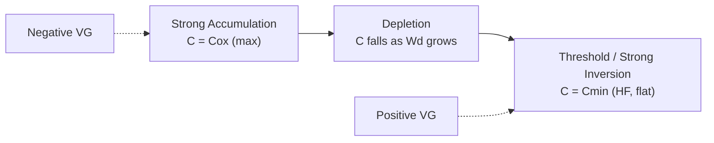

## Capacitance-Voltage Characteristics

### Overview

The capacitance-voltage (C-V) characteristic describes how the small-signal capacitance of a MOS capacitor varies as a function of applied DC gate voltage. It is one of the most important diagnostic tools in semiconductor device physics, since a single C-V measurement reveals oxide thickness, doping concentration, flatband voltage, threshold voltage, interface trap density, and fixed oxide charge.

The MOS capacitor's total capacitance is a series combination of the fixed oxide capacitance and a voltage-dependent semiconductor capacitance:

$$\frac{1}{C_{total}} = \frac{1}{C_{ox}} + \frac{1}{C_s(V_G)}$$

Because $C_s$ changes with the surface potential $\psi_s$, which itself depends on $V_G$, the total measured capacitance traces out a characteristic curve rather than a constant value.

### Physical Origin of Voltage-Dependent Capacitance

**Oxide Capacitance**

The oxide layer behaves as a simple parallel-plate capacitor, independent of bias:

$$C_{ox} = \frac{\varepsilon_{ox}}{t_{ox}}$$

per unit area, where $\varepsilon_{ox}$ is the oxide permittivity ($\approx 3.9\varepsilon_0$ for SiO₂) and $t_{ox}$ is the oxide thickness. This term sets the maximum achievable capacitance in the C-V curve.

**Semiconductor Capacitance**

The semiconductor capacitance arises from the charge $Q_s$ induced in the silicon in response to the surface potential $\psi_s$:

$$C_s = -\frac{dQ_s}{d\psi_s}$$

Unlike the oxide, this capacitance is nonlinear because the type and density of mobile/depleted charge in the silicon change dramatically as the surface moves through accumulation, depletion, and inversion.

### The Four Operating Regimes

**1. Accumulation**

For a p-type substrate (the conventional reference case), a sufficiently negative $V_G$ attracts majority carriers (holes) to the surface, forming an accumulation layer. This layer behaves like a conductive plate located essentially at the oxide-semiconductor interface, so:

$$C_{total} \approx C_{ox}$$

The capacitance is at its maximum and voltage-independent in strong accumulation.

**2. Depletion**

As $V_G$ increases toward and past the flatband voltage $V_{FB}$, holes are repelled from the surface, exposing a depletion region of ionized acceptors. This depletion layer acts as an additional capacitor in series with $C_{ox}$:

$$C_d = \frac{\varepsilon_s}{W_d}$$

where $W_d$ is the depletion width. As $V_G$ increases, $W_d$ grows, so $C_d$ decreases, pulling down $C_{total}$. This is the falling portion of the C-V curve.

**3. Weak Inversion / Onset of Inversion**

As $\psi_s$ approaches $2\phi_F$ (twice the bulk Fermi potential), minority carriers (electrons, for p-type substrate) begin to accumulate at the surface. The depletion width approaches its maximum value $W_{d,max}$:

$$W_{d,max} = \sqrt{\frac{4\varepsilon_s \phi_F}{qN_A}}$$

**4. Strong Inversion**

Beyond threshold, an inversion layer forms. What happens next depends critically on measurement frequency:

- **Low-Frequency (Quasi-Static) C-V**: Minority carriers can be generated/recombined fast enough to follow the AC signal, so the inversion charge screens the depletion layer. Capacitance rises back toward $C_{ox}$.
- **High-Frequency C-V**: Minority carrier generation is too slow to follow the AC probe signal. The depletion width remains frozen at $W_{d,max}$, so capacitance saturates at a minimum value:

$$C_{min} = \frac{C_{ox} \cdot C_{d,min}}{C_{ox} + C_{d,min}}, \quad C_{d,min} = \frac{\varepsilon_s}{W_{d,max}}$$

- **Deep Depletion**: If the gate voltage is swept very rapidly, even high-frequency inversion charge cannot form. The depletion width continues to grow past $W_{d,max}$, and capacitance keeps falling below $C_{min}$.

### Idealized C-V Curve Shape (p-type substrate, high-frequency)

For an n-type substrate, the curve is mirrored: accumulation occurs at positive $V_G$, and inversion at negative $V_G$.

### Flatband Voltage and Its Extraction

The flatband voltage $V_{FB}$ is the gate voltage at which $\psi_s = 0$ — no band bending exists in the semiconductor. It marks the transition point between accumulation and depletion and is given by:

$$V_{FB} = \phi_{MS} - \frac{Q_{ox}}{C_{ox}}$$

where $\phi_{MS}$ is the metal-semiconductor work function difference and $Q_{ox}$ is the effective fixed oxide charge (per unit area) at the oxide-semiconductor interface.

The flatband capacitance $C_{FB}$ (the capacitance value at $\psi_s = 0$) is used to locate $V_{FB}$ experimentally:

$$C_{FB} = \frac{C_{ox}}{1 + \dfrac{C_{ox}}{\varepsilon_s}\sqrt{\dfrac{kT\varepsilon_s}{q^2 N_A}}}$$

This is a well-established relation derived from linearizing the Debye length contribution to semiconductor capacitance at zero band bending. [Inference: exact numerical position on a measured curve is dataset-dependent and subject to measurement noise.]

### Effect of Interface Traps and Oxide Charge

Interface trap states (Dit) at the Si-SiO₂ interface add a parallel capacitance term that depends on surface potential and measurement frequency:

$$C_{it} = q^2 D_{it}(\psi_s)$$

Their effects on the C-V curve include:

- **Stretch-out**: The transition from accumulation to inversion becomes gradual rather than sharp, because traps must charge/discharge as $\psi_s$ shifts.
- **Frequency dispersion**: At high frequencies, fast traps cannot respond and their contribution disappears; at low frequencies, they add measurable capacitance, causing the low-frequency and high-frequency curves to diverge in the depletion region.

Fixed oxide charge ($Q_f$) and mobile ionic charge (e.g., Na⁺) shift the entire C-V curve laterally along the voltage axis without changing its shape, since they alter $V_{FB}$ without affecting the depletion physics itself.

### Extracting Key Parameters from a Measured C-V Curve

**Key Points**

- $C_{ox}$ (from accumulation plateau) → oxide thickness via $t_{ox} = \varepsilon_{ox}/C_{ox}$
- $C_{min}$ (from HF inversion plateau) → maximum depletion width $W_{d,max}$
- Slope in depletion region → substrate doping concentration $N_A$ (or $N_D$)
- Voltage shift of the curve → flatband voltage, hence oxide charge $Q_{ox}$
- Stretch-out / hysteresis → interface trap density $D_{it}$ and mobile ion content

### Terman Method and High-Low Frequency Method

Two standard techniques quantify $D_{it}$ from C-V data:

- **Terman Method**: Compares a measured high-frequency C-V curve against an ideal theoretical curve (computed for the same doping, with no traps). The voltage stretch-out between measured and ideal curves at a given $\psi_s$ yields $D_{it}(\psi_s)$.
- **High-Low Frequency (Hi-Lo) Method**: Compares a low-frequency (quasi-static) curve, where traps fully respond, against a high-frequency curve, where they do not. The capacitance difference at a given gate voltage directly yields:

$$D_{it} = \frac{1}{q^2}\left(\frac{C_{ox}C_{LF}}{C_{ox}-C_{LF}} - \frac{C_{ox}C_{HF}}{C_{ox}-C_{HF}}\right)$$

### Worked Example

**Example**

Given: p-type substrate, $N_A = 10^{16}\ \text{cm}^{-3}$, $t_{ox} = 10\ \text{nm}$ (SiO₂), $T = 300\ \text{K}$.

Step 1 — Oxide capacitance (per unit area):

$$C_{ox} = \frac{3.9 \times 8.85\times10^{-14}\ \text{F/cm}}{10\times10^{-7}\ \text{cm}} \approx 3.45\times10^{-7}\ \text{F/cm}^2$$

Step 2 — Bulk Fermi potential:

$$\phi_F = \frac{kT}{q}\ln\left(\frac{N_A}{n_i}\right) \approx 0.0259 \times \ln\left(\frac{10^{16}}{1.5\times10^{10}}\right) \approx 0.35\ \text{V}$$

Step 3 — Maximum depletion width:

$$W_{d,max} = \sqrt{\frac{4\varepsilon_s\phi_F}{qN_A}} \approx \sqrt{\frac{4(11.7)(8.85\times10^{-14})(0.35)}{(1.6\times10^{-19})(10^{16})}} \approx 3.0\times10^{-5}\ \text{cm} = 300\ \text{nm}$$

Step 4 — Minimum HF capacitance:

$$C_{d,min} = \frac{11.7\times8.85\times10^{-14}}{3.0\times10^{-5}} \approx 3.45\times10^{-8}\ \text{F/cm}^2$$

$$C_{min} = \frac{C_{ox}C_{d,min}}{C_{ox}+C_{d,min}} \approx 3.13\times10^{-8}\ \text{F/cm}^2$$

The measured curve should therefore fall from roughly $3.45\times10^{-7}\ \text{F/cm}^2$ in accumulation to approximately $3.13\times10^{-8}\ \text{F/cm}^2$ in HF strong inversion — roughly a 10:1 ratio, consistent with typical thin-oxide, moderate-doping MOS capacitors.

### Normalized C-V Curve Shape (SVG)

<svg xmlns="http://www.w3.org/2000/svg" viewBox="0 0 700 420">
<title>Normalized High-Frequency and Low-Frequency C-V Curves (svg_diagram)</title>
<rect x="0" y="0" width="700" height="420" fill="#ffffff" />
<line x1="80" y1="360" x2="650" y2="360" stroke="#333" stroke-width="2" />
<line x1="80" y1="360" x2="80" y2="40" stroke="#333" stroke-width="2" />
<text x="360" y="400" font-size="16" fill="#333" text-anchor="middle">Gate Voltage V_G</text>
<text x="30" y="200" font-size="16" fill="#333" text-anchor="middle" transform="rotate(-90 30 200)">C / C_ox</text>
<line x1="80" y1="70" x2="650" y2="70" stroke="#999" stroke-width="1" stroke-dasharray="4,4" />
<text x="655" y="74" font-size="12" fill="#666">1.0 (Cox)</text>
<line x1="80" y1="300" x2="650" y2="300" stroke="#999" stroke-width="1" stroke-dasharray="4,4" />
<text x="655" y="304" font-size="12" fill="#666">Cmin (HF)</text>
<path d="M 100 70 L 250 70 Q 320 70 360 180 Q 400 290 460 300 L 620 300" fill="none" stroke="#1f77b4" stroke-width="3" />
<path d="M 100 70 L 250 70 Q 320 70 360 180 Q 400 290 460 90 L 620 80" fill="none" stroke="#d62728" stroke-width="3" stroke-dasharray="6,3" />
<text x="150" y="60" font-size="13" fill="#1f77b4">Accumulation</text>
<text x="330" y="200" font-size="13" fill="#333">Depletion</text>
<text x="500" y="320" font-size="13" fill="#1f77b4">Inversion (HF)</text>
<text x="480" y="70" font-size="13" fill="#d62728">Inversion (LF)</text>
<line x1="250" y1="360" x2="250" y2="345" stroke="#333" stroke-width="1" />
<text x="250" y="380" font-size="12" fill="#333" text-anchor="middle">V_FB</text>
<line x1="460" y1="360" x2="460" y2="345" stroke="#333" stroke-width="1" />
<text x="460" y="380" font-size="12" fill="#333" text-anchor="middle">V_T</text>
<circle cx="250" cy="70" r="4" fill="#000" />
<circle cx="460" cy="90" r="4" fill="#000" />
<circle cx="460" cy="300" r="4" fill="#000" />
<rect x="480" y="40" width="14" height="14" fill="#1f77b4" />
<text x="500" y="52" font-size="12" fill="#333">High Frequency</text>
<rect x="480" y="20" width="14" height="14" fill="#d62728" />
<text x="500" y="32" font-size="12" fill="#333">Low Frequency</text>
</svg>

### Measurement Considerations

- **AC signal amplitude**: Must be small (typically 10-50 mV) to keep the measurement in the small-signal linear regime; large amplitudes distort the extracted $\psi_s$-$Q_s$ relationship.
- **Sweep rate**: Slow sweeps allow equilibrium inversion charge to form (approaching quasi-static/LF behavior); fast sweeps risk deep depletion, especially at low temperature or in high-quality (low generation-rate) substrates. [Inference: the exact sweep rate threshold for observable deep depletion depends on minority-carrier generation lifetime, which varies by process and cannot be generalized numerically without characterizing the specific wafer.]
- **Series resistance**: Parasitic resistance from substrate contacts can distort the apparent C-V shape, especially in strong accumulation and inversion; correction methods use conductance measurements to de-embed this effect.
- **Temperature dependence**: Higher temperature increases minority carrier generation rate, making it easier to reach true low-frequency behavior and shifting $\phi_F$, hence $V_T$ and $W_{d,max}$.

### Related Topics

- MOS threshold voltage derivation and body effect
- Quasi-static and pulsed C-V measurement techniques
- Interface trap density extraction (Terman, conductance, and Hi-Lo methods)
- Depletion approximation and Poisson's equation solution in MOS structures
- Oxide charge classification (fixed, mobile ionic, interface trap, oxide trapped charge)
- Deep depletion and its use in pulsed MOS characterization
- Quantum mechanical corrections to C-V in ultrathin oxides (inversion layer quantization)