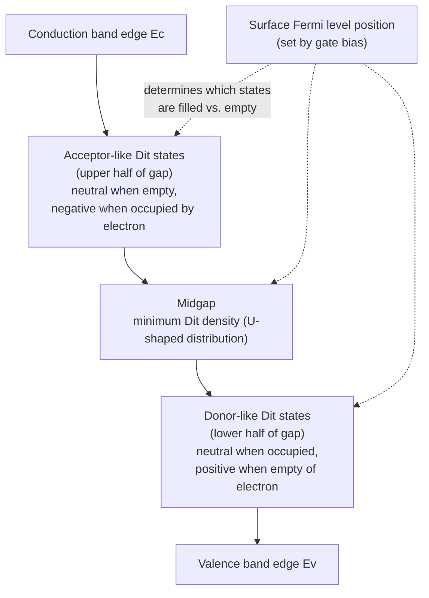

## Oxide Charges and Interface Trap States

### Overview

Real thermally grown SiO₂/Si structures deviate from the ideal MOS capacitor model due to charges residing in the oxide bulk, at the oxide surfaces, and at the Si/SiO₂ interface. These non-idealities shift the flat-band voltage, distort the C-V characteristics, degrade device reliability, and introduce trapping/detrapping dynamics that affect threshold voltage stability. Deal's classification (1980) remains the standard framework for categorizing these charges.

### Deal's Classification of Oxide Charges

Four principal charge types are distinguished by location and physical origin:

#### Fixed Oxide Charge ($Q_f$)

- Located within approximately 2.5 nm of the Si/SiO₂ interface, on the oxide side
- Arises from incomplete oxidation reactions — unoxidized or partially oxidized silicon (Si³⁺ suboxide states) left behind as the oxidation front advances
- Nearly always positive in sign for thermally grown oxide on Si
- Does not exchange charge with the underlying silicon under normal bias/temperature conditions (i.e., it is "fixed," not a function of surface potential or gate voltage)
- Areal density $N_f$ typically $10^{10}$–$10^{11}$ cm⁻² for well-controlled dry/wet thermal oxidation on (100) silicon; historically much higher ($10^{12}$ cm⁻²) before post-oxidation anneal optimization
- Strongly dependent on: oxidation temperature, ambient (dry O₂ vs. wet/steam), cool-down ambient, and crystal orientation — (111) surfaces show higher $N_f$ than (100) due to higher density of unsatisfied (dangling) bonds at the interface
- Reduced by post-oxidation annealing in inert ambient (N₂ or Ar) at the oxidation temperature, which allows residual reaction byproducts to diffuse away or complete oxidation

#### Interface Trapped Charge / Interface Trap States ($Q_{it}$, $D_{it}$)

- Physically located exactly at the Si/SiO₂ interface (a two-dimensional distribution, not a bulk density)
- Originate from the abrupt termination of the Si crystal lattice — unsatisfied ("dangling") silicon bonds, predominantly the $P_b$ center (a Si atom back-bonded to three Si atoms with one unpaired electron in an sp³ orbital directed into the oxide)
- Unlike fixed charge, interface traps **can** exchange charge (electrons or holes) with the silicon conduction/valence bands via thermal emission and capture — they behave as an amphoteric continuum of states distributed in energy across the Si bandgap
- Characterized by $D_{it}(E)$, the density of states per unit area per unit energy (units: cm⁻²·eV⁻¹), not a single fixed density
- $D_{it}(E)$ typically has a U-shaped (or "bathtub") distribution across the bandgap — minimum near midgap, rising toward both band edges
- Charge state depends on Fermi-level position at the surface (i.e., on gate bias) — donor-like traps below midgap are neutral when empty (occupied by electron) and positive when empty of that electron; acceptor-like traps above midgap are neutral when empty and negative when occupied
- The most effective known passivation is a low-temperature (~400–450 °C) anneal in forming gas (H₂/N₂ mixture, typically 5–10% H₂), which hydrogen-terminates the dangling Si bonds (Si–H bond formation), reducing $D_{it}$ from as-oxidized values of $10^{11}$–$10^{12}$ cm⁻²eV⁻¹ down to $10^9$–$10^{10}$ cm⁻²eV⁻¹ near midgap for state-of-the-art (100) interfaces

#### Oxide Trapped Charge ($Q_{ot}$)

- Located throughout the bulk of the oxide, associated with defects such as broken Si–O bonds, oxygen vacancies, or impurity-related trap sites
- Can be positive or negative depending on which carrier (hole or electron) is captured
- Normally low in as-grown oxide, but strongly populated by charge injection processes: avalanche injection, Fowler-Nordheim tunneling, hot-carrier injection, or ionizing radiation (X-ray, gamma) exposure
- This is the charge type most associated with radiation-induced threshold voltage shifts and hot-carrier-induced aging in MOSFETs
- Can often be partially annealed out at moderate temperatures (a few hundred °C), distinguishing it from more thermally stable fixed charge

#### Mobile Ionic Charge ($Q_m$)

- Due to ionic contaminants — predominantly alkali ions: Na⁺, K⁺, Li⁺ — introduced during processing (contaminated chemicals, handling, furnace tubes)
- Genuinely **mobile** within the oxide under the influence of an applied electric field, especially at elevated temperature — this is what distinguishes it from the other three (all of which are effectively immobile under normal operating conditions)
- Drifts toward the Si/SiO₂ interface under positive gate bias and toward the gate/oxide interface under negative gate bias, at rates that increase exponentially with temperature (thermally activated hopping/diffusion mechanism)
- Produces a bias-temperature instability (BTI): a hysteresis-type shift in flat-band and threshold voltage that depends on the bias-temperature stress history, distinguishing it diagnostically from fixed or trapped charge (which do not exhibit field-driven redistribution at moderate temperatures)
- Historically catastrophic for early MOS technology reliability; controlled today via cleanroom contamination control, gettering (e.g., phosphosilicate glass (PSG) passivation layers that trap alkali ions), and chlorine-containing oxidation ambients (HCl or TCE addition during oxide growth, which also getters heavy metal contaminants)

### Effect on Flat-Band Voltage

All oxide/interface charges (excluding the bias-dependent occupancy details of $D_{it}$, which is usually treated separately in threshold-voltage analysis) shift the flat-band voltage from its ideal value:

$$V_{FB} = \phi_{ms} - \frac{Q_f + Q_{ot} + Q_m}{C_{ox}}$$

where $\phi_{ms}$ is the metal-semiconductor (or gate-semiconductor) work function difference, and $C_{ox}$ is the oxide capacitance per unit area.

More generally, for a charge distribution $\rho(x)$ within the oxide (thickness $t_{ox}$, with $x=0$ at the metal/gate and $x=t_{ox}$ at the semiconductor interface), the flat-band shift contribution is weighted by proximity to the gate:

$$\Delta V_{FB} = -\frac{1}{C_{ox}} \int_0^{t_{ox}} \frac{x}{t_{ox}} \rho(x)\, dx$$

**Key Points**

- Charge located at the metal/oxide interface ($x=0$) contributes zero shift (it simply adds to the gate charge)
- Charge located at the oxide/semiconductor interface ($x=t_{ox}$) contributes the maximum shift, equal to $Q/C_{ox}$
- This is why $Q_f$, sitting essentially at the Si/SiO₂ interface, produces close to the full $Q_f/C_{ox}$ shift, while charge distributed uniformly through the bulk (typical of some $Q_{ot}$ distributions) produces only about half that shift
- Since $Q_f$ is typically positive, its effect is to shift $V_{FB}$ (and consequently $V_T$) negative

### Effect of Interface Traps on C-V Characteristics

Because $D_{it}$ states can capture/emit carriers as the surface potential sweeps through the bandgap, they contribute an additional capacitance term in parallel with the semiconductor depletion capacitance:

$$C_{it} = q^2 D_{it}(\phi_s)$$

This produces characteristic distortions in the measured C-V curve relative to the ideal case:

- **Stretch-out** of the C-V curve along the voltage axis through depletion and weak inversion — the transition from accumulation to inversion occurs more gradually because part of the applied gate voltage change is absorbed in charging/discharging traps rather than changing surface potential
- A **frequency-dependent** high-frequency vs. low-frequency (quasi-static) C-V discrepancy: at high measurement frequency, interface traps cannot respond fast enough to the AC signal (their capture/emission time constants, governed by Shockley-Read-Hall statistics, are too slow), so $C_{it}$ drops out; at low frequency or DC (quasi-static), traps fully respond and contribute
- This frequency dependence is the physical basis of the standard **high-low frequency method** for extracting $D_{it}(\phi_s)$ experimentally, comparing a high-frequency (~1 MHz, traps frozen out) C-V curve against a low-frequency or quasi-static C-V curve (traps fully responsive) at the same bias point
- The companion standard technique is the **Terman method**, which compares a measured high-frequency C-V curve to the theoretical ideal high-frequency curve, extracting $D_{it}$ from the horizontal voltage stretch-out between them

### Extraction Methods for $D_{it}$

| Method | Principle | Typical Sensitivity |
| --- | --- | --- |
| Terman (HF-only) | Compare measured HF C-V stretch-out vs. ideal theoretical HF curve | ~$10^{11}$ cm⁻²eV⁻¹ |
| High-Low frequency | Compare HF (traps frozen) vs. LF/quasi-static (traps responsive) capacitance at same $\phi_s$ | ~$10^{10}$ cm⁻²eV⁻¹ |
| Conductance method | Measure equivalent parallel conductance $G_p/\omega$ vs. frequency; peak relates to trap time constant and $D_{it}$ | ~$10^9$ cm⁻²eV⁻¹ (most sensitive) |
| Charge pumping (MOSFET) | Pulse gate between accumulation/inversion; recombination current through traps measured at source/drain | ~$10^9$–$10^{10}$ cm⁻²eV⁻¹ |

The conductance method (Nicollian-Goetzberger) is generally regarded as the most sensitive and rigorous technique because it directly measures the loss associated with trap capture/emission as a function of frequency, from which both $D_{it}$ and the trap capture cross-section/time constant can be extracted at a given surface potential.

### Diagram: Location of Charge Types in the MOS Structure

<svg xmlns="http://www.w3.org/2000/svg" viewBox="0 0 640 340" font-family="Helvetica, Arial, sans-serif">
<text x="320" y="24" text-anchor="middle" font-size="15" font-weight="bold">Oxide and Interface Charge Locations in MOS Structure (svg_diagram)</text>

<rect x="120" y="50" width="400" height="40" fill="#b0b0b0" stroke="#333" stroke-width="1.5" />
<text x="320" y="75" text-anchor="middle" font-size="13">Gate (Metal / Poly-Si)</text>

<rect x="120" y="90" width="400" height="110" fill="#dce8f5" stroke="#333" stroke-width="1.5" />
<text x="320" y="115" text-anchor="middle" font-size="12" fill="#333">SiO₂ (oxide bulk)</text>

<rect x="120" y="200" width="400" height="70" fill="#e8dcc8" stroke="#333" stroke-width="1.5" />
<text x="320" y="240" text-anchor="middle" font-size="13">Si substrate</text>

<circle cx="180" cy="100" r="6" fill="#e63946" />
<circle cx="210" cy="105" r="6" fill="#e63946" />
<circle cx="245" cy="98" r="6" fill="#e63946" />
<text x="215" y="88" text-anchor="middle" font-size="11" fill="#e63946">Q_m (mobile ionic, e.g. Na+)</text>
<line x1="215" y1="100" x2="215" y2="130" stroke="#e63946" stroke-width="1" stroke-dasharray="3,2" marker-end="url(#arrowRed)" />

<circle cx="320" cy="130" r="6" fill="#457b9d" />
<circle cx="360" cy="160" r="6" fill="#457b9d" />
<circle cx="300" cy="170" r="6" fill="#457b9d" />
<text x="330" y="150" text-anchor="middle" font-size="11" fill="#457b9d">Q_ot (oxide trapped, bulk)</text>

<circle cx="200" cy="192" r="6" fill="#f4a261" />
<circle cx="240" cy="192" r="6" fill="#f4a261" />
<circle cx="280" cy="192" r="6" fill="#f4a261" />
<circle cx="320" cy="192" r="6" fill="#f4a261" />
<text x="260" y="180" text-anchor="middle" font-size="11" fill="#c9781f">Q_f (fixed oxide charge, ~2.5 nm from interface)</text>

<line x1="120" y1="200" x2="520" y2="200" stroke="#000" stroke-width="2.5" />
<text x="440" y="215" text-anchor="middle" font-size="11" fill="#1d3557">Si/SiO₂ interface</text>

<circle cx="360" cy="200" r="5" fill="#1d3557" />
<circle cx="390" cy="200" r="5" fill="#1d3557" />
<circle cx="420" cy="200" r="5" fill="#1d3557" />
<circle cx="450" cy="200" r="5" fill="#1d3557" />
<circle cx="480" cy="200" r="5" fill="#1d3557" />
<text x="440" y="260" text-anchor="middle" font-size="11" fill="#1d3557">D_it(E): interface trap states (P_b centers, dangling bonds)</text>
</svg>

### Energy-Band View of Interface Trap Occupancy

### Reduction and Control Strategies

**Key Points**

- **Crystal orientation selection**: (100) silicon is preferred over (111) for MOS technology specifically because it has the lowest density of surface dangling bonds, giving intrinsically lower $D_{it}$ and $Q_f$
- **Post-oxidation anneal**: annealing in inert ambient (N₂/Ar) immediately after oxidation reduces $Q_f$ by allowing incomplete oxidation reaction byproducts to be consumed or diffuse away
- **Forming gas anneal (FGA)**: post-metallization anneal at ~400–450 °C in H₂/N₂ passivates dangling Si bonds at the interface via Si–H bond formation, is the single most effective step for reducing $D_{it}$, and is a standard final step in essentially all MOS process flows
- **Chlorine-based oxidation** (adding HCl, Cl₂, or TCE/TCA to the oxidizing ambient): getters mobile ionic (Na⁺) and heavy-metal contamination by forming volatile chlorides, and can also reduce $D_{it}$
- **Phosphosilicate glass (PSG) overcoat**: a phosphorus-doped oxide layer deposited over the gate oxide/passivation stack that immobilizes and getters alkali ions, preventing them from reaching the active gate oxide
- **Clean process control**: minimizing alkali contamination sources (chemicals, tube furnaces, handling) is the primary defense against $Q_m$
- **Low thermal budget / low-temperature processing**: minimizes generation of new $Q_{ot}$ and interface states during back-end processing, particularly important for advanced nodes and for radiation-hardened design

### Reliability Implications

- **Bias-Temperature Instability (BTI)**: negative BTI (NBTI) in PMOS under negative gate bias and elevated temperature is associated with generation of both interface traps and positive oxide charge, driven by Si-H bond breaking at the interface (linked mechanistically to $D_{it}$ generation) — this is a major aging/reliability concern in modern CMOS [Inference: exact microscopic mechanism (reaction-diffusion vs. hole-trapping models) remains an active research topic with model-dependent quantitative predictions]
- **Hot Carrier Injection (HCI)**: energetic carriers in the channel (especially at short channel length, high $V_{DS}$) gain enough energy to be injected into the oxide, generating $Q_ot$ and interfacial $D_{it}$ near the drain side, causing localized threshold voltage shift and transconductance degradation
- **Total Ionizing Dose (TID) radiation effects**: ionizing radiation generates electron-hole pairs in the oxide; the more mobile electrons are swept out quickly while holes transport slowly toward the Si/SiO₂ interface via hopping through localized states, are trapped there as $Q_{ot}$, and simultaneously break Si-H bonds to generate new $D_{it}$ — a well-studied two-stage process central to radiation-hardened IC design
- **Time-Dependent Dielectric Breakdown (TDDB)**: accumulated trap generation in the oxide bulk under prolonged electric field stress is a precursor to catastrophic oxide breakdown, with trap density thresholds ("percolation" models) used to predict oxide lifetime

**Related Topics**

- Flat-band voltage and work function difference in MOS capacitors
- High-frequency vs. low-frequency C-V curve theory
- Terman method and conductance method for $D_{it}$ extraction
- Threshold voltage equation and its dependence on oxide/interface charge
- Negative bias temperature instability (NBTI) mechanisms
- Hot carrier injection and MOSFET degradation
- Radiation effects on MOS devices (TID, single-event effects)
- Forming gas anneal and back-end-of-line thermal budget
- Gate oxide reliability and time-dependent dielectric breakdown (TDDB)
- P_b center defect physics at the Si/SiO₂ interface