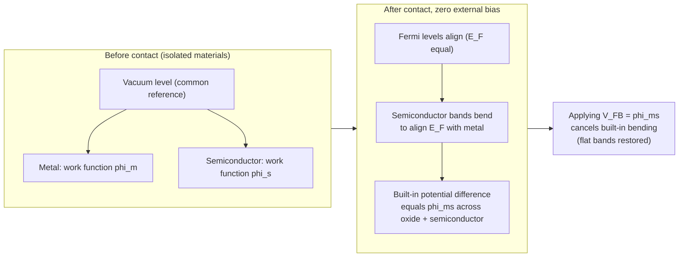

## Flat Band Voltage and Work Function Differences

### Definition and Physical Meaning

Flat-band voltage $V_{FB}$ is the gate voltage at which the energy bands in the semiconductor are flat (no band bending) from the bulk up to the semiconductor surface — the surface potential $\phi_s = 0$. In this condition, there is zero net space charge in the semiconductor, meaning the depletion/accumulation/inversion layer entirely vanishes.

For an ideal MOS capacitor with no oxide charge, applying $V_{FB} = 0$ would achieve flat-band naturally when the metal and semiconductor work functions are equal. In real devices, $V_{FB} \neq 0$ due to two independent contributions:

1. The **work function difference** $\phi_{ms}$ between gate and semiconductor
2. **Oxide and interface charges** (fixed, trapped, mobile — covered in the preceding topic)

$$V_{FB} = \phi_{ms} - \frac{Q_f + Q_{ot} + Q_m}{C_{ox}}$$

This section focuses on the $\phi_{ms}$ term; the charge term was developed in the previous item.

### Work Function Fundamentals

The work function $\phi$ of a material is the energy required to remove an electron from the Fermi level $E_F$ to the vacuum level $E_{vac}$ (vacuum energy just outside the material surface):

$$\phi = E_{vac} - E_F$$

For a metal gate, $\phi_m$ is a fixed material property (in the ideal, contamination-free case), typically 4.1–5.5 eV depending on the metal.

For a semiconductor gate or substrate, the work function is **not** a fixed number — it depends on doping type and concentration, because doping moves $E_F$ within the bandgap while $E_{vac}$ and the band edges stay fixed relative to the vacuum level via the electron affinity $\chi$:

$$\phi_s = \chi + (E_c - E_F)$$

where $\chi$ is the semiconductor electron affinity (4.05 eV for Si), and $(E_c - E_F)$ is the position of the Fermi level below the conduction band edge, which shifts with doping.

For silicon, this is commonly expressed using the intrinsic Fermi level $E_i$ and the bulk potential $\phi_F$:

$$\phi_s = \chi + \frac{E_g}{2q} + \phi_F$$

where $\phi_F = \frac{kT}{q}\ln\left(\frac{N_A}{n_i}\right)$ for p-type (positive $\phi_F$) or $\phi_F = -\frac{kT}{q}\ln\left(\frac{N_D}{n_i}\right)$ for n-type (negative $\phi_F$), $E_g$ is the bandgap (1.12 eV for Si at 300 K), and $n_i$ is the intrinsic carrier concentration ($\approx 1.0\times10^{10}$ cm⁻³ for Si at 300 K).

### Work Function Difference $\phi_{ms}$

$$\phi_{ms} = \phi_m - \phi_s = \phi_m - \left[\chi + \frac{E_g}{2q} + \phi_F\right]$$

**Key Points**

- $\phi_{ms}$ is positive when the gate work function exceeds that of the semiconductor (band bending required to align Fermi levels bends the semiconductor bands **downward** at zero bias, requiring negative $V_{FB}$ to flatten them — actually the sign convention must be tracked carefully per the formula above; see numerical example)
- Because $\phi_s$ (and hence $\phi_{ms}$) depends on doping concentration and type, $V_{FB}$ shifts with substrate doping even for a fixed gate material — this is a key design/process variable, not a fixed constant
- For **heavily doped polysilicon gates** (the historically dominant gate technology before high-k/metal gate), $\phi_m$ is replaced by the poly-Si work function, which itself depends on the poly doping type and level, following the same $\phi_s$ formula applied to the gate material

### Common Gate/Substrate Combinations

| Gate Material | Gate Work Function (approx.) | Typical Use Case |
| --- | --- | --- |
| n⁺ polysilicon | ~4.05–4.15 eV (near conduction band) | NMOS gate (historically) |
| p⁺ polysilicon | ~5.15–5.25 eV (near valence band) | PMOS gate (historically) |
| Al (aluminum) | ~4.1 eV | Early/legacy MOS gates |
| Al (older reported value) | ~4.1–4.3 eV | Legacy process technology |
| Metal gates (e.g., TiN, TaN, various work-function-tuned stacks) | 4.0–5.2 eV (engineered) | Modern high-k/metal-gate (HKMG) CMOS |

[Inference: exact tabulated work function values vary somewhat across textbooks/references due to measurement method and surface condition sensitivity; treat single-decimal-eV values as representative rather than universal constants]

### Worked Numerical Example

Consider an n⁺ polysilicon-gated MOS capacitor on a p-type Si substrate with $N_A = 10^{16}$ cm⁻³, at $T = 300$ K.

**Step 1 — Bulk potential $\phi_F$:**

$$\phi_F = \frac{kT}{q}\ln\left(\frac{N_A}{n_i}\right) = 0.0259\ \text{V} \times \ln\left(\frac{10^{16}}{1.0\times10^{10}}\right) \approx 0.0259 \times 13.8 \approx 0.357\ \text{V}$$

**Step 2 — Semiconductor work function:**

Using $\chi = 4.05$ eV and $E_g/2 = 0.56$ eV:

$$\phi_s = 4.05 + 0.56 + 0.357 \approx 4.967\ \text{eV}$$

**Step 3 — Gate (n⁺ poly) work function:**

For degenerately doped n⁺ polysilicon, $E_F$ sits essentially at $E_c$, so $\phi_m \approx \chi \approx 4.05$ eV (as an approximation; some references use ~4.05–4.15 eV to account for the residual degenerate-doping offset).

**Step 4 — Work function difference:**

$$\phi_{ms} = \phi_m - \phi_s \approx 4.05 - 4.967 \approx -0.92\ \text{V}$$

**Result**: this negative $\phi_{ms}$ means that, in the absence of oxide charge, $V_{FB} \approx -0.92$ V — a substantial negative flat-band voltage is required purely from the work function mismatch, before any oxide charge contribution is added. This illustrates why n⁺ poly / p-substrate NMOS technology has historically required threshold-adjust implants to bring $V_T$ into a usable positive range.

### Extraction of $V_{FB}$ from Measured C-V Data

**Key Points**

- $V_{FB}$ is identified experimentally as the gate voltage at which the measured high-frequency capacitance equals the theoretical flat-band capacitance $C_{FB}$, computed from:

$$C_{FB} = \frac{C_{ox}}{1 + \dfrac{C_{ox}}{C_s} \cdot \dfrac{\lambda_D}{\epsilon_s/\epsilon_s}}$$

more commonly written using the Debye length $L_D$ of the semiconductor:

$$C_{FB} = \frac{\epsilon_{ox}/t_{ox}}{1 + \dfrac{\epsilon_{ox}/t_{ox}}{\epsilon_s/L_D}}, \qquad L_D = \sqrt{\frac{\epsilon_s kT}{q^2 N_A}}$$

- $C_{FB}$ is always somewhat less than $C_{ox}$ (the flat-band capacitance line sits below the accumulation-region plateau on a standard C-V plot) because even at flat-band, the semiconductor contributes a small but nonzero Debye-length capacitance in series with $C_{ox}$
- Practically, $V_{FB}$ is read off the measured C-V curve at the bias point where $C = C_{FB}$
- Deviation of the measured $V_{FB}$ from the ideal work-function-only prediction directly yields the total effective oxide charge $Q_{ox,eff} = Q_f + Q_{ot} + Q_m$ via the flat-band equation, rearranged:

$$Q_{ox,eff} = C_{ox}\left(\phi_{ms} - V_{FB,measured}\right)$$

This is the standard method by which process engineers monitor oxide charge quality as a routine electrical test.

### Effect on Threshold Voltage

$V_{FB}$ is the reference point from which threshold voltage is built up in the standard MOS threshold voltage equation:

$$V_T = V_{FB} + 2\phi_F + \frac{\sqrt{2\epsilon_s q N_A (2\phi_F)}}{C_{ox}}$$

**Key Points**

- Any shift in $V_{FB}$ (from work function engineering, doping change, or oxide charge) translates directly, one-for-one, into a shift in $V_T$
- This is why gate work function engineering (choice of n⁺/p⁺ poly, or engineered metal gate work functions in HKMG technology) is one of the primary threshold-voltage-setting tools in CMOS process design, alongside channel doping and halo/pocket implants
- In modern dual-metal-gate CMOS, distinct metal work functions are deliberately selected near the conduction band edge (~4.0–4.2 eV) for NMOS and near the valence band edge (~5.0–5.2 eV) for PMOS, to obtain symmetric, low threshold voltages for both device types without needing heavily counter-doped polysilicon

### Energy Band Diagram: Before and After Contact

### Band Diagram Illustration: Flat-Band vs. Zero-Bias Condition

<svg xmlns="http://www.w3.org/2000/svg" viewBox="0 0 680 380" font-family="Helvetica, Arial, sans-serif">
<text x="340" y="24" text-anchor="middle" font-size="15" font-weight="bold">MOS Band Diagram: Zero Bias vs. Flat-Band Bias (svg_diagram)</text>

<text x="150" y="50" text-anchor="middle" font-size="13" font-weight="bold">V_G = 0 (bands bent)</text>

<line x1="40" y1="70" x2="40" y2="330" stroke="#333" stroke-width="1" />

<line x1="40" y1="80" x2="260" y2="80" stroke="#999" stroke-width="1" stroke-dasharray="2,2" />
<text x="260" y="78" font-size="9" fill="#999" text-anchor="end">E_vac</text>

<rect x="40" y="150" width="60" height="130" fill="#b0b0b0" stroke="#333" />
<line x1="40" y1="180" x2="100" y2="180" stroke="#000" stroke-width="2" />
<text x="70" y="175" text-anchor="middle" font-size="9">E_F (metal)</text>

<rect x="100" y="150" width="50" height="130" fill="#dce8f5" />
<text x="125" y="170" text-anchor="middle" font-size="8">SiO2</text>

<path d="M 150 160 Q 200 130 260 190" stroke="#e63946" stroke-width="2" fill="none" />
<text x="255" y="185" font-size="9" fill="#e63946">Ec</text>
<path d="M 150 260 Q 200 230 260 290" stroke="#457b9d" stroke-width="2" fill="none" />
<text x="255" y="300" font-size="9" fill="#457b9d">Ev</text>
<line x1="150" y1="220" x2="260" y2="220" stroke="#000" stroke-width="1.5" stroke-dasharray="4,2" />
<text x="265" y="223" font-size="9">E_F (semi)</text>
<text x="155" y="145" font-size="9" fill="#666">band bending</text>

<text x="510" y="50" text-anchor="middle" font-size="13" font-weight="bold">V_G = V_FB (bands flat)</text>

<rect x="400" y="150" width="60" height="130" fill="`#b0b0b0`" stroke="#333" />

<line x1="400" y1="180" x2="460" y2="180" stroke="#000" stroke-width="2" />

<text x="430" y="175" text-anchor="middle" font-size="9">E_F (metal)</text>

<rect x="460" y="150" width="50" height="130" fill="`#dce8f5`" />

<text x="485" y="170" text-anchor="middle" font-size="8">SiO2</text>

<line x1="510" y1="170" x2="620" y2="170" stroke="#e63946" stroke-width="2" />
<text x="615" y="165" font-size="9" fill="#e63946">Ec</text>
<line x1="510" y1="270" x2="620" y2="270" stroke="#457b9d" stroke-width="2" />
<text x="615" y="283" font-size="9" fill="#457b9d">Ev</text>
<line x1="510" y1="220" x2="620" y2="220" stroke="#000" stroke-width="1.5" stroke-dasharray="4,2" />
<text x="625" y="223" font-size="9">E_F (semi)</text>
<text x="500" y="145" font-size="9" fill="#666">no bending (flat)</text>
<line x1="340" y1="60" x2="340" y2="340" stroke="#ccc" stroke-width="1" stroke-dasharray="4,3" />
</svg>

### Doping and Temperature Dependence

**Key Points**

- Increasing substrate doping $N_A$ (p-type) increases $\phi_F$, which increases $\phi_s$, making $\phi_{ms}$ more negative — heavier p-type doping thus drives $V_{FB}$ more negative for a fixed gate material
- For n-type substrates, the sign of $\phi_F$ flips, and increasing $N_D$ drives $\phi_s$ down, making $\phi_{ms}$ more positive
- Temperature affects $V_{FB}$ primarily through $\phi_F \propto T\ln(N_A/n_i)$ and through the strong temperature dependence of $n_i$ itself ($n_i \propto T^{3/2}\exp(-E_g/2kT)$) — $n_i$ increases rapidly with temperature, which decreases $\phi_F$'s magnitude, so $V_{FB}$ drifts with temperature even with all charges held fixed [behavior may vary with specific doping level and temperature range; the approximation $n_i \propto T^{3/2}\exp(-E_g/2kT)$ itself assumes a temperature-independent bandgap, which is only approximately valid]

### Practical / Design Implications

- **Process monitoring**: $V_{FB}$ extraction from C-V test structures (MOS capacitors co-processed with the main wafer) is a standard fab-line electrical test used to monitor gate oxide charge quality wafer-to-wafer and lot-to-lot
- **Threshold voltage targeting**: gate work function selection (poly doping type/level, or metal gate composition in HKMG) is a first-order threshold-voltage design lever, used in conjunction with channel/well doping and threshold-adjust implants
- **Dual work-function CMOS**: modern HKMG processes use two distinct effective work function metals (or work-function-setting cap layers under a common metal) to independently target NMOS and PMOS thresholds without relying solely on heavily doped polysilicon depletion-prone gates
- **Reliability correlation**: unexpected $V_{FB}$ shift during device life (distinct from a shift traceable to intentional work function engineering) is a standard diagnostic signature of oxide charge instability (mobile ion contamination, radiation exposure, or bias-temperature stress)

**Related Topics**

- Oxide charges and interface trap states (fixed, trapped, mobile charge)
- MOS threshold voltage derivation and body effect
- C-V characteristics: accumulation, depletion, inversion regions
- High-k/metal-gate (HKMG) technology and effective work function engineering
- Poly-Si gate depletion effect
- Debye length and semiconductor small-signal capacitance
- Bias-temperature instability (NBTI/PBTI)