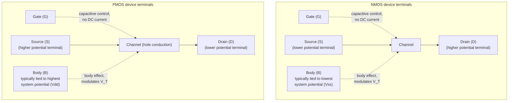

## MOSFET Structure and Terminal Behavior

### Overview

The Metal-Oxide-Semiconductor Field-Effect Transistor (MOSFET) is a four-terminal device that uses a gate electrode, capacitively coupled to a semiconductor channel through a thin insulating oxide, to modulate current flow between two other terminals (source and drain) via an electric field. It is the fundamental building block of virtually all modern digital and analog CMOS integrated circuits.

### Physical Structure

A conventional planar n-channel MOSFET (NMOS) built on a p-type substrate consists of:

- **Source and Drain**: two heavily doped n⁺ regions formed in the p-type substrate (or p-well), separated by a channel region. These regions are structurally identical and interchangeable by symmetry — the distinction between "source" and "drain" is defined electrically, not structurally (see Terminal Roles below)
- **Gate**: a conductive electrode (historically heavily doped polysilicon; in modern advanced nodes, a metal or metal-stack gate) positioned above the channel region, separated from the silicon by a thin gate dielectric
- **Gate oxide**: a thin insulating layer (thermally grown SiO₂ historically; high-k dielectrics such as HfO₂-based stacks in modern nodes) between the gate electrode and the channel, typically 1–5 nm in modern logic technology, historically tens of nm in older/legacy processes
- **Channel region**: the area of the substrate directly beneath the gate, between source and drain, where current-carrying inversion layer forms under appropriate gate bias
- **Body/Substrate (Bulk)**: the underlying semiconductor material (p-type for NMOS, n-type for PMOS) that the source, drain, and channel are formed within; often tied to a fixed potential (ground for NMOS body, $V_{DD}$ for PMOS body in bulk CMOS) but can be independently biased in some circuit configurations
- **Field oxide / isolation**: thick oxide regions (historically LOCOS, now predominantly shallow trench isolation, STI) surrounding the active device area to electrically isolate adjacent transistors

For a p-channel MOSFET (PMOS), the polarity is complementary: p⁺ source/drain regions in an n-type substrate (or n-well), with a hole-based inversion channel.

### Cross-Sectional Diagram

<svg xmlns="http://www.w3.org/2000/svg" viewBox="0 0 640 320" font-family="Helvetica, Arial, sans-serif">
<text x="320" y="24" text-anchor="middle" font-size="15" font-weight="bold">NMOS Transistor Cross Section (svg_diagram)</text>

<rect x="60" y="160" width="520" height="120" fill="#e8dcc8" stroke="#333" stroke-width="1.5" />
<text x="320" y="270" text-anchor="middle" font-size="12">p-type substrate (Body)</text>

<rect x="120" y="130" width="100" height="40" fill="#a8dadc" stroke="#333" stroke-width="1.5" />
<text x="170" y="155" text-anchor="middle" font-size="11">n+ Source</text>

<rect x="420" y="130" width="100" height="40" fill="#a8dadc" stroke="#333" stroke-width="1.5" />
<text x="470" y="155" text-anchor="middle" font-size="11">n+ Drain</text>

<rect x="220" y="160" width="200" height="10" fill="#f4a261" stroke="none" />
<text x="320" y="185" text-anchor="middle" font-size="10" fill="#c9781f">Channel region (under gate)</text>

<rect x="220" y="120" width="200" height="10" fill="#dce8f5" stroke="#333" stroke-width="1" />
<text x="320" y="105" text-anchor="middle" font-size="10">Gate oxide</text>

<rect x="220" y="85" width="200" height="35" fill="#b0b0b0" stroke="#333" stroke-width="1.5" />
<text x="320" y="107" text-anchor="middle" font-size="11">Gate (poly / metal)</text>

<rect x="60" y="145" width="60" height="15" fill="#dce8f5" stroke="#333" stroke-width="1" />

<rect x="520" y="145" width="60" height="15" fill="#dce8f5" stroke="#333" stroke-width="1" />
<text x="90" y="143" text-anchor="middle" font-size="8">STI</text>
<text x="550" y="143" text-anchor="middle" font-size="8">STI</text>

<line x1="170" y1="130" x2="170" y2="100" stroke="#000" stroke-width="1.5" />
<text x="170" y="90" text-anchor="middle" font-size="12" font-weight="bold">S</text>
<line x1="470" y1="130" x2="470" y2="100" stroke="#000" stroke-width="1.5" />
<text x="470" y="90" text-anchor="middle" font-size="12" font-weight="bold">D</text>
<line x1="320" y1="85" x2="320" y2="55" stroke="#000" stroke-width="1.5" />
<text x="320" y="45" text-anchor="middle" font-size="12" font-weight="bold">G</text>
<line x1="320" y1="280" x2="320" y2="305" stroke="#000" stroke-width="1.5" />
<text x="320" y="317" text-anchor="middle" font-size="12" font-weight="bold">B</text>
</svg>

### The Four Terminals

| Terminal | Symbol | Role |
| --- | --- | --- |
| Gate | G | Controls channel formation via capacitive field effect; ideally draws zero DC current through the (insulating) gate oxide |
| Source | S | Terminal from which carriers (electrons in NMOS, holes in PMOS) enter the channel |
| Drain | D | Terminal at which carriers exit the channel; carries the drain current $I_D$ |
| Body / Substrate / Bulk | B (or Sub) | Sets the reference potential for the channel region; modulates threshold voltage via the body effect |

**Key Points**

- The MOSFET is fundamentally a **four-terminal** device; the common three-terminal symbol/analysis (assuming source tied to body) is a simplification valid specifically when $V_{SB} = 0$
- In discrete MOSFETs, body is often internally tied to source at the package level, effectively making it a three-terminal device from the user's perspective
- In IC design, body is frequently a shared well/substrate connection across many transistors, tied to a fixed rail (VSS for NMOS body, VDD for PMOS body in standard bulk CMOS), rather than individually tied to each transistor's own source

### Terminal Identification by Convention (NMOS)

**Key Points**

- **Source**: by convention, the source of an NMOS is the terminal at the *lower* potential of the two source/drain terminals (the terminal that supplies/sources electrons into the channel)
- **Drain**: the terminal at the *higher* potential (collects/drains the current)
- For PMOS, the convention inverts: source is the terminal at the *higher* potential (source of holes), drain is at the *lower* potential
- This means source and drain can swap roles dynamically depending on the applied bias configuration — critical in circuits like transmission gates and pass-transistor logic, where current direction (and hence which physical terminal acts as source vs. drain) can reverse during operation
- Structurally the source and drain diffusions are typically fabricated identically (same doping, same geometry) precisely to support this electrical symmetry, though asymmetric source/drain engineering (e.g., different LDD/extension doping) is common in advanced nodes for performance optimization, which breaks perfect symmetry at the device-physics level even though the digital circuit abstraction still treats them as interchangeable

### Terminal Voltage Definitions

Standard bias conventions (referenced to the source terminal, for NMOS):

- $V_{GS}$ = gate-to-source voltage — the primary control variable that determines whether/how strongly the channel is inverted
- $V_{DS}$ = drain-to-source voltage — determines the electric field along the channel and the operating region (linear/triode vs. saturation)
- $V_{SB}$ = source-to-body voltage (or $V_{BS}$, body-to-source, sign-dependent per convention) — determines the body effect's influence on threshold voltage
- $V_{DB}$ = drain-to-body voltage (less commonly used directly, but relevant to junction reverse-bias considerations at the drain)

For NMOS in normal operation: $V_{GS} \geq 0$ typically, $V_{DS} \geq 0$, and the body-source junction is kept reverse- or zero-biased ($V_{SB} \geq 0$) to prevent forward conduction of the parasitic source-body p-n junction diode.

### Basic Operating Principle: Field-Effect Channel Formation

**Key Points**

- With $V_{GS} = 0$, the source and drain n⁺ regions are separated by the p-type body, forming two back-to-back p-n junctions (source-body and drain-body) — no continuous conduction path exists between source and drain, regardless of $V_{DS}$ (aside from leakage/subthreshold current)
- As $V_{GS}$ increases from zero, the MOS structure (gate-oxide-body, treated locally as a MOS capacitor) first depletes majority carriers (holes) from the surface, then — once $V_{GS}$ exceeds the threshold voltage $V_T$ — inverts the surface, forming a thin layer of minority carriers (electrons) that connects the source and drain n⁺ regions
- This inversion layer is the conducting **channel**; its electron concentration (and hence conductivity) increases with $(V_{GS} - V_T)$, giving the gate voltage direct control over the channel's current-carrying capacity
- The gate terminal itself carries essentially zero steady-state DC current (aside from a very small gate leakage current through the oxide, which becomes non-negligible for very thin oxides in advanced nodes via direct tunneling) — the gate exerts control purely through the electric field it establishes, not through injected charge, which is the defining characteristic of a field-effect device as opposed to a bipolar (current-controlled) device

### Two-Terminal Parasitic Structures Inherent to the MOSFET

**Key Points**

- **Source-body and drain-body p-n junction diodes**: parasitic diodes formed at each source/drain-to-body interface, which must remain reverse-biased (or zero-biased) during normal operation to avoid unwanted forward conduction and latch-up risk
- **Parasitic bipolar transistor**: the source-body-drain structure forms an inherent (typically undesired) bipolar junction transistor (n-p-n for NMOS), which is normally in cutoff but becomes relevant in punch-through, latch-up, and certain ESD protection design contexts
- **Gate-source and gate-drain overlap capacitances** ($C_{GSO}$, $C_{GDO}$): parasitic capacitances arising from lateral diffusion of source/drain dopants under the gate edge, significant for high-frequency and switching-speed analysis (notably via the Miller effect on $C_{GD}$)

### Terminal Behavior Summary Table

| Terminal | DC Current Behavior | Primary Physical Role |
| --- | --- | --- |
| Gate | ≈0 (ideal); small leakage in thin-oxide advanced nodes | Capacitively controls channel inversion |
| Source | Carries $I_D$ (current enters/exits depending on device polarity) | Origin of channel carriers |
| Drain | Carries $I_D$ | Collection point of channel carriers; sets channel field via $V_{DS}$ |
| Body | ≈0 in normal operation (reverse-biased junctions); can carry substrate/well current under stress conditions (e.g., impact ionization, latch-up) | Sets body effect / threshold modulation; junction isolation reference |

### Symbol Conventions

### NMOS vs. PMOS Structural and Bias Comparison

| Attribute | NMOS | PMOS |
| --- | --- | --- |
| Substrate/well type | p-type (or p-well) | n-type (or n-well) |
| Source/drain doping | n⁺ | p⁺ |
| Channel carrier | Electrons | Holes |
| Body typically tied to | $V_{SS}$ (ground) | $V_{DD}$ |
| Turn-on condition | $V_{GS} > V_{T,n}$ ($V_{T,n} > 0$ typical, enhancement mode) | $V_{GS} < V_{T,p}$ ($V_{T,p} < 0$ typical, enhancement mode) |
| Source identification convention | Lower-potential S/D terminal | Higher-potential S/D terminal |
| Relative mobility (same geometry) | Higher ($\mu_n > \mu_p$, roughly 2–3× in Si) | Lower |

### Enhancement Mode vs. Depletion Mode

**Key Points**

- **Enhancement-mode MOSFET** (the overwhelmingly dominant type in modern digital CMOS): no conducting channel exists at $V_{GS}=0$; a channel must be *induced* ("enhanced") by applying sufficient gate bias beyond threshold
- **Depletion-mode MOSFET**: a conducting channel is built in at $V_{GS}=0$ via a lightly doped implant of the same type as source/drain beneath the gate; applying gate bias of the opposite polarity from the enhancement case *depletes* this built-in channel, turning the device off — historically used in NMOS-only load-device circuits and in certain specialty/RF/power applications, largely superseded by CMOS enhancement-mode design in modern digital logic

### Practical Notes on Real-Device Terminal Behavior

- **Gate leakage**: in advanced nodes with gate oxides approaching a few atomic layers, direct quantum-mechanical tunneling produces non-negligible gate leakage current, motivating the shift to physically thicker high-k dielectrics (with equivalent oxide thickness, EOT, kept low) to suppress tunneling while preserving gate capacitive control [behavior may vary significantly with specific technology node, dielectric material, and oxide thickness]
- **Body effect in circuit design**: when body and source are not at the same potential (e.g., a transistor stacked above ground in a series NMOS stack, with its source floating above $V_{SB}=0$), the effective threshold voltage increases, which must be accounted for in analog and digital timing analysis
- **Symmetric layout convention**: in circuit schematics, MOSFETs are frequently drawn without distinguishing source/drain terminals explicitly (especially in switch-level and pass-transistor contexts), relying on the reader to infer source/drain roles from the bias conditions in the specific circuit configuration

**Related Topics**

- MOSFET threshold voltage and body effect
- Enhancement-mode vs. depletion-mode device operation
- I-V characteristics: linear (triode) and saturation regions
- Channel length modulation and output resistance
- Parasitic capacitances (Miller effect, overlap capacitance)
- Short-channel effects and subthreshold conduction
- CMOS inverter operation and complementary device pairing
- Latch-up in bulk CMOS technology
- High-k/metal-gate technology and gate leakage suppression