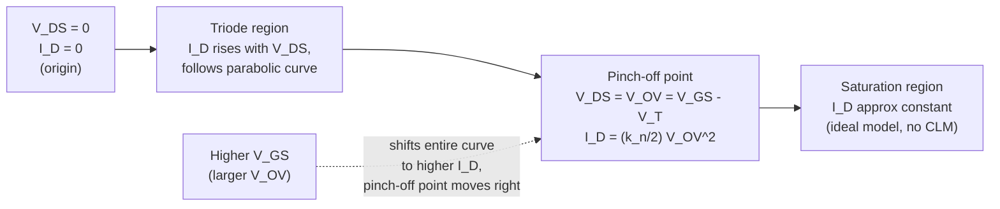

## Linear and Saturation Region Current Equations

### Overview

The drain current $I_D$ of a MOSFET as a function of terminal voltages is described by distinct analytical expressions depending on the operating region, derived from the gradual channel approximation (Shockley's square-law model). Three regions are defined by the relative magnitude of $V_{GS}$, $V_T$, and $V_{DS}$: cutoff, linear (triode), and saturation.

### Region Classification

For an NMOS device (enhancement mode, $V_T > 0$):

| Region | Condition | Physical State |
| --- | --- | --- |
| Cutoff | $V_{GS} < V_T$ | No inversion channel; only subthreshold leakage current flows |
| Linear (Triode/Ohmic) | $V_{GS} \geq V_T$ and $V_{DS} < V_{GS} - V_T$ | Continuous inversion channel from source to drain |
| Saturation | $V_{GS} \geq V_T$ and $V_{DS} \geq V_{GS} - V_T$ | Channel pinched off near the drain |

The quantity $V_{GS} - V_T$ is commonly denoted $V_{OV}$ (overdrive voltage) and represents the effective gate drive above threshold.

### Derivation via the Gradual Channel Approximation

**Key Points**

- Assumes the channel's transverse electric field (from gate to substrate) dominates over the longitudinal field (from source to drain), allowing the channel to be treated as a series of local MOS-capacitor cross-sections, each in quasi-equilibrium
- The local charge per unit area in the inversion channel at position $x$ along the channel, where the local channel-to-source voltage is $V(x)$, is:

$$Q_n(x) = -C_{ox}\left[V_{GS} - V(x) - V_T\right]$$

- Current continuity requires the same drain current $I_D$ flows at every point along the channel (charge conservation in steady state)
- The drift current at position $x$, using channel width $W$ and mobility $\mu_n$:

$$I_D = W \mu_n Q_n(x) \frac{dV(x)}{dx} \quad (\text{with sign convention absorbed appropriately})$$

- Integrating this equation from $x=0$ (source, $V=0$) to $x=L$ (drain, $V=V_{DS}$) yields the full linear-region expression

### Linear (Triode) Region Current Equation

$$I_D = \mu_n C_{ox} \frac{W}{L}\left[(V_{GS} - V_T)V_{DS} - \frac{V_{DS}^2}{2}\right]$$

Often written using the process transconductance parameter $k_n' = \mu_n C_{ox}$ and the device transconductance parameter $k_n = k_n' \frac{W}{L}$:

$$I_D = k_n\left[(V_{GS}-V_T)V_{DS} - \frac{V_{DS}^2}{2}\right] = k_n\left[V_{OV}V_{DS} - \frac{V_{DS}^2}{2}\right]$$

**Key Points**

- Valid strictly for $0 \leq V_{DS} < V_{OV}$
- For very small $V_{DS}$ (deep triode, $V_{DS} \ll V_{OV}$), the quadratic term becomes negligible and the equation reduces to:

$$I_D \approx k_n V_{OV} V_{DS}$$

which is linear in $V_{DS}$, giving the MOSFET a resistor-like behavior in this regime — the origin of the "linear region" name. The equivalent channel resistance is:

$$R_{on} \approx \frac{1}{k_n V_{OV}} = \frac{1}{\mu_n C_{ox}\frac{W}{L}(V_{GS}-V_T)}$$

- This deep-triode approximation is the basis for using MOSFETs as voltage-controlled resistors and as low-resistance switches in analog switch/pass-gate applications

### Saturation Region Current Equation

At the boundary $V_{DS} = V_{OV} = V_{GS} - V_T$, the channel charge at the drain end, $Q_n(L)$, drops to zero — this is the **pinch-off** point. For $V_{DS}$ beyond this point, the channel is pinched off before reaching the physical drain, and the drain current becomes (ideally) independent of further increases in $V_{DS}$:

$$I_D = \frac{1}{2}\mu_n C_{ox}\frac{W}{L}(V_{GS}-V_T)^2 = \frac{k_n}{2}V_{OV}^2$$

**Key Points**

- Obtained by substituting $V_{DS} = V_{OV}$ into the linear-region equation
- Valid for $V_{DS} \geq V_{OV}$ (ideal long-channel model, no channel-length modulation)
- The quadratic dependence on $V_{OV}$ is the origin of the term "square-law device"
- In this idealized model, $I_D$ is completely flat with respect to $V_{DS}$ once saturation is reached — output resistance is infinite; this is refined by channel-length modulation (covered separately) to give a finite, non-zero slope in real devices

### Complete Piecewise Model

$$I_D =
\begin{cases}
0 & V_{GS} < V_T \quad \text{(cutoff, ignoring subthreshold leakage)} \\[6pt]
k_n\left[V_{OV}V_{DS} - \dfrac{V_{DS}^2}{2}\right] & 0 \leq V_{DS} < V_{OV} \quad \text{(linear/triode)} \\[10pt]
\dfrac{k_n}{2}V_{OV}^2 & V_{DS} \geq V_{OV} \quad \text{(saturation)}
\end{cases}$$

### I-V Characteristic Family of Curves

### Transition Boundary: The Pinch-Off Locus

**Key Points**

- The parabola $I_D = k_n\left[V_{DS}V_{OV} - V_{DS}^2/2\right]$ evaluated exactly at $V_{DS}=V_{OV}$ traces out the locus of pinch-off points across different $V_{GS}$ values
- This boundary itself is described by $I_{D,sat} = \frac{k_n}{2}V_{DS}^2$ (substituting $V_{OV}=V_{DS}$ at the boundary), which is a parabola in the $I_D$–$V_{DS}$ plane, distinct from the horizontal saturation lines for each individual $V_{GS}$ curve
- On a standard family-of-curves plot ($I_D$ vs. $V_{DS}$, parameterized by $V_{GS}$), this locus is the dividing curve separating the triode region (left of the locus) from the saturation region (right of the locus)

### Transconductance and Output Conductance

Two key small-signal parameters are derived directly by differentiating the current equations:

**Transconductance** $g_m = \dfrac{\partial I_D}{\partial V_{GS}}\bigg|_{V_{DS}=\text{const}}$

In saturation:

$$g_m = k_n V_{OV} = \sqrt{2 k_n I_D} = \frac{2I_D}{V_{OV}}$$

In triode:

$$g_m = k_n V_{DS}$$

**Output conductance** $g_{ds} = \dfrac{\partial I_D}{\partial V_{DS}}\bigg|_{V_{GS}=\text{const}}$

In ideal saturation (no channel-length modulation): $g_{ds} = 0$

In triode:

$$g_{ds} = k_n(V_{OV} - V_{DS})$$

Note that $g_{ds} \to 0$ as $V_{DS} \to V_{OV}$ from below, consistent with the smooth (continuously differentiable) transition into the saturation region at the pinch-off boundary — this continuity of both $I_D$ and $dI_D/dV_{DS}$ across the triode/saturation boundary is an important self-consistency check on the model.

### PMOS Equations (Sign Convention)

For PMOS devices, all voltage and current polarities invert relative to NMOS. Using magnitudes with $V_T < 0$ for PMOS and defining $|V_{OV}| = |V_{GS}| - |V_T|$ (with $V_{GS} < 0$, $V_T < 0$):

$$I_D = k_p\left[|V_{OV}||V_{DS}| - \frac{V_{DS}^2}{2}\right] \quad \text{(triode)}$$

$$I_D = \frac{k_p}{2}|V_{OV}|^2 \quad \text{(saturation)}$$

with $k_p = \mu_p C_{ox}\frac{W}{L}$, and $\mu_p < \mu_n$ typically (by roughly 2–3× in bulk silicon), meaning a PMOS device sized with the same $W/L$ as an NMOS device produces proportionally less drive current — a key reason PMOS transistors are typically drawn wider than NMOS in balanced CMOS logic gate design.

### Numerical Example

Given an NMOS device with $\mu_n C_{ox} = 200\ \mu\text{A/V}^2$, $W/L = 10$, $V_T = 0.5$ V, find $I_D$ at (a) $V_{GS}=1.5$ V, $V_{DS}=0.3$ V, and (b) $V_{GS}=1.5$ V, $V_{DS}=1.5$ V.

$k_n = \mu_n C_{ox}\frac{W}{L} = 200 \times 10 = 2000\ \mu\text{A/V}^2 = 2\ \text{mA/V}^2$

$V_{OV} = 1.5 - 0.5 = 1.0$ V

**Case (a)**: $V_{DS} = 0.3$ V $< V_{OV} = 1.0$ V → triode region

$$I_D = 2\ \text{mA/V}^2 \times \left[1.0 \times 0.3 - \frac{0.3^2}{2}\right] = 2 \times [0.3 - 0.045] = 2 \times 0.255 = 0.51\ \text{mA}$$

**Case (b)**: $V_{DS} = 1.5$ V $\geq V_{OV} = 1.0$ V → saturation region

$$I_D = \frac{2\ \text{mA/V}^2}{2} \times (1.0)^2 = 1.0\ \text{mA}$$

### Limitations of the Ideal Square-Law Model

**Key Points**

- **Channel-length modulation**: real devices show a finite slope in saturation ($I_D$ increases slightly with $V_{DS}$) due to effective channel length shortening as the pinch-off point moves toward the source with increasing $V_{DS}$; modeled by the multiplicative factor $(1+\lambda V_{DS})$
- **Velocity saturation**: in short-channel devices, carrier velocity saturates at high longitudinal field before reaching the mobility-limited drift velocity, causing the actual $I_D$-$V_{GS}$ relationship in saturation to become closer to linear than quadratic — a well-documented short-channel deviation from the square law [Inference: the specific degree of deviation is technology-node and bias-dependent, and exact modeling requires more advanced compact models such as BSIM rather than the hand-analysis square-law equations]
- **Mobility degradation**: vertical field from the gate reduces effective channel mobility at high $V_{GS}$ (surface scattering effects), causing $k_n$ itself to be a decreasing function of $V_{OV}$ in real devices rather than a true constant
- **Subthreshold conduction**: the ideal model predicts exactly zero current for $V_{GS} < V_T$; real devices show an exponential subthreshold current governed by diffusion current physics, which is significant for low-power circuit design and is treated as a distinct topic
- **Body effect**: if $V_{SB} \neq 0$, $V_T$ itself shifts according to the body-effect equation, which must be substituted into all the above equations for accurate analysis — the equations above implicitly assume $V_{SB}=0$

These equations, despite their idealizations, remain the standard starting point for hand analysis, first-order circuit design intuition, and textbook derivation of amplifier gain, digital gate delay, and switching characteristics, even though production-grade SPICE simulation relies on far more detailed compact models (BSIM, PSP, etc.) for quantitative accuracy.

**Related Topics**

- Channel-length modulation and finite output resistance
- Subthreshold conduction and the exponential I-V regime
- Body effect and threshold voltage modulation
- Short-channel effects: velocity saturation, DIBL, mobility degradation
- Small-signal MOSFET model (g_m, g_ds, and equivalent circuit)
- CMOS logic gate switching and propagation delay analysis
- BSIM compact modeling for circuit simulation
- MOSFET as a voltage-controlled resistor / analog switch