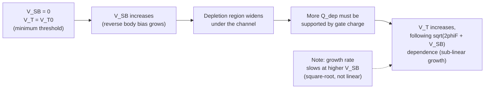

## Threshold Voltage and the Body Effect

### Overview

Threshold voltage $V_T$ is the gate-to-source voltage at which strong inversion is established at the semiconductor surface, marking the onset of significant channel conduction in a MOSFET. It is not a fixed device constant but depends on process parameters (oxide thickness, doping, gate material) and on operating conditions — most notably the source-to-body voltage $V_{SB}$, an effect known as the **body effect** (or substrate bias effect).

### Threshold Voltage Derivation

Threshold voltage is defined as the gate voltage required to achieve **strong inversion**, conventionally taken as the point where the surface potential $\phi_s$ equals $2\phi_F$ (twice the bulk Fermi potential), i.e., the surface is inverted to the same degree that the bulk is doped, but with opposite carrier type dominant at the surface.

Starting from the flat-band voltage (established in the MOS capacitor chapter) and adding the gate voltage components needed to (1) reach the onset of strong inversion at the surface and (2) support the depletion charge under the gate:

$$V_T = V_{FB} + 2\phi_F + \frac{\sqrt{2\epsilon_s q N_A(2\phi_F + V_{SB})}}{C_{ox}}$$

For $V_{SB} = 0$ (source tied to body), this reduces to the zero-bias threshold voltage $V_{T0}$:

$$V_{T0} = V_{FB} + 2\phi_F + \frac{\sqrt{2\epsilon_s q N_A(2\phi_F)}}{C_{ox}}$$

**Key Points**

- $V_{FB}$ carries the work function difference and oxide charge contributions (from the MOS capacitor chapter)
- $2\phi_F$ is the surface potential band-bending required to reach strong inversion, with $\phi_F = \frac{kT}{q}\ln(N_A/n_i)$ for p-type substrate
- The square-root term represents the gate voltage needed to support the depletion region charge $Q_{dep}$ under the gate at the onset of strong inversion, divided by $C_{ox}$ to convert charge into an equivalent gate voltage
- This is often written compactly as:

$$V_T = V_{FB} + 2\phi_F + \frac{Q_{dep,max}}{C_{ox}}, \qquad Q_{dep,max} = \sqrt{2\epsilon_s q N_A(2\phi_F + V_{SB})}$$

### The Body Effect

**Key Points**

- When the source is at a higher potential than the body (for NMOS: $V_{SB} > 0$, i.e., body more negative relative to source), the source-body junction becomes reverse-biased
- This reverse bias widens the depletion region under the channel (since the depletion width depends on the total junction potential, which now includes both the built-in potential and the externally applied $V_{SB}$)
- A wider depletion region holds more fixed depletion charge $Q_{dep}$, which requires more gate voltage to support at the onset of strong inversion — hence $V_T$ **increases in magnitude** with increasing $|V_{SB}|$ (more positive for NMOS)
- Physically: raising the source above the body potential effectively "pulls" the channel further from the body reference, requiring extra gate voltage to re-establish the same surface inversion condition
- This coupling — where a voltage applied at a *different* terminal (body) modulates the effective threshold seen at the gate-source pair — is why the body is sometimes informally called the "back gate," and $\partial V_T/\partial V_{SB}$ is analogous to a transconductance from the body terminal

### Body Effect Equation

$$V_T = V_{T0} + \gamma\left(\sqrt{2\phi_F + V_{SB}} - \sqrt{2\phi_F}\right)$$

where $\gamma$ is the **body effect coefficient** (also called the body-bias coefficient or substrate-bias factor):

$$\gamma = \frac{\sqrt{2\epsilon_s q N_A}}{C_{ox}}$$

with units of $\sqrt{\text{V}}$ (typically expressed in $\text{V}^{1/2}$).

**Key Points**

- $\gamma$ increases with substrate doping $N_A$ (heavier doping → stronger body effect) and decreases with thinner oxide (larger $C_{ox}$ → weaker body effect per unit depletion charge, since the same charge produces a smaller effective voltage across a larger capacitance)
- Typical values of $\gamma$ range from approximately 0.2 to 0.6 $\text{V}^{1/2}$ for bulk CMOS technologies, though this varies substantially with process generation and well/channel doping engineering [Inference: exact values are highly process-specific and require datasheet or SPICE model parameter extraction for any real design]
- For PMOS in an n-well, the equation takes the same form with sign conventions adapted to hole-based inversion and n-type body doping ($N_D$ replacing $N_A$), and $V_{SB}$ replaced conceptually by $V_{BS}$ (body more positive than source raises $|V_T|$ for PMOS)

### Numerical Example

Given $V_{T0} = 0.5$ V, $\gamma = 0.4\ \text{V}^{1/2}$, $2\phi_F = 0.7$ V, find $V_T$ at $V_{SB} = 2.0$ V.

$$V_T = 0.5 + 0.4\left(\sqrt{0.7+2.0} - \sqrt{0.7}\right) = 0.5 + 0.4\left(\sqrt{2.7} - \sqrt{0.7}\right)$$

$$= 0.5 + 0.4(1.643 - 0.837) = 0.5 + 0.4(0.806) = 0.5 + 0.322 = 0.822\ \text{V}$$

**Result**: applying 2.0 V of reverse source-body bias raises the threshold voltage from 0.5 V to approximately 0.822 V — a substantial shift that must be accounted for in any circuit where transistors are not source-body tied.

### Graphical Behavior: $V_T$ vs. $V_{SB}$

### Where the Body Effect Matters in Circuit Design

**Key Points**

- **Series-stacked transistors**: in NMOS transistor stacks (e.g., NAND gates, cascode current mirrors, transmission gate chains), transistors above the bottom-most device have their source floating above ground, creating nonzero $V_{SB}$ and hence elevated $V_T$ for those devices — this reduces drive current and must be included in accurate delay/timing analysis
- **Pass-transistor logic**: an NMOS pass transistor passing a HIGH signal suffers a threshold drop equal to $V_T$ (elevated further by the body effect as the output rises, since $V_{SB}$ of the pass transistor increases as its source-side output node rises toward $V_{DD}$) — this is the well-known "weak high" problem in NMOS-only pass-gate logic, worsened progressively as the output approaches $V_{DD} - V_T$
- **Body/substrate biasing techniques**: intentionally biasing the body terminal (forward or reverse body bias, FBB/RBB) is used as a design technique to dynamically trade off leakage current against speed — reverse body bias increases $V_T$ to reduce subthreshold leakage in standby mode, while forward body bias lowers $V_T$ to boost speed at the cost of increased leakage
- **Analog circuit design**: in cascode and folded-cascode amplifier topologies, body effect on the upper cascode transistor(s) is a standard consideration affecting both DC operating point and small-signal behavior (via the body transconductance $g_{mb}$)

### Body Transconductance ($g_{mb}$)

Since $V_T$ depends on $V_{SB}$, and $I_D$ depends on $V_T$, the body terminal has an effective small-signal transconductance:

$$g_{mb} = \frac{\partial I_D}{\partial V_{SB}} = -\frac{\partial I_D}{\partial V_T}\cdot\frac{\partial V_T}{\partial V_{SB}} = g_m \cdot \frac{\gamma}{2\sqrt{2\phi_F + V_{SB}}} = \chi\, g_m$$

where $\chi = g_{mb}/g_m$ is typically in the range of 0.1–0.3 for common bulk process technologies [Inference: this ratio is process- and bias-point-dependent; the 0.1–0.3 range is representative rather than universal]. This body transconductance appears explicitly in small-signal models whenever $V_{SB} \neq 0$, functioning as an additional current source dependent on the body-source voltage, in parallel with the standard $g_m v_{gs}$ dependent source.

### Threshold Voltage Adjustment via Implantation

**Key Points**

- Beyond the body effect (an operating-condition-dependent shift), $V_T$ is also deliberately set during fabrication via **threshold-adjust ion implantation** — a shallow implant into the channel region that modifies the effective surface doping profile beneath the gate
- A shallow **boron implant** (for NMOS on p-substrate) increases effective near-surface $N_A$, raising $V_T$
- A shallow **counter-doping implant** (e.g., phosphorus/arsenic for NMOS) can lower $V_T$ by partially compensating the substrate doping near the surface
- This technique allows independent tuning of NMOS and PMOS thresholds without relying solely on gate work function selection, and is standard practice for setting multiple threshold-voltage device flavors (high-$V_T$, standard-$V_T$, low-$V_T$) within a single process technology for power/performance trade-off in digital design

### Short-Channel and Advanced-Node Deviations

**Key Points**

- **DIBL (Drain-Induced Barrier Lowering)**: in short-channel devices, the drain electric field begins to influence the source-side potential barrier directly, causing $V_T$ to decrease with increasing $V_{DS}$ — a short-channel effect not captured in the long-channel body-effect equation above
- **Roll-off**: $V_T$ tends to decrease as channel length is scaled down (threshold voltage roll-off), due to charge-sharing effects between the source/drain depletion regions and the gate-controlled depletion region — again a deviation from the simple long-channel formula
- **Narrow-width effects**: for very narrow channel widths, additional fringing field effects from the isolation structure can shift $V_T$ in either direction depending on isolation technology (LOCOS historically increased $V_T$ at narrow widths; STI can produce the opposite trend, an inverse narrow-width effect)
- These effects mean the classical body-effect formula is a foundational long-channel approximation; production compact models (BSIM and successors) include extensive additional terms to capture these corrections accurately [behavior may vary substantially with specific technology node and device geometry]

**Related Topics**

- Flat-band voltage and work function differences
- Linear and saturation region current equations
- Short-channel effects: DIBL, threshold roll-off, velocity saturation
- Subthreshold conduction and subthreshold slope
- Multiple-Vt design and threshold-adjust implantation
- Body biasing techniques for leakage/performance trade-off (FBB/RBB)
- Small-signal MOSFET model including body transconductance g_mb
- Pass-transistor logic and threshold voltage drop