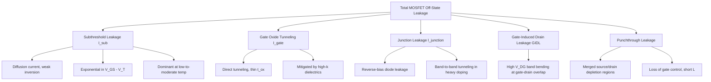

## Subthreshold Conduction and Leakage

### Overview

Subthreshold conduction refers to the drain current that flows in a MOSFET when the gate-to-source voltage $V_{GS}$ is below the threshold voltage $V_T$. In this regime, the device is nominally "off," but a non-zero current still flows due to weak inversion at the semiconductor surface. This current is a major contributor to static (leakage) power dissipation in modern integrated circuits, especially as supply voltages and threshold voltages scale down.

### Physical Origin: Weak Inversion

In strong inversion ($V_{GS} > V_T$), the channel conducts primarily by drift of carriers in an inverted surface layer with high carrier concentration. Below threshold, the surface potential is not high enough to create strong inversion, but a diffusion-based current still exists, analogous to the current in a bipolar junction transistor operating in the active region.

The channel behaves like the base region of a BJT: carriers diffuse from source to drain due to a concentration gradient rather than being swept by a strong drift field. This is why subthreshold current has an exponential dependence on $V_{GS}$, mirroring the exponential $I$-$V$ relationship of a diode or BJT.

### Subthreshold Current Equation

The subthreshold drain current is commonly modeled as:

$$I_{DS} = I_0 \cdot \frac{W}{L} \cdot e^{\frac{V_{GS} - V_T}{n V_{th}}} \left(1 - e^{-\frac{V_{DS}}{V_{th}}}\right)$$

where:

- $I_0$ is a technology-dependent current constant (depends on mobility, oxide capacitance, and $V_{th}^2$)
- $W/L$ is the transistor aspect ratio
- $V_{th} = kT/q$ is the thermal voltage (~26 mV at room temperature)
- $n$ is the subthreshold slope factor (ideality factor), typically between 1.0 and 2.0
- $V_T$ is the threshold voltage

For $V_{DS} > 3$–$4 \times V_{th}$ (a few hundred millivolts), the term $\left(1 - e^{-V_{DS}/V_{th}}\right) \approx 1$, so the current becomes essentially independent of $V_{DS}$ and depends exponentially only on $V_{GS}$.

### Subthreshold Slope (S)

The subthreshold slope, often called the "S-factor" or "swing," quantifies how sharply the transistor turns off. It is defined as the change in $V_{GS}$ required to change $I_{DS}$ by one decade:

$$S = \frac{\partial V_{GS}}{\partial (\log_{10} I_{DS})} = n V_{th} \ln(10)$$

At room temperature ($T = 300$ K), the theoretical minimum (with $n = 1$) is:

$$S_{min} = \ln(10) \cdot \frac{kT}{q} \approx 2.303 \times 26\ \text{mV} \approx 60\ \text{mV/decade}$$

In practice, real MOSFETs have $S$ in the range of 70–100 mV/decade due to $n > 1$, caused by capacitive coupling between the gate and the channel via the depletion region and interface traps.

The slope factor $n$ is expressed as:

$$n = 1 + \frac{C_{dep}}{C_{ox}}$$

where $C_{dep}$ is the depletion capacitance and $C_{ox}$ is the gate oxide capacitance. A thinner oxide (higher $C_{ox}$) or lower depletion capacitance (via well engineering) brings $n$ closer to 1, improving (lowering) the subthreshold slope.

**Key Points**

- Lower $S$ (closer to 60 mV/decade) means a sharper on/off transition — desirable for low-power digital logic.
- $S$ cannot be reduced below ~60 mV/decade at room temperature in a conventional bulk MOSFET; this is a fundamental thermodynamic limit tied to Boltzmann statistics, not a fabrication limitation.
- Emerging device concepts like tunnel FETs (TFETs) aim to break this 60 mV/decade limit by using band-to-band tunneling instead of thermionic emission.

### Why Subthreshold Slope Cannot Beat 60 mV/decade (Conventional MOSFET)

The carrier population in the channel follows a Boltzmann distribution with respect to the surface potential barrier, similar to carrier injection in a diode. Since the thermal voltage $kT/q$ sets the exponential rate of carrier population change with energy, and gate-to-surface-potential coupling is capacitively divided ($n \geq 1$), $S$ is bounded below by $\ln(10) \cdot kT/q$. This is a physical limit rooted in statistical mechanics — it applies regardless of gate length, oxide material, or channel material, as long as conduction relies on thermionic emission over a barrier.

### Sources of Leakage Current

Subthreshold conduction is one of several leakage mechanisms in a MOSFET. The major ones are:

1. **Subthreshold leakage ($I_{sub}$)** — diffusion current when $V_{GS} < V_T$, as described above.
2. **Gate oxide tunneling leakage ($I_{gate}$)** — direct tunneling or Fowler-Nordheim tunneling through very thin gate oxides, significant when $t_{ox}$ is scaled below ~2 nm.
3. **Junction leakage ($I_{junction}$)** — reverse-bias diode leakage at source/drain-to-body junctions, including band-to-band tunneling in heavily doped junctions.
4. **Gate-induced drain leakage (GIDL)** — band bending at the gate-drain overlap region under high $V_{DG}$, causing band-to-band tunneling.
5. **Punchthrough leakage** — when source and drain depletion regions merge at very short channel lengths, allowing current to flow independent of gate control.

**Key Points**

- Subthreshold leakage is typically the dominant leakage component in modern digital circuits at nominal operating temperatures, though gate tunneling becomes comparable or dominant in very thin-oxide nodes without high-$\kappa$ dielectrics.
- All leakage mechanisms increase with temperature; subthreshold leakage in particular grows roughly exponentially with temperature because both $V_{th}$ (thermal voltage) increases and threshold voltage $V_T$ decreases with temperature.

### Dependence on Design and Process Parameters

**Threshold voltage ($V_T$):**

Lower $V_T$ increases subthreshold leakage exponentially, since the off-state current at $V_{GS} = 0$ is:

$$I_{off} = I_0 \cdot \frac{W}{L} \cdot e^{\frac{-V_T}{n V_{th}}}$$

This creates a fundamental power-performance trade-off: lowering $V_T$ increases switching speed (higher overdrive at a given $V_{DD}$) but exponentially increases static leakage power.

**Channel length ($L$):**

Short-channel effects (drain-induced barrier lowering, DIBL) reduce the effective threshold voltage as $L$ shrinks and as $V_{DS}$ increases, worsening subthreshold leakage. This is captured empirically by adding a DIBL term:

$$V_T(V_{DS}) = V_{T0} - \eta \cdot V_{DS}$$

where $\eta$ is the DIBL coefficient.

**Temperature:**

Both $V_{th} = kT/q$ (thermal voltage) and the intrinsic carrier concentration increase with temperature, while $V_T$ typically decreases with temperature (~1–2 mV/°C for bulk silicon). Both effects act in the same direction, causing subthreshold leakage to increase substantially — often by an order of magnitude or more — from room temperature to typical operating temperatures of 85–125°C in commercial ICs. [Inference: exact magnitude is highly process- and design-dependent]

**Body bias:**

Applying reverse body bias (increasing $|V_{SB}|$) increases $V_T$ via the body effect, reducing subthreshold leakage at the cost of reduced drive current. This technique is used in some low-power designs as an adaptive leakage control mechanism.

### Subthreshold Region I-V Characteristic (Illustration)

<svg xmlns="http://www.w3.org/2000/svg" viewBox="0 0 700 450">
<text x="350" y="30" font-size="18" text-anchor="middle" font-family="sans-serif" font-weight="bold">MOSFET Subthreshold I-V Characteristic (svg_diagram)</text>

<line x1="80" y1="380" x2="650" y2="380" stroke="black" stroke-width="2" />
<line x1="80" y1="380" x2="80" y2="50" stroke="black" stroke-width="2" />

<text x="365" y="415" font-size="14" text-anchor="middle" font-family="sans-serif">Gate-Source Voltage, V_GS (linear)</text>

<text x="30" y="215" font-size="14" text-anchor="middle" font-family="sans-serif" transform="rotate(-90 30 215)">log(I_DS)</text>

<line x1="420" y1="380" x2="420" y2="60" stroke="gray" stroke-width="1.5" stroke-dasharray="6,4" />
<text x="420" y="400" font-size="13" text-anchor="middle" font-family="sans-serif">V_T</text>

<line x1="120" y1="360" x2="420" y2="180" stroke="#1f77b4" stroke-width="3" />

<path d="M 420 180 Q 500 130 650 70" fill="none" stroke="#d62728" stroke-width="3" />

<circle cx="120" cy="360" r="4" fill="black" />
<text x="130" y="358" font-size="12" font-family="sans-serif">I_off (V_GS=0)</text>

<text x="200" y="250" font-size="13" font-family="sans-serif" fill="`#1f77b4`">Subthreshold region</text>

<text x="200" y="268" font-size="12" font-family="sans-serif" fill="`#1f77b4`">Slope = S (mV/decade)</text>

<text x="470" y="120" font-size="13" font-family="sans-serif" fill="`#d62728`">Strong inversion</text>

<text x="470" y="138" font-size="12" font-family="sans-serif" fill="`#d62728`">(quadratic/linear region)</text>

<line x1="150" y1="330" x2="150" y2="300" stroke="black" stroke-width="1" />
<line x1="150" y1="300" x2="200" y2="300" stroke="black" stroke-width="1" />
<line x1="150" y1="330" x2="200" y2="300" stroke="black" stroke-width="1" stroke-dasharray="3,2" />
<text x="205" y="320" font-size="11" font-family="sans-serif">ΔV_GS per decade of I_DS</text>
</svg>

### Leakage Mechanism Summary Diagram

### Impact on Circuit Design (Static Power)

Total static power in a digital chip is approximately:

$$P_{static} = V_{DD} \cdot I_{off} \cdot N_{transistors}$$

As process nodes scale (following historical Dennard/Moore's Law trends), the number of transistors $N$ increases while $V_T$ has historically been reduced to maintain drive current at lower $V_{DD}$. This combination causes static power to become an increasingly significant fraction of total chip power, in some advanced nodes rivaling or exceeding dynamic (switching) power. [Inference: relative proportion depends heavily on specific process node, workload, and design techniques used]

### Mitigation Techniques

**Key Points**

- **Multi-$V_T$ design**: Using higher-$V_T$ transistors on non-critical timing paths to reduce leakage, while reserving low-$V_T$ devices for speed-critical paths.
- **Power gating**: Using sleep transistors (high-$V_T$, large-$W$ header/footer switches) to disconnect inactive blocks from the supply rail, cutting both subthreshold and other leakage paths.
- **Body biasing (adaptive body bias, ABB)**: Dynamically adjusting substrate/well bias to raise $V_T$ during idle periods.
- **High-$\kappa$/metal-gate stacks**: Increasing physical oxide thickness while maintaining high $C_{ox}$ (via high dielectric constant) reduces gate tunneling leakage without worsening electrostatic control.
- **FinFET / multi-gate structures**: Improve electrostatic control of the channel by the gate, reducing DIBL and improving subthreshold slope closer to the 60 mV/decade limit, which indirectly reduces required $V_T$ margins.
- **Dual-oxide processes**: Thicker oxide devices for I/O and non-critical logic to reduce gate leakage.

### Worked Example

Given a MOSFET with $n = 1.3$, $T = 300$ K ($V_{th} \approx 25.85$ mV), $V_T = 0.35$ V, and $I_0 \cdot (W/L) = 1\ \mu A$ at $V_{GS} = V_T$:

Find $I_{DS}$ at $V_{GS} = 0.2$ V (below threshold), assuming $V_{DS}$ is large enough that the $(1 - e^{-V_{DS}/V_{th}})$ term ≈ 1.

**Example**

$$I_{DS} = 1\ \mu A \cdot e^{\frac{0.2 - 0.35}{1.3 \times 0.02585}}$$

$$I_{DS} = 1\ \mu A \cdot e^{\frac{-0.15}{0.03361}} = 1\ \mu A \cdot e^{-4.463}$$

$$I_{DS} \approx 1\ \mu A \times 0.0115 \approx 11.5\ nA$$

This illustrates how a 150 mV drop below threshold reduces current by roughly two orders of magnitude, consistent with a subthreshold slope of approximately $S = n V_{th} \ln(10) \approx 1.3 \times 0.02585 \times 2.303 \approx 77.4$ mV/decade — meaning every ~77 mV reduction in $V_{GS}$ drops current by 10×, so a 150 mV drop corresponds to roughly $10^{150/77.4} \approx 10^{1.94} \approx 87\times$ reduction, matching the calculated result.

### Measurement Considerations

- Subthreshold slope $S$ and off-current $I_{off}$ are typically extracted from an $I_{DS}$–$V_{GS}$ semi-log plot at fixed $V_{DS}$ (often at both low $V_{DS}$ and rated $V_{DD}$ to observe DIBL).
- $I_{off}$ is conventionally reported as the drain current at $V_{GS} = 0$, $V_{DS} = V_{DD}$.
- The extrapolated $V_T$ from subthreshold behavior (constant-current method) may differ slightly from the $V_T$ extracted from strong-inversion linear extrapolation; datasheets should specify the extraction method.

**Next Steps**

- Drain-induced barrier lowering (DIBL) and short-channel effects
- Threshold voltage models and body effect
- High-$\kappa$/metal-gate technology and gate leakage reduction
- FinFET and gate-all-around (GAA) device electrostatics
- Tunnel FETs (TFETs) and sub-60 mV/decade switching devices
- Power gating and multi-threshold CMOS (MTCMOS) design techniques
- Temperature dependence of MOSFET parameters