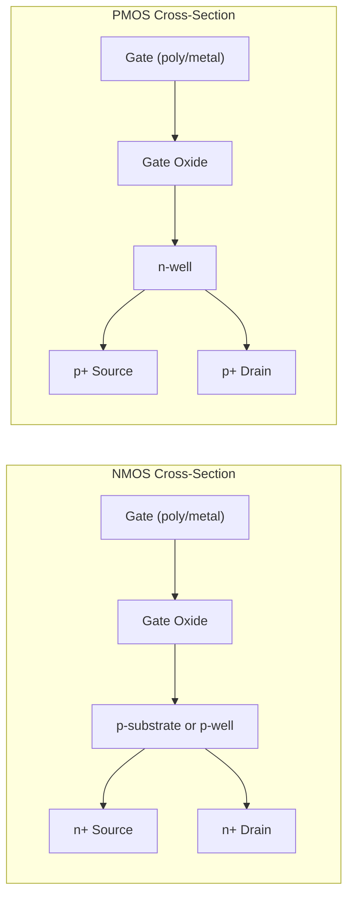
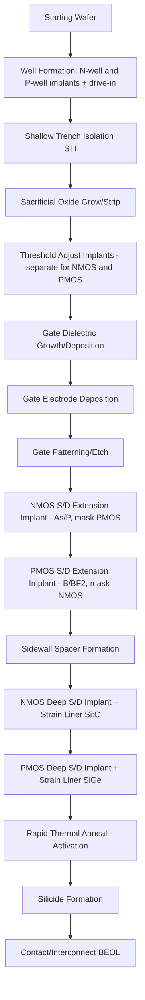

## N-Channel and P-Channel Device Design

### Overview

NMOS (n-channel) and PMOS (p-channel) transistors are the two complementary device types that form the basis of CMOS technology. They differ in substrate/well doping, source/drain doping, channel carrier type, and consequently in electrical characteristics such as mobility, threshold voltage, and drive strength. Designing both device types within the same process (CMOS) requires careful control of doping profiles, well engineering, and isolation.

### Basic Structural Differences

**NMOS transistor:**

- Built in a p-type substrate or p-well
- Source and drain are heavily doped n-type ($n^+$) regions
- Channel (when inverted) conducts via electrons
- Gate voltage must be positive relative to source to attract electrons and form the inversion layer

**PMOS transistor:**

- Built in an n-type substrate or n-well
- Source and drain are heavily doped p-type ($p^+$) regions
- Channel (when inverted) conducts via holes
- Gate voltage must be negative relative to source to attract holes and form the inversion layer

**Key Points**

- In a standard CMOS process on a p-type substrate, NMOS devices sit directly in the substrate while PMOS devices require an n-well.
- In a twin-well or triple-well process, both device types get dedicated wells, allowing independent optimization of doping profiles and body biasing.

### Cross-Sectional Structure Comparison

### Carrier Mobility Differences

Electron mobility ($\mu_n$) in silicon is significantly higher than hole mobility ($\mu_p$) — typically by a factor of roughly 2 to 3 in bulk silicon (e.g., $\mu_n \approx 1350\ cm^2/V\cdot s$ vs. $\mu_p \approx 480\ cm^2/V\cdot s$ at low doping, room temperature, though these values shift substantially with doping concentration and surface scattering in real MOSFET channels). This has direct design consequences:

$$I_{DS,sat} = \frac{1}{2}\mu_n C_{ox}\frac{W}{L}(V_{GS}-V_T)^2 \quad \text{(NMOS)}$$

$$I_{DS,sat} = \frac{1}{2}\mu_p C_{ox}\frac{W}{L}(V_{GS}-V_T)^2 \quad \text{(PMOS, magnitudes)}$$

Since $\mu_n > \mu_p$, an NMOS device delivers more drive current than a PMOS device of identical $W/L$, gate overdrive, and oxide thickness. To balance rise and fall times in CMOS logic gates (matching pull-up and pull-down strength), PMOS transistors are typically sized wider than their paired NMOS transistors:

$$\left(\frac{W}{L}\right)_p \approx \frac{\mu_n}{\mu_p}\left(\frac{W}{L}\right)_n$$

In practice, this ratio is often in the range of 2:1 to 3:1, though exact sizing depends on the specific process's mobility ratio and target speed/area/power trade-offs. [Inference: exact sizing ratio is process- and design-methodology-dependent]

### Well and Substrate Engineering

**N-well process:**

- Substrate is p-type; n-wells are implanted for PMOS devices
- Historically common because NMOS was the dominant/faster device and benefits from direct substrate contact

**P-well process:**

- Substrate is n-type; p-wells are implanted for NMOS devices

**Twin-well process:**

- Both n-wells and p-wells are formed on a lightly doped or epitaxial substrate
- Allows independent optimization of both device types' doping profiles, retrograde well profiles, and channel implants without compromise
- Standard in modern sub-micron CMOS processes

**Triple-well process:**

- Adds a deep n-well beneath a p-well, electrically isolating the p-well (and NMOS devices within it) from the substrate
- Enables independent body biasing of NMOS devices and improved noise isolation between analog and digital blocks

### Threshold Voltage Engineering

Threshold voltage for each device type is set via channel (threshold-adjust) implants, distinct from well implants:

$$V_{T,n} = V_{FB,n} + 2\phi_{F,n} + \frac{\sqrt{2\epsilon_{Si}qN_{A}(2\phi_{F,n})}}{C_{ox}}$$

$$V_{T,p} = V_{FB,p} - 2\phi_{F,p} - \frac{\sqrt{2\epsilon_{Si}qN_{D}(2\phi_{F,p})}}{C_{ox}}$$

where $V_{FB}$ is the flatband voltage (dependent on gate/substrate work function difference and oxide charge), and $\phi_F$ is the Fermi potential. Note the sign conventions: NMOS threshold voltages are conventionally positive, while PMOS threshold voltages are conventionally negative (the gate must go below source potential to turn the device on).

**Key Points**

- Separate threshold-adjust implants for NMOS and PMOS allow each device type's $V_T$ to be tuned independently (e.g., to achieve symmetric $|V_{T,n}| \approx |V_{T,p}|$ for balanced logic design).
- Multiple threshold flavors (standard-$V_T$, low-$V_T$, high-$V_T$) are typically offered for both device types in a given process node to trade off speed against leakage.

### Gate Work Function Considerations

In modern processes using metal gates (replacing polysilicon gates), different metal work functions are used for NMOS and PMOS to set appropriate threshold voltages without excessive channel doping (which would otherwise degrade mobility via increased impurity scattering):

- **NMOS gate metal**: typically a lower work function metal (closer to conduction band), such as materials based on titanium nitride/aluminum combinations or tantalum-based compounds, depending on process
- **PMOS gate metal**: typically a higher work function metal (closer to valence band)

This dual metal-gate approach is a key part of "gate-first" or "gate-last" high-$\kappa$/metal-gate (HKMG) process integration schemes. [Unverified: specific metal compositions are proprietary and vary by foundry/node; general work-function principle is well established]

### Source/Drain Engineering Differences

**NMOS S/D:**

- Typically uses arsenic (As) or phosphorus (P) for $n^+$ doping
- Arsenic is often preferred for shallow junctions due to lower diffusivity compared to phosphorus

**PMOS S/D:**

- Typically uses boron (B) or boron difluoride (BF₂) for $p^+$ doping
- Boron has higher diffusivity than arsenic, historically making shallow PMOS junction formation more challenging and often requiring optimized rapid thermal annealing (RTA) or spike/laser annealing techniques to limit diffusion

**Strain engineering:**

- PMOS: embedded silicon-germanium (SiGe) source/drain regions induce compressive strain in the channel, enhancing hole mobility
- NMOS: silicon-carbon (Si:C) source/drain or tensile-strain liners/contact-etch-stop layers (CESL) enhance electron mobility

These strain techniques became especially important starting around the 90 nm process generation as mobility enhancement was needed to continue performance scaling independent of pure geometric scaling. [Inference: adoption timeline and specific technique varies by foundry]

### Body Effect and Back-Gate Biasing

Both device types exhibit the body effect, where source-to-body bias affects threshold voltage:

$$V_{T,n} = V_{T0,n} + \gamma_n\left(\sqrt{2\phi_{F,n} + V_{SB}} - \sqrt{2\phi_{F,n}}\right)$$

$$V_{T,p} = V_{T0,p} - \gamma_p\left(\sqrt{2\phi_{F,p} + V_{BS}} - \sqrt{2\phi_{F,p}}\right)$$

For NMOS, $V_{SB} \geq 0$ (source tied at or above body potential) increases $|V_T|$. For PMOS, the analogous condition (with $V_{BS}$, body above source) also increases $|V_T|$. In n-well processes, all PMOS transistors sharing a common well must have their bodies tied appropriately (usually to the highest voltage rail, $V_{DD}$) unless individual well isolation is provided.

### Design Trade-offs and Symmetric CMOS Design

**Key Points**

- **Area trade-off**: Wider PMOS transistors (to compensate for lower hole mobility) increase gate capacitance and area, partially offsetting the benefit of balanced drive strength.
- **Layout considerations**: NMOS and PMOS devices are typically placed in separate rows/regions (n-well vs. substrate/p-well) with well-to-well spacing rules (latch-up prevention) dictating a minimum separation and guard-ring requirements.
- **Latch-up risk**: The parasitic PNPN structure formed by adjacent NMOS/PMOS devices in a CMOS inverter (parasitic bipolar transistors formed by well/substrate junctions) can trigger latch-up under transient conditions. Guard rings (substrate/well ties) around each device type are standard mitigation.
- **Static CMOS logic**: Correct pull-up (PMOS) and pull-down (NMOS) network sizing is essential for balanced noise margins, symmetric propagation delay, and correct duty-cycle preservation in the logic gate.

### Latch-Up Structure (Illustration)

<svg xmlns="http://www.w3.org/2000/svg" viewBox="0 0 700 420">
<text x="350" y="30" font-size="18" text-anchor="middle" font-family="sans-serif" font-weight="bold">Parasitic PNPN Latch-Up Path in CMOS Inverter (svg_diagram)</text>

<rect x="80" y="100" width="220" height="150" fill="#f4d1d1" stroke="black" stroke-width="1.5" />
<text x="190" y="95" font-size="13" text-anchor="middle" font-family="sans-serif">N-Well (PMOS region)</text>
<rect x="300" y="100" width="320" height="150" fill="#d1e0f4" stroke="black" stroke-width="1.5" />
<text x="460" y="95" font-size="13" text-anchor="middle" font-family="sans-serif">P-Substrate (NMOS region)</text>

<rect x="100" y="140" width="40" height="30" fill="#c76b6b" stroke="black" />
<text x="120" y="160" font-size="10" text-anchor="middle" font-family="sans-serif" fill="white">p+</text>
<rect x="220" y="140" width="40" height="30" fill="#c76b6b" stroke="black" />
<text x="240" y="160" font-size="10" text-anchor="middle" font-family="sans-serif" fill="white">p+</text>

<rect x="340" y="140" width="40" height="30" fill="#6b8fc7" stroke="black" />
<text x="360" y="160" font-size="10" text-anchor="middle" font-family="sans-serif" fill="white">n+</text>
<rect x="500" y="140" width="40" height="30" fill="#6b8fc7" stroke="black" />
<text x="520" y="160" font-size="10" text-anchor="middle" font-family="sans-serif" fill="white">n+</text>

<text x="190" y="220" font-size="12" text-anchor="middle" font-family="sans-serif">Parasitic PNP</text>

<text x="190" y="236" font-size="11" text-anchor="middle" font-family="sans-serif">(p+ / n-well / p-sub)</text>

<text x="460" y="220" font-size="12" text-anchor="middle" font-family="sans-serif">Parasitic NPN</text>

<text x="460" y="236" font-size="11" text-anchor="middle" font-family="sans-serif">(n+ / p-sub / n-well)</text>

<path d="M 260 155 C 290 100, 330 100, 360 155" fill="none" stroke="#8a2be2" stroke-width="2" marker-end="url(#arrow)" />
<path d="M 360 175 C 330 260, 290 260, 260 175" fill="none" stroke="#8a2be2" stroke-width="2" marker-end="url(#arrow)" />
<text x="350" y="300" font-size="12" text-anchor="middle" font-family="sans-serif" fill="`#8a2be2`">Regenerative feedback loop → latch-up if triggered</text>

<text x="350" y="340" font-size="11" text-anchor="middle" font-family="sans-serif">Guard rings (well/substrate ties) suppress parasitic gain</text>

<text x="350" y="358" font-size="11" text-anchor="middle" font-family="sans-serif">and break the regenerative loop.</text>

</svg>

### Symbol and Terminal Convention

| Device | Symbol Arrow Convention | Gate Behavior | Body Tie (typical) |
| --- | --- | --- | --- |
| NMOS | Arrow on source, pointing outward (into gate on some symbol styles) | Turns ON when $V_{GS} > V_{T,n} > 0$ | Tied to $V_{SS}$/ground |
| PMOS | Arrow on source, pointing inward | Turns ON when $V_{GS} < V_{T,p} < 0$ | Tied to $V_{DD}$ |

### Process Integration Flow (Simplified Twin-Well CMOS)

### Worked Example: Sizing a CMOS Inverter

**Example**

Given a process with $\mu_n = 1200\ cm^2/V\cdot s$ and $\mu_p = 450\ cm^2/V\cdot s$, and an NMOS pull-down transistor sized at $W_n/L_n = 4$ (minimum length process), determine the PMOS width ratio for balanced drive strength.

$$\left(\frac{W}{L}\right)_p = \frac{\mu_n}{\mu_p}\left(\frac{W}{L}\right)_n = \frac{1200}{450} \times 4 \approx 10.67$$

This means the PMOS transistor would need a $W/L$ of approximately 10.67 — roughly 2.67× wider than the NMOS device — to achieve matched rise/fall times in a static CMOS inverter, assuming identical $L$, $V_T$ magnitude, and oxide thickness for both devices. In practice, many digital standard-cell libraries use a somewhat lower ratio (closer to 2:1) as a compromise since exact drive-strength matching is not always the primary optimization target (area and leakage also factor in). [Inference: actual standard-cell ratios vary significantly by library and are set by the foundry/library vendor based on multiple objectives]

**Next Steps**

- CMOS inverter static and dynamic characteristics (VTC, noise margins, propagation delay)
- Latch-up mechanisms and guard-ring design rules
- Strain engineering (SiGe, Si:C) for mobility enhancement
- High-κ/metal-gate (HKMG) process integration
- Well proximity effects and layout-dependent effects (LDE)
- Multi-threshold CMOS (MTCMOS) and standard-cell library threshold flavors