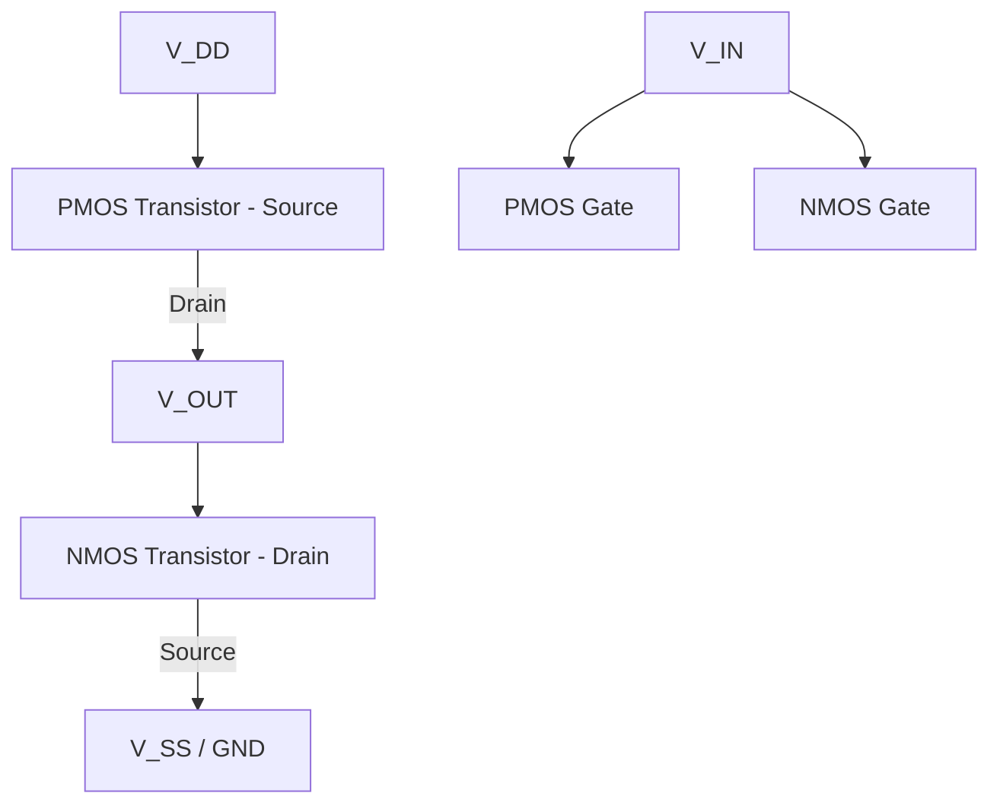

## CMOS Inverter Operation

### Overview

The CMOS inverter is the fundamental building block of digital CMOS logic, formed by pairing an NMOS pull-down transistor with a PMOS pull-up transistor. It converts a logic-high input into a logic-low output and vice versa, while consuming negligible static current in steady state — a defining advantage of CMOS over earlier NMOS-only or bipolar logic families.

### Circuit Topology

- **PMOS transistor**: source tied to $V_{DD}$, drain tied to output node, gate tied to input
- **NMOS transistor**: source tied to $V_{SS}$ (ground), drain tied to output node, gate tied to input
- Both gates share the same input signal $V_{IN}$; both drains share the same output node $V_{OUT}$

### Basic Switching Behavior

**Key Points**

- When $V_{IN} = V_{DD}$ (logic high): NMOS is ON ($V_{GS,n} = V_{DD} > V_{T,n}$), PMOS is OFF ($V_{GS,p} = 0 > V_{T,p}$, since $V_{T,p}$ is negative). The output is pulled to $V_{SS}$ through the NMOS, giving $V_{OUT} = 0$ (logic low).
- When $V_{IN} = 0$ (logic low): PMOS is ON ($V_{GS,p} = -V_{DD} < V_{T,p}$), NMOS is OFF ($V_{GS,n} = 0 < V_{T,n}$). The output is pulled to $V_{DD}$ through the PMOS, giving $V_{OUT} = V_{DD}$ (logic high).
- In both steady states, exactly one transistor is ON and one is OFF, so no direct DC current path exists from $V_{DD}$ to $V_{SS}$ — this is the origin of CMOS's low static power consumption.

### Voltage Transfer Characteristic (VTC)

The VTC plots $V_{OUT}$ versus $V_{IN}$ and is divided into five operating regions:

| Region | $V_{IN}$ Range | NMOS State | PMOS State | $V_{OUT}$ Behavior |
| --- | --- | --- | --- | --- |
| A | $0$ to $V_{T,n}$ | Cutoff | Triode | $V_{OUT} = V_{DD}$ |
| B | $V_{T,n}$ to $V_{IN1}$ | Saturation | Triode | $V_{OUT}$ begins falling |
| C | Near $V_{M}$ (switching threshold) | Saturation | Saturation | Sharp transition, high gain |
| D | $V_{IN2}$ to $V_{DD}- | V_{T,p} | $ | Triode |
| E | $V_{DD}- | V_{T,p} | $ to $V_{DD}$ | Triode |

Region C, where both transistors are in saturation simultaneously, produces the steep transition region and is the source of the inverter's voltage gain.

### VTC Illustration

<svg xmlns="http://www.w3.org/2000/svg" viewBox="0 0 700 480">
<text x="350" y="30" font-size="18" text-anchor="middle" font-family="sans-serif" font-weight="bold">CMOS Inverter Voltage Transfer Characteristic (svg_diagram)</text>

<line x1="90" y1="400" x2="620" y2="400" stroke="black" stroke-width="2" />
<line x1="90" y1="400" x2="90" y2="60" stroke="black" stroke-width="2" />
<text x="355" y="435" font-size="14" text-anchor="middle" font-family="sans-serif">V_IN</text>
<text x="40" y="230" font-size="14" text-anchor="middle" font-family="sans-serif" transform="rotate(-90 40 230)">V_OUT</text>

<text x="90" y="418" font-size="12" text-anchor="middle" font-family="sans-serif">0</text>

<text x="620" y="418" font-size="12" text-anchor="middle" font-family="sans-serif">V_DD</text>

<text x="75" y="404" font-size="12" text-anchor="end" font-family="sans-serif">0</text>

<text x="75" y="65" font-size="12" text-anchor="end" font-family="sans-serif">V_DD</text>

<path d="M 90 70 L 230 70" stroke="#2e7d32" stroke-width="3" fill="none" />

<path d="M 230 70 Q 270 80 310 180" stroke="#2e7d32" stroke-width="3" fill="none" />

<path d="M 310 180 L 340 320" stroke="#2e7d32" stroke-width="3" fill="none" />

<path d="M 340 320 Q 380 370 420 385" stroke="#2e7d32" stroke-width="3" fill="none" />

<path d="M 420 385 L 620 392" stroke="#2e7d32" stroke-width="3" fill="none" />

<line x1="230" y1="400" x2="230" y2="70" stroke="gray" stroke-dasharray="4,3" />
<line x1="325" y1="400" x2="325" y2="60" stroke="gray" stroke-dasharray="4,3" />
<line x1="420" y1="400" x2="420" y2="385" stroke="gray" stroke-dasharray="4,3" />

<text x="150" y="55" font-size="12" text-anchor="middle" font-family="sans-serif">A</text>

<text x="270" y="140" font-size="12" text-anchor="middle" font-family="sans-serif">B</text>

<text x="325" y="250" font-size="12" text-anchor="middle" font-family="sans-serif" font-weight="bold">C (V_M)</text>

<text x="380" y="360" font-size="12" text-anchor="middle" font-family="sans-serif">D</text>

<text x="500" y="410" font-size="12" text-anchor="middle" font-family="sans-serif">E</text>

<text x="230" y="415" font-size="11" text-anchor="middle" font-family="sans-serif">V_T,n</text>

<text x="420" y="415" font-size="11" text-anchor="middle" font-family="sans-serif">V_DD - |V_T,p|</text>

<text x="640" y="75" font-size="11" font-family="sans-serif" text-anchor="end">V_OH</text>

<text x="640" y="392" font-size="11" font-family="sans-serif" text-anchor="end">V_OL</text>

</svg>

### Switching Threshold ($V_M$)

The switching threshold $V_M$ is the input voltage at which $V_{OUT} = V_{IN}$ (the point where the VTC crosses the unity-gain line). At this point, both transistors are in saturation and carry equal current magnitude:

$$\frac{k_n}{2}(V_M - V_{T,n})^2 = \frac{k_p}{2}(V_{DD} - V_M - |V_{T,p}|)^2$$

where $k_n = \mu_n C_{ox}(W/L)_n$ and $k_p = \mu_p C_{ox}(W/L)_p$. Solving for $V_M$:

$$V_M = \frac{V_{T,n} + \sqrt{\frac{k_p}{k_n}}(V_{DD} - |V_{T,p}|)}{1 + \sqrt{\frac{k_p}{k_n}}}$$

For a symmetric inverter design where $k_n = k_p$ (achieved by sizing $(W/L)_p$ appropriately to compensate for lower hole mobility) and assuming $V_{T,n} = |V_{T,p}|$, this simplifies to $V_M = V_{DD}/2$, centering the transition and maximizing noise margins symmetrically.

### Noise Margins

Noise margins quantify the inverter's tolerance to voltage noise on its input while still being correctly interpreted as a valid logic level:

$$NM_H = V_{OH} - V_{IH}$$

$$NM_L = V_{IL} - V_{OL}$$

where:

- $V_{OH}$: output high voltage (ideally $V_{DD}$)
- $V_{OL}$: output low voltage (ideally $0$)
- $V_{IH}$: minimum input voltage recognized as logic high (where slope of VTC $= -1$)
- $V_{IL}$: maximum input voltage recognized as logic low (where slope of VTC $= -1$)

A steeper (more ideal, closer to a step function) VTC transition region produces larger noise margins for a given $V_{DD}$, which is why high transistor gain in the transition region is desirable.

### Static Power Consumption

In an ideal CMOS inverter, since one transistor is always OFF in steady state, DC current is theoretically zero except for leakage:

$$P_{static} = V_{DD} \cdot I_{leakage}$$

$I_{leakage}$ includes subthreshold conduction, gate tunneling, and junction leakage (see MOSFET leakage mechanisms). This is fundamentally why CMOS logic dissipates far less static power than resistor-load NMOS or bipolar logic families, which always have a DC current path in one logic state.

### Short-Circuit (Crowbar) Current

During the finite-time transition of $V_{IN}$ (not an ideal step), there exists a brief window where both NMOS and PMOS are simultaneously ON (both in the region where $V_{T,n} < V_{IN} < V_{DD} - |V_{T,p}|$), creating a direct current path from $V_{DD}$ to $V_{SS}$:

$$P_{short-circuit} = t_{sc} \cdot V_{DD} \cdot I_{peak} \cdot f_{clk}$$

where $t_{sc}$ is the duration of simultaneous conduction and $f_{clk}$ is the switching frequency. Short-circuit power is minimized by ensuring fast input transition times (steep input edges) relative to the output transition time, and is typically a smaller contributor to total power than dynamic switching power, but grows in relative importance as input edge rates degrade (e.g., driven by a weak upstream gate). [Inference: relative contribution varies significantly with design and technology node]

### Dynamic (Switching) Power

The dominant power component in most digital CMOS circuits during active operation is dynamic power from charging and discharging load capacitance:

$$P_{dynamic} = \alpha \cdot C_L \cdot V_{DD}^2 \cdot f_{clk}$$

where:

- $\alpha$ is the activity factor (probability of a switching transition per clock cycle)
- $C_L$ is the total load capacitance at the output node (wire capacitance + fan-out gate capacitance + parasitic drain capacitance)
- $f_{clk}$ is the operating frequency

This quadratic dependence on $V_{DD}$ is the primary motivation for voltage scaling in low-power digital design.

### Propagation Delay

Propagation delay characterizes how quickly the inverter output responds to an input change, typically measured from 50% input transition to 50% output transition:

$$t_{pHL} \approx \frac{C_L \cdot V_{DD}}{2 I_{DSAT,n}}\ \text{(approximate, first-order)}$$

$$t_{pLH} \approx \frac{C_L \cdot V_{DD}}{2 I_{DSAT,p}}\ \text{(approximate, first-order)}$$

More precise expressions integrate the current equation across the triode/saturation regions during the transition; the RC-based approximation above is a standard simplified first-order model commonly used for hand estimation and is understood to be an approximation rather than an exact solution. A commonly cited more refined approximation is the alpha-power law model or the use of an "effective resistance" derived from average current during the switching interval.

$$t_p = \frac{t_{pHL} + t_{pLH}}{2}$$

### Transient Response Waveforms (Illustration)

<svg xmlns="http://www.w3.org/2000/svg" viewBox="0 0 700 400">
<text x="350" y="30" font-size="18" text-anchor="middle" font-family="sans-serif" font-weight="bold">CMOS Inverter Transient Response (svg_diagram)</text>

<line x1="80" y1="350" x2="650" y2="350" stroke="black" stroke-width="2" />
<line x1="80" y1="350" x2="80" y2="50" stroke="black" stroke-width="2" />
<text x="365" y="380" font-size="13" text-anchor="middle" font-family="sans-serif">Time</text>

<path d="M 100 320 L 250 320 L 320 90 L 650 90" stroke="#1565c0" stroke-width="2.5" fill="none" />
<text x="500" y="80" font-size="12" font-family="sans-serif" fill="#1565c0">V_IN</text>

<path d="M 100 90 L 300 90 L 400 320 L 650 320" stroke="#c62828" stroke-width="2.5" fill="none" />
<text x="500" y="340" font-size="12" font-family="sans-serif" fill="#c62828">V_OUT</text>

<line x1="320" y1="215" x2="400" y2="215" stroke="black" stroke-dasharray="3,3" />
<text x="360" y="205" font-size="11" text-anchor="middle" font-family="sans-serif">t_pHL</text>

<line x1="80" y1="215" x2="650" y2="215" stroke="gray" stroke-width="1" stroke-dasharray="2,4" />
<text x="60" y="219" font-size="10" text-anchor="end" font-family="sans-serif">50%</text>
</svg>

### Sizing for Symmetric Operation

As covered in device design, matching PMOS width to compensate for lower hole mobility yields symmetric rise/fall behavior:

$$\left(\frac{W}{L}\right)_p = \frac{\mu_n}{\mu_p}\left(\frac{W}{L}\right)_n$$

A "symmetric" inverter (equal $t_{pHL}$ and $t_{pLH}$, $V_M = V_{DD}/2$) is often the default design target for standard-cell libraries, though real designs sometimes deliberately skew sizing when one transition (high-to-low vs. low-to-high) is more timing-critical than the other. [Inference: design choice depends on specific timing/power optimization objectives]

### Worked Example

**Example**

Given: $V_{DD} = 1.2$ V, $V_{T,n} = 0.4$ V, $|V_{T,p}| = 0.4$ V, $k_n = k_p$ (symmetric sizing already applied).

Find $V_M$:

$$V_M = \frac{V_{T,n} + \sqrt{1}(V_{DD} - |V_{T,p}|)}{1+\sqrt{1}} = \frac{0.4 + (1.2 - 0.4)}{2} = \frac{0.4+0.8}{2} = 0.6\ \text{V}$$

Since $V_{DD}/2 = 0.6$ V, this confirms the symmetric design places the switching threshold exactly at mid-rail, as expected when $k_n = k_p$ and $V_{T,n} = |V_{T,p}|$.

### Common Second-Order Effects

**Key Points**

- **Velocity saturation**: In short-channel devices, drain current saturates at lower $V_{DS}$ than the simple square-law model predicts, reducing the accuracy of the basic VTC/delay equations above; more advanced models (e.g., alpha-power law) are used in practice for nanometer-scale nodes.
- **Body effect during switching**: Source-body voltage of the "on" transistor can shift slightly during transition in stacked logic configurations (less relevant for a simple standalone inverter but significant in NAND/NOR gates).
- **Process, voltage, and temperature (PVT) variation**: $V_M$, $t_p$, and noise margins all shift with fabrication process corners, supply voltage variation, and temperature, requiring corner-based verification in real designs.

**Next Steps**

- CMOS NAND/NOR gate design and stacked transistor effects
- Static power vs. dynamic power trade-offs and low-power design techniques
- Noise margin analysis and logical effort methodology
- Alpha-power law MOSFET model for delay estimation
- Standard-cell library characterization (timing, power, noise)
- Short-channel effects and velocity saturation impact on digital timing