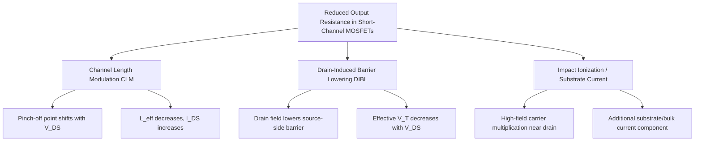

## Channel Length Modulation

### Overview

Channel length modulation (CLM) is a short-channel effect in which the effective channel length of a MOSFET decreases as drain-to-source voltage $V_{DS}$ increases beyond the saturation point. This shortening of the effective channel causes the saturation drain current to increase with $V_{DS}$ rather than remaining constant, giving the MOSFET's output characteristics a finite (non-infinite) output resistance instead of the ideal flat saturation region predicted by the simple square-law model.

### Physical Mechanism

In saturation, the channel is "pinched off" near the drain end — the inversion layer charge density approaches zero at a point before the physical drain junction. Beyond this pinch-off point, the region between the pinch-off point and the drain is depleted of mobile carriers and supports the additional voltage drop $(V_{DS} - V_{DSAT})$.

As $V_{DS}$ increases further past $V_{DSAT}$, the pinch-off point moves closer to the source, and the depletion region between pinch-off and drain widens. This effectively shortens the length of the channel over which the gate maintains strong inversion:

$$L_{eff} = L - \Delta L$$

where $\Delta L$ is the length of the pinch-off/depletion region, which grows with increasing $V_{DS}$. Since drain current in saturation is inversely proportional to channel length ($I_{DS} \propto 1/L_{eff}$), a shorter effective length yields a higher drain current — this is channel length modulation.

### Effect on the I-V Characteristic

The ideal square-law saturation current equation assumes constant $L$ and predicts $I_{DS}$ independent of $V_{DS}$ once saturation is reached:

$$I_{DS,sat,ideal} = \frac{1}{2}\mu_n C_{ox}\frac{W}{L}(V_{GS}-V_T)^2$$

With channel length modulation included, this is modified to:

$$I_{DS,sat} = \frac{1}{2}\mu_n C_{ox}\frac{W}{L}(V_{GS}-V_T)^2 (1 + \lambda V_{DS})$$

where $\lambda$ is the channel length modulation parameter (units of $V^{-1}$), empirically capturing the slope of the $I_{DS}$–$V_{DS}$ curve in saturation. $\lambda$ is inversely related to channel length:

$$\lambda \approx \frac{1}{L} \cdot \frac{d(\Delta L)}{dV_{DS}} \cdot \frac{1}{L_{eff}}$$

**Key Points**

- $\lambda$ decreases (approaches zero) as $L$ increases — longer-channel devices exhibit much flatter saturation regions and are less affected by CLM.
- $\lambda$ increases significantly for short-channel/advanced-node devices, making CLM a first-order effect that must be included in circuit design, particularly analog design.
- CLM is one of several effects (along with DIBL) that cause the drain current to depend on $V_{DS}$ even in nominal "saturation," collectively reducing the output resistance of the transistor.

### Output Resistance

The finite slope of $I_{DS}$ versus $V_{DS}$ in saturation defines the small-signal output resistance $r_o$, a critical parameter in analog amplifier design:

$$r_o = \left(\frac{\partial I_{DS}}{\partial V_{DS}}\right)^{-1} = \frac{1}{\lambda I_{DS}}$$

This shows that higher $\lambda$ (stronger CLM, typically in shorter-channel devices) directly reduces $r_o$, which in turn reduces the intrinsic voltage gain available from a single transistor:

$$A_{v,intrinsic} = g_m \cdot r_o = \frac{2}{V_{GS}-V_T}\cdot\frac{1}{\lambda}$$

(using $g_m = \sqrt{2\mu_n C_{ox}(W/L)I_{DS}}$ and substituting $r_o$ above; exact form varies slightly depending on which $g_m$ expression is used).

**Key Points**

- Lower $\lambda$ (longer channel or CLM-mitigated design) yields higher intrinsic gain per stage — a key reason analog designers often use longer-than-minimum channel lengths for gain stages, current mirrors, and other precision analog blocks, even though minimum length is preferred for maximum digital switching speed.
- The trade-off between channel length (gain, $r_o$) and layout area/speed is a central analog design decision.

### Output Characteristic Curve (Illustration)

<svg xmlns="http://www.w3.org/2000/svg" viewBox="0 0 700 450">
<text x="350" y="30" font-size="18" text-anchor="middle" font-family="sans-serif" font-weight="bold">MOSFET Output Characteristics with Channel Length Modulation (svg_diagram)</text>

<line x1="90" y1="380" x2="640" y2="380" stroke="black" stroke-width="2" />
<line x1="90" y1="380" x2="90" y2="60" stroke="black" stroke-width="2" />
<text x="365" y="415" font-size="14" text-anchor="middle" font-family="sans-serif">V_DS</text>
<text x="40" y="220" font-size="14" text-anchor="middle" font-family="sans-serif" transform="rotate(-90 40 220)">I_DS</text>

<path d="M 90 380 Q 200 200 260 150" stroke="gray" stroke-width="1.5" stroke-dasharray="5,4" fill="none" />
<text x="150" y="290" font-size="11" font-family="sans-serif" fill="gray">Triode</text>
<text x="330" y="130" font-size="11" font-family="sans-serif" fill="gray">Saturation boundary</text>

<path d="M 90 380 L 150 250 L 630 190" stroke="#1565c0" stroke-width="2.5" fill="none" />
<path d="M 90 380 L 200 200 L 630 130" stroke="#2e7d32" stroke-width="2.5" fill="none" />
<path d="M 90 380 L 260 150 L 630 70" stroke="#c62828" stroke-width="2.5" fill="none" />

<text x="640" y="192" font-size="11" font-family="sans-serif" fill="`#1565c0`" text-anchor="end">V_GS1</text>

<text x="640" y="132" font-size="11" font-family="sans-serif" fill="`#2e7d32`" text-anchor="end">V_GS2</text>

<text x="640" y="72" font-size="11" font-family="sans-serif" fill="`#c62828`" text-anchor="end">V_GS3</text>

<line x1="-40" y1="450" x2="630" y2="190" stroke="#1565c0" stroke-width="1" stroke-dasharray="3,3" />
<line x1="-40" y1="450" x2="630" y2="130" stroke="#2e7d32" stroke-width="1" stroke-dasharray="3,3" />
<line x1="-40" y1="450" x2="630" y2="70" stroke="#c62828" stroke-width="1" stroke-dasharray="3,3" />

<circle cx="20" cy="420" r="4" fill="black" />
<text x="20" y="440" font-size="11" text-anchor="middle" font-family="sans-serif">-1/λ</text>

<text x="300" y="400" font-size="11" font-family="sans-serif">Ideal (λ=0): flat saturation region</text>

</svg>

Note: the slight upward slope of each curve in the saturation region (rather than perfectly flat lines) is the visual signature of channel length modulation. Extrapolating each line backward, they converge near a common voltage-axis intercept at $-1/\lambda$, analogous to the Early voltage effect in bipolar transistors.

### Analogy to BJT Early Effect

CLM in MOSFETs is conceptually analogous to the Early effect in bipolar junction transistors, where base-width modulation causes collector current to increase with $V_{CE}$. In both cases:

- A voltage-dependent depletion/pinch-off region effectively modulates the active conduction length
- The result is a finite output resistance rather than an ideal current source behavior
- Extrapolated I-V lines converge to a common intercept voltage ($-1/\lambda$ for MOSFETs, $-V_A$ for BJTs)

### Dependence on Device Geometry

**Channel length ($L$):**

$\lambda \propto 1/L$ approximately, meaning $r_o \propto L / I_{DS}$. Doubling channel length roughly halves $\lambda$ and doubles $r_o$ at a fixed bias current, though the exact scaling relationship is more complex in advanced nodes where multiple short-channel effects overlap. [Inference: precise scaling law is technology- and model-dependent, particularly below ~100 nm]

**Drain junction depth and doping:**

Deeper or more lightly doped drain junctions extend the depletion region into the channel more readily under increasing $V_{DS}$, increasing $\Delta L$ and thus $\lambda$.

**Oxide thickness:**

Thinner gate oxide improves gate control over the channel, which can partially suppress the growth of the depletion/pinch-off region for a given $V_{DS}$, reducing CLM's relative impact compared to other short-channel effects.

### Interaction with Other Short-Channel Effects

CLM does not act in isolation; in short-channel devices, several effects combine to reduce output resistance and increase $I_{DS}$ dependence on $V_{DS}$:

**Key Points**

- DIBL affects the threshold voltage directly (electrostatic barrier lowering), while CLM affects the effective channel length in the current equation — they are physically distinct mechanisms but both increase $I_{DS}$ sensitivity to $V_{DS}$ in saturation.
- In compact SPICE models (e.g., BSIM), both effects are incorporated through separate, more sophisticated model parameters rather than the simple $\lambda$ term, since the simple $(1+\lambda V_{DS})$ model becomes increasingly inaccurate for deep-submicron devices.

### SPICE Modeling Considerations

The simple Level-1 SPICE MOSFET model uses the single parameter `LAMBDA` to represent CLM. More advanced models used in modern process design kits (BSIM3, BSIM4, BSIM-CMG for FinFETs) replace this simplistic approach with physically-based equations that separately account for CLM, DIBL, velocity saturation, and other effects, since a single constant $\lambda$ cannot accurately capture the strong $V_{GS}$- and $L$-dependence of output resistance in modern devices. [Unverified: specific model parameter names/structures are version-dependent across BSIM releases; general point about increased model sophistication is well documented]

### Worked Example

**Example**

Given: $\mu_n C_{ox} = 200\ \mu A/V^2$, $W/L = 10$, $V_{GS} - V_T = 0.3$ V, $\lambda = 0.1\ V^{-1}$.

Find $I_{DS}$ at $V_{DS} = 1.0$ V and at $V_{DS} = 2.0$ V (both in saturation).

Ideal (no CLM) saturation current:

$$I_{DS,ideal} = \frac{1}{2}(200\ \mu A/V^2)(10)(0.3)^2 = \frac{1}{2}(200)(10)(0.09)\ \mu A = 90\ \mu A$$

With CLM at $V_{DS} = 1.0$ V:

$$I_{DS} = 90\ \mu A \times (1 + 0.1 \times 1.0) = 90 \times 1.1 = 99\ \mu A$$

With CLM at $V_{DS} = 2.0$ V:

$$I_{DS} = 90\ \mu A \times (1 + 0.1 \times 2.0) = 90 \times 1.2 = 108\ \mu A$$

This shows a 9% increase in current from $V_{DS}=1.0$ to the baseline, and a further increase to 20% above ideal at $V_{DS}=2.0$ V, purely due to channel length modulation — despite $V_{GS}$ remaining constant. The corresponding output resistance at $V_{DS}=1.0$ V:

$$r_o = \frac{1}{\lambda I_{DS}} = \frac{1}{0.1 \times 99\ \mu A} \approx 101\ k\Omega$$

### Design Implications

**Key Points**

- **Analog design**: Current mirrors, differential pairs, and gain stages rely on high $r_o$ for accuracy and gain; CLM directly degrades current-mirror matching accuracy (output current varies with output voltage) and reduces achievable gain. Cascode topologies are a standard technique to mitigate CLM's impact by isolating the sensitive node from large $V_{DS}$ swings.
- **Digital design**: CLM has a comparatively minor direct effect on digital switching behavior (since digital gates operate primarily in the triode region during the majority of the switching transient, and full rail-to-rail swings are tolerated), but it does contribute to leakage/off-current sensitivity to supply voltage.
- **Technology scaling trend**: As channel lengths have scaled down across process generations, $\lambda$ has generally increased, requiring more aggressive analog design techniques (cascoding, gain-boosting, multi-stage amplifiers) to maintain adequate gain in nanometer-scale analog circuits. [Inference: general historical trend is well-documented qualitatively; precise quantitative scaling depends on specific technology node data]

**Next Steps**

- Drain-induced barrier lowering (DIBL) and its distinction from CLM
- Cascode and gain-boosting techniques for analog amplifier design
- BSIM compact model overview for SPICE simulation
- Early voltage analogy and BJT output resistance
- Current mirror design and matching accuracy
- Velocity saturation effects in short-channel MOSFETs