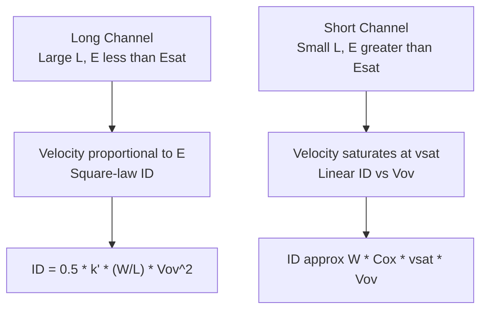

## Velocity Saturation in Short Channels

### Overview

Velocity saturation is a short-channel phenomenon in which carrier drift velocity ceases to increase linearly with electric field and instead approaches a maximum, field-independent value $v_{sat}$. As channel lengths shrink into the deep-submicron regime, the lateral electric field along the channel becomes large enough (even at modest supply voltages) that carriers spend a substantial portion of the channel traveling at or near this saturation velocity rather than at mobility-limited drift velocities. This fundamentally alters MOSFET current-voltage behavior, transconductance, and scaling trends compared to the long-channel square-law model.

### Physical Origin

At low electric fields, carrier drift velocity is proportional to the field through mobility:

$$v_d = \mu E$$

As $E$ increases, carriers gain kinetic energy faster than they can lose it through lattice (phonon) scattering. Beyond a critical field $E_{sat}$, additional energy input goes into generating optical phonons rather than further accelerating carriers, causing velocity to plateau. This saturation velocity is approximately:

$$v_{sat} \approx 10^7\ \text{cm/s}$$

for electrons in silicon at room temperature (holes saturate at a somewhat lower value). [Fact: this is a standard, widely cited silicon material parameter, not device-specific.]

### Empirical Velocity-Field Relation

A common empirical model capturing the transition from linear to saturated velocity is:

$$v_d(E) = \frac{\mu_0 E}{1+\dfrac{E}{E_{sat}}}$$

where $\mu_0$ is the low-field mobility and $E_{sat} = v_{sat}/\mu_0$ is the critical field at which velocity saturation becomes significant. For electrons in silicon, $E_{sat}$ is typically on the order of $1$–$4\times10^4\ \text{V/cm}$, while for holes it is higher due to lower hole mobility. [Inference: exact $E_{sat}$ values are process/doping dependent and reported ranges vary across literature sources.]

An alternative, more general empirical form uses an exponent $n$ to fit different carrier types:

$$v_d(E) = \frac{\mu_0 E}{\left[1+\left(\dfrac{E}{E_{sat}}\right)^n\right]^{1/n}}$$

with $n \approx 2$ for electrons and $n \approx 1$ for holes in many compact models (e.g., early BSIM formulations).

### Why Short Channels Trigger Velocity Saturation

The lateral electric field along the channel scales approximately as:

$$E \approx \frac{V_{DS}}{L}$$

As $L$ shrinks with each technology generation while $V_{DD}$ scales more slowly than ideal (a departure from pure Dennard scaling), the field $E$ increases substantially. Once $L$ drops into the sub-micron/deep-submicron range, $E$ routinely exceeds $E_{sat}$ well before the drain end of the channel reaches classical pinch-off, meaning velocity saturation — not pinch-off — becomes the dominant current-limiting mechanism.

### Modified Drain Current Model

**Saturation Current with Velocity Saturation**

Incorporating velocity saturation into the current equation (using the widely used unified model form), the saturation drain current becomes:

$$I_{D,sat} = W C_{ox} v_{sat}(V_{GS}-V_T-V_{Dsat})$$

or, in a commonly used simplified closed-form approximation blending square-law and velocity-saturated behavior:

$$I_{D,sat} = \frac{\mu_0 C_{ox}\dfrac{W}{L}V_{ov}^2}{2\left(1+\dfrac{V_{ov}}{E_{sat}L}\right)}$$

**Key Points**

- When $E_{sat}L \gg V_{ov}$ (long channel, low field), this reduces to the familiar square-law expression.
- When $E_{sat}L \ll V_{ov}$ (short channel, velocity-saturated regime), the equation approaches a linear dependence on $V_{ov}$ rather than quadratic:

  $$I_{D,sat} \approx W C_{ox} v_{sat} V_{ov}$$

This linear-in-$V_{ov}$ behavior is one of the clearest experimental/simulation signatures distinguishing short-channel velocity-saturated devices from long-channel square-law devices.

### Impact on Saturation Voltage

In the square-law model, $V_{Dsat} = V_{ov}$. With velocity saturation, the effective saturation voltage becomes smaller than the overdrive voltage:

$$V_{Dsat} = \frac{E_{sat}L \cdot V_{ov}}{E_{sat}L + V_{ov}}$$

This means the device enters saturation (current becomes largely independent of further $V_{DS}$ increases) at a lower drain voltage than the long-channel model predicts, which affects the sizing of the linear vs. saturation operating margin in circuit design.

### Impact on Transconductance

As derived from the linear-current relation above, transconductance in the fully velocity-saturated regime becomes bias-independent (constant with respect to $V_{ov}$):

$$g_m \approx W C_{ox} v_{sat}$$

This contrasts sharply with the long-channel result $g_m = \mu_n C_{ox}(W/L)V_{ov}$, which grows with overdrive. The practical implication is that increasing gate overdrive in a heavily velocity-saturated device yields diminishing transconductance improvement, changing optimal bias-point selection in analog design and reducing intrinsic gain scaling benefits historically expected from technology scaling.

### Impact on Current Drive and Scaling Trends

**Key Points**

- Ideal (Dennard) scaling predicted that shrinking $L$ while proportionally scaling $V_{DD}$ and $t_{ox}$ would keep the electric field constant and current density scaling favorably.
- Velocity saturation breaks this scaling assumption: because current becomes limited by $v_{sat}$ (a fixed material constant) rather than by mobility and channel length together, the current drive benefit from further shrinking $L$ diminishes.
- This is one of several physical effects (along with DIBL and other short-channel effects) that motivated the industry's shift toward strained silicon, high-mobility channel materials, and eventually FinFET/multi-gate architectures to sustain performance scaling once planar bulk MOSFETs became velocity-saturation-limited.

### Effect on Output Conductance and DIBL Interaction

Velocity-saturated short-channel devices tend to show a "kink" or extended non-ideal region near the onset of saturation, and channel length modulation effects are compounded by velocity saturation because the effective pinch-off/saturation point shifts differently with $V_{DS}$ than in the long-channel case. Additionally, velocity saturation and DIBL (drain-induced barrier lowering) often occur together in the same short-channel regime, making it difficult to separate their individual contributions to elevated $g_{ds}$ from simple hand-calculation models alone. [Inference: the relative weighting of velocity saturation vs. DIBL contributions to measured $g_{ds}$ is device- and process-specific and generally requires TCAD simulation or compact-model (e.g., BSIM) parameter extraction to quantify accurately.]

### Worked Example

**Example**

Given: NMOS with $L = 0.18\ \mu\text{m}$, $\mu_n = 400\ \text{cm}^2/\text{V·s}$, $v_{sat} = 1\times10^7\ \text{cm/s}$, $C_{ox} = 8.6\times10^{-7}\ \text{F/cm}^2$, $W = 2\ \mu\text{m}$, $V_{ov} = 0.5\ \text{V}$.

Step 1 — Critical field:

$$E_{sat} = \frac{v_{sat}}{\mu_n} = \frac{1\times10^7}{400} = 2.5\times10^4\ \text{V/cm}$$

Step 2 — Compare $E_{sat}L$ to $V_{ov}$:

$$E_{sat}L = (2.5\times10^4\ \text{V/cm})(0.18\times10^{-4}\ \text{cm}) = 0.45\ \text{V}$$

Since $E_{sat}L$ (0.45 V) is comparable to $V_{ov}$ (0.5 V), this device operates in a transitional regime between square-law and fully velocity-saturated behavior — a realistic outcome for a 0.18 µm generation device. [Inference: whether a specific real device is "transitional," "square-law-dominated," or "fully saturated" also depends on additional parameters like vertical field mobility degradation, not captured in this simplified comparison alone.]

Step 3 — Approximate saturation current using the blended model:

$$I_{D,sat} = \frac{(400)(8.6\times10^{-7})\left(\dfrac{2}{0.18}\right)(0.5)^2}{2\left(1+\dfrac{0.5}{0.45}\right)}$$

$$I_{D,sat} = \frac{(400)(8.6\times10^{-7})(11.11)(0.25)}{2(2.11)} \approx \frac{9.55\times10^{-4}}{4.22} \approx 2.26\times10^{-4}\ \text{A} = 226\ \mu\text{A}$$

Compare to the (incorrect for this regime) pure square-law prediction, which would overestimate current since it ignores the velocity-saturation denominator term — illustrating why square-law hand calculations become unreliable below roughly the 0.25 µm generation and finer. [Inference: the specific technology-node threshold at which square-law becomes unreliable is a general engineering rule of thumb, not a precise universal boundary.]

### Velocity-Field Characteristic (SVG)

<svg xmlns="http://www.w3.org/2000/svg" viewBox="0 0 700 400">
<title>Carrier Drift Velocity vs Electric Field (svg_diagram)</title>
<rect x="0" y="0" width="700" height="400" fill="#ffffff" />
<line x1="70" y1="350" x2="650" y2="350" stroke="#333" stroke-width="2" />
<line x1="70" y1="350" x2="70" y2="30" stroke="#333" stroke-width="2" />
<text x="360" y="385" font-size="15" fill="#333" text-anchor="middle">Electric Field E</text>
<text x="25" y="190" font-size="15" fill="#333" text-anchor="middle" transform="rotate(-90 25 190)">Drift Velocity v_d</text>
<line x1="70" y1="90" x2="650" y2="90" stroke="#999" stroke-width="1" stroke-dasharray="4,4" />
<text x="655" y="94" font-size="12" fill="#666">vsat</text>
<path d="M 70 350 L 220 160 Q 300 100 400 92 L 650 90" fill="none" stroke="#1f77b4" stroke-width="3" />
<line x1="220" y1="350" x2="220" y2="160" stroke="#999" stroke-width="1" stroke-dasharray="3,3" />
<text x="220" y="368" font-size="12" fill="#666" text-anchor="middle">Esat</text>
<text x="100" y="250" font-size="12" fill="#1f77b4">Linear region</text>
<text x="100" y="235" font-size="12" fill="#1f77b4">(v = mu * E)</text>
<text x="450" y="110" font-size="12" fill="#1f77b4">Saturation region</text>
<text x="450" y="125" font-size="12" fill="#1f77b4">(v approx vsat)</text>
</svg>

### Related Topics

- Short-channel drain current models and unified BSIM formulations
- Drain-induced barrier lowering (DIBL)
- Transconductance and output conductance in short-channel MOSFETs
- Carrier mobility degradation (vertical field effects)
- Strained silicon and mobility enhancement techniques
- FinFET and multi-gate device architectures as scaling responses
- Hot carrier effects and channel hot electron injection