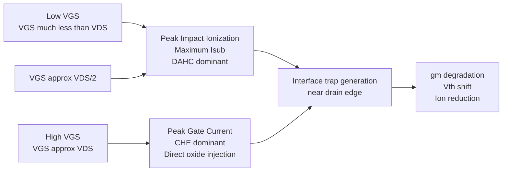

## Hot Carrier Effects

### Overview

Hot carrier effects (HCE) refer to the phenomena arising when charge carriers (electrons or holes) in a MOSFET gain kinetic energy far exceeding the thermal equilibrium energy ($\frac{3}{2}k_BT$) due to acceleration in high electric fields within the device. These "hot" carriers can overcome potential barriers that would normally confine them, causing them to inject into the gate oxide, generate electron-hole pairs through impact ionization, or become trapped at the Si/SiO$_2$ interface. This leads to permanent, cumulative degradation of device characteristics over the operational lifetime of the transistor, making hot carrier effects a critical reliability concern in short-channel device scaling.

Hot carrier degradation is distinct from short-term or reversible effects — it produces lasting shifts in threshold voltage ($V_{th}$), transconductance ($g_m$), and drive current ($I_{on}$), which can eventually cause circuit-level timing failures or functional errors.

### Physical Origin: The High-Field Region

In a MOSFET operating in saturation, the lateral electric field is highly non-uniform along the channel. Most of the applied drain-source voltage drops across a short "pinch-off" region near the drain, called the depletion region or velocity saturation region. As channel lengths shrink through scaling (per Dennard scaling and its breakdown), this field does not shrink proportionally with voltage, since supply voltages historically scaled down more slowly than physical dimensions. The result is a peak lateral electric field, $E_m$, near the drain junction, which can reach magnitudes on the order of $10^5$ to $10^6$ V/cm.

The peak field can be approximated using the effective channel length and the relationship:

$$E_m \approx \frac{V_{DS} - V_{Dsat}}{l}$$

where $l$ is a characteristic length related to the junction depth and gate oxide thickness, and $V_{Dsat}$ is the drain saturation voltage. Carriers traversing this region gain energy from the field faster than they can lose it via phonon (lattice) scattering, producing a population with an effective "carrier temperature" $T_c \gg T_{lattice}$.

### Key Mechanisms

**Impact Ionization**

When electrons traveling through the high-field pinch-off region acquire sufficient kinetic energy (typically greater than the semiconductor bandgap energy, ~1.1 eV for silicon), they can collide with lattice atoms and generate secondary electron-hole pairs. This avalanche-like multiplication process is characterized by the ionization coefficient $\alpha$, which follows an empirical Chynoweth-type relation:

$$\alpha = A \exp\left(-\frac{B}{E}\right)$$

where $A$ and $B$ are material-dependent constants and $E$ is the local electric field. The generated holes are swept toward the substrate, contributing to substrate current ($I_{sub}$), a key diagnostic signature and monitor of hot carrier stress.

**Channel Hot Electron (CHE) Injection**

In NMOS devices, hot electrons that gain enough energy perpendicular to the current flow can surmount the Si-SiO$_2$ energy barrier (~3.1 eV) and inject into the gate oxide. This is most severe when the gate voltage $V_{GS}$ is comparable to $V_{DS}$, since the vertical field then assists electrons toward the oxide interface. Injected electrons can become trapped in oxide defect states or create new interface states via bond-breaking (particularly breaking Si-H bonds at the interface, releasing atomic hydrogen that can further react and create additional traps).

**Drain Avalanche Hot Carrier (DAHC) Injection**

This mechanism dominates near peak substrate current conditions, typically when $V_{GS} \approx V_{DS}/2$. Here, the impact-ionization-generated carriers themselves become hot enough to inject into the oxide, and the mechanism is closely tied to the avalanche multiplication process described above.

**Secondary Generated Hot Electron (SGHE) Injection**

Holes generated by impact ionization can themselves gain energy while being collected at the substrate/bulk contact or can generate a secondary avalanche, producing an additional pool of hot electrons that contribute to gate current, particularly relevant at very high $V_{DS}$.

**Substrate Hot Electron (SHE) Injection**

Carriers hot enough due to substrate bias conditions (rather than channel field) can be injected into the oxide from the substrate side; this is a less common mechanism typically induced deliberately for controlled oxide charging studies or in specific substrate-biased circuit conditions.

### Degradation Signatures and Mechanisms

Once hot carriers are injected into the oxide, damage manifests in two primary forms:

1. **Oxide Charge Trapping**: Electrons trapped in pre-existing or stress-generated oxide traps shift the local threshold voltage. Trapped negative charge near the drain increases the local $V_{th}$, reducing effective drive current.
2. **Interface State Generation**: The most significant long-term damage mechanism, especially in NMOS, is the generation of interface traps ($D_{it}$) at the Si/SiO$_2$ boundary through hydrogen-mediated bond dissociation (the Si-H bond breaking, or "Reaction-Diffusion" model). These interface states act as generation-recombination centers and additional scattering sites, degrading:
   - Transconductance ($g_m$) — due to increased Coulombic and surface roughness scattering
   - Threshold voltage ($V_{th}$) — typically increasing for NMOS
   - Subthreshold slope — degrading due to added interface trap density
   - Drive current ($I_{on}$) — decreasing over time, directly impacting circuit speed

The characteristic lifetime degradation is often modeled empirically using a power-law relationship with stress time $t$:

$$\Delta P = C \cdot (I_{sub})^n \cdot t^m$$

where $\Delta P$ represents the percentage shift in a parameter (e.g., $g_m$ or $V_{th}$), $I_{sub}$ is the peak substrate current (used as a proxy for hot carrier stress intensity), and $C$, $n$, $m$ are process-dependent fitting constants. The device lifetime $\tau$ (commonly defined as the time to reach a specified percentage degradation, e.g., 10% $g_m$ shift) is extracted by extrapolating this relation, typically expressed as:

$$\tau = A \cdot (I_{sub}/I_D)^{-n}$$

**Key Points**

- Hot carrier degradation is a wear-out mechanism, unlike NBTI/PBTI which can partially recover during relaxation.
- Substrate current $I_{sub}$ peaks at a specific $V_{GS}$ (typically ~$V_{DS}/2$) and serves as the primary experimental monitor for CHC/DAHC stress.
- Gate current $I_g$ (electron injection into oxide) tends to peak at higher $V_{GS}$, closer to $V_{GS} \approx V_{DS}$, corresponding to the CHE mechanism.
- NMOS devices are historically far more susceptible to hot carrier degradation than PMOS, because electrons have a lower effective mass and smaller ionization threshold energy than holes in silicon, making impact ionization and injection more efficient.

### Illustration: Hot Carrier Injection at the Drain (svg_diagram)

<svg xmlns="http://www.w3.org/2000/svg" viewBox="0 0 720 420" font-family="Helvetica, Arial, sans-serif">
<text x="360" y="24" text-anchor="middle" font-size="16" font-weight="bold" fill="#1a1a1a">Hot Carrier Injection Mechanism (svg_diagram)</text>

<rect x="60" y="220" width="600" height="120" fill="#d9c9a3" stroke="#5c4a2a" stroke-width="2" />
<text x="360" y="285" text-anchor="middle" font-size="13" fill="#3a2f1a">P-Substrate</text>

<rect x="60" y="150" width="600" height="30" fill="#cfe8f7" stroke="#2c6e91" stroke-width="2" />
<text x="360" y="170" text-anchor="middle" font-size="12" fill="#164a63">Gate Oxide (SiO2)</text>

<rect x="230" y="90" width="260" height="60" fill="#b0b0b0" stroke="#4a4a4a" stroke-width="2" />
<text x="360" y="125" text-anchor="middle" font-size="13" fill="#1a1a1a">Gate</text>

<rect x="60" y="180" width="120" height="40" fill="#7fb3d9" stroke="#2c6e91" stroke-width="2" />
<text x="120" y="204" text-anchor="middle" font-size="12" fill="#0d3350">n+ Source</text>

<rect x="540" y="180" width="120" height="40" fill="#7fb3d9" stroke="#2c6e91" stroke-width="2" />
<text x="600" y="204" text-anchor="middle" font-size="12" fill="#0d3350">n+ Drain</text>

<rect x="180" y="210" width="360" height="10" fill="#f2d675" stroke="#a3872a" stroke-width="1" />
<text x="360" y="205" text-anchor="middle" font-size="10" fill="#5c4a10">Channel</text>

<path d="M 470 180 L 540 180 L 540 220 L 470 220 Z" fill="#f28c8c" opacity="0.6" />
<text x="505" y="240" text-anchor="middle" font-size="10" fill="#8a1f1f">High-Field</text>
<text x="505" y="252" text-anchor="middle" font-size="10" fill="#8a1f1f">Pinch-off Region</text>

<path d="M 460 215 Q 500 190 500 175 Q 500 160 490 152" stroke="#c0392b" stroke-width="2.5" fill="none" marker-end="url(#arrow1)" />
<text x="530" y="140" font-size="11" fill="#c0392b">Hot electron injected</text>
<text x="530" y="153" font-size="11" fill="#c0392b">into gate oxide</text>

<circle cx="500" cy="215" r="4" fill="#c0392b" />
<text x="500" y="235" font-size="9" fill="#c0392b" />
<path d="M 500 215 L 480 240" stroke="#2e6b2e" stroke-width="2" marker-end="url(#arrow2)" />
<text x="440" y="260" font-size="10" fill="#2e6b2e">Generated hole to substrate (Isub)</text>

<path d="M 190 215 L 450 215" stroke="#1a1a1a" stroke-width="1.5" stroke-dasharray="4,3" marker-end="url(#arrow3)" />
<text x="300" y="230" text-anchor="middle" font-size="10" fill="#1a1a1a">Electron flow (accelerating)</text>

<circle cx="495" cy="160" r="5" fill="#8e44ad" />
<text x="530" y="175" font-size="10" fill="#8e44ad">Trapped oxide charge</text>

<circle cx="510" cy="180" r="3" fill="#e67e22" />
<text x="545" y="185" font-size="10" fill="#e67e22">Interface state (Dit)</text>
</svg>

### Dependence on Bias Conditions

The relative severity of each injection mechanism depends strongly on the gate-to-source voltage relative to the drain voltage:

### Impact of Device Scaling

As technology nodes shrink, several interacting trends affect hot carrier reliability:

- **Voltage scaling lag**: Supply voltages have not scaled as aggressively as gate lengths (to maintain noise margins and performance), keeping lateral fields high even as $L$ decreases — this is the classic departure from ideal Dennard scaling.
- **Lightly Doped Drain (LDD) structures**: Introduced specifically to combat HCE by grading the doping profile near the drain, spreading the high-field region over a longer distance and reducing peak $E_m$. This trades off some series resistance and drive current for improved reliability.
- **Halo/pocket implants**: While primarily used to control short-channel $V_{th}$ roll-off, these locally elevated doping regions near source/drain also modify the local field profile and can interact with hot carrier degradation behavior.
- **High-$\kappa$/metal-gate and FinFET/GAA architectures**: Multi-gate and fully-depleted architectures alter the electrostatics and channel field profile; while HCE is still present, the vertical field geometry and thinner effective oxides change trapping dynamics, and self-heating in FinFETs can additionally interact with carrier energy distributions. [Inference: the precise magnitude of this interaction is process- and geometry-specific and generally requires TCAD/reliability characterization per node.]

### Mitigation Strategies

- **Lightly Doped Drain (LDD)/Drain Extension Engineering**: Reduces peak lateral field via graded doping.
- **Reduced Supply Voltage ($V_{DD}$) Scaling**: Directly lowers $E_m$, though constrained by performance and noise-margin requirements.
- **Graded/Retrograde Channel Doping**: Shapes the vertical field profile to reduce carrier heating near the surface.
- **Buffered/Double-Diffused Drain (DDD) structures**: An earlier-generation approach, largely superseded by LDD.
- **Optimized Spacer Design**: Controls the effective offset of the heavily doped drain from the gate edge, tuning the trade-off between series resistance and field reduction.
- **Nitrided/Engineered Gate Dielectrics**: Nitrogen incorporation at the Si/SiO$_2$ interface can reduce the rate of hydrogen-related bond breaking, improving HCE immunity.
- **Circuit-Level Guardbanding**: Designers apply aging-aware timing margins based on hot-carrier-induced $I_{on}$/$V_{th}$ shift projections (often combined with BTI aging in unified reliability models) to guarantee lifetime specifications (e.g., 10 years).

### Characterization and Modeling

Hot carrier lifetime is typically characterized through accelerated stress testing: devices are stressed at elevated $V_{DS}$ (and a fixed $V_{GS}$ near the peak $I_{sub}$ or peak $I_g$ condition) while periodically monitoring $I_{D}$, $g_m$, and $V_{th}$. The resulting degradation-versus-time data on a log-log plot typically shows the power-law behavior described earlier, allowing extrapolation to use-condition lifetimes via the substrate current scaling relationship.

Compact reliability models (e.g., based on the Hu et al. lucky-electron model, or more modern energy-driven models based on the carrier energy distribution function derived from Monte Carlo or hydrodynamic TCAD simulations) are used to predict degradation across a range of operating conditions without requiring exhaustive stress testing at every bias point. [Inference: the choice between lucky-electron and energy-driven approaches is generally determined by whether channel lengths are long enough for the driftdiffusion/lucky-electron approximation to remain reasonably accurate, versus sub-100 nm nodes where energy-transport models are typically considered more physically representative.]

**Related Topics**

- Negative Bias Temperature Instability (NBTI) and Positive Bias Temperature Instability (PBTI)
- Lightly Doped Drain (LDD) and drain engineering structures
- Impact ionization and avalanche multiplication
- Time-Dependent Dielectric Breakdown (TDDB)
- Velocity saturation and carrier transport in short-channel devices
- Gate-Induced Drain Leakage (GIDL)
- Reliability-aware circuit design and aging guardbands
- FinFET and Gate-All-Around (GAA) electrostatics and self-heating