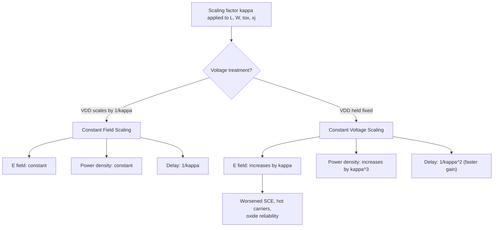

## Constant Field and Constant Voltage Scaling

### Overview

Device scaling theory provides the quantitative framework for shrinking MOSFET dimensions across technology generations while predicting the resulting changes in performance, power, and electrical behavior. The two foundational scaling methodologies — **constant field (full) scaling** and **constant voltage scaling** — differ in how they treat supply voltage relative to shrinking geometry. These frameworks, originally formalized by Dennard et al. in 1974, established the theoretical basis for decades of semiconductor technology roadmaps, and their eventual breakdown motivated the shift toward "general" or "quasi-constant voltage" scaling used in modern nodes.

### The Scaling Parameter

Both methodologies are defined relative to a dimensionless scaling factor $\kappa$ (or commonly denoted $S$ or $\alpha$), where $\kappa > 1$, applied uniformly to reduce all lateral and vertical physical dimensions of the device:

$$L' = \frac{L}{\kappa}, \quad W' = \frac{W}{\kappa}, \quad t_{ox}' = \frac{t_{ox}}{\kappa}, \quad x_j' = \frac{x_j}{\kappa}$$

where $L$ is channel length, $W$ is channel width, $t_{ox}$ is gate oxide thickness, and $x_j$ is junction depth. The doping concentration $N_A$ is scaled inversely to maintain proper electrostatic control:

$$N_A' = \kappa \cdot N_A$$

The two scaling approaches diverge specifically in their treatment of the supply voltage $V_{DD}$.

### Constant Field (Dennard) Scaling

In constant field scaling, the supply voltage is scaled down by the same factor $\kappa$ as the physical dimensions:

$$V_{DD}' = \frac{V_{DD}}{\kappa}$$

The defining principle is that the internal electric fields within the device — both lateral (channel) and vertical (gate oxide) — remain constant across generations:

$$E' = \frac{V_{DD}'}{L'} = \frac{V_{DD}/\kappa}{L/\kappa} = \frac{V_{DD}}{L} = E$$

This field invariance was the central motivation: keeping $E$ constant avoids the reliability risks (hot carrier degradation, oxide breakdown, velocity saturation onset) that would otherwise worsen as dimensions shrink.

**Key Points**

- Constant field scaling preserves the long-channel MOSFET current equation's validity, since none of the field-dependent physics (mobility degradation, velocity saturation, avalanche multiplication) is pushed harder by scaling.
- It was the original ideal proposed in Dennard's 1974 paper, "Design of Ion-Implanted MOSFET's with Very Small Physical Dimensions."
- Because $V_{DD}$ scales down proportionally with $L$, this is sometimes called **full scaling**.

**Derived Scaling of Key Parameters (Constant Field)**

Using the MOSFET saturation drive current relation $I_{Dsat} \propto \frac{W}{L}\mu C_{ox}(V_{GS}-V_{th})^2$ and the scaling rules above, the following device and circuit parameters scale as:

| Parameter | Scaling Factor | Rationale |
| --- | --- | --- |
| Channel length $L$, width $W$ | $1/\kappa$ | Direct geometric scaling |
| Oxide thickness $t_{ox}$ | $1/\kappa$ | Maintains gate control (constant $C_{ox} \cdot E$ product) |
| Supply voltage $V_{DD}$ | $1/\kappa$ | Defining constraint |
| Gate oxide capacitance $C_{ox} = \epsilon_{ox}/t_{ox}$ | $\kappa$ | Thinner oxide increases capacitance per area |
| Drain current $I_{Dsat}$ | $1/\kappa$ | $\frac{W}{L}\propto 1$, but $C_{ox}(V_{GS}-V_{th})^2 \propto \kappa \cdot (1/\kappa)^2 = 1/\kappa$ |
| Gate capacitance $C_g = C_{ox}\cdot W \cdot L$ | $1/\kappa$ | $\kappa \cdot (1/\kappa)^2$ |
| Gate delay $\tau = C_g V_{DD}/I_{Dsat}$ | $1/\kappa$ | $(1/\kappa)(1/\kappa)/(1/\kappa) = 1/\kappa$ |
| Power dissipation per gate $P = I_{Dsat}V_{DD}$ | $1/\kappa^2$ | $(1/\kappa)(1/\kappa)$ |
| Power density $P/\text{Area}$ | $1$ (constant) | $\frac{1/\kappa^2}{1/\kappa^2}$ |
| Circuit density (devices/area) | $\kappa^2$ | Area $\propto 1/\kappa^2$ per device |
| Power-delay product | $1/\kappa^3$ | $(1/\kappa^2)(1/\kappa)$ |

The constant power density result is the celebrated outcome of Dennard scaling: because both power per device and area per device shrink by $\kappa^2$, the overall power dissipated per unit chip area stays flat even as transistor density increases quadratically — this is what historically permitted ever-higher integration without a proportional rise in chip-level thermal load.

### Constant Voltage Scaling

In constant voltage scaling, the supply voltage $V_{DD}$ is held fixed across generations while physical dimensions continue to shrink by $\kappa$:

$$V_{DD}' = V_{DD} \quad \text{(unchanged)}$$

This approach was adopted historically (and largely by necessity) because supply voltages were standardized around fixed values dictated by system-level compatibility (e.g., TTL-compatible 5V logic, then later fixed voltage families), making it impractical to reduce $V_{DD}$ in lockstep with every process shrink.

Because dimensions shrink but voltage does not, the internal electric field **increases** with each generation:

$$E' = \frac{V_{DD}}{L'} = \frac{V_{DD}}{L/\kappa} = \kappa \cdot E$$

This field increase is the central drawback of constant voltage scaling and directly worsens all field-driven reliability and short-channel-effect mechanisms.

**Derived Scaling of Key Parameters (Constant Voltage)**

| Parameter | Scaling Factor | Rationale |
| --- | --- | --- |
| Channel length $L$, width $W$ | $1/\kappa$ | Direct geometric scaling |
| Oxide thickness $t_{ox}$ | $1/\kappa$ | Still thinned for gate control |
| Supply voltage $V_{DD}$ | $1$ (constant) | Defining constraint |
| Gate oxide capacitance $C_{ox}$ | $\kappa$ | Same as constant field case |
| Electric field $E$ | $\kappa$ | Field increases — key liability |
| Drain current $I_{Dsat}$ | $\kappa$ | $\frac{W}{L}(=1) \times C_{ox}(=\kappa) \times V_{DD}^2(=1)$ |
| Gate capacitance $C_g$ | $1/\kappa$ | Same as constant field case |
| Gate delay $\tau = C_g V_{DD}/I_{Dsat}$ | $1/\kappa^2$ | $(1/\kappa)(1)/(\kappa)$ |
| Power dissipation per gate $P = I_{Dsat}V_{DD}$ | $\kappa$ | $(\kappa)(1)$ |
| Power density $P/\text{Area}$ | $\kappa^3$ | $\frac{\kappa}{1/\kappa^2}$ |
| Circuit density | $\kappa^2$ | Same as constant field case |

The dramatic $\kappa^3$ increase in power density is the fundamental limitation of constant voltage scaling: as devices shrink, both switching current and integration density rise, and because voltage does not decrease to compensate, thermal density spirals upward — this is precisely the mechanism behind the "power wall" that became a central design constraint from roughly the mid-2000s onward.

### Comparative Summary

**Key Points**

- Constant field scaling is reliability-favorable but historically difficult to implement due to system voltage compatibility constraints and the fact that threshold voltage $V_{th}$ cannot scale indefinitely (subthreshold leakage and noise margin limits prevent $V_{th}$ from shrinking as fast as $V_{DD}$).
- Constant voltage scaling offers a larger delay improvement per generation ($1/\kappa^2$ vs. $1/\kappa$) but at the cost of unsustainable power density growth and accelerated short-channel/hot-carrier degradation.
- Neither pure form was sustained in practice past a few technology generations; the industry transitioned to **generalized (quasi-constant voltage) scaling**, in which $V_{DD}$ scales down, but more slowly than $L$, balancing performance gains against power density and reliability limits.

### Why Pure Scaling Broke Down

Several second-order effects prevent either idealized model from holding indefinitely across many generations:

- **Threshold voltage floor**: $V_{th}$ cannot scale proportionally with $V_{DD}$ indefinitely because subthreshold leakage current increases exponentially as $V_{th}$ decreases (per the subthreshold slope relation, $I_{off} \propto e^{-qV_{th}/nk_BT}$), so leakage power would become unmanageable.
- **Built-in potential and band-gap invariance**: Certain physical quantities (the silicon bandgap, the built-in junction potential, and thermal voltage $kT/q$) do not scale with $\kappa$, so parameters that depend on them (like subthreshold slope, roughly 60 mV/decade at room temperature at minimum) place a floor on how far $V_{th}$ and $V_{DD}$ can be reduced.
- **Interconnect scaling asymmetry**: Wire resistance increases and capacitance does not scale as favorably as transistor capacitance, so as devices sped up, interconnect delay became a larger fraction of total path delay — a deviation not accounted for in the original transistor-centric scaling model.
- **Variability and reliability limits**: Random dopant fluctuation, line-edge roughness, and oxide reliability (TDDB) impose practical lower bounds on $t_{ox}$ and doping scaling well before the ideal geometric scaling ratios would suggest.

These factors collectively describe the end of "classical Dennard scaling" (commonly cited as becoming significant around the 90 nm–65 nm nodes in the mid-2000s), after which frequency scaling plateaued and multi-core/parallel architectures, combined with generalized scaling and new materials (high-$\kappa$ dielectrics, strained silicon, multi-gate architectures), became the primary levers for continued performance improvement. [Inference: exact node/year attribution for the onset of scaling breakdown varies somewhat between sources, as it is a gradual transition rather than a discrete event.]

### Generalized Scaling (Brief Note)

A more flexible model introduces two independent scaling factors: $\kappa$ for physical dimensions and a separate factor $\alpha$ (with $\alpha < \kappa$) for voltage, such that $V_{DD}' = V_{DD}/\alpha$. Setting $\alpha = \kappa$ recovers constant field scaling; setting $\alpha = 1$ recovers constant voltage scaling. Real-world process nodes since roughly the 1990s onward have followed intermediate values of $\alpha$, chosen to balance the delay-vs-power-density trade-off illustrated in the table above.

**Example**

Consider a technology generation scaled with $\kappa = 1.4$ (a typical ~30% linear shrink per node, corresponding to a 2$\times$ area/density improvement, following the historical ITRS/Moore's Law cadence):

- Under **constant field** scaling: $L' = L/1.4$, $V_{DD}' = V_{DD}/1.4$. If the original $V_{DD} = 1.0\,\text{V}$, the new $V_{DD}' \approx 0.71\,\text{V}$, and power density remains unchanged.
- Under **constant voltage** scaling: $L' = L/1.4$, $V_{DD}' = 1.0\,\text{V}$ (unchanged). Power density increases by $1.4^3 \approx 2.74\times$, illustrating why sustained constant-voltage scaling across several nodes would rapidly become thermally infeasible.

**Related Topics**

- Dennard Scaling and its historical breakdown
- Threshold voltage roll-off and short-channel effects
- Subthreshold slope and the 60 mV/decade limit
- Power density and the "power wall"
- Generalized/quasi-constant-voltage scaling in modern nodes
- High-$\kappa$/metal-gate and multi-gate (FinFET/GAA) architectures as scaling enablers
- Interconnect (RC) delay scaling and its divergence from transistor scaling
- Dynamic and static power scaling trends across technology nodes