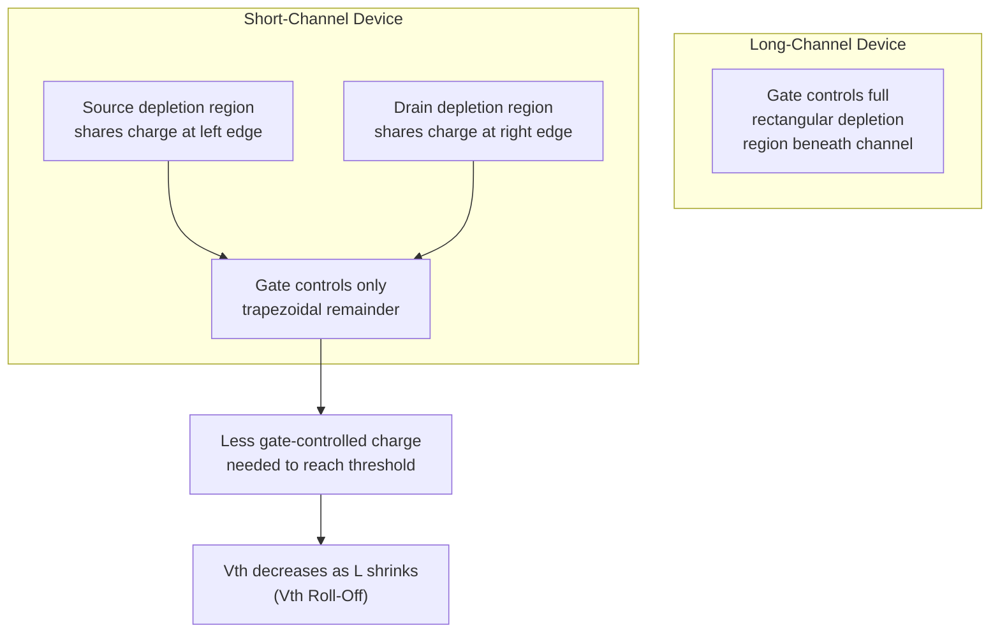
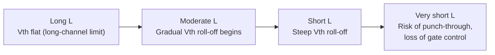

## Threshold Voltage Roll-Off

### Overview

Threshold voltage roll-off refers to the reduction in MOSFET threshold voltage ($V_{th}$) that occurs as channel length is scaled down into the short-channel regime. In an ideal long-channel MOSFET, $V_{th}$ is determined solely by vertical (gate-to-substrate) electrostatics and is independent of channel length. As $L$ shrinks, however, the source and drain depletion regions begin to occupy a proportionally larger fraction of the total channel charge that must be depleted by the gate, reducing the amount of charge the gate itself needs to control. This lowers the gate voltage required to reach threshold, causing $V_{th}$ to decrease (roll off) as $L$ decreases. This effect is a fundamental signature of two-dimensional electrostatic coupling in short-channel devices and a critical consideration in device scaling and circuit design.

### Physical Origin: Charge Sharing

In the long-channel (one-dimensional) approximation, threshold voltage is given by the classical MOS relation:

$$V_{th} = V_{FB} + 2\phi_F + \frac{\sqrt{2\epsilon_{Si}qN_A(2\phi_F)}}{C_{ox}}$$

where $V_{FB}$ is the flat-band voltage, $\phi_F$ is the Fermi potential, $N_A$ is the substrate doping, and $C_{ox}$ is the gate oxide capacitance per unit area. This expression assumes the depletion charge beneath the gate is controlled entirely by the vertical field from the gate — a valid assumption only when the channel is long relative to the source/drain junction depth and depletion width.

In short-channel devices, the source and drain junctions each have their own depletion regions that extend laterally into the channel. Because the source and drain (rather than the gate) partially deplete the channel region directly adjacent to them, part of the bulk charge that would otherwise require gate voltage to deplete is already accounted for by the fringing field lines from the source/drain. This is the **charge-sharing model**, first formalized by Yau (1974).

The geometric picture is that of a trapezoidal (rather than rectangular) depletion charge region beneath the gate, since the source/drain depletion regions "share" a triangular wedge of the bulk charge at each end. The corrected threshold voltage expression subtracts a length-dependent term:

$$V_{th}(L) = V_{th,long} - \Delta V_{th}(L)$$

A widely used approximate form for the charge-sharing correction is:

$$\Delta V_{th} = \frac{2\epsilon_{Si}qN_A}{C_{ox}} \cdot \frac{x_j}{L}\left[\sqrt{1+\frac{2W_d}{x_j}}-1\right]\phi_F$$

where $x_j$ is the source/drain junction depth and $W_d$ is the maximum depletion width. As $L$ decreases, this correction term grows, producing progressively larger reductions in $V_{th}$ — the characteristic "roll-off" behavior.

### Illustration: Charge Sharing Geometry

### Drain-Induced Barrier Lowering (DIBL) Contribution

A closely related but distinct mechanism that also produces apparent $V_{th}$ reduction is **Drain-Induced Barrier Lowering (DIBL)**. While charge sharing describes the length dependence of $V_{th}$ at low $V_{DS}$, DIBL describes an *additional* $V_{th}$ reduction that depends on drain bias: as $V_{DS}$ increases in a short-channel device, the drain's depletion region and its associated field penetrate further into the channel, lowering the source-side potential barrier and further reducing the gate voltage needed to turn the device on.

$$\Delta V_{th,DIBL} = -\eta \cdot V_{DS}$$

where $\eta$ is the DIBL coefficient (units of V/V, typically in the range of tens to hundreds of mV/V depending on technology and $L$), which itself increases in magnitude as $L$ decreases. It is important to distinguish:

- **Static (zero/low $V_{DS}$) roll-off** — governed primarily by charge sharing.
- **DIBL** — the incremental, drain-voltage-dependent component of roll-off, dominant in the deep short-channel regime.

Both mechanisms produce curves that trend in the same direction (decreasing $V_{th}$ with decreasing $L$), and experimentally the total observed roll-off is the superposition of both effects, typically measured by extracting $V_{th}$ vs. $L$ curves at multiple $V_{DS}$ values.

### The Roll-Off Curve

Plotting $V_{th}$ against channel length $L$ at a fixed $V_{DS}$ produces a characteristic curve:

- For long $L$ (well above the technology's minimum feature size), $V_{th}$ is essentially flat and length-independent — the long-channel regime.
- As $L$ decreases below a critical length (roughly a few times the depletion width or junction depth), $V_{th}$ begins to drop, initially gradually then more steeply, this is the roll-off region.
- At very short $L$, near or below the technology's minimum designed channel length, $V_{th}$ can decrease sharply, and at high $V_{DS}$ the device may fail to fully turn off, is a precursor to punch-through.

**Key Points**

- Roll-off is worsened (steeper, occurring at longer $L$) by: increasing $V_{DS}$ (via DIBL), decreasing substrate doping $N_A$, increasing junction depth $x_j$, and increasing oxide thickness $t_{ox}$.
- Roll-off is a primary reason why a single technology node specifies a *minimum* usable channel length: below this length, $V_{th}$ variation with $L$ becomes too large to guarantee reliable circuit operation across process variation.
- Reverse short-channel effect (RSCE) is a related but opposite phenomenon seen in some processes (typically due to non-uniform channel doping profiles from halo implants), where $V_{th}$ initially *increases* slightly as $L$ decreases from the long-channel value, before eventually rolling off at very short $L$ — producing a non-monotonic $V_{th}(L)$ curve.

### Mitigation Techniques

**Halo (Pocket) Implants**

The most widely used mitigation technique in planar CMOS technology. Halo implants introduce localized, angled, higher-doping regions adjacent to the source and drain, beneath the gate edges. This locally increases the effective doping near the junctions specifically in the region most affected by charge sharing, counteracting the depletion-charge loss without raising the doping (and thus degrading mobility/junction capacitance) across the entire channel.

**Shallow Junction Engineering**

Reducing junction depth $x_j$ directly reduces the charge-sharing term (since $\Delta V_{th} \propto x_j$), as it limits the lateral extent of the source/drain depletion regions extending under the gate. This motivates the use of ultra-shallow junctions, often formed via low-energy ion implantation and rapid thermal annealing, in advanced nodes.

**Higher Channel Doping / Retrograde Profiles**

Increasing $N_A$ increases $V_{th}$ overall and can partially compensate for roll-off, though at the cost of increased body effect, junction capacitance, and band-to-band tunneling leakage. Retrograde doping profiles (low doping at the surface, higher doping deeper in the channel) are used to balance mobility (surface) against short-channel control (bulk).

**Thinner Gate Oxide / High-$\kappa$ Dielectrics**

Reducing $t_{ox}$ increases $C_{ox}$, strengthening gate control relative to the source/drain depletion fields and reducing the magnitude of the roll-off correction term. This is a primary driver behind continued oxide/EOT (equivalent oxide thickness) scaling, and later the adoption of high-$\kappa$ gate dielectrics with metal gates to allow further EOT reduction without excessive gate leakage.

**Multi-Gate / Fully-Depleted Architectures (FinFET, FD-SOI, GAA)**

By wrapping the gate around multiple sides of the channel (or fully depleting a thin body), these architectures dramatically increase the ratio of gate-controlled charge to total channel charge, suppressing charge-sharing-driven roll-off far more effectively than doping or junction engineering alone in planar bulk devices. [Inference: the specific quantitative improvement in roll-off suppression depends on the fin width/body thickness and gate wrap geometry, and requires device-specific TCAD or measured characterization for precise figures.]

### Example

Consider a bulk NMOS process where the long-channel threshold voltage is $V_{th,long} = 0.45\,\text{V}$. Measured data at $V_{DS} = 0.05\,\text{V}$ (low-field, isolating charge-sharing) might show:

| $L$ (nm) | $V_{th}$ (V) at low $V_{DS}$ | $V_{th}$ (V) at $V_{DS} = 1.0\,\text{V}$ |
| --- | --- | --- |
| 180 | 0.45 | 0.44 |
| 90 | 0.44 | 0.41 |
| 45 | 0.40 | 0.33 |
| 28 | 0.32 | 0.20 |

The gap that widens between the two columns at shorter $L$ illustrates the growing DIBL contribution, while the general downward trend in either column with decreasing $L$ illustrates the charge-sharing-driven roll-off. [Illustrative numerical example; actual values are highly process-dependent and would be extracted from device measurement or TCAD simulation for a specific technology.]

**Related Topics**

- Charge-sharing model (Yau model) derivation
- Drain-Induced Barrier Lowering (DIBL)
- Reverse short-channel effect (RSCE) and halo implant doping profiles
- Punch-through and subsurface leakage
- Subthreshold slope degradation in short-channel devices
- Gate oxide scaling and high-$\kappa$/metal-gate integration
- FinFET, FD-SOI, and Gate-All-Around (GAA) electrostatic control
- Process variation and $V_{th}$ mismatch in scaled technologies