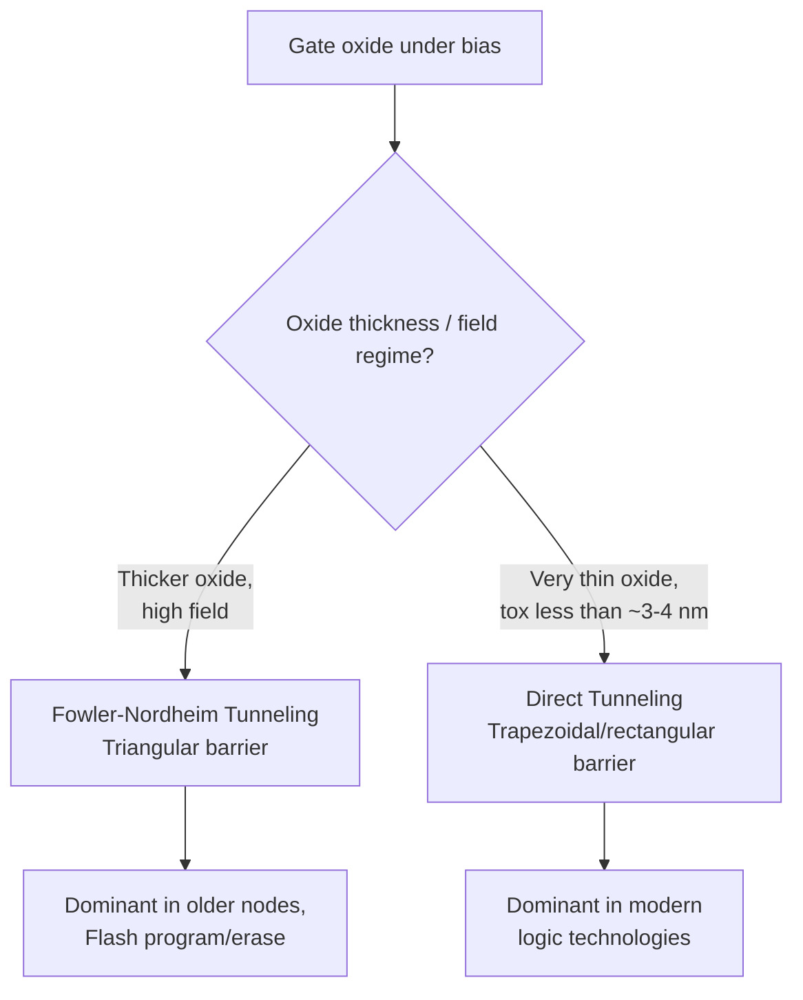

## Gate Leakage and Tunneling Currents

### Overview

Gate leakage current refers to the parasitic current that flows through the gate dielectric of a MOSFET, from the gate electrode into the channel/substrate (or vice versa), even though the gate is nominally an insulated terminal separated from the channel by the gate oxide. In an ideal MOSFET, this current should be zero. However, as gate oxide thickness ($t_{ox}$) has been aggressively scaled to maintain electrostatic control in short-channel devices, the oxide has become thin enough that quantum mechanical tunneling allows a non-negligible fraction of carriers to cross the dielectric barrier directly. Gate leakage is a critical concern in advanced CMOS scaling because it contributes directly to static power dissipation and was one of the primary drivers behind the industry-wide transition to high-$\kappa$ gate dielectrics.

### Physical Origin: Quantum Mechanical Tunneling

Classically, an electron in the gate or channel region does not have sufficient energy to surmount the SiO$_2$/Si conduction or valence band offset barrier (approximately 3.1 eV for the electron affinity difference at the Si/SiO$_2$ interface, and about 4.7 eV for holes). However, quantum mechanics allows a finite probability that a carrier can tunnel through a sufficiently thin barrier even without possessing enough energy to go over it. The tunneling probability depends exponentially on both the barrier width (oxide thickness) and the barrier height, following a form closely related to the WKB approximation:

$$T \propto \exp\left(-2\kappa_b \cdot t_{ox}\right), \quad \kappa_b = \frac{\sqrt{2m^*\phi_B}}{\hbar}$$

where $m^*$ is the effective mass of the tunneling carrier in the oxide, $\phi_B$ is the barrier height, and $\hbar$ is the reduced Planck constant. Because the tunneling current depends exponentially on oxide thickness, even sub-nanometer reductions in $t_{ox}$ produce order-of-magnitude increases in gate leakage — this exponential sensitivity is what makes gate tunneling such an abrupt and severe scaling limiter compared to other short-channel effects, which tend to degrade more gradually.

### Tunneling Mechanisms

**Fowler-Nordheim (FN) Tunneling**

Occurs under relatively high electric fields (typically several MV/cm) and relatively thick oxides, where the carrier tunnels through a *triangular* potential barrier — the applied field is strong enough to bend the oxide conduction band so the carrier only needs to tunnel through part of the physical oxide thickness before reaching the conduction band on the other side. The current density follows the classical FN relation:

$$J_{FN} = A \cdot E_{ox}^2 \exp\left(-\frac{B}{E_{ox}}\right)$$

where $E_{ox}$ is the oxide electric field, and $A$, $B$ are constants dependent on the effective mass and barrier height. FN tunneling was the dominant gate leakage mechanism in older, thicker-oxide technologies (generally $t_{ox} \gtrsim 4$–5 nm) under high-field stress conditions, and remains relevant today primarily in the context of Fowler-Nordheim-based flash memory programming/erase operations.

**Direct Tunneling (DT)**

Becomes dominant as oxide thickness scales below roughly 3–4 nm, particularly at the lower operating fields typical of logic circuit supply voltages. Here, the carrier tunnels through the *entire* physical oxide thickness as a rectangular (trapezoidal, more precisely, under bias) barrier, rather than only a triangular portion. Direct tunneling current density increases far more steeply with decreasing $t_{ox}$ than FN tunneling does with field, and is the dominant gate leakage mechanism in essentially all modern sub-100 nm logic technologies using conventional SiO$_2$ or oxynitride dielectrics.

**Component Currents by Bias Condition**

Direct tunneling gate current is further categorized by carrier type and terminal path, since the dominant tunneling component depends on the transistor's bias region:

- $I_{gc}$ (gate-to-channel): dominant in strong inversion, the primary component in the "on" state.
- $I_{gs}$, $I_{gd}$ (gate-to-source/drain overlap): tunneling through the gate-source/drain overlap regions.
- $I_{gb}$ (gate-to-body/substrate): dominant in accumulation or depletion, relevant to off-state and standby leakage.

Both electron tunneling from the conduction band (ECB) and from the valence band (EVB, producing tunneling holes) contribute, with relative weighting depending on gate polarity, doping type (NMOS vs. PMOS), and gate poly-depletion effects.

### Poly-Depletion and Quantum Confinement Effects

In polysilicon-gated devices, an additional depletion layer forms within the poly-Si gate itself under inversion bias (poly-depletion effect), which reduces the effective gate capacitance and further increases the effective electrical oxide thickness beyond the physical thickness. Simultaneously, quantum confinement of inversion-layer carriers at the Si surface shifts the carrier density peak away from the interface, adding an additional "dark space" capacitance in series. Both effects mean that as physical $t_{ox}$ is scaled to the sub-2 nm range, the *effective* oxide thickness (EOT) as seen electrically no longer decreases proportionally, compounding the challenge of maintaining both gate control and low tunneling current simultaneously. This was one of several factors motivating the shift to metal gate electrodes (eliminating poly-depletion) alongside high-$\kappa$ dielectrics.

**Key Points**

- Gate leakage current density can increase by roughly one order of magnitude for each ~2 Å (0.2 nm) reduction in oxide thickness in the direct tunneling regime — an extremely steep dependence that made continued SiO$_2$ scaling below ~1.2 nm physically untenable for production logic.
- NMOS and PMOS devices exhibit different gate leakage characteristics due to differing barrier heights for electrons vs. holes and differences in inversion-layer carrier populations.
- Gate leakage contributes to total static (standby) power alongside subthreshold leakage and junction (band-to-band tunneling) leakage, and became a comparably significant leakage component to subthreshold leakage in the early-2000s planar CMOS nodes before high-$\kappa$/metal-gate adoption.

### The High-$\kappa$/Metal-Gate Solution

The most significant industry response to gate tunneling leakage was the replacement of SiO$_2$ (and SiON) gate dielectrics with high-$\kappa$ materials (most notably hafnium-based dielectrics such as HfO$_2$ and hafnium silicates), paired with metal gate electrodes, first introduced in production at the 45 nm node.

The underlying principle: gate capacitance is what determines electrostatic control, given by $C_{ox} = \epsilon_{ox}/t_{ox}$. A high-$\kappa$ material with dielectric constant $\kappa_{high-k}$ significantly greater than that of SiO$_2$ ($\kappa_{SiO2} \approx 3.9$) can achieve the *same* capacitance (same electrostatic control) using a **physically thicker** film:

$$t_{high-k} = t_{ox,SiO2} \times \frac{\kappa_{high-k}}{\kappa_{SiO2}}$$

This physically thicker film — while electrically equivalent in terms of capacitance (same EOT) — presents a much wider tunneling barrier width, exponentially suppressing direct tunneling current relative to an equivalently-capacitive SiO$_2$ film, even though the high-$\kappa$ material's tunneling barrier *height* is typically somewhat lower than that of SiO$_2$.

$$\text{EOT} = t_{high-k} \times \frac{\kappa_{SiO2}}{\kappa_{high-k}}$$

Metal gates are paired with high-$\kappa$ dielectrics primarily to eliminate poly-Si/high-$\kappa$ interface instabilities (Fermi-level pinning, threshold voltage shifts, and mobility degradation from remote phonon scattering with the polysilicon gate) rather than to directly address tunneling, but the combination as an integrated module became the standard solution beginning at the 45/32 nm generations and continuing through FinFET-era nodes.

**Key Points**

- The introduction of high-$\kappa$/metal-gate stacks reduced gate leakage by reported factors on the order of 10–100$\times$ at equivalent EOT compared to continued SiO$_2$/SiON scaling, though exact figures are process- and vendor-specific. [Unverified: precise leakage reduction factors vary by publication and measurement condition; general order-of-magnitude improvement is well documented in the literature.]
- Trade-offs of high-$\kappa$ dielectrics include lower channel mobility (due to remote phonon and remote Coulomb scattering from the high-$\kappa$ material), threshold voltage shifts requiring dual metal gate work-function engineering (separate metals for NMOS/PMOS), and reliability concerns such as bias-temperature instability (BTI) behavior distinct from SiO$_2$.

### Illustration: Tunneling Barrier Comparison (svg_diagram)

<svg xmlns="http://www.w3.org/2000/svg" viewBox="0 0 700 380" font-family="Helvetica, Arial, sans-serif">
<text x="350" y="24" text-anchor="middle" font-size="16" font-weight="bold" fill="#1a1a1a">Tunneling Barrier: SiO2 vs High-k (svg_diagram)</text>

<line x1="60" y1="300" x2="640" y2="300" stroke="#333" stroke-width="1.5" />
<text x="350" y="325" text-anchor="middle" font-size="12" fill="#333">Position across gate stack</text>
<line x1="60" y1="60" x2="60" y2="300" stroke="#333" stroke-width="1.5" />
<text x="30" y="180" text-anchor="middle" font-size="12" fill="#333" transform="rotate(-90 30 180)">Energy</text>

<rect x="150" y="100" width="40" height="200" fill="#f2a65a" opacity="0.75" stroke="#a05a1a" stroke-width="1.5" />
<text x="170" y="90" text-anchor="middle" font-size="11" fill="#a05a1a">SiO2</text>
<text x="170" y="320" text-anchor="middle" font-size="10" fill="#333">~1 nm</text>
<text x="170" y="250" text-anchor="middle" font-size="10" fill="#333" transform="rotate(-90 170 250)">Height ~3.1 eV</text>

<path d="M 130 200 L 210 200" stroke="#c0392b" stroke-width="2" stroke-dasharray="3,3" marker-end="url(#arrowT1)" />
<text x="170" y="195" text-anchor="middle" font-size="9" fill="#c0392b">High tunneling probability</text>

<rect x="380" y="150" width="140" height="150" fill="#7ec8e3" opacity="0.75" stroke="#1a6e91" stroke-width="1.5" />
<text x="450" y="140" text-anchor="middle" font-size="11" fill="#1a6e91">High-k (e.g. HfO2)</text>
<text x="450" y="320" text-anchor="middle" font-size="10" fill="#333">~3-4 nm (same EOT)</text>
<text x="450" y="230" text-anchor="middle" font-size="10" fill="#333">Height ~1.5-2 eV</text>

<path d="M 360 220 L 540 220" stroke="#2e6b2e" stroke-width="2" stroke-dasharray="3,3" marker-end="url(#arrowT2)" />
<text x="450" y="215" text-anchor="middle" font-size="9" fill="#2e6b2e">Suppressed tunneling probability</text>
</svg>

### Impact on Circuit Design and Scaling

- **Standby power budget**: In battery-powered and mobile applications, gate leakage (alongside subthreshold and junction leakage) directly determines idle power consumption, motivating techniques like multi-$V_{th}$ design and power gating.
- **SRAM stability**: Gate leakage in SRAM bit cells can affect data retention and static noise margins, particularly in low-power, high-density memory arrays.
- **Technology node EOT limits**: Gate tunneling current constraints, alongside gate oxide reliability (TDDB) limits, effectively set the minimum usable EOT for a given technology generation, independent of what pure lithographic scaling of $L$ might otherwise allow.
- **FinFET/GAA continuation**: The transition to multi-gate architectures did not eliminate the need for high-$\kappa$/metal-gate stacks; tunneling remains governed by the same EOT-dependent physics regardless of channel geometry, so high-$\kappa$ dielectrics remain standard through FinFET and GAA nodes. [Inference: specific EOT/leakage targets at advanced nodes are proprietary to individual foundries and not fully disclosed in public literature.]

**Related Topics**

- High-$\kappa$/metal-gate integration and work-function engineering
- Equivalent Oxide Thickness (EOT) and capacitance equivalent thickness (CET)
- Poly-silicon gate depletion effect
- Time-Dependent Dielectric Breakdown (TDDB) and oxide reliability
- Subthreshold leakage and multi-$V_{th}$ design techniques
- Band-to-band tunneling (BTBT) and junction leakage
- FinFET and Gate-All-Around (GAA) gate stack integration
- Remote phonon/Coulomb scattering and mobility degradation in high-$\kappa$ channels