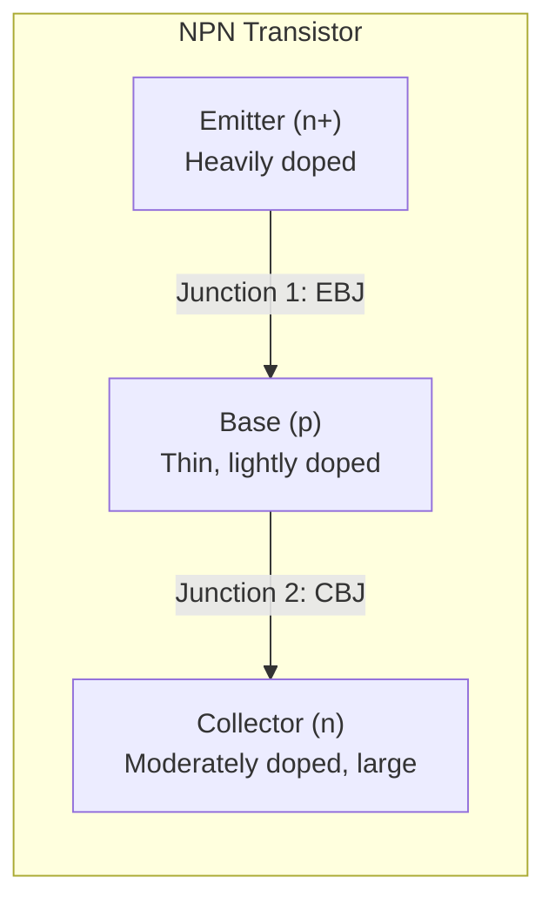
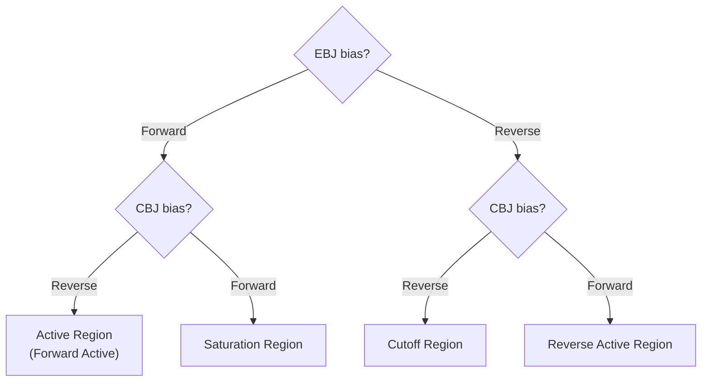
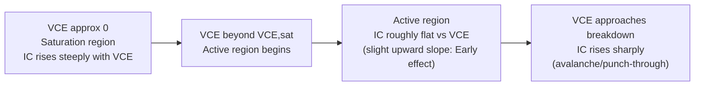

## BJT Structure and Operating Regions

### Overview

The Bipolar Junction Transistor (BJT) is a three-terminal semiconductor device formed by two back-to-back p-n junctions sharing a common, thin middle region. Unlike the MOSFET, whose operation relies on a single majority-carrier channel controlled by an electric field, the BJT is a **minority-carrier** device in which current conduction depends on the injection, diffusion, and collection of both electron and hole populations across the device — hence "bipolar." The BJT's three terminals — emitter, base, and collector — correspond to the three doped regions, and its behavior is governed by which of the two internal junctions are forward- or reverse-biased, defining four distinct operating regions.

### Physical Structure

A BJT consists of three alternately doped semiconductor regions forming two junctions:

- **Emitter (E)**: The most heavily doped region, responsible for injecting the majority of carriers into the base. In an NPN device this is n-type (electrons); in a PNP device this is p-type (holes).
- **Base (B)**: A thin, lightly doped region sandwiched between emitter and collector. Its thinness (typically much smaller than the minority carrier diffusion length) is essential, allowing most carriers injected from the emitter to diffuse across to the collector rather than recombining in the base.
- **Collector (C)**: A moderately doped, physically larger region that collects the carriers diffusing across the base. It is generally the largest and least heavily doped of the three regions, since it must support the reverse-biased collector-base junction and withstand higher voltages.

Two device polarities exist, distinguished by the doping sequence:

- **NPN**: n-type emitter, p-type base, n-type collector. Conduction is primarily via electrons injected from emitter to collector.
- **PNP**: p-type emitter, n-type base, p-type collector. Conduction is primarily via holes injected from emitter to collector.

The doping concentration hierarchy is a defining design feature: $N_{D,emitter} \gg N_{A,base} > N_{D,collector}$ (for NPN). This asymmetry is intentional and essential — the heavily doped emitter ensures that carrier injection is strongly dominated by the emitter-to-base direction (rather than base-to-emitter), maximizing emitter injection efficiency.

### Terminal Currents and Current Gain

The three terminal currents are related by Kirchhoff's current law:

$$I_E = I_B + I_C$$

Two figures of merit characterize current amplification:

**Common-Base Current Gain ($\alpha$)**:

$$\alpha = \frac{I_C}{I_E}, \quad \text{typically } 0.95 < \alpha < 0.999$$

**Common-Emitter Current Gain ($\beta$, or $h_{FE}$)**:

$$\beta = \frac{I_C}{I_B} = \frac{\alpha}{1-\alpha}$$

Because $\alpha$ is close to unity, small variations in $\alpha$ produce large variations in $\beta$ — this is why $\beta$ is highly sensitive to base width, doping ratios, and recombination effects, and why $\beta$ typically shows significant device-to-device variation and temperature dependence, whereas $\alpha$ remains comparatively stable.

**Key Points**

- $\alpha$ is composed of two sub-efficiencies: the emitter injection efficiency $\gamma$ (fraction of emitter current that is useful minority carrier injection into the base, versus majority-carrier back-injection into the emitter) and the base transport factor $\alpha_T$ (fraction of carriers injected into the base that successfully diffuse across without recombining): $\alpha = \gamma \cdot \alpha_T$.
- A thin, lightly doped base (relative to the emitter) is the central structural requirement for achieving both high $\gamma$ and high $\alpha_T$, and therefore high $\beta$.

### The Four Operating Regions

BJT operation is classified according to the bias condition of each of its two junctions: the emitter-base junction (EBJ) and the collector-base junction (CBJ). Each junction can independently be forward-biased (FB) or reverse-biased (RB), giving four combinations:

**Forward Active Region**

The EBJ is forward-biased and the CBJ is reverse-biased. This is the primary region used for analog amplification, since it produces the linear (exponential in $V_{BE}$, but linear $I_C$-vs-$I_B$ proportionality) relationship that defines transistor gain behavior. In this region:

$$I_C = I_S \exp\left(\frac{V_{BE}}{V_T}\right), \quad I_B = \frac{I_C}{\beta}$$

where $I_S$ is the saturation current (a device-specific constant dependent on geometry and doping) and $V_T = kT/q$ is the thermal voltage (~26 mV at room temperature). The collector current in the active region is, to first order, independent of $V_{CE}$ (ignoring the Early effect discussed below), producing the characteristic flat output curves seen in BJT $I_C$-$V_{CE}$ characteristic plots.

**Saturation Region**

Both the EBJ and CBJ are forward-biased. Physically, this means the collector-base junction is no longer able to efficiently collect carriers diffusing across the base — since the CBJ is forward-biased rather than reverse-biased, it can no longer sweep carriers across efficiently, and excess minority carrier charge accumulates in the base region. In this region, $I_C$ is no longer proportional to $I_B$ (i.e., $\beta$ is not maintained); instead, $V_{CE}$ drops to a small, roughly constant value ($V_{CE,sat}$, typically 0.1–0.3 V for silicon devices). Saturation is the primary "on" state used in digital switching applications, since it produces the lowest achievable "on" voltage drop across the device.

**Cutoff Region**

Both the EBJ and CBJ are reverse-biased (or, more precisely, not sufficiently forward-biased to conduct). In this state, both junctions behave essentially as reverse-biased diodes, and only small leakage currents flow. $I_C \approx I_B \approx 0$ (ignoring small reverse leakage currents), making this the "off" state used in digital switching applications.

**Reverse Active (Inverse Active) Region**

The EBJ is reverse-biased and the CBJ is forward-biased — essentially the mirror image of forward active operation, with the roles of emitter and collector interchanged. Because the collector is typically less heavily doped and has a larger junction area than the emitter (optimized for heat dissipation and breakdown voltage rather than injection efficiency), the reverse active current gain $\beta_R$ is typically much lower than the forward $\beta$ (often by one to two orders of magnitude). This region is rarely used intentionally in analog design but is relevant in certain digital logic families (e.g., some early saturating logic families) and must be considered in device modeling (e.g., the Ebers-Moll model, which explicitly accounts for both forward and reverse operation).

**Key Points**

- Cutoff and Saturation together define the two stable logic states ("off" and "on") used in BJT-based digital switching circuits (e.g., classic TTL logic families).
- Forward Active is the region of interest for essentially all BJT analog amplifier design (common-emitter, common-base, common-collector configurations).
- The clear asymmetry between forward and reverse gain ($\beta \gg \beta_R$) is a direct consequence of the deliberately asymmetric emitter/collector doping and geometry, and is a key structural distinction from a symmetric device.

### Output Characteristics Across Regions

A representative common-emitter $I_C$-$V_{CE}$ characteristic curve family, for increasing base current or base-emitter voltage steps, exhibits the following structure:

### The Early Effect (Base-Width Modulation)

In the active region, $I_C$ is not perfectly independent of $V_{CE}$: as $V_{CE}$ (and thus the CBJ reverse bias) increases, the CBJ depletion region widens, encroaching into the base and effectively narrowing the neutral base width $W_B$. Since diffusion current across the base is inversely related to base width, this narrowing slightly increases $I_C$ for a given $V_{BE}$. This is the Early effect, characterized by the Early voltage $V_A$, and modeled as:

$$I_C = I_S \exp\left(\frac{V_{BE}}{V_T}\right)\left(1+\frac{V_{CE}}{V_A}\right)$$

The finite slope of the $I_C$-$V_{CE}$ curves in the active region (rather than perfectly flat) is the graphical signature of this effect, and $V_A$ is extracted by extrapolating the active-region slope back to the $V_{CE}$ axis, where the extrapolated lines from all base-current curves ideally converge at a single point $V_{CE} = -V_A$.

### Example

A silicon NPN transistor with $\beta = 100$ is biased with $I_B = 20\,\mu\text{A}$ in the forward active region:

$$I_C = \beta \cdot I_B = 100 \times 20\,\mu\text{A} = 2\,\text{mA}$$

$$I_E = I_B + I_C = 20\,\mu\text{A} + 2\,\text{mA} = 2.02\,\text{mA}$$

$$\alpha = \frac{I_C}{I_E} = \frac{2.0}{2.02} \approx 0.99$$

If this same device is instead driven with $I_B = 100\,\mu\text{A}$ but the collector supply is insufficient to maintain $V_{CE} > V_{CE,sat}$ (e.g., a small collector resistor pulling the collector low), the device will enter saturation: $I_C$ will be limited by the external circuit (not by $\beta \cdot I_B$), and $V_{CE}$ will settle near $V_{CE,sat} \approx 0.2\,\text{V}$ rather than continuing to follow $I_C = \beta I_B$.

**Related Topics**

- Ebers-Moll model and large-signal BJT equations
- Early effect and Early voltage extraction
- Common-emitter, common-base, and common-collector configurations
- BJT small-signal ($h$-parameter and hybrid-$\pi$) models
- Base transit time and base-width modulation
- Heterojunction Bipolar Transistors (HBTs)
- BJT breakdown voltages ($BV_{CEO}$, $BV_{CBO}$)
- Gummel-Poon model and second-order BJT effects