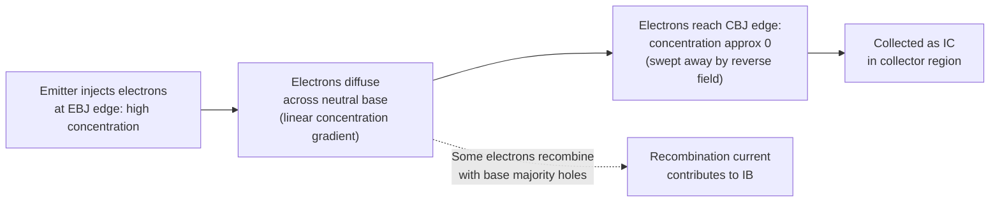

## Minority Carrier Injection and Transport

### Overview

Minority carrier injection and transport describes the physical process by which the BJT achieves current amplification: carriers of a type that are the *minority* species in a given region (electrons in a p-type base, or holes in an n-type base) are injected across a forward-biased junction and subsequently transported across the base region via diffusion. This process is the defining physical mechanism that distinguishes bipolar transistor action from simple diode behavior, and understanding it quantitatively is essential to deriving the BJT's current equations, frequency response, and the physical origin of current gain.

### Injection at the Forward-Biased Emitter-Base Junction

When the emitter-base junction (EBJ) is forward-biased (as in the active or saturation regions), the applied voltage $V_{BE}$ reduces the built-in potential barrier at the junction, allowing majority carriers from each side to be injected as minority carriers into the opposite region. For an NPN transistor:

- Electrons from the heavily doped n-type emitter are injected into the p-type base, becoming excess minority carriers there.
- Holes from the p-type base are injected into the n-type emitter, becoming excess minority carriers there.

The excess minority carrier concentration at the edge of the depletion region (on the base side) is governed by the **law of the junction**, derived from the requirement that the product of electron and hole concentrations remains fixed relative to their equilibrium product under an applied bias:

$$n_p(0) = n_{p0}\exp\left(\frac{V_{BE}}{V_T}\right)$$

where $n_p(0)$ is the electron concentration at the base edge of the depletion region (base side), $n_{p0}$ is the equilibrium (thermal) minority electron concentration in the base, and $V_T = kT/q$ is the thermal voltage. This exponential relationship is the direct physical origin of the exponential $I_C$-$V_{BE}$ relationship characteristic of BJT operation.

**Key Points**

- The injected minority carrier concentration is many orders of magnitude larger than the equilibrium minority carrier concentration even for modest forward bias (since $V_{BE}/V_T$ is typically 15–25 for silicon devices at normal operating currents), which is why this "excess" carrier population dominates transport physics in the base.
- The reverse injection of holes from base into emitter (rather than only electrons from emitter into base) is why emitter injection efficiency $\gamma$ is not unity — this reverse component is "wasted" current that does not contribute to useful collector current, and is deliberately minimized by making the emitter doping far higher than the base doping.

### Transport Across the Base: Diffusion Physics

Once injected into the base, excess minority carriers (electrons, in the NPN case) do not travel via drift (there is negligible electric field in a uniformly doped neutral base region under the standard idealized assumption) — instead, they move via **diffusion**, driven by the concentration gradient established between the high concentration at the emitter-base junction edge and the low (near-zero) concentration at the collector-base junction edge (since the reverse-biased CBJ sweeps away any carriers reaching it almost immediately).

The steady-state minority carrier diffusion equation in the base, under the standard short-base approximation (ignoring recombination for a first-order picture, then reintroducing it), yields an approximately **linear** concentration profile across the neutral base width $W_B$:

$$n_p(x) \approx n_p(0)\left(1-\frac{x}{W_B}\right)$$

This linear gradient, when substituted into the diffusion current relation $J_n = qD_n \frac{dn_p}{dx}$, gives the collector current density:

$$J_C \approx qD_n\frac{n_p(0)}{W_B} = \frac{qD_n n_{p0}}{W_B}\exp\left(\frac{V_{BE}}{V_T}\right)$$

where $D_n$ is the electron diffusion coefficient in the base. This expression directly reveals two of the most important structural dependencies in BJT design: collector current (and thus gain) increases as base width $W_B$ decreases, and increases as base doping (which sets $n_{p0} = n_i^2/N_A$) decreases — both pointing toward "thin, lightly doped base" as the structural ideal, consistent with the physical structure discussed for BJT device design.

### Base Transport Factor and Recombination

Not every electron injected into the base successfully reaches the collector; some recombine with the majority-carrier holes in the base before diffusing across. This recombination loss is quantified by the **base transport factor**:

$$\alpha_T = \frac{I_{C}}{I_{n,injected}} \approx 1-\frac{1}{2}\left(\frac{W_B}{L_n}\right)^2$$

where $L_n = \sqrt{D_n \tau_n}$ is the minority carrier (electron) diffusion length in the base, and $\tau_n$ is the minority carrier lifetime. This approximation makes explicit the design requirement that $W_B \ll L_n$ — the base must be short relative to the natural diffusion length of the injected carriers for most of them to survive the transit and contribute to useful collector current, rather than recombining and contributing only to (wasted) base current.

**Key Points**

- Recombination in the base is one of the two components of base current $I_B$ (the other being the reverse hole injection into the emitter described above); both are "loss" mechanisms that reduce $\alpha$ and $\beta$ below their ideal maximum values.
- Base transit time $\tau_B \approx \frac{W_B^2}{2D_n}$ (for a uniformly doped base) is the average time an injected minority carrier spends diffusing across the base, and is one of several delay components (along with EBJ and CBJ depletion capacitance charging times) that collectively determine the transistor's cutoff frequency $f_T$ — making short base width doubly beneficial: it improves both DC current gain and high-frequency response.

### Illustration: Minority Carrier Concentration Profile (svg_diagram)

<svg xmlns="http://www.w3.org/2000/svg" viewBox="0 0 680 380" font-family="Helvetica, Arial, sans-serif">
<text x="340" y="24" text-anchor="middle" font-size="16" font-weight="bold" fill="#1a1a1a">Minority Carrier Profile Across Base (svg_diagram)</text>

<line x1="80" y1="320" x2="600" y2="320" stroke="#333" stroke-width="1.5" />
<text x="340" y="345" text-anchor="middle" font-size="12" fill="#333">Position x (Emitter edge -&gt; Collector edge)</text>
<line x1="80" y1="60" x2="80" y2="320" stroke="#333" stroke-width="1.5" />
<text x="45" y="190" text-anchor="middle" font-size="12" fill="#333" transform="rotate(-90 45 190)">Excess electron concentration np(x)</text>

<rect x="150" y="60" width="300" height="260" fill="#eef2f7" stroke="#9aa5b1" stroke-width="1" stroke-dasharray="4,3" />
<text x="300" y="80" text-anchor="middle" font-size="12" fill="#5a6472">Neutral Base Region (width WB)</text>

<line x1="150" y1="60" x2="150" y2="320" stroke="#8a1f1f" stroke-width="1.5" />
<text x="150" y="335" text-anchor="middle" font-size="10" fill="#8a1f1f">EBJ edge (x=0)</text>
<line x1="450" y1="60" x2="450" y2="320" stroke="#1f4a8a" stroke-width="1.5" />
<text x="450" y="335" text-anchor="middle" font-size="10" fill="#1f4a8a">CBJ edge (x=WB)</text>

<line x1="150" y1="90" x2="450" y2="315" stroke="#c0392b" stroke-width="3" />
<text x="200" y="85" font-size="11" fill="#c0392b">np(0) = np0 * exp(VBE/VT)</text>
<text x="460" y="310" font-size="11" fill="#c0392b">np(WB) approx 0</text>

<path d="M 150 90 Q 300 160 450 300" stroke="#2e6b2e" stroke-width="2" stroke-dasharray="5,3" fill="none" />
<text x="480" y="270" font-size="10" fill="#2e6b2e">With recombination (slight curvature)</text>

<path d="M 200 250 L 400 260" stroke="#1a1a1a" stroke-width="1.5" marker-end="url(#arrowD)" />
<text x="300" y="245" text-anchor="middle" font-size="10" fill="#1a1a1a">Diffusion flux (Jn)</text>
</svg>

### Emitter-Side Injection and the Gummel Number

The complementary process — hole injection from base into emitter — is governed analogously by the emitter's minority carrier (hole) diffusion, and the resulting reverse injection current $I_{p,E}$ subtracts from overall emitter efficiency. The full expression for emitter injection efficiency, incorporating both sides, is often expressed in terms of the **Gummel number** $G_B$ (the integrated, doping-weighted base majority carrier charge per unit area) and its emitter-side analog $G_E$:

$$\gamma \approx \frac{1}{1+\frac{D_{p,E} n_{p0,base} W_B}{D_{n,base} p_{n0,emitter} W_E}} = \frac{1}{1+\frac{G_B}{G_E}}$$

A high ratio $G_E/G_B$ (achieved via heavy emitter doping relative to base doping, i.e., $N_{D,E} \gg N_{A,B}$) drives $\gamma$ close to unity, reinforcing why the emitter must be far more heavily doped than the base — this is not an incidental design choice but a direct requirement derived from minority carrier injection physics.

### Wide-Base vs. Short-Base Diode Behavior

The BJT's base transport behavior is a specific case of the more general "short-base diode" analysis in semiconductor device physics, distinguished from the "long-base" (or wide-base) diode case relevant to standard p-n junction diodes:

- **Long-base (diode) case**: The neutral region is much longer than the diffusion length ($W \gg L$), so injected minority carriers largely recombine before reaching the far contact, producing an exponentially decaying concentration profile.
- **Short-base (BJT) case**: The neutral base is much shorter than the diffusion length ($W_B \ll L_n$), so the concentration profile is approximately linear (as derived above), and the far boundary condition (near-zero concentration at the CBJ edge, due to the reverse-biased collector junction efficiently extracting carriers) dominates the profile shape rather than natural recombination decay.

This distinction is why standard p-n junction diode current equations cannot be directly applied to describe BJT collector current — the short-base boundary condition imposed by the adjacent reverse-biased collector junction is what fundamentally enables transistor action (current transfer between two junctions) rather than simple independent diode behavior at each junction.

### Example

For a silicon NPN transistor with base width $W_B = 0.5\,\mu\text{m}$, base doping $N_A = 10^{17}\,\text{cm}^{-3}$, and electron diffusion coefficient in the base $D_n = 20\,\text{cm}^2/\text{s}$, with minority carrier lifetime $\tau_n = 10^{-7}\,\text{s}$:

$$L_n = \sqrt{D_n \tau_n} = \sqrt{20 \times 10^{-7}} \approx 44.7\,\mu\text{m}$$

Since $W_B = 0.5\,\mu\text{m} \ll L_n \approx 44.7\,\mu\text{m}$ (a ratio of nearly 90:1), the short-base approximation is excellent, and the base transport factor:

$$\alpha_T \approx 1-\frac{1}{2}\left(\frac{0.5}{44.7}\right)^2 \approx 1-6.2\times10^{-5} \approx 0.99994$$

This illustrates why, in well-designed modern BJTs, the base transport factor is typically very close to unity, and emitter injection efficiency $\gamma$ (rather than base transport) is usually the dominant limiting factor on overall current gain.

**Related Topics**

- Law of the junction and minority carrier boundary conditions
- Gummel number and emitter injection efficiency
- Base transit time and cutoff frequency ($f_T$)
- Short-base vs. long-base diode analysis
- Ebers-Moll and Gummel-Poon transistor models
- Kirk effect and base push-out at high current density
- Heterojunction Bipolar Transistors (HBTs) and bandgap engineering for injection efficiency
- High-level injection effects in the base