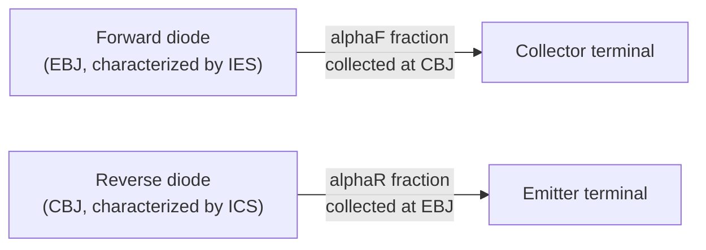
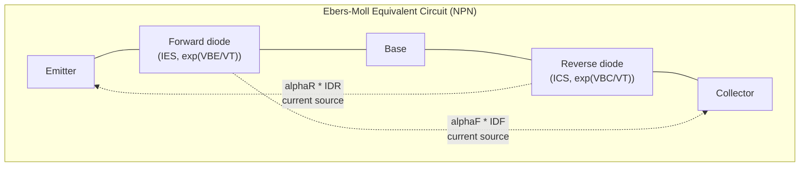

## The Ebers-Moll Model

### Overview

The Ebers-Moll model is a foundational large-signal circuit model for the bipolar junction transistor, first published by J.J. Ebers and J.L. Moll in 1954. It provides a unified mathematical description of BJT terminal currents that is valid across **all four operating regions** (forward active, reverse active, saturation, and cutoff) simultaneously, in contrast to simpler models that are only valid in a single region (such as the active-region-only exponential relationship). The model treats the BJT as two coupled diodes — representing the emitter-base and collector-base junctions — with additional current-controlled current sources capturing the coupling between them via minority carrier transport across the base. This makes it one of the most important and widely taught compact models in bipolar device physics and circuit simulation.

### Conceptual Basis: Two Coupled Diodes

The physical insight behind the Ebers-Moll model is that a BJT can be decomposed into two back-to-back diodes (the emitter-base junction diode and the collector-base junction diode), each of which would, in isolation, follow standard diode exponential I-V behavior. However, the two junctions are not independent: because the base is thin, a substantial fraction of the current injected at one junction is transported across the base and collected at the other junction. This coupling is what produces transistor action (current gain) rather than simple independent diode behavior at each terminal.

### The Ebers-Moll Equations

The model expresses the emitter and collector terminal currents as the superposition of a "forward" diode current (dependent on $V_{BE}$) and a "reverse" diode current (dependent on $V_{BC}$), each coupled to the opposite terminal by a transport (coupling) term:

$$I_E = I_{ES}\left[\exp\left(\frac{V_{BE}}{V_T}\right)-1\right] - \alpha_R I_{CS}\left[\exp\left(\frac{V_{BC}}{V_T}\right)-1\right]$$

$$I_C = \alpha_F I_{ES}\left[\exp\left(\frac{V_{BE}}{V_T}\right)-1\right] - I_{CS}\left[\exp\left(\frac{V_{BC}}{V_T}\right)-1\right]$$

$$I_B = I_E - I_C$$

where:

- $I_{ES}$ is the emitter-base junction saturation current (with the collector-base junction short-circuited to the base).
- $I_{CS}$ is the collector-base junction saturation current (with the emitter-base junction short-circuited to the base).
- $\alpha_F$ is the forward common-base current gain (the same $\alpha$ discussed in standard forward-active operation, typically 0.95–0.999).
- $\alpha_R$ is the reverse common-base current gain (typically much smaller than $\alpha_F$, since the collector is not optimized for efficient carrier injection back into the base).
- $V_{BE}$, $V_{BC}$ are the base-emitter and base-collector junction voltages respectively (note: $V_{BC}$, not $V_{CB}$ — sign convention matters and varies between textbooks).

**Reciprocity Condition**

A fundamental constraint on the four parameters $I_{ES}$, $I_{CS}$, $\alpha_F$, $\alpha_R$ arises from the requirement that the device be reciprocal (a consequence of detailed balance in a passive, symmetric-in-structure sense at the junction level), expressed as:

$$\alpha_F I_{ES} = \alpha_R I_{CS} = I_S$$

where $I_S$ is termed the transport saturation current. This relation reduces the number of independent parameters needed to fully characterize the model from four to three ($I_S$, $\alpha_F$, $\alpha_R$), and is a well-established and experimentally verified property of the BJT structure.

**Key Points**

- The Ebers-Moll model is a **large-signal, DC (or quasi-static) model** — it does not inherently capture capacitive/dynamic (charge-storage) effects, which must be added separately (e.g., via the charge-control formulation or the more complete Gummel-Poon model) for transient or high-frequency analysis.
- The model is fully symmetric in structure between the "forward" and "reverse" diode terms, reflecting the fact that, mathematically, emitter and collector play interchangeable roles — the physical asymmetry (heavy emitter doping vs. moderate collector doping) is captured entirely through the numerical difference between $\alpha_F$ and $\alpha_R$ (and correspondingly $I_{ES}$ vs. $I_{CS}$), not through any structural difference in the equations themselves.

### Equivalent Circuit Representation

The Ebers-Moll equations map directly onto a physical circuit topology consisting of two diodes and two current-controlled current sources:

In this representation:

- The forward diode (between base and emitter) carries current $I_{DF} = I_{ES}[\exp(V_{BE}/V_T)-1]$.
- The reverse diode (between base and collector) carries current $I_{DR} = I_{CS}[\exp(V_{BC}/V_T)-1]$.
- A current source of value $\alpha_F I_{DF}$ delivers current from base to collector (representing the fraction of forward-injected carriers successfully transported across the base and collected).
- A current source of value $\alpha_R I_{DR}$ delivers current from base to emitter (representing the analogous reverse-direction transport).

### Behavior Across the Four Operating Regions

The strength of the Ebers-Moll formulation is that setting $V_{BE}$ and $V_{BC}$ to their appropriate signs (forward or reverse biased) for each region automatically reduces the general equations to the expected simplified behavior:

**Forward Active** ($V_{BE} > 0$, $V_{BC} < 0$, i.e., $V_{BC}$ sufficiently negative that $\exp(V_{BC}/V_T) \approx 0$):

$$I_C \approx \alpha_F I_{ES}\exp\left(\frac{V_{BE}}{V_T}\right) = I_S\exp\left(\frac{V_{BE}}{V_T}\right)$$

This recovers the standard active-region exponential relationship, with the reverse diode term vanishing since the CBJ is reverse-biased.

**Reverse Active** ($V_{BC} > 0$, $V_{BE} < 0$): By symmetry, the roles invert, and

$$I_E \approx -\alpha_R I_{CS}\exp\left(\frac{V_{BC}}{V_T}\right) = -I_S\exp\left(\frac{V_{BC}}{V_T}\right)$$

describing the (typically much weaker) reverse-mode gain $\beta_R = \alpha_R/(1-\alpha_R)$.

**Saturation** ($V_{BE} > 0$ and $V_{BC} > 0$, both junctions forward-biased): Both exponential terms are significant and contribute simultaneously; neither diode term is negligible. This correctly captures the loss of proportionality between $I_C$ and $I_B$ that is characteristic of saturation, since both the forward-injected and reverse-injected carrier populations coexist in the base, and $I_C$ becomes limited by the external circuit rather than by $\beta \cdot I_B$.

**Cutoff** ($V_{BE} < 0$ and $V_{BC} < 0$, both junctions reverse-biased): Both exponential terms approach $-1$ (i.e., both diodes carry only their small reverse saturation leakage current), and all terminal currents reduce to small leakage-level values.

**Key Points**

- Because it is valid across all four regions with a single continuous set of equations, the Ebers-Moll model is particularly well-suited to circuit simulation (SPICE-level modeling), where a transistor's operating point may move between regions during a transient simulation (e.g., a switching circuit transitioning from cutoff through active to saturation).
- The saturation region prediction from Ebers-Moll — that $V_{CE,sat}$ settles to a small, calculable value based on the ratio of forced $\beta$ to available $\beta$ — is a direct and testable consequence of the model, and matches well with observed switching transistor behavior.

### Deriving $V_{CE,sat}$ from Ebers-Moll

One of the most practically useful applications of the Ebers-Moll equations is deriving the saturation voltage. Given a "forced" current gain $\beta_{forced} = I_C/I_B$ (as set by the external circuit) that is less than the nominal forward $\beta_F$, the model predicts:

$$V_{CE,sat} = V_T \ln\left[\frac{1+\frac{\beta_{forced}}{\beta_R}\left(1-\frac{\beta_{forced}}{\beta_F}\right)^{-1}}{1-\frac{\beta_{forced}}{\beta_F}}\right]$$

[This is one common closed-form rearrangement of the Ebers-Moll saturation relations; exact algebraic form varies slightly between textbook derivations depending on which variables are eliminated first, but all are algebraically equivalent when starting from the same underlying Ebers-Moll current equations.] The key qualitative result — that driving a transistor harder into saturation (lower $\beta_{forced}$ relative to $\beta_F$) produces a lower, more stable $V_{CE,sat}$ — is a well-established and widely used design principle in switching circuit design (e.g., choosing base drive resistors in a saturating BJT switch).

### Limitations of the Basic Ebers-Moll Model

While foundational, the basic (original 1954) Ebers-Moll formulation has several recognized limitations that motivated later, more refined models:

- **No capacitive/charge-storage effects**: The model as presented is purely resistive/exponential; it does not capture junction depletion capacitances or minority carrier charge storage (diffusion capacitance), both essential for switching speed and frequency response analysis. Extensions such as the **charge-control model** and the **Gummel-Poon model** add these effects.
- **No high-level injection effects**: At high current densities, the simple exponential relationship breaks down (current gain falls off due to effects such as the Webster effect and base conductivity modulation) — not captured in the basic model.
- **No Early effect (in the simplest form)**: The original formulation does not inherently include finite output resistance in the active region; this is added via an output resistance term or via the more complete Gummel-Poon model, which incorporates base-width modulation naturally through its Gummel number formulation.
- **No temperature dependence modeling of secondary parameters**: While $V_T$'s temperature dependence is included, temperature dependence of $I_S$, $\beta_F$, and other parameters requires additional empirical modeling.
- **Idealized recombination physics**: The model implicitly assumes ideal (diffusion-dominated) diode behavior; non-ideal recombination in the depletion region (captured by the "ideality factor" $n$ in more refined diode equations) is not included in the basic form.

**Key Points**

- The **Gummel-Poon model**, developed later, is generally regarded as the practical successor used in modern SPICE simulators, since it retains the topological insight of Ebers-Moll while adding base-width modulation (Early effect), high-level injection, and more detailed charge-storage modeling in a physically consistent framework based on the base Gummel number.
- Despite its limitations, the Ebers-Moll model remains the standard pedagogical starting point for understanding BJT large-signal behavior because of the clarity with which it connects the four operating regions to a single, physically motivated equation set.

### Example

Consider an NPN transistor with $I_S = 10^{-15}\,\text{A}$, $\alpha_F = 0.99$ ($\beta_F \approx 99$), and $\alpha_R = 0.5$ ($\beta_R = 1$), biased at $V_{BE} = 0.7\,\text{V}$ and $V_{BC} = -5\,\text{V}$ (clearly forward active, since $V_{BC} \ll 0$):

Using $I_{ES} = I_S/\alpha_F = 10^{-15}/0.99 \approx 1.01\times10^{-15}\,\text{A}$ and $I_{CS} = I_S/\alpha_R = 10^{-15}/0.5 = 2\times10^{-15}\,\text{A}$:

Since $V_{BC} = -5\,\text{V}$, $\exp(V_{BC}/V_T) = \exp(-5/0.026) \approx 0$ (negligibly small), so the reverse diode term vanishes entirely, and:

$$I_C \approx I_S\exp\left(\frac{0.7}{0.026}\right) = 10^{-15}\times\exp(26.9) \approx 4.9\times10^{-4}\,\text{A} = 0.49\,\text{mA}$$

$$I_B = I_C/\beta_F \approx 0.49\,\text{mA}/99 \approx 4.95\,\mu\text{A}$$

This numerically confirms that in the forward active region with a strongly reverse-biased CBJ, the full Ebers-Moll equations correctly collapse to the familiar simplified active-region exponential relationship.

**Related Topics**

- Gummel-Poon model and Early effect integration
- Charge-control model and minority carrier charge storage
- $V_{CE,sat}$ derivation and saturation-region design
- Diode ideality factor and non-ideal recombination current
- BJT small-signal (hybrid-$\pi$) model derivation from large-signal equations
- SPICE BJT model parameters and parameter extraction
- Reverse active operation and $\beta_R$ characterization
- High-level injection and the Webster effect