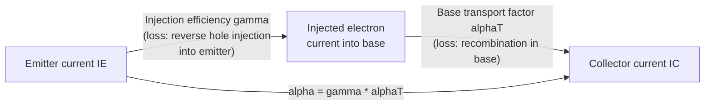
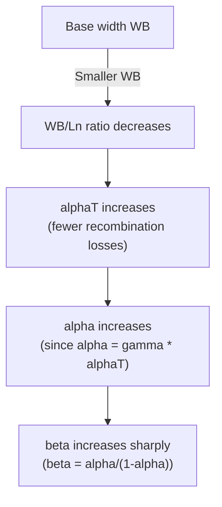
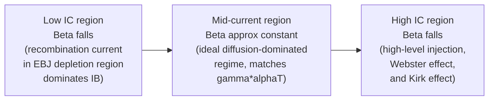

## Current Gain and Base Transport Factor

### Overview

Current gain in the bipolar junction transistor quantifies how efficiently base current controls collector current, and is the single most important figure of merit distinguishing the BJT as an amplifying device. Current gain is not a single monolithic quantity but is decomposed into two physically distinct efficiency factors — the **emitter injection efficiency** ($\gamma$) and the **base transport factor** ($\alpha_T$) — each governed by different physical loss mechanisms within the device. Understanding this decomposition is essential for connecting device structure (doping profiles, base width) to the measurable terminal quantities $\alpha$ and $\beta$.

### Defining the Gain Quantities

As established in BJT terminal current relations, the two standard gain figures of merit are:

$$\alpha = \frac{I_C}{I_E} \quad (\text{common-base current gain, typically } 0.95\text{–}0.999)$$

$$\beta = \frac{I_C}{I_B} = \frac{\alpha}{1-\alpha} \quad (\text{common-emitter current gain, typically } 20\text{–}500)$$

The common-base gain $\alpha$ is decomposed into the product of two independent efficiency terms:

$$\alpha = \gamma \cdot \alpha_T$$

where $\gamma$ is the emitter injection efficiency and $\alpha_T$ is the base transport factor. This decomposition reflects the two sequential stages a carrier must successfully pass through to contribute to collector current: first, being *injected* into the base rather than lost to reverse injection at the emitter, and second, successfully *transporting* across the base without recombining.

### Emitter Injection Efficiency ($\gamma$)

The emitter injection efficiency quantifies what fraction of the total emitter current consists of the *useful* carrier type (electrons injected into the base, for an NPN device) versus the *wasted* reverse-injection component (holes injected from base back into emitter):

$$\gamma = \frac{I_{n,injected}}{I_{n,injected}+I_{p,reverse}} = \frac{J_{nE}}{J_{nE}+J_{pE}}$$

where $J_{nE}$ is the electron current density injected from emitter into base, and $J_{pE}$ is the hole current density injected from base into emitter. Using the standard short-base diode diffusion current expressions for each component:

$$J_{nE} = \frac{qD_{nB}n_{p0}}{W_B}\exp\left(\frac{V_{BE}}{V_T}\right), \quad J_{pE} = \frac{qD_{pE}p_{n0}}{W_E}\exp\left(\frac{V_{BE}}{V_T}\right)$$

Substituting $n_{p0} = n_i^2/N_{A,B}$ and $p_{n0} = n_i^2/N_{D,E}$ (equilibrium minority carrier concentrations in terms of doping) yields:

$$\gamma = \frac{1}{1+\dfrac{D_{pE}N_{A,B}W_B}{D_{nB}N_{D,E}W_E}}$$

This expression makes explicit the design lever available to maximize $\gamma$: the ratio $N_{D,E}/N_{A,B}$ (emitter doping relative to base doping) must be made large. This is precisely why the emitter is deliberately doped far more heavily than the base — often by two to three orders of magnitude — a defining structural asymmetry of the BJT.

**Key Points**

- $\gamma$ approaching unity requires $N_{D,E} \gg N_{A,B}$; typical well-designed silicon BJTs achieve $\gamma > 0.999$.
- The $D_{pE}/D_{nB}$ ratio (relative mobility/diffusivity of holes in the emitter versus electrons in the base) also enters the expression, meaning injection efficiency is not purely a doping ratio effect — material transport properties matter as well, though doping ratio is typically the dominant, most controllable design lever.
- Heavy emitter doping has trade-off consequences: very high doping levels ($N_{D,E} > 10^{19}\text{-}10^{20}\,\text{cm}^{-3}$) can induce **bandgap narrowing** in the emitter, which partially counteracts the injection efficiency benefit by increasing $p_{n0}$ in the emitter — a second-order effect relevant in the design of very high-gain, heavily doped-emitter devices.

### Base Transport Factor ($\alpha_T$)

The base transport factor quantifies what fraction of the carriers successfully injected into the base survive the diffusion transit across the base without recombining, and are subsequently collected at the collector-base junction:

$$\alpha_T = \frac{J_{nC}}{J_{nE}}$$

Solving the minority carrier diffusion equation in the base with appropriate boundary conditions (injected concentration at the EBJ edge, near-zero concentration at the CBJ edge due to the reverse-biased collector sweeping carriers away) and accounting for recombination via the minority carrier lifetime $\tau_n$ gives the exact hyperbolic form:

$$\alpha_T = \frac{1}{\cosh\left(\dfrac{W_B}{L_n}\right)}$$

where $L_n = \sqrt{D_{nB}\tau_n}$ is the electron diffusion length in the base. For the practically important short-base case ($W_B \ll L_n$), a Taylor series expansion of the hyperbolic cosine gives the widely used quadratic approximation:

$$\alpha_T \approx 1-\frac{1}{2}\left(\frac{W_B}{L_n}\right)^2$$

This approximation makes explicit that base transport losses scale with the *square* of the ratio of base width to diffusion length — meaning that even a modest reduction in base width produces a disproportionately large improvement in $\alpha_T$ (and correspondingly a large improvement in $\beta$, given $\beta$'s sensitivity to small changes in $\alpha$).

**Key Points**

- $\alpha_T$ approaching unity requires $W_B \ll L_n$; in modern, well-designed BJTs, $\alpha_T$ is typically extremely close to 1 (often $>0.9999$), meaning **emitter injection efficiency $\gamma$, not base transport, is usually the dominant limiting factor** on overall $\alpha$ and $\beta$ in practical devices.
- Base width is set by process design (base implant/diffusion depth or epitaxial growth thickness in modern devices) and represents a direct trade-off: thinner base improves both $\alpha_T$ and high-frequency response (via reduced base transit time), but excessively thin bases risk **punch-through** (base fully depleted by the combined EBJ and CBJ depletion regions) and increased base resistance (affecting high-frequency performance and noise).

### Combined Effect on $\beta$ Sensitivity

Because $\beta = \alpha/(1-\alpha)$, and $\alpha$ is the product of two factors each close to unity, small degradations in either $\gamma$ or $\alpha_T$ produce amplified, disproportionate reductions in $\beta$. This can be seen by writing:

$$1-\alpha \approx (1-\gamma)+(1-\alpha_T)$$

(valid when both $\gamma$ and $\alpha_T$ are close to 1, to first order), so:

$$\beta \approx \frac{1}{(1-\gamma)+(1-\alpha_T)}$$

This relation explains why $\beta$ is notoriously sensitive to small process variations, temperature, and current level — even a small percentage change in either the injection or transport loss term produces a much larger percentage change in $\beta$, since $\beta$ depends on the reciprocal of a small difference between near-unity quantities.

### Current-Dependence of Gain: The Gummel Plot and Low/High Current Falloff

While the above analysis describes the "ideal" mid-current-range behavior, $\beta$ is not constant across the full operating current range of a real device. This behavior is typically visualized via the **Gummel plot** ($\log I_C$ and $\log I_B$ vs. $V_{BE}$):

**Low-current falloff**: At low $V_{BE}$/$I_C$, non-ideal recombination current within the emitter-base depletion region itself (not accounted for in the ideal diffusion-only $\gamma$ derivation above) becomes a proportionally larger fraction of total base current, since this recombination current follows an ideality factor $n \approx 2$ dependence (varying as $\exp(V_{BE}/2V_T)$) rather than the ideal $n \approx 1$ diffusion current dependence, causing it to fall off more slowly than $I_C$ as $V_{BE}$ decreases — thus $I_B$ becomes relatively larger and $\beta$ drops at low current.

**High-current falloff**: At high $V_{BE}$/$I_C$, two effects reduce $\beta$: the **Webster effect** (high-level injection into the base reduces effective emitter injection efficiency as injected minority carrier density approaches or exceeds the base majority doping level), and the **Kirk effect** (base push-out, where high current density causes the effective base-collector junction to shift into the lightly doped collector epitaxial region, effectively widening $W_B$ and reducing $\alpha_T$ at very high current densities).

**Key Points**

- The mid-current "flat" region of the Gummel plot, where $\beta$ is approximately constant, is the regime described by the ideal $\gamma \cdot \alpha_T$ analysis above; the low- and high-current falloff regions require additional physical mechanisms beyond the simple ideal-diode/ideal-diffusion framework.
- Because $\beta$ varies significantly with current level, temperature, and manufacturing tolerance, circuit designs intended to be robust generally avoid relying on a precise numerical value of $\beta$ (e.g., using negative feedback biasing techniques), rather than assuming $\beta$ is a fixed, precisely known constant.

### Example

Consider an NPN transistor with base width $W_B = 0.3\,\mu\text{m}$, electron diffusion length in the base $L_n = 20\,\mu\text{m}$, emitter doping $N_{D,E} = 5\times10^{19}\,\text{cm}^{-3}$, base doping $N_{A,B} = 2\times10^{17}\,\text{cm}^{-3}$, base width-to-emitter-width ratio $W_B/W_E = 3$, and diffusivity ratio $D_{pE}/D_{nB} = 0.5$:

**Base transport factor:**

$$\alpha_T \approx 1-\frac{1}{2}\left(\frac{0.3}{20}\right)^2 = 1-\frac{1}{2}(0.015)^2 \approx 1-1.125\times10^{-4} \approx 0.999888$$

**Emitter injection efficiency:**

$$\gamma = \frac{1}{1+0.5\times 3 \times \dfrac{2\times10^{17}}{5\times10^{19}}} = \frac{1}{1+1.5\times0.004} = \frac{1}{1.006}\approx 0.9940$$

**Overall gain:**

$$\alpha = \gamma\cdot\alpha_T \approx 0.9940\times0.999888 \approx 0.9939$$

$$\beta = \frac{\alpha}{1-\alpha} \approx \frac{0.9939}{0.0061}\approx 163$$

This example numerically confirms the earlier qualitative claim: with $\alpha_T \approx 0.9999$ but $\gamma \approx 0.994$, the emitter injection efficiency is clearly the dominant limiting factor on overall gain for this device, consistent with typical modern BJT design where base transport losses are engineered to be nearly negligible relative to injection losses.

**Related Topics**

- Ebers-Moll model and terminal current equations
- Gummel plot analysis and ideality factor extraction
- Webster effect and high-level injection in the base
- Kirk effect (base push-out) at high current density
- Gummel number formulation and its role in the Gummel-Poon model
- Bandgap narrowing in heavily doped emitters
- Base transit time and cutoff frequency ($f_T$)
- Heterojunction Bipolar Transistors (HBTs) and injection efficiency via bandgap engineering