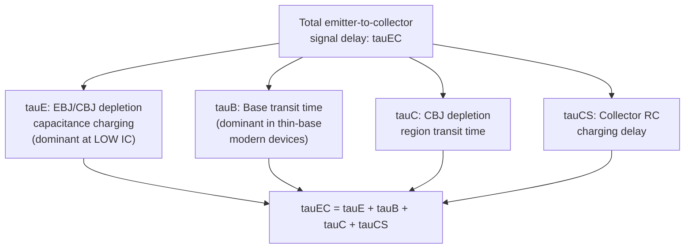
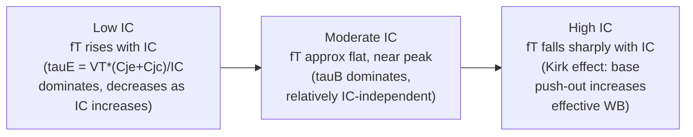

## Frequency Response and Cutoff Frequency

### Overview

The frequency response of a bipolar junction transistor describes how its current gain and amplifying capability degrade as signal frequency increases, ultimately setting an upper bound on the device's usefulness for high-frequency amplification and switching applications. This behavior is governed primarily by internal charge-storage elements — junction depletion capacitances and, most significantly, minority carrier diffusion (charge storage) in the base — which were not captured in the purely resistive, DC-oriented Ebers-Moll and Early-effect analyses. The key figure of merit summarizing high-frequency capability is the **transition frequency** $f_T$, the frequency at which the short-circuit common-emitter current gain drops to unity.

### Physical Origin: Charge Storage Delays

Under AC (time-varying) operation, several internal charge-storage mechanisms introduce delay between an applied base drive signal and the resulting collector current response. Unlike the DC analysis, where only the *steady-state* concentration profile in the base matters, high-frequency operation requires that these charge-storage elements be charged and discharged as the signal varies, and each element contributes an associated time constant:

**Base Transit Time ($\tau_B$)**

As established in minority carrier transport, injected carriers require a finite time to diffuse across the base. For a uniformly doped base with width $W_B$ and diffusion coefficient $D_{nB}$:

$$\tau_B \approx \frac{W_B^2}{2D_{nB}}$$

This is generally the dominant delay component in a well-designed, thin-base modern BJT, and is the primary reason base width minimization is doubly beneficial — it improves both DC current gain (via $\alpha_T$) and high-frequency response simultaneously.

**Emitter-Base Depletion Capacitance Charging Time ($\tau_E$)**

The forward-biased EBJ depletion capacitance $C_{je}$ must be charged and discharged by the small-signal emitter current, introducing a delay:

$$\tau_E \approx \frac{V_T}{I_C}\left(C_{je}+C_{jc}\right)$$

(This combines both EBJ and CBJ depletion capacitances charged through the dynamic emitter resistance $r_e = V_T/I_C$; some formulations separate these into distinct terms.) Because this term scales inversely with $I_C$, it is the dominant delay component at **low bias currents**.

**Collector-Base Depletion Region Transit Time ($\tau_C$)**

Carriers that reach the collector-base junction depletion region still take a finite time to drift across this depletion region before reaching the neutral collector:

$$\tau_C \approx \frac{x_{dCB}}{2v_{sat}}$$

where $x_{dCB}$ is the CBJ depletion width and $v_{sat}$ is the carrier saturation drift velocity. This term becomes more significant in high-voltage devices with wider collector depletion regions.

**Collector Charging Time ($\tau_{CS}$ or $r_cC_{jc}$)**

The collector series (bulk) resistance $r_c$ combined with the collector-base junction capacitance $C_{jc}$ introduces an additional $RC$ charging delay, generally significant primarily in devices with substantial collector series resistance (e.g., some integrated, non-epitaxial, or lateral device structures).

### The Transition Frequency $f_T$

The total emitter-to-collector delay time, $\tau_{EC} = \tau_E + \tau_B + \tau_C + \tau_{CS}$, is directly related to the transition frequency (also called the gain-bandwidth product) via:

$$f_T = \frac{1}{2\pi\tau_{EC}}$$

$f_T$ is formally defined as the frequency at which the magnitude of the small-signal short-circuit common-emitter current gain $|h_{fe}(f)|$ extrapolates to unity (0 dB), when the collector is AC short-circuited to the emitter (i.e., under small-signal test conditions with zero AC load impedance). Because $\beta$ (or $h_{fe}$) rolls off at approximately $-20\,\text{dB/decade}$ above a characteristic corner frequency $f_\beta$ (the beta cutoff frequency, where $|h_{fe}|$ drops to $1/\sqrt{2}$ of its low-frequency value), the two frequencies are related approximately by:

$$f_T \approx \beta_0 \cdot f_\beta$$

where $\beta_0$ is the low-frequency (DC) current gain. This relationship reflects the classic gain-bandwidth trade-off: a device with high DC $\beta$ will generally exhibit a proportionally lower $f_\beta$ for a given $f_T$, and vice versa.

**Key Points**

- $f_T$ is not directly measured at DC; it is typically extrapolated from measurements of $|h_{fe}(f)|$ at a frequency well above $f_\beta$ (where the roll-off is cleanly established at $-20\,\text{dB/decade}$) back to the unity-gain crossing point, since directly measuring gain at extremely high frequencies near the true $f_T$ is often impractical.
- $f_T$ is bias-dependent — it is not a single fixed device constant, but varies with collector current $I_C$ and, to a lesser degree, $V_{CE}$, due to the current-dependence of $\tau_E$ (and, at high currents, due to the Kirk effect discussed below).

### $f_T$ Dependence on Bias Current

Plotting $f_T$ versus $I_C$ (on a log current axis) at fixed $V_{CE}$ reveals a characteristic non-monotonic curve with three distinct regions:

**Low-current region**: $\tau_E \propto V_T/I_C$ dominates total delay; as $I_C$ increases, this term shrinks, so $f_T$ increases with increasing $I_C$.

**Moderate-current (peak) region**: Once $\tau_E$ has become small relative to $\tau_B$, further increases in $I_C$ produce little additional improvement, and $f_T$ approaches a roughly flat maximum, set primarily by the base-transit-time-dominated $\tau_B$.

**High-current region (Kirk effect / base push-out)**: At sufficiently high current density, the electric field in the lightly doped collector region (needed to sustain the mobile carrier charge flowing through it) becomes strong enough to effectively neutralize the intended collector-base junction field profile, causing the effective space-charge (depletion) boundary to shift deep into the collector — a phenomenon known as **base push-out** or the **Kirk effect**. This effectively and dramatically increases the neutral base width, sharply increasing $\tau_B$ and causing $f_T$ to fall precipitously at high current densities.

**Key Points**

- The peak $f_T$ value and the current density at which it occurs ($J_{C,peak}$) are important device design and biasing specifications, particularly for RF and high-speed digital bipolar applications; operating a device too far below or above this peak-current region sacrifices achievable bandwidth.
- The Kirk effect onset current density can be increased by higher collector doping, but this trades off against collector-base breakdown voltage and Early voltage, representing another classic bipolar transistor design trade-off (speed vs. voltage handling).

### Small-Signal High-Frequency Model: The Hybrid-$\pi$ with Capacitances

The high-frequency behavior described above is captured in circuit-simulation terms by augmenting the standard low-frequency hybrid-$\pi$ small-signal model with two capacitances:

- $C_\pi$: the total base-emitter capacitance, combining the EBJ depletion capacitance $C_{je}$ and the **diffusion capacitance** $C_{d} = g_m\tau_B$ (representing the minority carrier charge stored in the base, which is proportional to $\tau_B$ and to transconductance $g_m$).
- $C_\mu$ (or $C_{jc}$): the collector-base junction depletion capacitance, which additionally plays an important role in the **Miller effect**, amplifying its effective impact on input impedance in common-emitter amplifier configurations.

The relationship between these small-signal model capacitances and $f_T$ is:

$$f_T = \frac{g_m}{2\pi(C_\pi+C_\mu)}$$

This equation is often used as an alternative, circuit-model-based definition of $f_T$, fully consistent with the delay-time-based definition given earlier, since $C_\pi$ incorporates the diffusion capacitance term directly tied to $\tau_B$, and $g_m = I_C/V_T$ ties the current dependence together.

**Key Points**

- $C_\mu$ (the collector-base capacitance) is particularly significant in amplifier design because of the **Miller multiplication effect**: in a common-emitter configuration with voltage gain $-A_v$, the effective input capacitance contribution from $C_\mu$ is approximately $C_\mu(1+A_v)$ — meaning even a modest physical $C_\mu$ can dominate high-frequency input impedance and bandwidth in high-gain configurations.
- The **maximum oscillation frequency** $f_{max}$ is a related but distinct figure of merit (relevant for power gain rather than current gain), incorporating base resistance $r_b$ and $C_\mu$ explicitly: $f_{max} \approx \sqrt{f_T/(8\pi r_b C_\mu)}$, and is generally the more relevant metric for RF power amplifier and oscillator applications, whereas $f_T$ is more directly relevant to digital switching speed and current-gain-oriented analog design.

### Illustration: $h_{fe}$ Roll-off and $f_T$ Extraction (svg_diagram)

<svg xmlns="http://www.w3.org/2000/svg" viewBox="0 0 700 380" font-family="Helvetica, Arial, sans-serif">
<text x="350" y="24" text-anchor="middle" font-size="16" font-weight="bold" fill="#1a1a1a">Common-Emitter Current Gain vs Frequency (svg_diagram)</text>

<line x1="80" y1="320" x2="640" y2="320" stroke="#333" stroke-width="1.5" />
<text x="360" y="345" text-anchor="middle" font-size="12" fill="#333">log(Frequency)</text>
<line x1="80" y1="60" x2="80" y2="320" stroke="#333" stroke-width="1.5" />
<text x="45" y="190" text-anchor="middle" font-size="12" fill="#333" transform="rotate(-90 45 190)">|hfe(f)| dB</text>

<line x1="80" y1="110" x2="250" y2="110" stroke="#1f4a8a" stroke-width="2.5" />
<text x="140" y="100" font-size="11" fill="#1f4a8a">beta0 (DC gain, flat)</text>

<line x1="250" y1="110" x2="560" y2="300" stroke="#c0392b" stroke-width="2.5" />
<text x="380" y="200" font-size="11" fill="#c0392b" transform="rotate(-28 380 200)">-20 dB/decade roll-off</text>

<line x1="250" y1="60" x2="250" y2="320" stroke="#888" stroke-width="1" stroke-dasharray="3,3" />
<text x="250" y="335" text-anchor="middle" font-size="11" fill="#333">f_beta</text>

<line x1="560" y1="60" x2="560" y2="320" stroke="#888" stroke-width="1" stroke-dasharray="3,3" />
<line x1="80" y1="300" x2="640" y2="300" stroke="#2e6b2e" stroke-width="1" stroke-dasharray="2,4" />
<text x="620" y="315" font-size="10" fill="#2e6b2e">0 dB (unity gain)</text>
<text x="560" y="335" text-anchor="middle" font-size="11" fill="#333">f_T</text>
<circle cx="560" cy="300" r="4" fill="#c0392b" />
</svg>

### Example

An NPN transistor has base width $W_B = 0.2\,\mu\text{m}$, base diffusion coefficient $D_{nB} = 20\,\text{cm}^2/\text{s}$, $C_{je} = 1\,\text{pF}$, $C_{jc} = 0.3\,\text{pF}$, and is biased at $I_C = 5\,\text{mA}$:

**Base transit time:**

$$\tau_B = \frac{(0.2\times10^{-4}\,\text{cm})^2}{2\times20\,\text{cm}^2/\text{s}} = \frac{4\times10^{-10}}{40} = 1\times10^{-11}\,\text{s} = 10\,\text{ps}$$

**Emitter charging time:**

$$\tau_E = \frac{V_T}{I_C}(C_{je}+C_{jc}) = \frac{0.026}{5\times10^{-3}}\times(1.3\times10^{-12}) = 5.2\,\Omega \times 1.3\,\text{pF} \approx 6.76\times10^{-12}\,\text{s} \approx 6.76\,\text{ps}$$

**Total delay (neglecting $\tau_C$, $\tau_{CS}$ for this simplified example):**

$$\tau_{EC} \approx 10\,\text{ps}+6.76\,\text{ps} = 16.76\,\text{ps}$$

**Transition frequency:**

$$f_T = \frac{1}{2\pi\times16.76\times10^{-12}} \approx \frac{1}{1.053\times10^{-10}} \approx 9.5\,\text{GHz}$$

This example illustrates the typical dominance of base transit time in a thin-base modern device at a reasonably high bias current, and demonstrates the general order-of-magnitude ($\sim$GHz to tens of GHz) $f_T$ achievable in well-designed silicon bipolar devices; compound semiconductor and heterojunction bipolar devices can achieve substantially higher $f_T$ values through further base thinning and bandgap engineering. [Illustrative simplified calculation; a complete analysis would also include $\tau_C$ and $\tau_{CS}$ terms, which were omitted here for clarity.]

**Related Topics**

- Hybrid-$\pi$ small-signal model and Miller effect
- Kirk effect (base push-out) and high-current $f_T$ falloff
- Maximum oscillation frequency ($f_{max}$) and RF power gain
- Base transit time minimization and thin-base device design
- Heterojunction Bipolar Transistors (HBTs) for high-$f_T$ applications
- $S$-parameter characterization of high-frequency BJT behavior
- Gummel-Poon model dynamic (charge-storage) extensions
- Common-emitter vs. common-base high-frequency response comparison