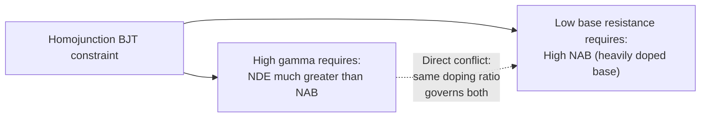
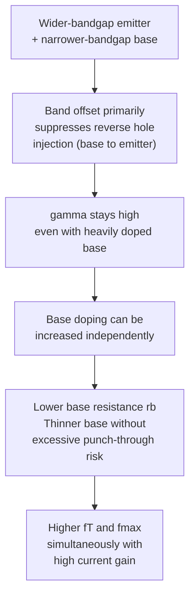

## Heterojunction Bipolar Transistors

### Overview

The Heterojunction Bipolar Transistor (HBT) is a bipolar junction transistor variant in which the emitter and base regions are formed from two different semiconductor materials with different bandgaps, rather than the single homogeneous material (e.g., silicon throughout) used in a conventional homojunction BJT. By using a wider-bandgap material for the emitter and a narrower-bandgap material for the base, the HBT decouples emitter injection efficiency from the doping ratio constraint that governs conventional BJTs, enabling simultaneously higher base doping (for lower base resistance and higher speed) and higher current gain than would otherwise be achievable. This bandgap engineering approach has made HBTs the dominant technology for high-frequency, high-power RF applications, including cellular power amplifiers and high-speed optical/wireless communication circuits.

### Motivation: The Homojunction Trade-off

In a conventional homojunction BJT, emitter injection efficiency $\gamma$ is governed by the doping ratio between emitter and base:

$$\gamma = \frac{1}{1+\dfrac{D_{pE}N_{A,B}W_B}{D_{nB}N_{D,E}W_E}}$$

Achieving high $\gamma$ (and thus high $\beta$) requires making the emitter doping $N_{D,E}$ much greater than the base doping $N_{A,B}$. This constraint directly conflicts with a separate, high-frequency-motivated design goal: increasing base doping to reduce base resistance $r_b$ (important for both noise performance and maximum oscillation frequency $f_{max}$) and to allow further base thinning without excessive punch-through risk. In a conventional silicon BJT, these two goals compete directly, since both depend on the *same* doping ratio.

### The Heterojunction Solution: Bandgap Engineering

The HBT resolves this conflict by using a wider-bandgap emitter material (e.g., AlGaAs, or SiGe with a graded/narrower-bandgap base while the emitter remains silicon in Si/SiGe HBTs) grown or deposited on a narrower-bandgap base material. The bandgap discontinuity at the emitter-base heterojunction primarily manifests as a **valence band offset** $\Delta E_v$ (for an emitter with a wider bandgap positioned mostly by raising the conduction band, common in III-V systems) or, in the Si/SiGe case, a bandgap reduction concentrated at the base, which similarly creates an effective barrier asymmetry between electron and hole injection.

This band offset introduces an additional exponential suppression factor specifically on the **reverse hole injection current** (from base into emitter) — the "wasted" component of emitter current that limits $\gamma$ in homojunction devices — while leaving the desired **forward electron injection current** (emitter into base) comparatively unaffected. The emitter injection efficiency for an HBT becomes approximately:

$$\gamma_{HBT} \approx \frac{1}{1+\dfrac{D_{pE}N_{A,B}W_B}{D_{nB}N_{D,E}W_E}\exp\left(-\dfrac{\Delta E_g}{kT}\right)}$$

where $\Delta E_g$ is the effective bandgap difference between emitter and base materials. Because this exponential term can be made extremely small even for modest $\Delta E_g$ values (a few tenths of an eV is often sufficient, given the exponential dependence), $\gamma_{HBT}$ can remain close to unity **even when the base is doped more heavily than the emitter** — a doping configuration that would produce very poor injection efficiency (and thus very low gain) in a conventional homojunction device.

**Key Points**

- The essential innovation of the HBT is **decoupling** two design goals that are coupled by a single doping ratio in the homojunction BJT: emitter injection efficiency (traditionally requiring heavy emitter doping) and base resistance/thinness (traditionally requiring heavy base doping) can now both be optimized largely independently.
- This decoupling allows HBTs to simultaneously achieve high current gain, low base resistance, and thin base regions — a combination not achievable in conventional homojunction silicon BJTs — translating directly into superior high-frequency and high-power performance metrics ($f_T$, $f_{max}$, and linearity).

### Major HBT Material Systems

**GaAs/AlGaAs and InGaP/GaAs HBTs**

Among the earliest and most widely commercialized HBT systems, using a wider-bandgap AlGaAs or InGaP emitter grown on a GaAs base. These are extensively used in RF power amplifiers for cellular handsets and other wireless applications, prized for high breakdown voltage, high power density, and good linearity characteristics. InGaP/GaAs HBTs in particular gained favor over AlGaAs/GaAs variants due to improved reliability (reduced sensitivity to certain surface-related degradation mechanisms associated with aluminum-containing layers) and better interface characteristics.

**InP-based HBTs (InP/InGaAs)**

Using an InP emitter on an InGaAs base, these devices are capable of extremely high $f_T$ and $f_{max}$ values (historically among the highest reported for any transistor technology, into the hundreds of GHz to sub-THz range in advanced research devices), owing to favorable material transport properties (very high electron mobility and saturation velocity in InGaAs) combined with the heterojunction bandgap engineering benefit. These are used in ultra-high-speed optical communication circuits, high-frequency instrumentation, and millimeter-wave/THz research applications. [Unverified: specific record $f_T$/$f_{max}$ figures evolve continually with ongoing research and vary by publication; general statement of InP HBTs achieving among the highest reported speeds is well established in the device physics literature.]

**Si/SiGe HBTs**

A particularly commercially significant variant in which a graded SiGe (silicon-germanium) alloy is used for the base, grown epitaxially on a conventional silicon emitter and collector, integrated within otherwise standard silicon CMOS-compatible process flows (commonly termed **BiCMOS** technology). Germanium content is typically graded across the base (higher Ge fraction toward the collector side), which not only provides the bandgap engineering injection efficiency benefit but also introduces a **built-in accelerating electric field** in the base (due to the position-dependent bandgap narrowing), which assists minority carrier transport via a drift component in addition to diffusion — further reducing base transit time and boosting $f_T$ beyond what pure diffusion-based transport would allow.

$$E_{built-in}(x) \approx \frac{1}{q}\frac{d(\Delta E_g(x))}{dx}$$

This graded-base drift-field mechanism is a distinguishing additional benefit specific to SiGe HBTs (and other graded-bandgap HBT designs) beyond the basic injection-efficiency decoupling shared by all HBT variants.

**Key Points**

- Si/SiGe HBTs are especially significant industrially because they can be fabricated using process modules largely compatible with mainstream silicon CMOS fabrication, enabling BiCMOS technology that integrates high-performance SiGe HBTs alongside standard CMOS logic on the same die — combining RF/analog performance with digital integration density and cost advantages.
- III-V HBTs (GaAs- and InP-based) generally offer higher absolute speed and power-handling capability than Si/SiGe HBTs but at higher cost and without the same direct CMOS process integration, making material choice a application-driven trade-off between raw performance, integration, and cost.

### Impact on Frequency Response ($f_T$, $f_{max}$)

Because the base transit time $\tau_B$ (as established in frequency response analysis) is a dominant delay component, and because HBTs enable much thinner, more heavily doped bases than homojunction devices (without sacrificing injection efficiency), HBTs generally achieve substantially higher $f_T$ than comparable homojunction BJTs at similar current gain. Additionally, the reduced base resistance $r_b$ enabled by heavier base doping directly improves $f_{max}$, given its dependence $f_{max} \propto \sqrt{f_T/r_b}$ established in the frequency response relation. This combination of simultaneously improved $f_T$ and $f_{max}$ — rather than a trade-off between them — is a defining performance advantage of the HBT architecture over conventional homojunction bipolar devices.

**Key Points**

- SiGe HBTs in advanced BiCMOS processes have demonstrated $f_T$ and $f_{max}$ values exceeding 300 GHz in research and advanced production devices, competitive with or exceeding many III-V technologies while retaining silicon-process cost and integration advantages. [Unverified: specific frequency figures are technology-generation- and vendor-specific, and continue to advance with process development; cited as representative of the general performance class rather than a fixed benchmark.]
- The graded-base drift field in SiGe HBTs is particularly beneficial precisely because it directly reduces the diffusion-dominated base transit time $\tau_B$, which frequency response analysis identifies as typically the dominant delay term in thin-base modern bipolar devices.

### Illustration: Band Diagram Comparison (svg_diagram)

<svg xmlns="http://www.w3.org/2000/svg" viewBox="0 0 700 380" font-family="Helvetica, Arial, sans-serif">
<text x="350" y="24" text-anchor="middle" font-size="16" font-weight="bold" fill="#1a1a1a">Homojunction vs Heterojunction Band Diagram (svg_diagram)</text>

<text x="170" y="55" text-anchor="middle" font-size="13" fill="#333" font-weight="bold">Homojunction BJT</text>

<line x1="60" y1="200" x2="280" y2="200" stroke="#888" stroke-width="1" stroke-dasharray="2,3" />

<path d="M 60 120 L 150 120 L 150 160 L 280 160" stroke="`#c0392b`" stroke-width="2.5" fill="none" />

<text x="60" y="110" font-size="10" fill="`#c0392b`">Ec</text>

<path d="M 60 260 L 150 260 L 150 240 L 280 240" stroke="`#1f4a8a`" stroke-width="2.5" fill="none" />

<text x="60" y="278" font-size="10" fill="`#1f4a8a`">Ev</text>

<text x="90" y="290" font-size="10" fill="#333">Emitter</text>

<text x="200" y="290" font-size="10" fill="#333">Base</text>

<text x="150" y="310" text-anchor="middle" font-size="9" fill="`#8a1f1f`">Same bandgap both sides</text>

<text x="520" y="55" text-anchor="middle" font-size="13" fill="#333" font-weight="bold">Heterojunction HBT</text>

<line x1="400" y1="200" x2="640" y2="200" stroke="#888" stroke-width="1" stroke-dasharray="2,3" />

<path d="M 400 100 L 490 100 L 490 160 L 640 160" stroke="`#c0392b`" stroke-width="2.5" fill="none" />

<text x="400" y="90" font-size="10" fill="`#c0392b`">Ec</text>

<path d="M 400 260 L 490 260 L 490 220 L 640 220" stroke="`#1f4a8a`" stroke-width="2.5" fill="none" />

<text x="400" y="278" font-size="10" fill="`#1f4a8a`">Ev</text>

<text x="430" y="290" font-size="10" fill="#333">Wide-gap Emitter</text>

<text x="560" y="290" font-size="10" fill="#333">Narrow-gap Base</text>

<line x1="490" y1="160" x2="490" y2="220" stroke="#2e6b2e" stroke-width="2" />
<text x="500" y="195" font-size="10" fill="#2e6b2e">Delta Ev</text>
<text x="520" y="325" text-anchor="middle" font-size="9" fill="#2e6b2e">Suppresses hole back-injection</text>
</svg>

### Design and Fabrication Considerations

- **Strain and critical thickness**: In SiGe and other lattice-mismatched heterojunction systems, the base layer is typically grown as a strained (pseudomorphic) film below its critical thickness to avoid generating misfit dislocations, which would otherwise degrade minority carrier lifetime and device reliability; this places practical limits on achievable Ge content and base thickness combinations.
- **Conduction band spike/notch**: Depending on the specific band alignment type at the heterojunction, a conduction band discontinuity can create a potential spike or notch at the emitter-base junction that can impede electron injection if not properly graded; compositionally graded heterojunctions (rather than abrupt) are commonly used to smooth this transition and avoid parasitic injection barriers.
- **Emitter-base grading and turn-on voltage**: The heterojunction band structure affects the effective turn-on voltage and can introduce a distinct offset voltage in the $I$-$V$ characteristics compared to homojunction devices, relevant to circuit-level biasing design considerations.
- **Thermal and reliability considerations**: III-V HBTs used in power amplifier applications require careful thermal design due to high power density operation; self-heating effects and associated thermal runaway/current collapse phenomena are active areas of reliability engineering distinct from silicon HBT/BiCMOS thermal considerations. [Inference: specific reliability mechanisms and mitigation techniques are technology- and vendor-specific and continue to be refined with process maturity.]

**Related Topics**

- SiGe BiCMOS process integration and graded-base drift-field design
- Emitter injection efficiency and the homojunction doping-ratio constraint
- Base transit time and $f_T$/$f_{max}$ optimization
- III-V compound semiconductor epitaxy (MBE/MOCVD growth)
- Strained-layer epitaxy and critical thickness limits
- RF power amplifier design using GaAs/InGaP HBTs
- Band alignment types (straddling, staggered, broken-gap) in heterojunctions
- Millimeter-wave and THz transistor technology (InP HBTs, HEMTs)