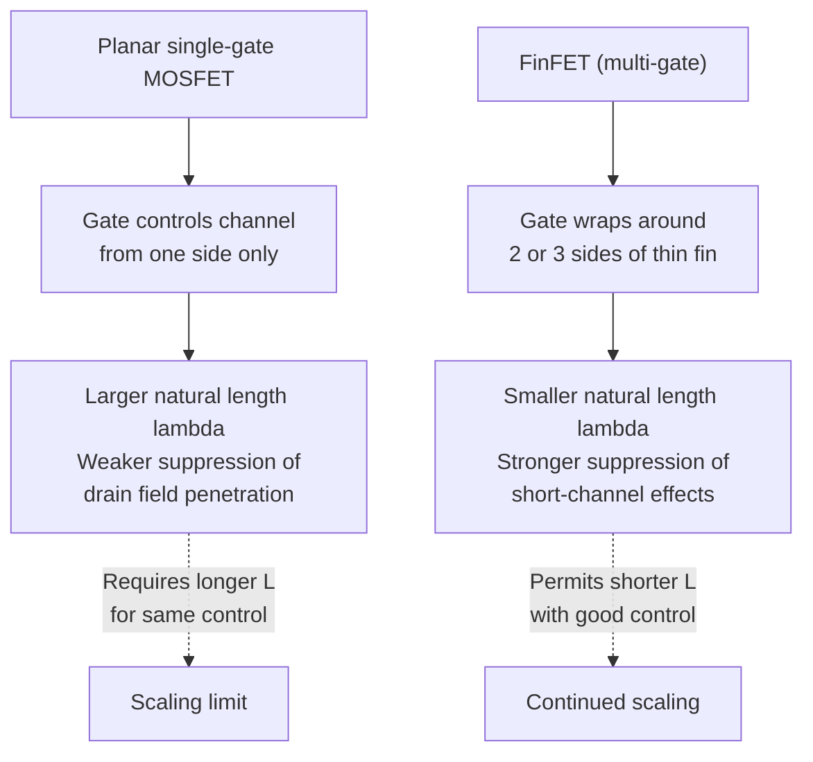
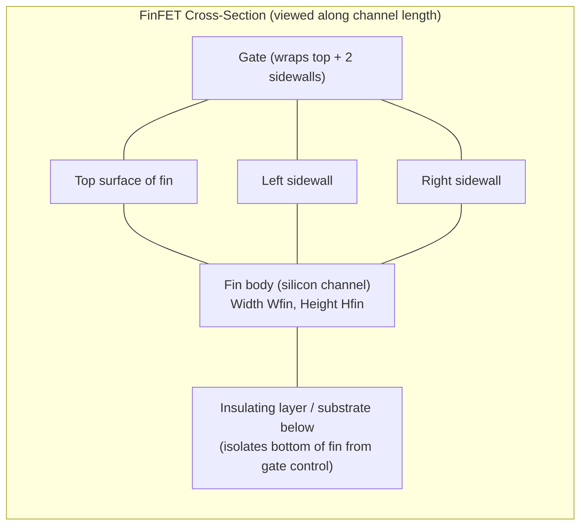

## FinFET Structure and Multi-Gate Control

### Overview

The FinFET (Fin Field-Effect Transistor) is a non-planar, three-dimensional transistor architecture in which the channel is formed as a thin, vertical silicon "fin" protruding from the substrate, with the gate wrapped around multiple sides of this fin rather than lying flat above a single planar channel surface. This multi-gate configuration dramatically improves electrostatic control of the channel by the gate relative to conventional planar (bulk) MOSFETs, directly suppressing the short-channel effects (threshold voltage roll-off, DIBL, subthreshold leakage) that become increasingly severe as channel length scales into the deep sub-100 nm regime. FinFETs became the dominant production transistor architecture for logic technology starting at the 22 nm node (Intel, 2011) and remained the industry-standard architecture through subsequent generations before the more recent transition toward Gate-All-Around (GAA) nanosheet devices.

### Motivation: The Limits of Planar Electrostatic Control

In a conventional planar (single-gate, bulk) MOSFET, the gate controls the channel from only one side (the top surface), while the bottom and lateral boundaries of the channel region are controlled by the substrate doping and the source/drain junctions themselves. As channel length shrinks, this single-sided control becomes progressively less effective at suppressing the two-dimensional field penetration from the source and drain (the physical origin of charge-sharing-driven threshold voltage roll-off and DIBL), since the gate simply does not have direct electrostatic authority over the full depth of the channel region.

The natural solution — established broadly in short-channel MOSFET electrostatics theory — is to increase the gate's degree of control by wrapping it around more sides of the channel, thereby screening the channel more effectively from source/drain field penetration. This principle can be quantified via the **natural length** (or scale length) parameter $\lambda$, which characterizes how effectively the gate suppresses drain-induced potential penetration into the channel:

$$\lambda = \sqrt{\frac{\epsilon_{Si}}{\epsilon_{ox}}\cdot t_{Si}\cdot t_{ox}} \quad \text{(single-gate approximation)}$$

For adequate short-channel control, the channel length must generally satisfy $L \gtrsim (5\text{–}6)\lambda$; smaller $\lambda$ (achieved via a thinner silicon body $t_{Si}$ and/or thinner effective oxide) permits shorter channel lengths while maintaining acceptable short-channel behavior. Multi-gate architectures reduce $\lambda$ further (for a given body thickness) than a single-gate structure can achieve, because additional gate surfaces provide additional field-line termination paths that more effectively screen the channel interior from drain-side potential.

### Physical Structure

A FinFET is constructed around a thin, vertical fin of silicon (or silicon-on-insulator, depending on process variant) etched from the substrate, with the following key structural elements:

- **Fin**: The vertical silicon body forming the transistor channel, characterized by its height ($H_{fin}$) and width ($W_{fin}$, sometimes called the fin thickness $t_{Si}$). The fin width is typically the most critical dimension for electrostatic control, since it directly determines the natural length $\lambda$.
- **Gate**: Deposited conformally over the fin, wrapping around the top and both sidewalls (in the standard tri-gate/FinFET configuration), separated from the silicon by the gate dielectric (typically a high-$\kappa$/metal-gate stack in modern nodes, following the same tunneling-suppression motivation as planar high-$\kappa$ adoption).
- **Source/Drain**: Formed at either end of the fin, often with raised, epitaxially grown source/drain regions (commonly SiGe for PMOS or Si:C/SiP for NMOS in strained-silicon process integration) to reduce parasitic series resistance and, in the PMOS case, introduce beneficial channel strain.
- **Effective Channel Width**: Because the channel now wraps around the fin's perimeter rather than lying flat, effective device width is a function of fin geometry rather than a simple lithographically defined planar dimension:

$$W_{eff} \approx 2H_{fin}+W_{fin} \quad \text{(tri-gate approximation, ignoring corner effects)}$$

Multiple fins can be placed in parallel and connected by a shared gate and source/drain contacts to achieve a desired total effective device width, a technique commonly referred to as "fin multiplication" or using multiple "fin fingers" — since $W_{eff}$ per fin is fixed by process-defined fin geometry rather than being a freely adjustable design parameter as in planar technology.

**Key Points**

- The fin is typically **undoped or very lightly doped**, in contrast to the moderately doped channel region of a conventional planar bulk MOSFET; because the thin fin body is nearly fully depleted under gate bias, threshold voltage is set primarily by gate work function engineering (via metal gate selection) rather than by channel doping and body effect, reducing sensitivity to random dopant fluctuation — an important variability advantage at advanced nodes.
- Fin height $H_{fin}$ is generally a fixed, technology-defined parameter (not adjustable per-transistor in most standard-cell design flows), meaning device width is quantized in discrete increments corresponding to the number of parallel fins used, a design constraint distinct from the continuously adjustable channel width available in planar layout.

### Gate Configurations: Double-Gate, Tri-Gate, and Beyond

Multi-gate FinFET-family devices are further classified by exactly how many fin surfaces the gate controls:

**Double-Gate FinFET**: The gate controls only the two vertical sidewalls of the fin, with the top surface intentionally covered by an insulating hard mask (preventing gate control from the top). This configuration provides symmetric control from both sides and was among the earliest FinFET concepts studied academically.

**Tri-Gate FinFET**: The gate controls three surfaces — both sidewalls and the top surface of the fin — without a top hard mask. This is the configuration most widely adopted in mainstream commercial production (e.g., Intel's original 22 nm "Tri-Gate" technology terminology), since it provides additional gate control from the top surface at little additional process complexity, further improving electrostatic control beyond the double-gate case.

**Key Points**

- The specific choice between double-gate and tri-gate configurations affects the precise natural-length scaling formula and the relative contribution of top-surface versus sidewall conduction to total drive current, but both share the same fundamental multi-gate electrostatic advantage over single-gate planar devices.
- "FinFET" and "Tri-Gate" are often used interchangeably in industry terminology for the mainstream commercial device, though "Tri-Gate" more precisely specifies the three-surface gate control configuration as opposed to the double-gate variant.

### Bulk FinFET vs. SOI FinFET

FinFETs can be fabricated on either a conventional bulk silicon substrate or a silicon-on-insulator (SOI) substrate, with different implications for the bottom boundary of the fin:

- **Bulk FinFET**: The fin is etched directly from the bulk silicon substrate, with the bottom of the fin remaining electrically connected to (and controllable by) the underlying substrate. This requires careful **punch-through stopper** doping beneath the fin (a localized implant) to prevent unwanted subsurface leakage paths beneath the gate-controlled fin region, since the gate does not electrostatically control the very bottom of the fin in a bulk configuration.
- **SOI FinFET**: The fin sits atop a buried oxide (BOX) insulating layer, electrically isolating the bottom of the fin from the substrate entirely. This can provide improved electrostatic isolation and eliminate the need for punch-through stopper implants, at the cost of the additional process complexity and expense of SOI substrate material compared to bulk silicon wafers.

**Key Points**

- Bulk FinFET has been the more widely adopted commercial choice (e.g., in mainstream foundry logic processes) due to lower substrate cost and compatibility with existing bulk-wafer supply chains and equipment, despite the additional punch-through stopper implant complexity required.
- SOI-based FinFET and related fully-depleted SOI (FD-SOI) technologies remain used in specific application niches (e.g., certain low-power, RF, or radiation-hardened applications) where the electrical isolation and reduced parasitic capacitance benefits of the buried oxide layer are particularly valuable.

### Illustration: FinFET 3D Structure (svg_diagram)

<svg xmlns="http://www.w3.org/2000/svg" viewBox="0 0 700 420" font-family="Helvetica, Arial, sans-serif">
<text x="350" y="24" text-anchor="middle" font-size="16" font-weight="bold" fill="#1a1a1a">FinFET Structure - Simplified 3D View (svg_diagram)</text>

<polygon points="80,340 620,340 560,380 20,380" fill="#d9c9a3" stroke="#5c4a2a" stroke-width="1.5" />
<text x="300" y="365" text-anchor="middle" font-size="11" fill="#3a2f1a">Substrate</text>

<polygon points="280,340 320,340 340,150 260,150" fill="#7fb3d9" stroke="#2c6e91" stroke-width="1.5" />
<text x="230" y="200" font-size="10" fill="#0d3350">Fin (channel)</text>
<line x1="260" y1="150" x2="340" y2="150" stroke="#2c6e91" stroke-width="1.5" />

<polygon points="220,300 380,300 400,110 200,110" fill="#b0b0b0" opacity="0.55" stroke="#4a4a4a" stroke-width="2" />
<text x="440" y="140" font-size="11" fill="#333">Gate (wraps top + both sidewalls)</text>

<polygon points="240,340 320,340 330,240 250,240" fill="#7ec8e3" opacity="0.85" stroke="#1a6e91" stroke-width="1.5" />
<text x="150" y="300" font-size="10" fill="#1a6e91">Source</text>

<text x="500" y="330" font-size="11" fill="#333">Wfin (fin width)</text>

<line x1="480" y1="335" x2="500" y2="335" stroke="#333" stroke-width="1" />

<text x="150" y="180" font-size="11" fill="#333">Hfin (fin height)</text>

<path d="M 200 200 Q 240 190 260 200" stroke="#c0392b" stroke-width="1.5" stroke-dasharray="3,3" fill="none" marker-end="url(#fA)" />
<path d="M 400 200 Q 360 190 340 200" stroke="#c0392b" stroke-width="1.5" stroke-dasharray="3,3" fill="none" marker-end="url(#fA)" />
<path d="M 300 130 L 300 155" stroke="#c0392b" stroke-width="1.5" stroke-dasharray="3,3" marker-end="url(#fA)" />
<text x="500" y="200" font-size="10" fill="#c0392b">Gate field control from 3 sides</text>
</svg>

### Electrostatic and Performance Benefits

**Suppressed Short-Channel Effects**: The reduced natural length $\lambda$ directly translates into reduced threshold voltage roll-off and reduced DIBL coefficient $\eta$, allowing continued channel length scaling at technology nodes where planar bulk devices would suffer unacceptable short-channel degradation.

**Improved Subthreshold Slope**: The near-ideal electrostatic control achievable with thin, lightly doped, multi-gate-controlled fin bodies allows subthreshold slope to approach the fundamental thermal limit (~60 mV/decade at room temperature) much more closely than typical planar bulk devices at comparable gate lengths, directly reducing off-state leakage for a given on-state drive current target.

**Reduced Random Dopant Fluctuation (RDF) Variability**: Because the fin is lightly doped (threshold voltage set primarily by metal gate work function rather than channel doping), FinFETs exhibit significantly reduced $V_{th}$ variation due to statistical dopant placement fluctuations compared to heavily doped planar bulk channels — an important advantage for both analog matching and digital circuit yield at scaled dimensions.

**Increased Effective Drive Current Density (per footprint)**: While per-fin drive current is limited by the fin's cross-sectional geometry, the ability to stack multiple fins in parallel within a compact footprint, combined with improved short-channel control permitting more aggressive gate length scaling, allows FinFET technology to achieve favorable overall drive-current-per-area figures relative to the planar bulk technology it replaced.

**Key Points**

- The transition to FinFET was driven primarily by the exhaustion of planar bulk scaling options once channel lengths reached a regime where even aggressive halo implants, ultra-shallow junctions, and high-$\kappa$/metal-gate stacks (individually or combined) could no longer adequately suppress short-channel effects at required power and performance targets.
- FinFET adoption did not eliminate the need for high-$\kappa$/metal-gate dielectric stacks (as established in gate leakage and tunneling discussion) — both technologies (multi-gate geometry and high-$\kappa$/metal-gate) address distinct aspects of device scaling (lateral electrostatic control vs. vertical gate dielectric tunneling/capacitance) and are used together in modern FinFET production processes.

### Design and Layout Implications

- **Discrete width quantization**: As noted above, device width is set in integer multiples of the fixed per-fin effective width, rather than being continuously adjustable — this changes standard-cell library design methodology compared to planar technology, where cell drive strength was tuned via continuous channel width selection.
- **Fin pitch and patterning**: Fins are typically patterned using advanced multi-patterning lithography techniques (e.g., self-aligned double or quadruple patterning) to achieve fin pitches below what single-exposure lithography could directly resolve, adding process complexity relative to planar gate patterning.
- **Parasitic capacitance considerations**: The three-dimensional gate wrap-around structure introduces additional parasitic gate-to-source/drain fringing capacitance components not present (or present to a lesser degree) in planar devices, requiring careful layout and process co-optimization to manage AC performance impact.
- **Self-heating**: Because the fin is a thin, three-dimensionally isolated silicon structure (particularly pronounced in SOI variants, but relevant in bulk FinFETs as well) with comparatively poor thermal conduction paths compared to a planar device's broader contact with the bulk substrate, self-heating effects are generally more pronounced in FinFETs than in planar bulk devices, requiring thermal-aware design and reliability consideration. [Inference: the quantitative magnitude of self-heating impact is process- and application-specific and is an active area of ongoing device reliability characterization.]

**Related Topics**

- Natural length (scale length) theory and multi-gate electrostatics
- Threshold voltage roll-off and DIBL in multi-gate devices
- Gate-All-Around (GAA) nanosheet transistors as FinFET successor
- High-$\kappa$/metal-gate integration in non-planar architectures
- Random dopant fluctuation and $V_{th}$ variability
- Strained silicon and epitaxial source/drain engineering
- Self-aligned multi-patterning lithography for fin formation
- FinFET self-heating and thermal reliability