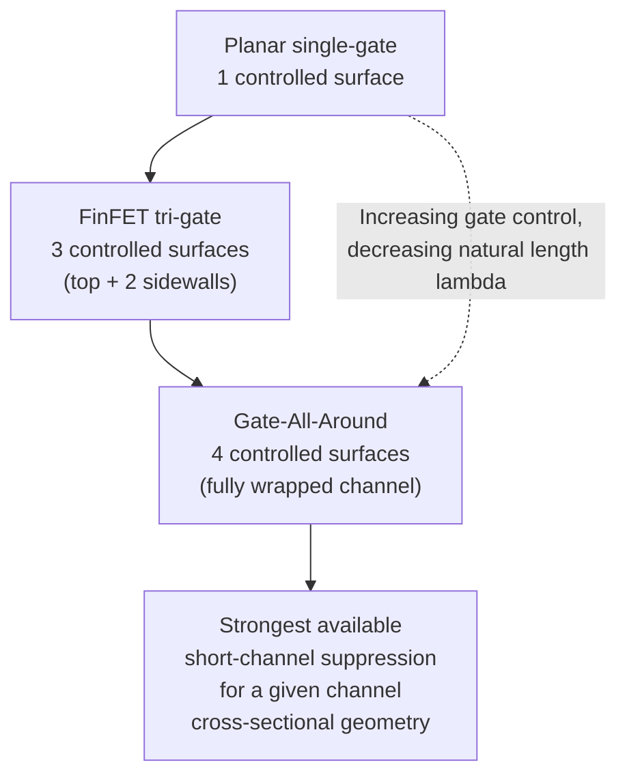
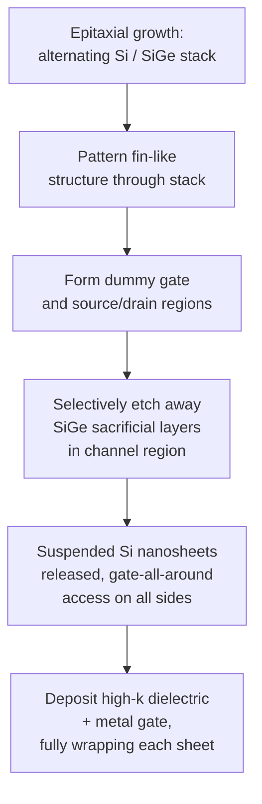

## Gate-All-Around Nanosheet Transistors

### Overview

The Gate-All-Around (GAA) nanosheet transistor represents the next evolutionary step in multi-gate device architecture beyond the FinFET, in which the gate electrode fully surrounds the channel on all four sides rather than the three sides accessible in a tri-gate FinFET. In the nanosheet implementation, the channel consists of one or more thin, horizontally stacked silicon sheets, each fully encircled by gate material, providing the strongest achievable electrostatic control of any planar-compatible transistor architecture to date. GAA nanosheet technology entered volume production starting around the 3 nm-class node generation (e.g., Samsung's early adoption, followed by other foundries at subsequent nodes), succeeding FinFET as the primary logic transistor architecture for continued scaling.

### Motivation: Completing the Multi-Gate Progression

As established in FinFET electrostatics, gate control effectiveness (quantified by the natural length $\lambda$) improves as the gate wraps around more of the channel's cross-sectional perimeter. The FinFET's tri-gate configuration leaves one surface — the bottom of the fin, where it meets the substrate or isolation — outside direct gate control. The GAA architecture completes this progression by wrapping the gate around the **entire** channel perimeter, eliminating this last uncontrolled surface entirely.

This full-perimeter control further reduces the natural length $\lambda$ for a given channel cross-sectional dimension compared to a tri-gate FinFET of similar width, allowing either continued gate-length scaling at equivalent short-channel-effect immunity, or improved short-channel immunity at a given gate length — directly extending the electrostatic scaling roadmap beyond what FinFET geometry alone could sustain.

### Nanosheet vs. Nanowire GAA Implementations

GAA devices are broadly categorized by channel cross-sectional shape, with two principal variants having been explored industrially and academically:

- **Gate-All-Around Nanowire**: The channel is a thin, roughly cylindrical or square cross-section wire, fully surrounded by gate. Nanowire GAA offers excellent electrostatic control per unit channel cross-section but suffers from limited effective drive current per device footprint, since the small cross-sectional area limits current-carrying capacity unless many wires are stacked or bundled.
- **Gate-All-Around Nanosheet (or "Nanoslab")**: The channel is a wide, thin, horizontally oriented sheet (higher width-to-thickness aspect ratio than a nanowire), still fully wrapped by gate on all sides. The nanosheet geometry provides a substantially larger effective channel width (and thus higher drive current) per stacked layer compared to a nanowire of similar vertical footprint, while retaining full-perimeter gate wrap-around electrostatic control. This width-tunability is the primary reason nanosheet (rather than nanowire) geometry has become the industrially preferred GAA implementation.

**Key Points**

- Nanosheet width is a **continuously adjustable design parameter** (within process-defined limits), in contrast to the FinFET's discrete, fixed per-fin width — this restores a design flexibility that was lost in the transition from planar to FinFET technology, allowing standard-cell libraries to tune individual transistor drive strength more finely via nanosheet width selection rather than only via discrete fin-count multiples.
- The specific choice of nanosheet width represents a trade-off between drive current (favoring wider sheets) and electrostatic control/short-channel immunity (favoring narrower, more fully-depleted sheets) — a continuously tunable version of the same fundamental trade-off present in fin width selection for FinFET devices.

### Physical Structure and Stacked-Sheet Architecture

A GAA nanosheet transistor is fabricated by growing an alternating epitaxial stack of two different semiconductor materials (commonly alternating silicon and SiGe layers) on the substrate, then selectively removing the sacrificial material (typically the SiGe layers) in the channel region to leave a vertically stacked series of suspended silicon nanosheets. The gate stack (high-$\kappa$ dielectric and metal gate) is then deposited to fully wrap around each individually released nanosheet.

**Key Structural Elements:**

- **Channel Nanosheets**: Multiple thin silicon sheets stacked vertically (commonly 2-4 sheets in early-generation devices, though exact counts are process-generation-specific), each fully surrounded by gate material, connected in parallel to form the total device channel.
- **Inter-sheet Spacing**: The vertical gap between adjacent nanosheets must be sufficient to allow the gate stack (dielectric plus metal gate fill) to be deposited conformally around each individual sheet without voids or pinch-off, setting a practical lower bound on achievable sheet-to-sheet spacing.
- **Inner Spacers**: Dielectric spacers formed specifically at the source/drain-facing edges between the gate and the source/drain regions along each nanosheet, engineered to minimize parasitic gate-to-source/drain capacitance while maintaining adequate isolation — a structural feature specific to the nanosheet architecture's stacked geometry, more complex to fabricate than the equivalent spacer structure in a FinFET.
- **Source/Drain**: Epitaxially grown source/drain regions merge around and between the stacked nanosheets, contacting all sheets in parallel, analogous in function to FinFET source/drain regions but with a more complex three-dimensional merge geometry due to the stacked-sheet structure.

**Key Points**

- The number of stacked nanosheets functions analogously to the FinFET's fin height in determining total effective device width per unit footprint — more stacked sheets increase effective width (and drive current) within the same horizontal chip area, providing an additional scaling lever (vertical stacking) beyond simple lateral dimension shrinkage.
- Precise control of inter-sheet spacing and gate fill quality is a significant process integration challenge specific to GAA nanosheet fabrication, since incomplete or non-uniform gate metal fill between closely spaced sheets could compromise gate control uniformity across the stack.

### Illustration: Nanosheet GAA Cross-Section (svg_diagram)

<svg xmlns="http://www.w3.org/2000/svg" viewBox="0 0 700 420" font-family="Helvetica, Arial, sans-serif">
<text x="350" y="24" text-anchor="middle" font-size="16" font-weight="bold" fill="#1a1a1a">GAA Nanosheet Cross-Section (svg_diagram)</text>

<rect x="80" y="340" width="540" height="40" fill="#d9c9a3" stroke="#5c4a2a" stroke-width="1.5" />
<text x="350" y="365" text-anchor="middle" font-size="11" fill="#3a2f1a">Substrate</text>

<rect x="220" y="100" width="260" height="220" fill="#b0b0b0" opacity="0.35" stroke="#4a4a4a" stroke-width="2" />
<text x="350" y="90" text-anchor="middle" font-size="12" fill="#333">Gate (wraps all sheets fully)</text>

<rect x="250" y="140" width="200" height="18" fill="#7fb3d9" stroke="#2c6e91" stroke-width="1.5" rx="4" />
<rect x="240" y="130" width="220" height="38" fill="none" stroke="#8e44ad" stroke-width="2" stroke-dasharray="4,3" rx="8" />
<rect x="250" y="190" width="200" height="18" fill="#7fb3d9" stroke="#2c6e91" stroke-width="1.5" rx="4" />
<rect x="240" y="180" width="220" height="38" fill="none" stroke="#8e44ad" stroke-width="2" stroke-dasharray="4,3" rx="8" />
<rect x="250" y="240" width="200" height="18" fill="#7fb3d9" stroke="#2c6e91" stroke-width="1.5" rx="4" />
<rect x="240" y="230" width="220" height="38" fill="none" stroke="#8e44ad" stroke-width="2" stroke-dasharray="4,3" rx="8" />

<text x="500" y="150" font-size="10" fill="`#2c6e91`">Nanosheet 1</text>

<text x="500" y="200" font-size="10" fill="`#2c6e91`">Nanosheet 2</text>

<text x="500" y="250" font-size="10" fill="`#2c6e91`">Nanosheet 3</text>

<text x="500" y="140" font-size="9" fill="`#8e44ad`">Gate fully wraps</text>

<text x="500" y="128" font-size="9" fill="`#8e44ad`">each sheet</text>

<ellipse cx="180" cy="220" rx="45" ry="100" fill="#7ec8e3" opacity="0.85" stroke="#1a6e91" stroke-width="1.5" />
<text x="180" y="340" text-anchor="middle" font-size="10" fill="#1a6e91">Source</text>
<ellipse cx="520" cy="220" rx="45" ry="100" fill="#7ec8e3" opacity="0.85" stroke="#1a6e91" stroke-width="1.5" />
<text x="520" y="340" text-anchor="middle" font-size="10" fill="#1a6e91">Drain</text>
</svg>

### Electrostatic and Performance Characteristics

**Superior Short-Channel Control**: With the smallest achievable natural length $\lambda$ for a given channel cross-sectional dimension among current planar-compatible architectures, GAA nanosheets provide the strongest available suppression of DIBL and threshold voltage roll-off, enabling continued effective gate length scaling in a regime where even FinFET geometry would begin to show degraded short-channel immunity.

**Near-Ideal Subthreshold Slope**: The full-perimeter gate wrap allows subthreshold slope performance very close to the fundamental thermal limit even at aggressively scaled gate lengths, supporting continued reduction of off-state leakage at a given performance target — a direct continuation of the trend established by the FinField's improvement over planar bulk devices.

**Independent Width Tunability**: As emphasized above, the continuously adjustable nanosheet width (rather than FinFET's discrete fin-count quantization) restores finer-grained device sizing flexibility, which can benefit both digital standard-cell optimization (matching drive strength more precisely to timing requirements) and analog/mixed-signal design (finer transconductance and matching control).

**Key Points**

- GAA nanosheet technology does not eliminate the continued need for high-$\kappa$/metal-gate dielectric stacks or advanced strain engineering techniques — these remain complementary technologies addressing distinct physical mechanisms (vertical tunneling/capacitance and channel mobility, respectively) alongside the lateral electrostatic control improvement that GAA geometry specifically provides.
- The improved electrostatic control of GAA nanosheets is generally understood to permit operation at somewhat lower supply voltages than equivalent-generation FinFETs for a given performance target, contributing to continued power efficiency improvement, though exact voltage/performance figures are process-generation- and vendor-specific. [Inference: precise quantitative voltage-scaling benefit versus FinFET at equivalent nodes is proprietary foundry information and not comprehensively disclosed in public literature.]

### Process Integration Challenges

- **Sacrificial Layer Selectivity**: The selective etch process that removes SiGe sacrificial layers while leaving silicon nanosheets intact requires extremely high etch selectivity and precise control to avoid damaging the thin silicon channel sheets, a significantly more demanding process step than any single etch required in FinFET fabrication.
- **Gate Fill Uniformity**: As noted above, depositing a uniform, void-free high-$\kappa$/metal-gate stack in the narrow, confined spaces between closely stacked nanosheets is substantially more challenging than gate deposition over an exposed FinFET fin, requiring advanced atomic layer deposition (ALD) techniques for conformal, uniform coverage.
- **Inner Spacer Formation**: Forming the inner spacer structures (isolating the gate from source/drain at each individual sheet edge) within the confined inter-sheet spacing requires precise, highly selective deposition and etch processes not needed in FinFET fabrication.
- **Parasitic Capacitance Management**: The increased structural complexity and additional gate-to-source/drain proximity introduced by the stacked, fully-wrapped geometry can introduce new parasitic capacitance components requiring careful process and layout co-optimization to manage AC performance impact, extending the general parasitic-management challenge already present in FinFET technology to a more complex three-dimensional structure.

**Key Points**

- The process complexity increase from FinFET to GAA nanosheet fabrication is substantial, reflected in generally higher reported process costs and longer development cycles for GAA-based technology nodes compared to equivalent-generation FinFET processes. [Unverified: specific cost figures are proprietary and vary by foundry; the general trend of increased process complexity and cost for GAA relative to FinFET is widely discussed in industry technical literature.]
- Despite this added complexity, the electrostatic scaling benefits of GAA nanosheet architecture are generally considered necessary for continued transistor scaling beyond the point where FinFET geometry can no longer adequately suppress short-channel effects at required technology node dimensions.

### Forksheet and Complementary FET (CFET): Beyond Basic GAA

Emerging architectural variants building on the GAA nanosheet foundation are under active industry research and early development for future technology generations:

- **Forksheet**: A variant in which NMOS and PMOS nanosheet stacks are separated by a dielectric wall within the same gate structure, allowing tighter N-to-P spacing than conventional GAA nanosheet layouts, improving area scaling.
- **Complementary FET (CFET)**: A more aggressive architecture in which NMOS and PMOS nanosheet stacks are vertically stacked directly on top of one another (rather than side-by-side), potentially offering substantial further area scaling benefits at the cost of significantly increased process and interconnect complexity.

[Inference: as of the knowledge cutoff, forksheet and CFET architectures are in the research and early development stage across the industry rather than in high-volume production; specific production timelines and final architectural details are subject to change as development continues, so readers should verify current status against up-to-date foundry roadmap disclosures.]

**Related Topics**

- Natural length theory and multi-gate electrostatic scaling
- FinFET structure and the transition to full gate wrap-around
- High-$\kappa$/metal-gate integration in stacked-channel architectures
- Strain engineering and epitaxial source/drain design in nanosheet devices
- Forksheet and Complementary FET (CFET) emerging architectures
- Inner spacer formation and parasitic capacitance in stacked-channel devices
- Subthreshold slope and the thermal (60 mV/decade) limit
- Atomic layer deposition (ALD) for conformal gate stack formation