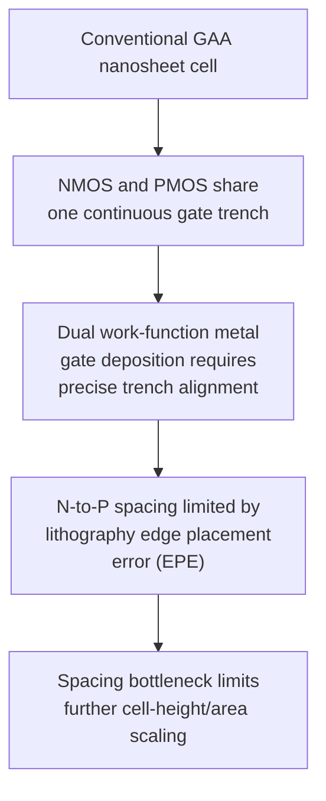
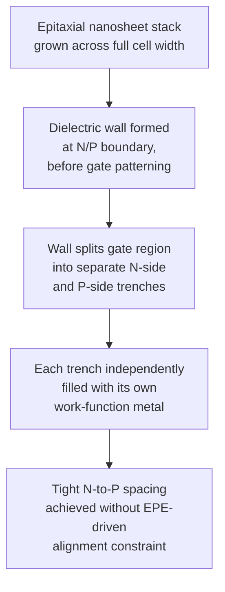
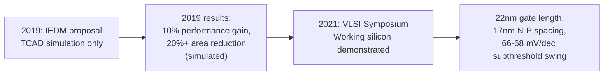

## Forksheet Device Architecture

### Overview

The forksheet transistor is a variant of the Gate-All-Around (GAA) nanosheet architecture, first proposed by imec at IEDM 2019, in which a dielectric wall is inserted between the NMOS and PMOS nanosheet stacks of a standard cell before gate patterning, physically separating the n-type and p-type gate trenches into two adjacent "fork" prongs sharing a single gate structure. The forksheet device was recently proposed by imec as a natural extension of vertically stacked lateral gate-all-around nanosheet devices, and contrary to the gate-all-around nanosheet device, in the forksheet, the nanosheets are controlled by a tri-gate forked structure realized by introducing a dielectric wall between the P- and NMOS devices before gate patterning. This architectural modification is aimed specifically at solving a spacing bottleneck that neither FinFET nor conventional GAA nanosheet technology can adequately address, positioning the forksheet as a candidate bridge technology between mainstream GAA nanosheets and more radical future architectures such as the Complementary FET (CFET). [semiconductor-digest](https://semiconductor-digest.com/?p=6232)

### Motivation: The N-to-P Spacing Bottleneck

In conventional GAA nanosheet standard cells, NMOS and PMOS devices sit in a shared, continuous gate trench, separated only by the lithographically defined gap between their respective nanosheet stacks. Because NMOS and PMOS devices require different metal gate work functions (to set appropriate threshold voltages for each device type), a single continuous gate trench containing both device types requires precise, spatially separated deposition of two different work-function metals within that trench. The minimum spacing between adjacent n-channel and p-channel devices — the width of the dielectric spine or gate cut region between them — is limited by the edge placement error (EPE) of the lithography process, and if the lithography process is misaligned, the gate structures will be formed incorrectly and the transistors will not function properly. [uspto](https://image-ppubs.uspto.gov/dirsearch-public/print/downloadPdf/12538516)

This edge-placement-error-driven minimum spacing becomes an increasingly dominant contributor to overall standard-cell height and area as other dimensions continue to scale, meaning that even if nanosheet width, gate length, and other features could shrink further, the N-to-P gap itself would eventually limit further cell-height scaling.

### The Forksheet Solution: Dielectric Wall Separation

The forksheet architecture addresses this bottleneck by physically inserting a solid dielectric wall between the NMOS and PMOS nanosheet stacks prior to gate metal deposition. This wall — commonly formed from a material such as silicon nitride — physically separates the p-gate trench from the n-gate trench. This wall physically isolates the p-gate trench from the n-gate trench, allowing a much tighter n-to-p spacing than what is possible with either FinFET or nanosheet devices. [techdesignforums](https://www.techdesignforums.com/?p=10281)[eenewseurope](https://www.eenewseurope.com/news/imec-forksheet-transistors-2nm-1nm)

Because the two gate trenches are now physically walled off from one another rather than merely separated by an open, shared trench region, the dual work-function metal deposition process no longer needs to rely on precise lithographic alignment within a single continuous trench to prevent unwanted metal intermixing between NMOS and PMOS regions — the dielectric wall itself provides that isolation mechanically, decoupling the achievable N-to-P spacing from the lithography-driven EPE limit that constrains conventional nanosheet cells.

**Key Points**

- The dielectric wall between N- and P-FET significantly reduces gate parasitic capacitance and allows an increase in the active width while maintaining a fixed cell height. [ResearchGate](https://www.researchgate.net/publication/339255467_Novel_forksheet_device_architecture_as_ultimate_logic_scaling_device_towards_2nm)
- The "fork" naming reflects the resulting cross-sectional gate geometry: a single gate structure that splits, like the tines of a fork, into two separated prongs on either side of the dielectric wall, each independently wrapping its respective nanosheet stack.

### Reported Performance and Area Benefits

Since its introduction, imec has published simulation and, subsequently, silicon-integration results quantifying the forksheet's benefits relative to conventional GAA nanosheet devices:

Compared to nanosheet devices, the reduced n-to-p spacing results in a 10 percent performance increase, and when combined with scaling boosters, the forksheet architecture can bring logic standard cell height down to 4.3 tracks, which combined with cell template optimization can result in more than 20 percent area reduction. For SRAM bit-cell layouts specifically, the forksheet can provide up to 30% scaling of the bit-cell height, since the p-n space is no longer governed by gate extension, gate cut, or dummy-fin gate-tuck design rules that constrain conventional nanosheet layouts. [semiconductor-digest](https://semiconductor-digest.com/?p=6232)[reinraum](https://www.reinraum.de/en/news/imec-presents-forksheet-device-as-the-ultimate-solution-to-push-scaling-towards-the-2nm-technology-node.html)

Simulations in 2019 showed this approach had better area and performance scaling to 2nm and 1nm than GAA devices, as a result of reduced Miller capacitance coming from a smaller gate-drain overlap. [eenewseurope](https://www.eenewseurope.com/news/imec-forksheet-transistors-2nm-1nm)

**Key Points**

- The device studied by imec targeted its 2nm technology node using a contacted gate pitch of 42nm and a 5T standard cell library with a metal pitch of 16nm, with scaling boosters including buried power rails and wrap-around contacts. [semiconductor-digest](https://semiconductor-digest.com/?p=6232)
- The reduced gate-drain overlap (and associated reduction in Miller capacitance) is a secondary benefit of the forked gate geometry beyond the primary area-scaling motivation, contributing to the reported performance improvement alongside pure density gains.

### Silicon Integration and Demonstrated Electrical Performance

Following the initial 2019 simulation-based proposal, imec demonstrated working silicon forksheet devices at the 2021 VLSI Symposium. The forksheet devices were successfully integrated using a 300mm process flow, with gate lengths down to 22nm, and both n- and pFETs, each with two stacked Si channels, were found to be fully functional. [eenewseurope](https://www.eenewseurope.com/news/imec-forksheet-transistors-2nm-1nm)

The forksheet devices demonstrated short-channel control (subthreshold swing of 66-68 mV/decade) comparable to gate-all-around nanosheet devices down to a 22nm gate length, and dual work-function metal gates were integrated at 17nm spacing between n- and pFETs, highlighting the key benefit of forksheet devices for advanced CMOS area scaling. This 17nm n-p spacing is about 35 percent of the spacing achievable in state-of-the-art FinFET technology. This was reported as the first demonstration of dual work-function metal integration at such a low spacing. [imec builds working forksheet transistors for 2nm, 1nm +2](https://www.eenewseurope.com/news/imec-forksheet-transistors-2nm-1nm)

**Key Points**

- The short-channel control of 66 to 68 mV/decade demonstrated in the forksheet devices was compared directly against vertically stacked nanosheet devices co-integrated on the same wafer, providing a controlled, direct comparison at the VLSI 2021 Symposium. [eenewseurope](https://www.eenewseurope.com/news/imec-forksheet-transistors-2nm-1nm)
- Achieving comparable short-channel electrostatic control to conventional GAA nanosheets, while simultaneously achieving much tighter N-to-P spacing, is the central technical claim distinguishing the forksheet from simply being a denser but electrostatically inferior alternative.

### Illustration: Forksheet vs. Conventional Nanosheet Cross-Section (svg_diagram)

<svg xmlns="http://www.w3.org/2000/svg" viewBox="0 0 720 400" font-family="Helvetica, Arial, sans-serif">
<text x="360" y="24" text-anchor="middle" font-size="16" font-weight="bold" fill="#1a1a1a">Forksheet vs Conventional Nanosheet Cell (svg_diagram)</text>

<text x="180" y="55" text-anchor="middle" font-size="13" fill="#333" font-weight="bold">Conventional GAA Nanosheet</text>

<rect x="60" y="280" width="240" height="30" fill="`#d9c9a3`" stroke="`#5c4a2a`" stroke-width="1" />

<text x="180" y="300" text-anchor="middle" font-size="9" fill="`#3a2f1a`">Substrate</text>

<rect x="80" y="120" width="200" height="150" fill="#b0b0b0" opacity="0.35" stroke="#4a4a4a" stroke-width="2" />
<text x="180" y="112" text-anchor="middle" font-size="10" fill="#333">Single shared gate trench</text>

<rect x="100" y="150" width="70" height="14" fill="#7fb3d9" stroke="#2c6e91" />
<rect x="100" y="180" width="70" height="14" fill="#7fb3d9" stroke="#2c6e91" />
<text x="135" y="215" text-anchor="middle" font-size="9" fill="#1f4a8a">NMOS (metal A)</text>

<rect x="190" y="150" width="70" height="14" fill="#f2a65a" stroke="#a05a1a" />
<rect x="190" y="180" width="70" height="14" fill="#f2a65a" stroke="#a05a1a" />
<text x="225" y="215" text-anchor="middle" font-size="9" fill="#a05a1a">PMOS (metal B)</text>

<line x1="170" y1="230" x2="190" y2="230" stroke="#c0392b" stroke-width="2" />
<text x="180" y="250" text-anchor="middle" font-size="8" fill="#c0392b">Gap limited by EPE</text>

<text x="540" y="55" text-anchor="middle" font-size="13" fill="#333" font-weight="bold">Forksheet</text>

<rect x="420" y="280" width="240" height="30" fill="`#d9c9a3`" stroke="`#5c4a2a`" stroke-width="1" />

<text x="540" y="300" text-anchor="middle" font-size="9" fill="`#3a2f1a`">Substrate</text>

<rect x="535" y="110" width="10" height="170" fill="#8e44ad" stroke="#5b2c6f" stroke-width="1.5" />
<text x="540" y="100" text-anchor="middle" font-size="9" fill="#5b2c6f">Dielectric wall</text>

<rect x="450" y="120" width="85" height="150" fill="#b0b0b0" opacity="0.35" stroke="#4a4a4a" stroke-width="2" />
<rect x="545" y="120" width="85" height="150" fill="#b0b0b0" opacity="0.35" stroke="#4a4a4a" stroke-width="2" />
<text x="490" y="112" text-anchor="middle" font-size="9" fill="#333">N-trench</text>
<text x="590" y="112" text-anchor="middle" font-size="9" fill="#333">P-trench</text>

<rect x="465" y="150" width="55" height="14" fill="#7fb3d9" stroke="#2c6e91" />
<rect x="465" y="180" width="55" height="14" fill="#7fb3d9" stroke="#2c6e91" />
<text x="492" y="215" text-anchor="middle" font-size="9" fill="#1f4a8a">NMOS</text>

<rect x="560" y="150" width="55" height="14" fill="#f2a65a" stroke="#a05a1a" />
<rect x="560" y="180" width="55" height="14" fill="#f2a65a" stroke="#a05a1a" />
<text x="587" y="215" text-anchor="middle" font-size="9" fill="#a05a1a">PMOS</text>

<text x="540" y="245" text-anchor="middle" font-size="8" fill="`#2e6b2e`">Tight spacing, wall-isolated (not EPE-limited)</text>

</svg>

### Structural and Process Details

The physical formation of the dielectric wall involves patterning a trench into the fin/nanosheet stack at the N-to-P boundary early in the process flow, before gate replacement, then filling it with dielectric material. The merged layers of the dielectric feature allow the nanosheet channels to attach to both sides of the dielectric feature and form forksheet transistors at a later stage, with the reduced fin-to-fin spacing and fork-like gate nanosheet transistors enabling greater device density, even with greater channel width, and superior area and performance scalability. [uspto](https://image-ppubs.uspto.gov/dirsearch-public/print/downloadPdf/11855078)

Later refinements to the basic forksheet concept address specific integration challenges:

- **Asymmetric or overhang dielectric structures**: A dielectric overhang structure that at least partially hangs over the nanoribbons of each device, directly coupled to the dielectric spine between devices, allows higher alignment tolerance when forming different work-function metals over each semiconductor device, which in turn allows narrower dielectric spines to be used. [uspto](https://image-ppubs.uspto.gov/dirsearch-public/print/downloadPdf/12538516)
- **Cell-height and dielectric-bar depth engineering**: Later patent disclosures describe forksheet structures with dielectric bars of varying height and depth between the channel region and source/drain region of adjacent devices, aimed at further optimizing cell-height scaling beyond the basic forksheet concept. In these structures, a first portion of a dielectric bar between two sets of channel nanosheets can have a different height than a second portion of the same bar between the corresponding source/drain regions, with the two dielectric bars in a cell also having different depths relative to the bottom of the channel nanosheets. [uspto](https://image-ppubs.uspto.gov/dirsearch-public/print/downloadPdf/12615841)
- **Extension beyond FET-only structures**: The forksheet concept has been extended in later disclosures beyond pure field-effect transistor pairs. Forksheet semiconductor structures incorporating bipolar junction transistors have also been disclosed, in which a dielectric body separates two BJTs (of matching or complementary polarity), or a hybrid structure separates a BJT from a FET, with both devices oriented parallel to each other and to the dielectric body between them. [uspto](https://image-ppubs.uspto.gov/dirsearch-public/print/downloadPdf/12408417)

**Key Points**

- The core forksheet innovation — a dielectric wall physically separating the N and P gate regions — is compatible with, and builds directly on top of, standard GAA nanosheet channel-release and replacement-metal-gate process flows, making it more of an incremental structural modification to nanosheet processing than an entirely new fabrication paradigm.
- Continued patent and process development activity around dielectric wall geometry (overhangs, asymmetric spines, variable-depth bars) indicates that N-to-P spacing and cell-height optimization remain active areas of ongoing engineering refinement beyond the original 2019 concept.

### Position in the Scaling Roadmap

The forksheet architecture is generally positioned as an intermediate scaling step between conventional GAA nanosheet and the more radical Complementary FET (CFET) architecture, in which NMOS and PMOS devices are stacked vertically on top of one another rather than merely placed side by side with tighter spacing. Because the forksheet retains a side-by-side (rather than vertically stacked) NMOS/PMOS arrangement, it is generally considered a less disruptive, more near-term-manufacturable evolution of nanosheet technology than CFET, while still providing a meaningful area-scaling benefit specifically targeted at the N-to-P spacing bottleneck that both FinFET and conventional nanosheet technology share.

**Key Points**

- The forksheet, GAA nanosheet, and CFET architectures are often depicted together as sequential steps in the same overall industry scaling roadmap, reflecting a progression from side-by-side device placement (nanosheet, forksheet) to full vertical device stacking (CFET) as the primary lever for continued area scaling once purely lateral dimensional shrinkage becomes insufficient. [Inference: exact production timelines and whether forksheet reaches high-volume manufacturing as a standalone node, versus being bypassed in favor of a more direct nanosheet-to-CFET transition, remain subject to individual foundry roadmap decisions not fully disclosed in public literature as of the knowledge cutoff.]

**Related Topics**

- Gate-All-Around (GAA) nanosheet transistor structure
- Complementary FET (CFET) vertical device stacking
- Dual work-function metal gate integration
- Standard-cell height scaling and track-height reduction
- Miller capacitance and gate-drain overlap effects
- Buried power rails and back-side power delivery
- Edge placement error (EPE) in advanced lithography
- SRAM bit-cell area scaling in advanced logic nodes