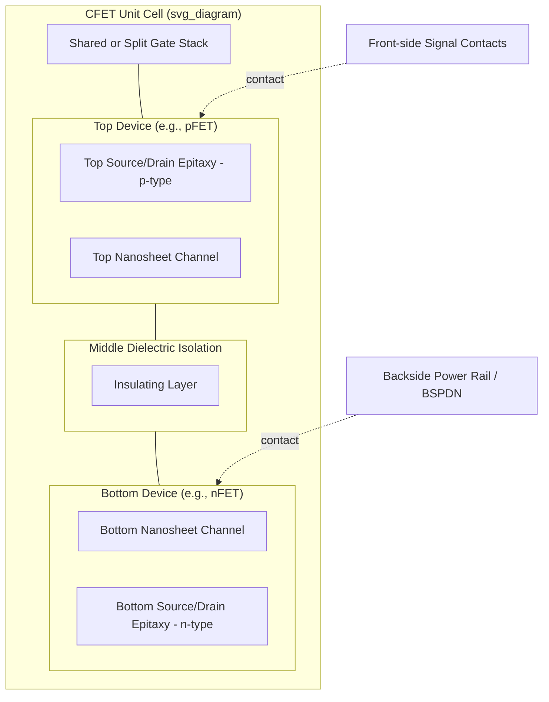

## Complementary FET Vertical Stacking

### Overview

Complementary FET (CFET) vertical stacking is a transistor architecture in which an nFET and a pFET are fabricated on top of one another within the same footprint, sharing a single gate/contact stack, rather than being placed side by side as in conventional planar or FinFET/nanosheet layouts. By stacking the n-type device directly over (or under) the p-type device, CFET aims to roughly halve the standard-cell area compared to a side-by-side nanosheet or forksheet implementation at the same technology node, since the cell height can in principle be reduced to a single device track.

CFET is widely regarded as one of the leading candidates to extend CMOS scaling beyond the point where nanosheet/gate-all-around (GAA) transistors run out of area-scaling headroom, targeted broadly at technology nodes in the sub-2nm / "A-node" era. [Inference] The precise node at which CFET becomes commercially necessary depends on cell-architecture choices made by individual foundries and is not fixed by physics alone.

### Motivation: Why Stack Complementary Devices

**Key Points**

- Conventional CMOS logic gates (e.g., an inverter) require one nFET and one pFET, laid out side by side, separated by an n-well/p-well boundary and isolation spacing.
- Standard-cell height is largely determined by the number of horizontal tracks needed to fit the pFET, the nFET, and the space between them.
- As nanosheet width scaling and track-height reduction approach physical limits (gate pitch, contact size, parasitic capacitance), further area scaling from *lateral* shrinkage becomes difficult.
- CFET converts area scaling into an area/height trade: the two devices occupy the same X-Y footprint but are separated in Z (vertical stacking), so the cell can shrink to roughly one device's width instead of two.

This mirrors the general 3D scaling philosophy in semiconductor fabrication: when lateral (2D) scaling stalls, move to the third dimension, as previously done with FinFETs (fins standing vertically) and 3D NAND memory (stacked cell layers).

### Architectural Evolution Leading to CFET

CFET is best understood as the next step after several prior transitions:

1. **Planar MOSFET** — single conduction channel at the wafer surface, gate controls one side of the channel.
2. **FinFET** — channel raised into a vertical fin; gate wraps three sides, improving electrostatic control.
3. **Nanosheet / Gate-All-Around (GAA) FET** — channel broken into multiple stacked horizontal sheets, with the gate fully surrounding each sheet (4-side control), improving short-channel effects further and allowing sheet width to be tuned for drive-current/power trade-offs.
4. **CFET** — takes the nanosheet stack concept one step further: instead of stacking multiple sheets of the *same* device type, the stack contains sheets belonging to *two different devices* (n-type and p-type), isolated from each other and each with its own independently contacted gate/source/drain.

### Two Primary Integration Schemes

#### 1. Sequential (Monolithic) CFET

**Key Points**

- The bottom device (commonly the nFET or pFET, foundry-dependent) is fully fabricated first, including its source/drain and often initial contacts.
- A dielectric isolation layer is deposited/bonded on top.
- The top device's channel material is either epitaxially regrown or transferred (e.g., via layer transfer/wafer bonding of a separately prepared channel layer), then processed with its own gate stack, source/drain, and contacts.
- Requires low thermal budget for the top-device processing steps so as not to degrade the completed bottom device (dopant diffusion, silicide/metal stability, contact resistance drift).

**Trade-offs**

- Enables independent optimization of top and bottom channel materials (e.g., different semiconductor materials for holes vs. electrons for higher mobility).
- Thermal budget constraints on the second device are the dominant integration challenge. [Inference] The specific thermal ceiling (commonly discussed informally in the few-hundred-°C range for back-end-compatible steps) is process-dependent and not a fixed industry constant.

#### 2. Self-Aligned (Monolithic, Single-Stack-Etch) CFET

**Key Points**

- Both device channels (n and p nanosheet stacks) are grown and patterned together as one continuous vertical stack early in the process, then separated later by a dielectric isolation layer inserted between them (sometimes formed via a sacrificial layer that is later replaced, similar in spirit to the replacement-metal-gate process used in FinFET/nanosheet).
- Gate, spacer, and source/drain modules are processed for the combined stack, with the middle dielectric isolation layer preventing electrical interaction between the top and bottom device gates/channels and source/drains.
- Generally considered the more manufacturable near-term path because it reuses more of the existing nanosheet process flow and avoids some of the alignment/bonding complexity of sequential integration.

**Trade-offs**

- Simpler process integration than sequential CFET.
- Less flexibility for using dissimilar channel materials for the n- and p-devices, since both are grown in the same epitaxial stack.

### Key Structural Elements

- **Shared/independent gate stacks**: The top and bottom devices can share a single continuous gate electrode (a "shared gate" or "merged gate" configuration) or have separate, independently biased gates ("split gate" / "independent gate" configuration). Independent gates give more circuit design flexibility (e.g., back-gate biasing, dynamic $V_t$ tuning) at the cost of extra process complexity and contact routing.
- **Middle dielectric isolation (MDI)**: The insulating layer separating the top and bottom device channels/source-drains, critical for preventing leakage and parasitic coupling between the n- and p-type devices.
- **Bottom and top source/drain (S/D) epitaxy**: Each device's S/D regions must be independently doped (n-type S/D for the nFET, p-type S/D for the pFET) despite close vertical proximity, requiring high selectivity in epitaxial growth and careful control of dopant diffusion between layers.
- **Vertical/buried power rail (BPR) or backside power delivery**: CFET is frequently paired with backside power delivery network (BSPDN) architectures, since routing power and signal contacts to both a top and bottom device from the front side alone becomes congested; moving power rails to the wafer backside frees front-side routing resources.
- **Separate contact vias for top/bottom S/D**: Because the two devices are stacked, contacts to the bottom device's source/drain must route past or around the top device, typically requiring deep/self-aligned via structures.

### Structural Diagram

### Cross-Sectional View (Conceptual SVG)

<svg xmlns="http://www.w3.org/2000/svg" viewBox="0 0 640 420">
<text x="320" y="24" text-anchor="middle" font-size="16" font-weight="bold" fill="#222">CFET Cross-Section — Sequential/Self-Aligned Stack (svg_diagram)</text>

<rect x="60" y="360" width="520" height="30" fill="#8a8a8a" />
<text x="320" y="380" text-anchor="middle" font-size="12" fill="#fff">Silicon Substrate</text>

<rect x="260" y="335" width="120" height="20" fill="#c98a2b" />
<text x="320" y="350" text-anchor="middle" font-size="10" fill="#fff">Backside Power Rail</text>

<rect x="220" y="295" width="200" height="14" fill="#4a90d9" />
<rect x="220" y="275" width="200" height="14" fill="#4a90d9" />
<rect x="220" y="255" width="200" height="14" fill="#4a90d9" />
<text x="440" y="285" font-size="11" fill="#222">Bottom nFET channels</text>

<rect x="160" y="250" width="55" height="65" fill="#3f7cc2" />
<rect x="425" y="250" width="55" height="65" fill="#3f7cc2" />
<text x="187" y="335" text-anchor="middle" font-size="9" fill="#222">n+ S/D</text>
<text x="452" y="335" text-anchor="middle" font-size="9" fill="#222">n+ S/D</text>

<rect x="160" y="235" width="320" height="14" fill="#dddddd" stroke="#999" />
<text x="320" y="245" text-anchor="middle" font-size="10" fill="#333">Middle Dielectric Isolation (MDI)</text>

<rect x="220" y="195" width="200" height="14" fill="#d9704a" />
<rect x="220" y="175" width="200" height="14" fill="#d9704a" />
<rect x="220" y="155" width="200" height="14" fill="#d9704a" />
<text x="440" y="185" font-size="11" fill="#222">Top pFET channels</text>

<rect x="160" y="150" width="55" height="65" fill="#c25a37" />
<rect x="425" y="150" width="55" height="65" fill="#c25a37" />
<text x="187" y="235" text-anchor="middle" font-size="9" fill="#222">p+ S/D</text>
<text x="452" y="235" text-anchor="middle" font-size="9" fill="#222">p+ S/D</text>

<rect x="200" y="130" width="240" height="195" fill="none" stroke="#2e7d32" stroke-width="4" stroke-dasharray="6,4" />
<text x="320" y="122" text-anchor="middle" font-size="12" fill="#2e7d32" font-weight="bold">Shared/Split Gate Envelope</text>

<rect x="300" y="70" width="40" height="60" fill="#666" />
<text x="320" y="65" text-anchor="middle" font-size="10" fill="#222">Front-side Gate/Signal Contact</text>
</svg>

### Electrical and Process Challenges

**Key Points**

- **Thermal budget management**: For sequential CFET, the top device must be built without degrading the bottom device's dopant profiles, silicides, or work-function metals.
- **Independent source/drain doping selectivity**: Growing n-type epitaxy on the bottom and p-type epitaxy on the top (or vice versa) in extreme proximity requires highly selective, low-defect epitaxial processes to avoid cross-contamination/auto-doping.
- **Middle dielectric isolation reliability**: The MDI layer must provide low enough capacitance and sufficient breakdown strength to prevent crosstalk and leakage between vertically adjacent devices operating at different bias conditions.
- **Contact/via complexity and aspect ratio**: Reaching the bottom device's source/drain and gate requires taller, higher-aspect-ratio vias than in a planar layout, increasing parasitic resistance and process difficulty (etch uniformity, void-free metal fill).
- **Self-heating and thermal crosstalk**: Two active devices stacked vertically in close proximity can each contribute to local Joule heating, and the thermal conductivity path through the MDI and surrounding dielectrics affects how heat from one device influences the other. [Inference] The magnitude of this coupling is process- and material-dependent and is an active area of thermal-electrical co-simulation research rather than a settled figure.
- **Design-for-manufacturing (DFM) and EDA support**: Standard-cell libraries, place-and-route tools, and parasitic extraction flows must be updated to represent 3D-stacked devices, independent/shared gate configurations, and backside power delivery — a significant tooling and methodology shift compared to 2D standard-cell design.

### Comparison with Preceding Architectures

| Architecture | Channel Control | Device Arrangement | Relative Cell Area | Key Scaling Lever |
| --- | --- | --- | --- | --- |
| Planar MOSFET | Single-side gate | Side-by-side | Largest | Gate length shrink |
| FinFET | Tri-gate (3-side) | Side-by-side | Reduced | Fin pitch/height |
| Nanosheet (GAA) | Gate-all-around (4-side) | Side-by-side | Further reduced | Sheet width/count, track height |
| CFET | Gate-all-around, independently isolated per device | Vertically stacked | Smallest (target ~1 device track) | Vertical integration, MDI thickness |

### Design and Circuit Implications

- **Standard-cell height reduction**: With n and p devices stacked, cell height can approach the width of a single device row, translating directly into higher logic density.
- **Gate configuration choice affects circuit style**: A shared gate simplifies wiring but forces the top and bottom devices to switch together (useful for standard inverters/logic gates); split/independent gates allow more flexible circuit topologies (e.g., independent threshold tuning, stacked transmission-gate structures) at the cost of extra contacts and routing tracks.
- **Backside power delivery synergy**: Because CFET already pushes contact routing to its limits, backside power rails (removing power straps from the front-side metal stack) are commonly discussed as a co-requisite technology to make CFET routing practical.
- **Library and PDK impact**: Cell libraries designed for CFET require redefinition of "track height" in terms of vertical device stacking rather than purely lateral pitch, and parasitic models must account for 3D coupling capacitances between stacked n/p regions.

### Industry and Research Status

[Unverified] Because specific foundry roadmaps, pilot-line results, and publication timelines change frequently and are often disclosed at conferences (e.g., IEDM, VLSI Symposium) rather than through static documentation, exact performance figures (drive current uplift, area scaling factor achieved, target production node) should be verified against current primary sources (foundry technology disclosures, IEDM/VLSI papers) rather than treated as fixed. In general terms, CFET is broadly discussed across major foundries and research consortia (e.g., imec) as a leading candidate for post-nanosheet scaling, with sequential and self-aligned/monolithic variants both under active development as of the mid-2020s. [Inference]

### Example: Simplified Process Flow (Self-Aligned CFET)

1. Grow alternating epitaxial stack: bottom-device channel material, sacrificial spacer layers, MDI precursor layer, top-device channel material, additional sacrificial layers.
2. Pattern and etch the combined nanosheet stack into fin-like structures.
3. Form dummy gate, spacers; recess to define source/drain cavities for both top and bottom devices.
4. Selectively and sequentially epitaxially grow bottom (e.g., n-type) and top (e.g., p-type) source/drain regions, using masking to prevent cross-doping.
5. Remove dummy gate; selectively remove sacrificial layers between channel sheets (inner spacer/release process) for both device stacks.
6. Deposit the middle dielectric isolation material into the gap between top and bottom channel regions.
7. Deposit high-k/metal gate stack conformally around all released nanosheet channels (top and bottom), forming either a shared or, using additional patterning, a split gate.
8. Form self-aligned contacts to top S/D, then deep/self-aligned vias to bottom S/D and bottom gate.
9. Integrate backside power delivery: thin the wafer from the back, form backside contacts/vias to bottom-device source/drain or power rails.
10. Complete front-side and backside interconnect (BEOL) metallization.

**Output**: A completed CFET inverter (or other logic gate) cell occupying substantially less lateral area than an equivalent side-by-side nanosheet implementation, with independently doped and contacted n- and p-type devices stacked vertically within a shared gate envelope.

### Conclusion

CFET vertical stacking represents a structural inflection point in CMOS scaling: rather than continuing to shrink lateral dimensions of side-by-side nFET/pFET pairs, it reorganizes the complementary pair into the vertical dimension, sharing footprint while separating function by height. This shift trades new fabrication challenges — thermal budget control, selective epitaxy, middle dielectric isolation reliability, high-aspect-ratio contacts — for continued logic density scaling, and it is closely linked to complementary innovations like backside power delivery and updated EDA/PDK methodologies needed to design with 3D-stacked standard cells.

**Related Topics**

- Nanosheet / Gate-All-Around (GAA) FET fundamentals
- Forksheet FET architecture
- Backside power delivery networks (BSPDN)
- Middle-of-line (MOL) and via aspect ratio scaling challenges
- Sequential 3D integration and low-thermal-budget epitaxy
- Standard-cell library design for 3D-stacked transistors
- Source/drain selective epitaxy and dopant activation techniques
- Replacement metal gate (RMG) process flow