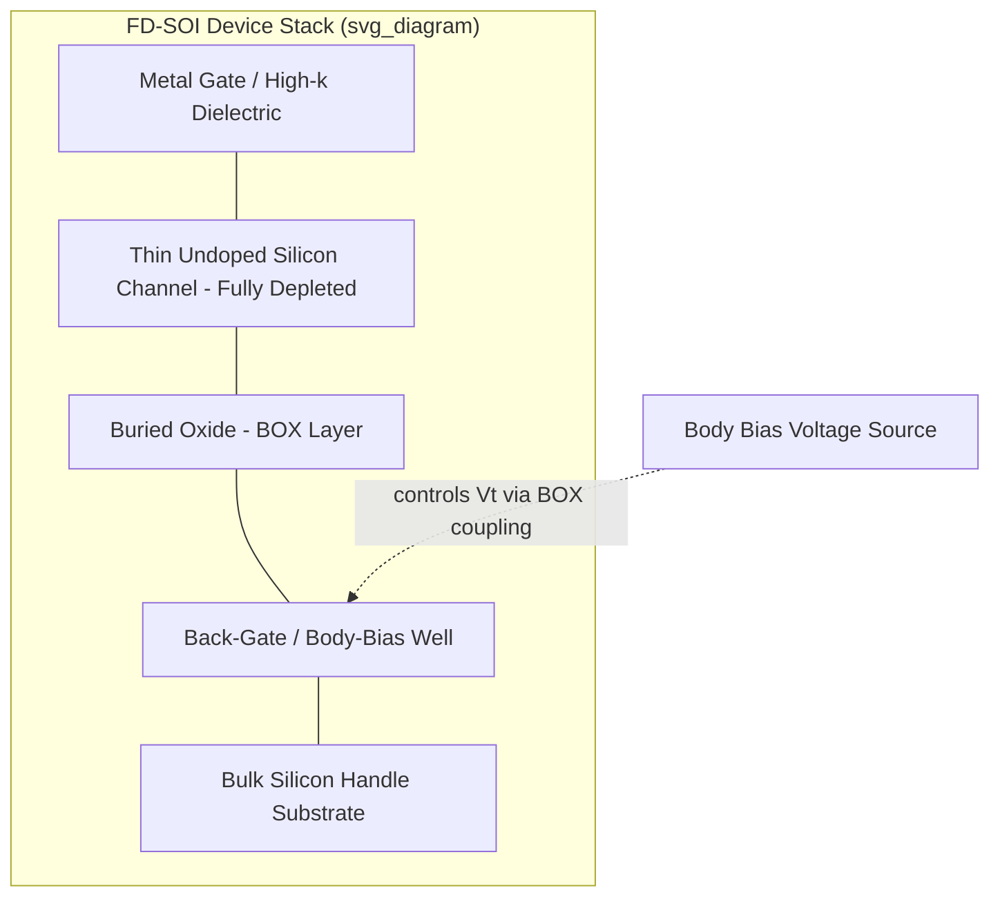

## Fully Depleted Silicon on Insulator Devices

### Overview

Fully Depleted Silicon-On-Insulator (FD-SOI) is a planar transistor architecture built on a silicon-on-insulator substrate in which the top silicon film (the device body/channel) is thin enough that it becomes fully depleted of mobile carriers under normal gate bias, rather than only partially depleted as in bulk or partially-depleted SOI (PD-SOI) devices. This thin, undoped (or lightly doped) channel, combined with a buried oxide (BOX) layer isolating the device from the substrate, gives FD-SOI transistors strong electrostatic control of the channel from the gate, without relying on a tall vertical fin (as in FinFET) or wrapping the gate around a suspended sheet (as in gate-all-around/nanosheet devices).

FD-SOI is generally positioned as a planar, lower-cost alternative to FinFET/GAA scaling, competitive in the same broad node range as early-to-mid FinFET generations, and particularly favored for low-power, mixed-signal, RF, and automotive/IoT applications where its body-biasing capability and cost profile offer application-specific advantages over more expensive multi-gate architectures. [Inference] The specific relative cost and performance positioning versus FinFET/GAA at any given moment depends on foundry process maturity and continues to shift as each roadmap evolves.

### Physical Structure

**Key Points**

- **Substrate stack (bottom to top)**: bulk silicon handle wafer → buried oxide (BOX) layer (typically tens of nanometers thick) → thin top silicon film (the device channel, typically on the order of a few nanometers to ~10 nm in modern FD-SOI generations).
- **Undoped/near-intrinsic channel**: Unlike bulk CMOS, which relies on channel doping (well/channel implants) to set threshold voltage and suppress leakage, FD-SOI channels are left undoped or very lightly doped, since the thin film and BOX provide the electrostatic control that doping would otherwise need to supply.
- **Gate stack**: A conventional planar gate (typically high-k/metal gate) sits on top of the thin silicon film, forming a single-gate device from the top; the BOX layer beneath acts as a second, lower-coupling "back gate" interface.
- **Ground plane / back-bias well**: Beneath the BOX, an implanted well region (n-well or p-well) can serve as a back-gate electrode, enabling body biasing through the BOX capacitor.

### Why "Fully Depleted"

In a bulk or PD-SOI MOSFET, the channel region beneath the gate contains a depletion region whose width is limited by channel doping; deeper layers of silicon remain quasi-neutral (undepleted), and that undepleted "body" can float, causing floating-body effects (e.g., kink effect, history effect) in PD-SOI.

In FD-SOI, the silicon film is made thin enough — thinner than the maximum depletion width that would naturally form — that the *entire* film thickness is depleted by the gate field before or as inversion occurs. There is no quasi-neutral floating body left, which:

- Eliminates classic floating-body effects seen in PD-SOI.
- Produces a much sharper, more ideal sub-threshold slope.
- Makes threshold voltage $V_t$ set primarily by gate work function and film thickness rather than by channel doping concentration, since doping is minimal.

### Electrostatics and Key Equations

The subthreshold swing ($SS$) in an ideal long-channel MOSFET is bounded by the thermal limit:

$$SS_{min} = \frac{kT}{q}\ln(10) \approx 60\ \text{mV/decade at } 300\text{K}$$

Real devices exceed this due to a body-effect/coupling factor $m > 1$:

$$SS = m \cdot \frac{kT}{q}\ln(10), \quad m = 1 + \frac{C_{dep}}{C_{ox}}$$

where $C_{dep}$ is the depletion capacitance and $C_{ox}$ is the gate oxide capacitance. FD-SOI's thin, fully depleted body reduces $C_{dep}$ relative to a bulk device with a deep depletion region, pushing $m$ closer to 1 and $SS$ closer to the ~60 mV/decade thermal limit, which directly improves off-state leakage for a given on-current target.

Short-channel effects (drain-induced barrier lowering, threshold roll-off) scale with the "natural length" $\lambda$, approximated for a single-gate thin-film device as:

$$\lambda \approx \sqrt{\frac{\varepsilon_{Si}}{\varepsilon_{ox}} \cdot t_{Si} \cdot t_{ox}}$$

where $t_{Si}$ is the silicon film thickness and $t_{ox}$ is the gate oxide thickness. Because $\lambda$ scales with $\sqrt{t_{Si}}$, thinning the silicon film directly suppresses short-channel effects — the central design lever in FD-SOI scaling, analogous to how fin width plays the same role in FinFET.

### Body Biasing (A Defining FD-SOI Feature)

**Key Points**

- Because the channel sits atop a thin BOX with an accessible back-gate/well beneath it, FD-SOI supports **body biasing**: applying a voltage to the well beneath the BOX to electrostatically shift the threshold voltage of the transistor above it, through capacitive coupling across the BOX.
- **Forward Body Bias (FBB)**: Biasing the well to reduce $V_t$, increasing drive current/speed at the cost of higher leakage — used to boost performance during high-demand operation.
- **Reverse Body Bias (RBB)**: Biasing the well to increase $V_t$, reducing leakage at the cost of speed — used during idle/standby states to save power.
- This gives circuit designers a real-time, software/firmware-controllable knob to trade power and performance dynamically, without changing the physical device, which is a differentiating advantage over bulk FinFET/GAA where body biasing is largely unavailable (fins/sheets are electrically isolated from a controllable well in the same way).

### Comparison with Other Advanced Architectures

| Architecture | Channel Control | Body Bias Capable | Relative Process Complexity | Typical Target Applications |
| --- | --- | --- | --- | --- |
| Bulk planar CMOS | Single gate, doped channel | Limited (weak) | Lowest | Legacy/low-cost logic |
| PD-SOI | Single gate, partial depletion | Limited (floating body issues) | Moderate | Older high-speed SOI logic |
| FD-SOI | Single gate, full depletion, thin undoped film | Strong (via BOX) | Moderate | Low-power, RF, automotive, IoT, mixed-signal |
| FinFET | Tri-gate (3-side) | Minimal | High | High-performance mobile/compute |
| Nanosheet/GAA | Gate-all-around (4-side) | Minimal | Highest | Leading-edge high-performance compute |

### Process Flow Considerations

**Key Points**

1. Start with an SOI wafer (fabricated via processes such as SIMOX — separation by implantation of oxygen — or layer transfer/wafer bonding techniques like Smart Cut) with a thin top silicon layer and BOX already formed.
2. Thin and condition the top silicon layer to the target FD thickness using oxidation/etch-back or epitaxial adjustment, since as-bonded SOI films are typically thinned down further to reach FD-compatible thicknesses.
3. Form shallow trench isolation (STI) to define active areas.
4. Implant the back-gate/well region beneath the BOX (through the BOX or via a separate process step, depending on integration scheme) to enable body biasing.
5. Deposit gate stack (high-k dielectric + metal gate) directly on the thin, largely undoped silicon film — minimal channel implants are needed compared to bulk CMOS, simplifying (and reducing variability in) the front-end-of-line flow.
6. Form raised source/drain regions via selective epitaxy, since the thin native film alone is often insufficient to provide low-resistance source/drain contact regions.
7. Complete standard middle-of-line (MOL) contacts and back-end-of-line (BEOL) interconnect, with an additional option to route body-bias control signals to the well contacts.

### Structural Diagram

### Cross-Sectional View (Conceptual SVG)

<svg xmlns="http://www.w3.org/2000/svg" viewBox="0 0 640 400">
<text x="320" y="24" text-anchor="middle" font-size="16" font-weight="bold" fill="#222">FD-SOI Cross-Section (svg_diagram)</text>

<rect x="60" y="330" width="520" height="40" fill="#8a8a8a" />
<text x="320" y="354" text-anchor="middle" font-size="12" fill="#fff">Bulk Silicon Handle Substrate</text>

<rect x="60" y="300" width="520" height="30" fill="#b98a3d" />
<text x="320" y="320" text-anchor="middle" font-size="11" fill="#fff">Back-Gate / Body-Bias Well</text>

<rect x="60" y="270" width="520" height="30" fill="#cfcfcf" />
<text x="320" y="290" text-anchor="middle" font-size="11" fill="#333">Buried Oxide (BOX)</text>

<rect x="60" y="255" width="520" height="15" fill="#4a90d9" />
<text x="600" y="266" text-anchor="start" font-size="9" fill="#222">Thin Si film</text>

<rect x="90" y="205" width="90" height="50" fill="#3f7cc2" />
<rect x="460" y="205" width="90" height="50" fill="#3f7cc2" />
<text x="135" y="235" text-anchor="middle" font-size="10" fill="#fff">Raised S</text>
<text x="505" y="235" text-anchor="middle" font-size="10" fill="#fff">Raised D</text>

<rect x="260" y="175" width="120" height="80" fill="#2e7d32" />
<text x="320" y="220" text-anchor="middle" font-size="11" fill="#fff">Metal Gate</text>
<rect x="260" y="255" width="120" height="8" fill="#a0d9a5" />
<text x="320" y="168" text-anchor="middle" font-size="10" fill="#222">High-k/Gate Stack</text>

<rect x="245" y="175" width="15" height="88" fill="#999" />
<rect x="380" y="175" width="15" height="88" fill="#999" />

<line x1="320" y1="330" x2="320" y2="280" stroke="#c9302c" stroke-width="2" stroke-dasharray="4,3" />
<text x="330" y="345" font-size="9" fill="#c9302c">Body-bias coupling path</text>
</svg>

### Advantages

- **Reduced parasitic capacitance**: The thin film and BOX reduce junction capacitance to the substrate compared to bulk CMOS, benefiting RF and analog performance.
- **No random dopant fluctuation (RDF) variability**: Since the channel is essentially undoped, threshold voltage variability caused by random placement of dopant atoms — a major issue in scaled bulk CMOS — is substantially reduced, improving $V_t$ matching for analog/mixed-signal and SRAM design.
- **Excellent short-channel control on a planar process**: Achieves strong electrostatic control without the 3D topography (fins, sheets) that complicates lithography, etch, and strain engineering in FinFET/GAA.
- **Dynamic power/performance tuning via body bias**: Enables per-die or per-block voltage/frequency scaling strategies without additional physical device variants.
- **Relatively lower mask count and process complexity** than FinFET/GAA, since the planar structure avoids complex 3D fin/sheet patterning and multiple patterning steps associated with tight fin/sheet pitches. [Inference] Exact relative mask-count/cost figures vary by specific foundry process and are commercially sensitive; treat comparative cost claims as directional rather than precise.

### Limitations and Challenges

- **SOI substrate cost**: SOI wafers (with engineered BOX and thin film) are more expensive than standard bulk silicon wafers, adding raw material cost.
- **Limited drive-current scaling versus FinFET/GAA at the most advanced nodes**: Because FD-SOI remains planar, it does not benefit from the effective channel-width multiplication that 3D fin/sheet structures provide, which can limit its performance ceiling relative to FinFET/GAA at the same lithographic pitch. [Inference] The magnitude of this gap is process-generation dependent.
- **Self-heating**: The BOX layer, while electrically isolating, is also thermally insulating (lower thermal conductivity than bulk silicon), which can trap heat generated in the channel and raise local device temperature under sustained high-current operation.
- **Raised source/drain requirement**: The very thin native silicon film is generally too resistive/thin on its own for low-resistance contacts, requiring an added selective epitaxial raised S/D module.
- **Ecosystem and node availability**: FD-SOI is offered by a narrower set of foundries and at a narrower range of nodes compared to bulk/FinFET/GAA offerings, which can affect IP availability and multi-sourcing decisions for designers. [Unverified] Current foundry node offerings and roadmaps for FD-SOI change over time and should be checked against up-to-date foundry technology documentation.

### Example: Body-Bias Use Case

**Example**

A low-power IoT sensor SoC uses FD-SOI with an on-chip power management unit that applies:

- **Reverse body bias** to compute cores during idle/sleep states, raising $V_t$ to suppress subthreshold leakage and extend battery life.
- **Forward body bias** briefly during a wake-up/burst-processing event, lowering $V_t$ to boost switching speed and meet a latency deadline.

This dynamic adjustment happens without changing supply voltage rails or physical silicon, illustrating the practical system-level value of FD-SOI's body-bias capability in energy-constrained designs.

### Conclusion

FD-SOI achieves strong electrostatic channel control through vertical thin-film confinement and a buried oxide rather than through 3D fin or gate-all-around structuring, keeping the process planar and comparatively simpler while still addressing short-channel effects and subthreshold leakage. Its standout differentiator — real-time body biasing through the BOX — gives it a distinct value proposition for low-power, RF, and mixed-signal design that is largely unavailable in FinFET/GAA architectures, even where those architectures may offer higher peak drive-current density at the most advanced nodes.

**Related Topics**

- Partially Depleted SOI (PD-SOI) and floating-body effects
- SOI wafer fabrication (SIMOX, Smart Cut / layer transfer)
- Nanosheet / Gate-All-Around (GAA) FET fundamentals
- FinFET fundamentals and tri-gate electrostatics
- Short-channel effects and threshold voltage roll-off
- Random dopant fluctuation and $V_t$ variability in scaled CMOS
- Dynamic voltage and frequency scaling (DVFS) in low-power SoC design
- High-k/metal gate stack engineering