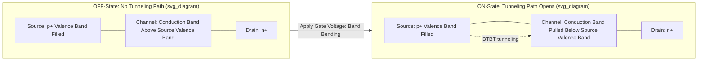

## Tunnel FETs and Steep Slope Devices

### Overview

Tunnel field-effect transistors (TFETs) are a class of transistor that use quantum-mechanical band-to-band tunneling (BTBT), rather than thermionic emission over a potential barrier, as the mechanism for carrier injection into the channel. This distinguishes them fundamentally from conventional MOSFETs (bulk, FinFET, nanosheet, FD-SOI), all of which rely on thermionic injection and are therefore bound by the same ~60 mV/decade room-temperature subthreshold swing (SS) limit. TFETs belong to a broader category called "steep slope devices," which encompasses any transistor architecture designed to achieve subthreshold swing below the thermionic limit, enabling lower supply voltage operation and reduced power consumption for the same on-current/off-current ratio.

### The Thermionic Limit and Motivation for Steep Slope Devices

**Key Points**

- In a conventional MOSFET, current turn-on/turn-off is governed by the Boltzmann (thermal) distribution of carrier energies in the source, which imposes a hard physical floor on subthreshold swing:

$$SS_{min} = \frac{kT}{q}\ln(10) \approx 60\ \text{mV/decade at } 300\text{K}$$

- This 60 mV/decade limit means that, no matter how ideal the gate electrostatics (short-channel effects fully suppressed, $m=1$), a conventional MOSFET can never switch current by one decade with less than ~60 mV of gate voltage swing.
- Because supply voltage ($V_{DD}$) scaling has slowed (unlike gate-length scaling, which continued through FinFET/GAA generations), power density has become a dominant constraint in advanced logic, especially since dynamic power scales as $P \propto C V_{DD}^2 f$ and leakage power depends directly on how steep the off-to-on transition is relative to $V_{DD}$.
- Steep slope devices aim to break the 60 mV/decade barrier, allowing $V_{DD}$ to be scaled further while maintaining an adequate on/off current ratio, which would proportionally reduce both dynamic and static power.

### Band-to-Band Tunneling: The TFET Mechanism

**Key Points**

- A TFET is structurally similar to a MOSFET but uses a **gated p-i-n (or p-n) junction** instead of the conventional MOSFET's n-i-n or p-i-p doped source/drain arrangement around an undoped or lightly doped channel.
- In the off-state, the energy bands of the source and channel are arranged so that no states are available for tunneling — the device is genuinely off, not just weakly conducting.
- Applying a gate voltage bends the channel bands relative to the source bands. When the conduction band of the channel is pulled below the valence band of the source (for an n-type TFET), electrons can quantum-mechanically tunnel directly from filled valence-band states in the source into empty conduction-band states in the channel — without needing enough thermal energy to surmount a classical barrier.
- Because tunneling probability depends on the band-bending profile and tunneling barrier width (which the gate controls very sharply near threshold) rather than on the thermal tail of the carrier distribution, the injected current can turn on/off over a much narrower gate-voltage range — in principle achieving sub-60 mV/decade switching, at least over part of its operating current range.

### TFET vs. MOSFET: Structural Comparison

| Aspect | Conventional MOSFET | Tunnel FET (TFET) |
| --- | --- | --- |
| Carrier injection mechanism | Thermionic emission over barrier | Band-to-band quantum tunneling |
| Source/drain doping | Same type (both n+ or both p+) | Opposite type (p+ source / n+ drain, or vice versa) — gated p-i-n structure |
| Subthreshold swing limit | ~60 mV/decade (thermal limit) | Can be < 60 mV/decade over part of I-V curve |
| On-current (typical) | High | Historically lower — a major limitation |
| Ambipolar conduction risk | Low (well controlled) | Present unless specifically suppressed |
| Best suited operating regime | Full voltage/current range | Especially advantageous at low $V_{DD}$ |

### Energy Band Diagram Concept

### Key Performance Challenge: Low On-Current

**Key Points**

- The central obstacle limiting TFET adoption is that tunneling current is fundamentally much lower than thermionic emission current for a given device geometry and bias, because BTBT relies on the (typically small) overlap of available filled and empty states across the tunneling junction, whereas thermionic emission draws on the full thermal population of carriers.
- This translates into TFETs historically delivering **lower on-current ($I_{ON}$)** than equivalent-node MOSFETs, which directly limits circuit switching speed — a major reason TFETs have remained primarily a research/niche device rather than a mainstream logic replacement.
- **Approaches to improve on-current** (active research directions):
  - **Narrow-bandgap or staggered/broken-gap heterojunction materials** (e.g., III-V compound semiconductors such as InAs/GaSb, or Ge-based heterostructures) at the source-channel junction, which increase tunneling probability by reducing the effective tunneling barrier compared to silicon-only TFETs.
  - **Steeper doping gradients / abrupt junctions** at the source-channel interface to sharpen the tunneling barrier.
  - **Vertical or nanowire/nanosheet TFET geometries** to increase the tunneling junction area relative to footprint, and to improve gate electrostatic control over the tunneling region.
  - **Strain engineering** to reduce the effective bandgap locally at the tunneling junction.

### Ambipolar Conduction

**Key Points**

- TFETs can conduct in both polarities (n-type-like and p-type-like behavior in the same device) depending on which junction (source-channel or channel-drain) is biased into a tunneling condition, since both ends of the gated intrinsic/lightly-doped channel are adjacent to oppositely doped regions.
- This **ambipolar leakage** is undesirable for digital logic, where a clean single-polarity on/off characteristic is required, and must be suppressed through design techniques such as:
  - Asymmetric drain doping/underlap to suppress tunneling at the drain-channel junction.
  - Gate/drain offset or spacer engineering to reduce electric field at the unwanted junction.
  - Use of a lightly doped or underlapped drain region to weaken the parasitic tunneling path.

### Other Steep-Slope Device Concepts (Beyond TFET)

Steep slope devices are a broader category; TFET is the most extensively studied, but several other mechanisms have been proposed to beat the thermionic limit:

- **Negative Capacitance FET (NCFET)**: Incorporates a ferroelectric material into the gate stack. The ferroelectric layer's negative capacitance region can, under the right bias/stability conditions, provide internal voltage amplification — the surface potential of the channel changes by more than the applied gate voltage — effectively achieving a body factor $m < 1$ and sub-60 mV/decade swing while retaining a conventional MOSFET-like current mechanism (thermionic), which historically has allowed higher on-current than TFETs. [Inference] The degree to which NCFET reliably achieves hysteresis-free, stable sub-60 mV/decade operation across process variation remains an active research question rather than settled industry practice.
- **Impact-Ionization MOSFET (I-MOS)**: Uses avalanche/impact ionization to achieve abrupt switching, but typically suffers from high operating voltage and reliability/hot-carrier degradation concerns, limiting practicality for logic.
- **Nano-electromechanical (NEM) relays**: Use a physically moving mechanical contact to achieve an abrupt, near-zero-leakage on/off transition, decoupling switching from any semiconductor thermal limit entirely, at the cost of mechanical switching speed and reliability (contact wear/stiction).

### Cross-Sectional Structure (Conceptual SVG)

<svg xmlns="http://www.w3.org/2000/svg" viewBox="0 0 640 340">
<text x="320" y="24" text-anchor="middle" font-size="16" font-weight="bold" fill="#222">Gated p-i-n TFET Structure (svg_diagram)</text>

<rect x="60" y="250" width="520" height="20" fill="#999" />
<text x="320" y="264" text-anchor="middle" font-size="10" fill="#fff">Isolation / Substrate</text>

<rect x="80" y="180" width="140" height="70" fill="#c2543f" />
<text x="150" y="220" text-anchor="middle" font-size="12" fill="#fff">Source (p+)</text>

<rect x="220" y="180" width="200" height="70" fill="#dddddd" stroke="#999" />
<text x="320" y="220" text-anchor="middle" font-size="12" fill="#333">Intrinsic Channel</text>

<rect x="420" y="180" width="140" height="70" fill="#3f7cc2" />
<text x="490" y="220" text-anchor="middle" font-size="12" fill="#fff">Drain (n+)</text>

<rect x="220" y="120" width="200" height="50" fill="#2e7d32" />
<text x="320" y="150" text-anchor="middle" font-size="12" fill="#fff">Metal Gate</text>
<rect x="220" y="170" width="200" height="10" fill="#a0d9a5" />
<text x="320" y="110" text-anchor="middle" font-size="10" fill="#222">High-k Gate Dielectric</text>

<line x1="220" y1="215" x2="260" y2="215" stroke="#c9302c" stroke-width="2" marker-end="url(#arrow)" />
<text x="240" y="270" text-anchor="middle" font-size="9" fill="#c9302c">BTBT tunneling path</text>
</svg>

### Example: Subthreshold Swing Comparison

**Example**

Consider a MOSFET and a TFET both designed to switch from $I_{OFF} = 1\ \text{pA/\mu m}$ to $I_{ON} = 1\ \mu\text{A/\mu m}$ (six decades of current):

- **MOSFET** at the thermal limit ($SS = 60$ mV/decade): requires $6 \times 60\ \text{mV} = 360\ \text{mV}$ of gate swing, setting a practical floor on how low $V_{DD}$ can go while maintaining that on/off ratio.
- **TFET** achieving, hypothetically, an average $SS = 30$ mV/decade over the same current range: requires only $6 \times 30\ \text{mV} = 180\ \text{mV}$ of gate swing — potentially allowing $V_{DD}$ to be roughly halved for the same on/off ratio, directly reducing dynamic power ($\propto V_{DD}^2$).

[Inference] This example illustrates the theoretical motivation; real TFETs typically exhibit sub-60 mV/decade swing only over a limited current range near threshold, with swing degrading toward the thermal limit or worse at higher currents, so the full-range benefit shown here is an idealized case rather than a typical measured result.

### Applications and Status

**Key Points**

- TFETs and other steep-slope devices are primarily targeted at **ultra-low-power, low-frequency applications** (e.g., IoT sensor nodes, implantable/wearable electronics, energy-harvesting systems) where minimizing static and dynamic power at low $V_{DD}$ matters more than raw switching speed.
- They are **not currently used in mainstream high-performance logic** (CPUs, GPUs) because on-current limitations translate directly into reduced switching speed, which is unacceptable for performance-oriented workloads.
- [Unverified] The maturity of TFET manufacturing (materials integration, yield, variability control) versus mainstream CMOS/FinFET/GAA processes should be checked against current literature, as this remains an active and evolving research area rather than a stable, standardized industrial process.

### Conclusion

TFETs and other steep-slope devices represent a departure from thermionic-emission-based switching, targeting the fundamental thermal subthreshold-swing limit that constrains all conventional MOSFET-family architectures (bulk, FinFET, nanosheet, FD-SOI). By exploiting band-to-band tunneling, TFETs can in principle achieve sub-60 mV/decade switching and enable lower supply-voltage operation, but they remain constrained in practice by low on-current and ambipolar leakage, restricting their current relevance to ultra-low-power niche applications rather than general-purpose high-performance logic. Alternative steep-slope mechanisms like NCFET aim to combine sub-thermal swing with conventional thermionic-level on-current, representing a complementary research direction to pure tunneling-based devices.

**Related Topics**

- Band-to-band tunneling physics and Kane's tunneling model
- Negative Capacitance FET (NCFET) and ferroelectric gate stacks
- Subthreshold swing and body-effect coefficient in MOSFETs
- III-V heterojunction materials for tunneling devices
- Ultra-low-power circuit design for IoT/energy-harvesting systems
- Nanosheet / Gate-All-Around (GAA) FET fundamentals
- Complementary FET (CFET) vertical stacking
- Fully Depleted Silicon-On-Insulator (FD-SOI) devices