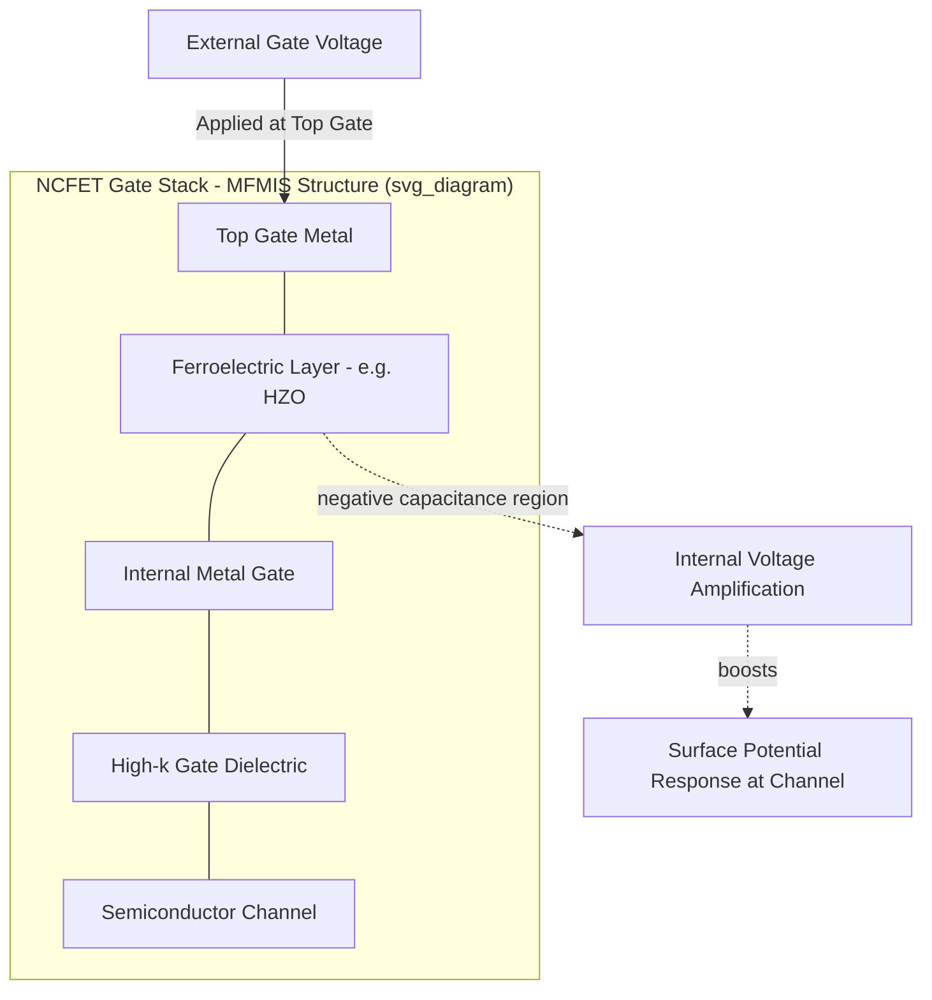

## Negative Capacitance FETs

### Overview

The Negative Capacitance Field-Effect Transistor (NCFET) is a steep-slope transistor concept that incorporates a ferroelectric material into the gate stack of an otherwise conventional MOSFET (bulk, FinFET, nanosheet, or FD-SOI) to achieve internal voltage amplification at the channel surface. Unlike Tunnel FETs, which change the carrier injection mechanism itself (band-to-band tunneling instead of thermionic emission), NCFET retains the standard thermionic conduction mechanism of a normal MOSFET but modifies the electrostatics of the gate stack so that a smaller applied gate voltage produces a larger change in surface potential — allowing subthreshold swing (SS) below the ~60 mV/decade thermal limit while preserving MOSFET-like on-current, which has historically been the main weakness of TFETs.

### The Physical Principle: Negative Capacitance in Ferroelectrics

**Key Points**

- A standard MOSFET gate stack behaves as a normal (positive) capacitor: increasing gate voltage $V_G$ increases the charge on the gate, and the channel surface potential $\psi_s$ responds with a gain of at most 1 (i.e., $d\psi_s/dV_G \leq 1$), which is the root cause of the 60 mV/decade thermal limit.
- A **ferroelectric material** has a double-well (S-shaped) free-energy landscape as a function of polarization, described phenomenologically by the Landau free-energy expansion:

$$U(P) = \alpha P^2 + \beta P^4 + \gamma P^6 - EP$$

where $P$ is polarization, $E$ is the applied electric field, and $\alpha$, $\beta$, $\gamma$ are material-dependent Landau coefficients (with $\alpha < 0$ in the ferroelectric phase, producing the double-well shape).

- In the region between the two energy minima (the unstable branch of the polarization-vs-field curve), the local differential capacitance of the ferroelectric is **negative**: $dV/dQ < 0$, meaning that as charge increases, voltage across that layer decreases.
- This negative-capacitance segment is inherently unstable as a standalone, isolated element, but when the ferroelectric layer is placed **in series** with the normal (positive) capacitance of the underlying MOSFET gate stack (the semiconductor's depletion/inversion capacitance), the series combination can be stabilized, and the *effective* total gate capacitance can be voltage-amplifying.

### Series Capacitance Amplification

For two capacitors in series, the equivalent capacitance follows:

$$\frac{1}{C_{eq}} = \frac{1}{C_{FE}} + \frac{1}{C_{MOS}}$$

If $C_{FE}$ is negative and its magnitude is appropriately matched to $C_{MOS}$ (the baseline MOSFET's internal capacitance, primarily its depletion capacitance $C_{dep}$), the series combination can yield an effective capacitance $C_{eq} > C_{MOS}$, and critically, the internal voltage gain from the external gate terminal to the semiconductor surface can exceed unity:

$$\frac{d\psi_s}{dV_G} > 1$$

This is the defining NCFET effect: **voltage step-up inside the gate stack**, such that a small change in externally applied $V_G$ produces a larger-than-proportional change in surface potential $\psi_s$, which in turn modulates channel charge and drain current more steeply than in a conventional MOSFET — directly translating into subthreshold swing below the 60 mV/decade thermal limit:

$$SS_{NC} = m \cdot \frac{kT}{q}\ln(10), \quad m = \left(1 + \frac{C_{dep}}{C_{ox}}\right)\left(1 - \frac{|C_{FE}|}{C_{dep}+C_{ox}}\right)_{\text{simplified form}}$$

[Inference] The exact analytical form of $m$ for NCFET depends on the specific circuit/device model used (Landau-Khalatnikov dynamics, single-domain vs. multi-domain ferroelectric behavior, and whether internal metal interlayers are present), so this expression should be read as illustrating the mechanism (negative $C_{FE}$ reducing the effective body factor $m$) rather than as a single universally agreed formula.

### Device Structure

**Key Points**

- **MFIS structure** (Metal-Ferroelectric-Insulator-Semiconductor): the ferroelectric layer sits directly on top of the conventional gate dielectric (e.g., high-k oxide), which sits on the semiconductor channel — closest to a "drop-in" modification of an existing MOSFET gate stack.
- **MFMIS structure** (Metal-Ferroelectric-Metal-Insulator-Semiconductor): an additional internal metal layer is inserted between the ferroelectric and the gate dielectric, electrically isolating the ferroelectric's polarization dynamics from the semiconductor's charge response. This internal metal (sometimes called an "internal gate") is widely used in NCFET research because it:
  - Decouples the ferroelectric switching dynamics from the semiconductor's nonlinear charge response, easing stabilization.
  - Allows separate optimization/characterization of the ferroelectric capacitor and the underlying MOS capacitor.
  - Reduces hysteresis compared to a direct MFIS stack, though does not necessarily eliminate it.
- **Common ferroelectric materials**: Hafnium-oxide-based ferroelectrics, particularly **hafnium-zirconium-oxide (HfZrO$_2$, often abbreviated HZO)**, are the dominant material system studied for NCFET integration, largely because they are compatible with existing high-k/metal-gate CMOS process flows (HfO$_2$-based dielectrics are already used as the standard high-k gate dielectric in advanced CMOS), unlike earlier ferroelectric research materials (e.g., PZT — lead zirconate titanate) which pose CMOS contamination and integration concerns.

### Structural Diagram

### Cross-Sectional View (Conceptual SVG)

<svg xmlns="http://www.w3.org/2000/svg" viewBox="0 0 640 380">
<text x="320" y="24" text-anchor="middle" font-size="16" font-weight="bold" fill="#222">NCFET MFMIS Gate Stack (svg_diagram)</text>

<rect x="140" y="300" width="360" height="50" fill="#8a8a8a" />
<text x="320" y="330" text-anchor="middle" font-size="12" fill="#fff">Semiconductor Channel</text>

<rect x="80" y="290" width="55" height="60" fill="#3f7cc2" />
<rect x="505" y="290" width="55" height="60" fill="#3f7cc2" />
<text x="107" y="325" text-anchor="middle" font-size="9" fill="#fff">S</text>
<text x="532" y="325" text-anchor="middle" font-size="9" fill="#fff">D</text>

<rect x="140" y="280" width="360" height="18" fill="#a0d9a5" />
<text x="320" y="293" text-anchor="middle" font-size="10" fill="#222">High-k Gate Dielectric</text>

<rect x="140" y="245" width="360" height="33" fill="#666" />
<text x="320" y="266" text-anchor="middle" font-size="11" fill="#fff">Internal Metal Gate</text>

<rect x="140" y="195" width="360" height="48" fill="#c2543f" />
<text x="320" y="223" text-anchor="middle" font-size="12" fill="#fff">Ferroelectric (HZO) — Negative Capacitance Region</text>

<rect x="140" y="160" width="360" height="33" fill="#2e7d32" />
<text x="320" y="181" text-anchor="middle" font-size="11" fill="#fff">Top Gate Metal</text>

<line x1="320" y1="130" x2="320" y2="160" stroke="#222" stroke-width="2" />
<text x="320" y="120" text-anchor="middle" font-size="10" fill="#222">V_G (external)</text>

<line x1="510" y1="210" x2="570" y2="210" stroke="#c9302c" stroke-width="2" stroke-dasharray="4,3" />
<text x="575" y="214" text-anchor="start" font-size="9" fill="#c9302c">dψ_s/dV_G &gt; 1</text>
</svg>

### Comparison: NCFET vs. TFET vs. Conventional MOSFET

| Aspect | Conventional MOSFET | TFET | NCFET |
| --- | --- | --- | --- |
| Conduction mechanism | Thermionic emission | Band-to-band tunneling | Thermionic emission (unchanged) |
| Subthreshold swing | Limited to ~60 mV/decade | Can be < 60 mV/decade (partial range) | Can be < 60 mV/decade |
| On-current | Baseline/reference | Historically much lower | Comparable to baseline MOSFET (key advantage) |
| Structural change required | None (reference) | New junction doping profile (p-i-n) | Added ferroelectric layer in gate stack |
| Ambipolar conduction risk | Low | Present, needs suppression | Low (inherits MOSFET behavior) |
| Process compatibility | N/A | Requires new junction/material engineering | HZO is compatible with existing HfO$_2$-based high-k CMOS flows |
| Primary reliability concern | Standard MOSFET degradation (BTI, HCI) | Junction abruptness, defect-assisted tunneling | Ferroelectric hysteresis, polarization fatigue/wake-up, stability |

### Key Design and Reliability Challenges

**Key Points**

- **Hysteresis**: If the ferroelectric layer's negative-capacitance region is not fully stabilized by the series MOS capacitance, the device can exhibit hysteresis in its $I_D$–$V_G$ characteristic (different current for the same $V_G$ depending on sweep direction), which is undesirable for digital logic switching behavior and must be minimized through careful capacitance matching and ferroelectric layer thickness/composition control.
- **Ferroelectric switching dynamics vs. transistor switching speed**: Ferroelectric polarization switching follows its own time-dependent dynamics (commonly modeled via Landau-Khalatnikov kinetics), and if this switching is slow relative to the desired transistor operating frequency, it can limit the practical speed benefit of the steep-slope effect. [Inference] The degree to which ferroelectric switching speed constrains high-frequency logic operation is an active area of device-level research and depends heavily on specific material/thickness choices.
- **Polarization fatigue and "wake-up" effects**: HZO-based ferroelectric films are known in broader ferroelectric-memory literature to exhibit "wake-up" (increasing remnant polarization over initial cycling) and fatigue (degradation after many switching cycles) behaviors, which raise reliability questions for repeated NCFET switching over a device's operational lifetime. [Unverified] The specific fatigue/endurance characteristics relevant to NCFET logic operation (as opposed to ferroelectric memory operation, which uses the material differently) should be checked against current device-reliability literature.
- **Capacitance matching sensitivity**: The NC effect's stability and magnitude depend on precisely matching ferroelectric layer thickness/area to the underlying MOS capacitance; process variation in either can push the device out of the stable amplification regime.
- **Multi-domain vs. single-domain ferroelectric behavior**: Real (non-idealized) ferroelectric films typically consist of multiple polarization domains rather than switching uniformly, which complicates both the theoretical negative-capacitance picture (often derived assuming single-domain Landau theory) and practical device modeling.

### Advantages Over TFET for Steep-Slope Scaling

- **Retains near-MOSFET on-current**: Because conduction still occurs via conventional thermionic emission over the channel barrier, NCFET does not suffer the severe on-current penalty that limits TFET practicality for high-performance logic.
- **Process compatibility with existing high-k/metal-gate flows**: HZO-based ferroelectric integration can be added as a modification to an existing gate stack (inserting a ferroelectric layer and, optionally, an internal metal gate) rather than requiring a fundamentally different junction architecture, doping profile, or exotic channel material, making it comparatively easier to integrate into established CMOS/FinFET/GAA process flows.
- **Compatible with multiple channel architectures**: The NC gate-stack concept has been studied in combination with planar bulk, FinFET, and nanosheet/GAA channel geometries, since it modifies the gate stack rather than the underlying channel/junction structure. [Inference] Practical co-integration maturity varies by architecture and is an active research area rather than a standardized offering.

### Example: Subthreshold Swing Improvement

**Example**

A baseline FinFET exhibits $SS \approx 70$ mV/decade due to residual short-channel effects (above the ideal 60 mV/decade limit). By inserting a thin HZO ferroelectric layer into the gate stack (forming an NCFET), simulation/experimental studies in the literature commonly report SS improvements into the sub-60 mV/decade range over part of the subthreshold region, along with a modest increase in on-current at fixed $V_{DD}$ due to the amplified surface-potential response. [Inference] Specific numeric SS and $I_{ON}$ improvement figures are highly dependent on ferroelectric material composition, thickness, and the baseline device being modified, and should be sourced from the specific study or foundry disclosure in question rather than treated as generalizable constants.

### Current Status and Applications

**Key Points**

- NCFET remains primarily a **research and early-development-stage concept** rather than a device in high-volume mainstream logic production. [Unverified] Specific foundry adoption timelines, pilot integration results, and roadmap commitments change over time and are typically disclosed at device physics conferences (e.g., IEDM, VLSI Symposium); current status should be verified against up-to-date primary sources rather than assumed static.
- Target applications mirror those of other steep-slope devices: **low-power logic, low-$V_{DD}$ operation, and energy-constrained computing** (mobile, IoT, edge-AI accelerators) where reducing subthreshold swing directly enables supply-voltage scaling and associated dynamic/static power savings.
- Because NCFET is a **gate-stack-level modification** rather than a channel/junction architecture change, it is also explored as a complementary technique that could, in principle, be layered onto other advanced architectures (FinFET, nanosheet, CFET) rather than being mutually exclusive with them. [Inference] The practical co-integration complexity of combining NC gate stacks with, for example, CFET vertical stacking has not been established as a mature, standardized process.

### Conclusion

NCFET achieves steep-slope switching by exploiting the negative differential capacitance available in the unstable region of a ferroelectric material's polarization curve, using it in series with a conventional MOSFET's gate capacitance to internally amplify surface-potential response to gate voltage. This preserves the standard thermionic conduction mechanism — and with it, MOSFET-like on-current — distinguishing NCFET from TFET's tunneling-based approach, which sacrifices on-current for steep slope. The primary engineering challenges for NCFET center on stabilizing the negative-capacitance effect without hysteresis, ensuring ferroelectric switching speed and reliability (fatigue, wake-up) are compatible with logic operation, and precisely matching capacitances across process variation — all areas of continued active device research rather than settled industrial practice.

**Related Topics**

- Tunnel FETs and band-to-band tunneling
- Landau-Khalatnikov ferroelectric switching dynamics
- Hafnium-zirconium-oxide (HZO) ferroelectric material properties
- Ferroelectric memory (FeRAM, FeFET) device physics
- Subthreshold swing and body-effect coefficient in MOSFETs
- High-k/metal-gate stack engineering
- Nanosheet / Gate-All-Around (GAA) FET fundamentals
- Dynamic voltage scaling and low-power logic design