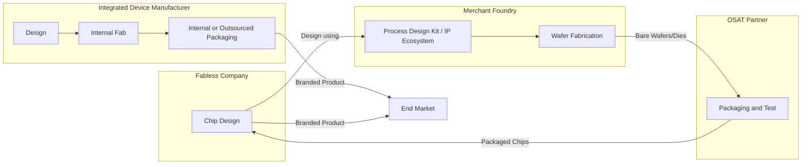

## IDM, Foundry, and Fabless Business Models

### Overview

The semiconductor industry organizes itself around three principal business models that determine who designs a chip, who manufactures it, and how those functions are financially and organizationally structured: the **Integrated Device Manufacturer (IDM)**, the **fabless** company, and the **foundry**. These models emerged as the capital cost of building and operating a leading-edge wafer fabrication plant ("fab") grew so large that few companies could afford to both design chips and own the manufacturing capacity to produce them, driving an industry-wide split between design-only and manufacturing-only specialists, alongside firms that still do both.

### The Integrated Device Manufacturer (IDM) Model

**Key Points**

- An IDM designs, manufactures, and typically also assembles, tests, packages, and sells its own semiconductor products, controlling the entire value chain internally.
- Historically the dominant model in the early semiconductor industry (e.g., Intel, Texas Instruments, and originally most chip companies), since fabs were comparatively less capital-intensive and vertical integration allowed tight coupling between process technology and product design.
- **Advantages**:
  - Tight co-optimization between circuit design and process technology, since design and manufacturing teams work within the same organization and can iterate together.
  - Full control over the process roadmap, allowing an IDM to tailor manufacturing specifically to its own product needs rather than needing to share a process node with external customers.
  - Proprietary process technology can become a competitive moat if it delivers superior performance or cost versus competitors using merchant foundries.
- **Disadvantages**:
  - Requires enormous, sustained capital expenditure to build and continuously upgrade fabs to leading-edge nodes — a cost that has grown dramatically over successive process generations.
  - Fab utilization risk: if internal product demand doesn't fill fab capacity, the company bears the fixed cost of underutilized, extremely expensive equipment, unlike a foundry that can pool demand across many external customers.
  - Slower to benefit from the economies of scale that a foundry serving many customers across many product categories can achieve.

### The Fabless Model

**Key Points**

- A fabless company designs semiconductor products (chip architecture, circuit design, physical layout) but owns no wafer fabrication facilities, instead contracting a foundry to manufacture the chips it designs.
- Enabled by the maturation of the merchant foundry industry, which allowed design-focused companies to access leading-edge manufacturing without bearing fab capital costs directly.
- **Advantages**:
  - Dramatically lower capital expenditure requirements, since no fab needs to be built or maintained — capital is instead directed toward design tools, IP licensing, R&D headcount, and product engineering.
  - Access to the most advanced process nodes available from leading foundries, without needing to independently develop that process technology.
  - Flexibility to switch foundries or split production across multiple foundries/nodes to optimize cost, capacity availability, or geographic/supply-chain diversification.
  - Faster time-to-market for new product lines, since manufacturing scale-up is the foundry's responsibility rather than requiring internal fab construction.
- **Disadvantages**:
  - Dependent on external foundry capacity allocation, pricing, and process roadmap timing — a fabless company does not control when a given node becomes available or how foundry capacity is prioritized among customers during shortages.
  - Less direct co-optimization between circuit design and process technology compared to an IDM, since the fabless company designs to a process design kit (PDK) provided by the foundry rather than having in-house process engineers tuning the fab specifically to its products.
  - Competitive exposure if a rival fabless company using the same foundry and node achieves better allocation, priority, or access to leading-edge capacity.

### The Foundry Model

**Key Points**

- A (merchant) foundry manufactures semiconductor wafers on behalf of other companies (fabless firms, and sometimes IDMs needing overflow capacity) but does not design or sell its own branded chip products to end customers.
- Foundries develop and offer process technology (a portfolio of process nodes, each with an associated PDK, standard-cell libraries, and IP ecosystem) that customers design their chips against.
- **Advantages**:
  - Aggregates manufacturing demand across many customers and product categories, achieving fab utilization and economies of scale that no single IDM's internal demand alone could typically sustain at the leading edge.
  - Specializes purely in process technology development and manufacturing excellence, allowing deep focus and investment concentration in fab operations.
  - Revenue model scales with the number and volume of fabless (and IDM-outsourced) customers using its process nodes.
- **Disadvantages**:
  - Extremely high capital intensity, since leading-edge fab construction and equipment costs continue to rise with each process generation. [Inference] The specific per-fab cost at any given moment is a fast-moving figure driven by equipment pricing, node complexity, and site/regional factors, and should be sourced from current industry reporting rather than treated as fixed.
  - Must balance and prioritize capacity allocation among competing customers, particularly during periods of high demand or supply-constrained capacity, which can create tension with customers over pricing, priority, and roadmap access.
  - Process technology must be generalized enough to serve a diverse customer base, which can create some trade-offs compared to an IDM's ability to hyper-tailor a process to a single product line.

### Related and Hybrid Models

**Key Points**

- **Fab-lite**: A hybrid approach in which a company retains some internal fabrication capacity (often for legacy or specialty processes, or for products where tight process/design integration remains valuable) while outsourcing leading-edge or high-volume production to external foundries. This lets a company balance some of the IDM advantages (proprietary process control for select products) against the capital efficiency of foundry outsourcing for the bulk of its volume.
- **IP core / semiconductor IP licensing companies**: Firms that design and license reusable circuit blocks or full processor architectures (e.g., CPU/GPU core designs, interface IP) to fabless and IDM customers, without manufacturing chips themselves and often without producing complete chip designs either — an even more specialized slice of the value chain than fabless companies, which still design complete products.
- **OSAT (Outsourced Semiconductor Assembly and Test)**: Companies that specialize in the packaging, assembly, and testing stages of chip production, separate from wafer fabrication itself. Both fabless companies and foundries commonly rely on OSAT partners for these back-end steps rather than performing them in-house, further fragmenting the value chain beyond the simple IDM/fabless/foundry split.
- **Foundry-owned advanced packaging services**: Some leading foundries have expanded into offering advanced packaging (e.g., 2.5D/3D integration, chiplet assembly) directly, partially overlapping with traditional OSAT services, reflecting how the boundaries between these categories can shift over time. [Inference] The specific scope of services offered by any given foundry changes as companies expand their offerings, so current service portfolios should be verified against up-to-date company disclosures.

### Value Chain Comparison

| Model | Designs Chips | Owns Fabs | Sells Branded End Products | Primary Capital Exposure |
| --- | --- | --- | --- | --- |
| IDM | Yes | Yes | Yes | Highest (fab + design + product) |
| Fabless | Yes | No | Yes | Lower (design + product only) |
| Foundry | No (typically) | Yes | No (manufactures for others) | Highest (fab only, amortized across many customers) |
| Fab-lite | Yes | Partial | Yes | Moderate (selective fab ownership) |
| IP licensing firm | Partial (IP blocks, not full chips) | No | No (licenses IP) | Lowest |
| OSAT | No | No (assembly/test facilities, not wafer fabs) | No | Moderate (assembly/test equipment) |

### Value Chain Relationship Diagram

### Example: Why a Startup Chooses Fabless

**Example**

A startup designing a specialized AI inference accelerator chip typically chooses the fabless model because:

- Building a leading-edge fab would require capital far beyond what a startup can realistically raise, whereas contracting a foundry allows the startup to access an advanced process node with capital directed instead toward design engineering and IP licensing.
- The foundry's PDK and standard-cell library let the startup's design team begin physical implementation without needing in-house process engineering expertise.
- If demand for the chip is uncertain, the fabless model avoids the fixed-cost risk of an underutilized owned fab, since foundry capacity is contracted (and costed) per wafer/volume rather than as a large fixed capital investment.

### Industry Context and Trends

**Key Points**

- The relative scale of the leading foundries versus IDMs and fabless companies, and the specific list of who occupies each category, shifts over time as companies change strategy (e.g., some historical IDMs have moved toward fab-lite or increased foundry outsourcing; some countries and companies have pursued new IDM or foundry investments for supply-chain resilience reasons). [Unverified] Current market-share figures, leading foundry/IDM rankings, and recent strategic shifts (such as new fab announcements or ownership changes) should be verified against current industry reporting rather than assumed static, as this is a fast-moving competitive and geopolitical landscape.
- Government policy (subsidies, export controls, reshoring incentives) has increasingly influenced fab investment decisions in various regions, adding a geopolitical dimension to what was historically a primarily commercial/technical business-model choice. [Inference] The specific policy landscape and its effects on any given company's fab strategy change frequently and should be checked against current news/policy sources for up-to-date accuracy.

### Conclusion

The IDM, fabless, and foundry models reflect different answers to the same underlying tension: semiconductor manufacturing has become so capital-intensive that few companies can profitably own fabs unless they can either fill that capacity with enormous internal product demand (the IDM path) or aggregate demand across many external customers (the foundry path), while companies that only want to focus on chip design can access leading-edge manufacturing without owning fabs at all (the fabless path). Hybrid and adjacent models — fab-lite, IP licensing, and OSAT — further fragment the value chain, reflecting how specialization has proven more capital-efficient than full vertical integration for most participants in the modern semiconductor industry, even as a smaller number of large IDMs continue to operate the vertically integrated model successfully.

**Related Topics**

- Process Design Kits (PDKs) and standard-cell library structure
- Wafer fabrication capital costs and Moore's Law economics
- Outsourced Semiconductor Assembly and Test (OSAT) processes
- Advanced packaging and chiplet integration (2.5D/3D)
- Semiconductor supply chain geopolitics and export controls
- Photolithography and EUV scanner economics
- Process node naming conventions and technology roadmaps
- Semiconductor IP licensing and core/architecture business models