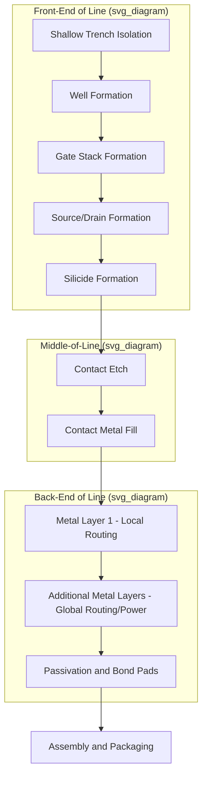

## Front End Versus Back End Processing

### Overview

Semiconductor fabrication is divided into two broad, sequential process domains: **Front-End of Line (FEOL)** and **Back-End of Line (BEOL)**, with a transitional stage often called **Middle-of-Line (MOL)** bridging them. FEOL encompasses all process steps that create the active transistor devices themselves — the semiconductor junctions, gates, and channels — directly in and on the silicon substrate. BEOL encompasses all subsequent steps that wire those transistors together into functional circuits, building up multiple layers of metal interconnect above the completed devices. Understanding this division is foundational to understanding wafer fab flow, process node terminology, and where different technology innovations (new transistor architectures vs. new interconnect materials) apply.

Note: "Front end" and "back end" are also used in a separate, unrelated sense in the industry — referring to *wafer fabrication* (front-end) versus *assembly, packaging, and test* (back-end) at the whole-manufacturing-flow level, distinct from the FEOL/BEOL distinction within the fab itself. This entry focuses on the FEOL/MOL/BEOL distinction within wafer processing, and notes the assembly-level usage separately below to avoid ambiguity.

### Front-End of Line (FEOL)

**Key Points**

- FEOL comprises all fabrication steps up through (but not including) the formation of the first metal interconnect layer, covering everything needed to build the transistor devices themselves.
- **Typical FEOL process steps**:
  - **Wafer preparation**: starting substrate (bulk silicon, SOI, etc.) cleaning and initial characterization.
  - **Shallow Trench Isolation (STI)**: etching and filling trenches with dielectric to electrically isolate adjacent transistors/active areas.
  - **Well formation**: ion implantation to create n-well and p-well regions that define where nFETs and pFETs will be built.
  - **Channel/threshold-voltage implants**: doping adjustments to set transistor threshold voltage (in architectures that use channel doping; reduced or absent in undoped-channel architectures like FD-SOI).
  - **Gate stack formation**: growth/deposition of gate dielectric (high-k oxide in modern nodes) and gate electrode material (metal gate, often via replacement-metal-gate flow).
  - **Source/drain formation**: ion implantation or selective epitaxial growth of source/drain regions, followed by dopant activation annealing.
  - **Silicide formation**: reaction of a deposited metal (e.g., nickel, cobalt, or titanium-based silicides depending on node/generation) with exposed silicon at source/drain and gate contact areas to reduce contact resistance.
- FEOL is where transistor architecture choices — planar, FinFET, nanosheet/GAA, CFET, FD-SOI — are physically realized, and where most of the "Advanced Transistor Architectures" innovations discussed elsewhere in this syllabus are implemented.
- FEOL process control is dominated by concerns like: junction abruptness and dopant activation, channel strain engineering, gate stack reliability (bias temperature instability, hot-carrier injection), and short-channel effect control.

### Middle-of-Line (MOL)

**Key Points**

- MOL is a transitional stage that forms the local contacts connecting the FEOL device terminals (source, drain, gate) up to the first metal interconnect layer that BEOL will build upon.
- **Typical MOL process steps**:
  - **Contact etch**: etching high-aspect-ratio holes through the interlayer dielectric down to source/drain and gate silicide regions.
  - **Contact metal fill**: depositing a barrier/liner layer (e.g., titanium/titanium nitride) followed by a fill metal (historically tungsten; cobalt and ruthenium have been explored/adopted at advanced nodes for reduced contact resistance at small dimensions).
  - **Local interconnect** (in some process flows): a short-distance routing layer that connects nearby device terminals before reaching the full BEOL metal stack, used to relieve routing congestion in tightly-pitched standard cells.
- MOL is increasingly recognized as a distinct scaling bottleneck at advanced nodes, since contact resistance and via aspect ratio in this region contribute significantly to overall parasitic resistance-capacitance (RC) delay, especially as contact dimensions shrink faster than the resistivity of available fill metals improves. [Inference] The precise relative contribution of MOL parasitics to total circuit delay is node- and design-specific and is an active area of process/device co-optimization research.

### Back-End of Line (BEOL)

**Key Points**

- BEOL comprises all steps that build the multi-layer metal interconnect stack above the completed transistors (and MOL contacts), wiring individual devices together into functional logic gates, and those gates into complete circuits, up through the final passivation and bond-pad layers.
- **Typical BEOL process steps**:
  - **Dielectric deposition**: depositing interlayer dielectric (ILD), historically silicon dioxide-based, but increasingly low-k and ultra-low-k dielectric materials at advanced nodes to reduce parasitic capacitance between adjacent metal lines.
  - **Damascene patterning**: etching trenches (and vias) into the dielectric in the desired wiring pattern — named for its resemblance to the ancient metal-inlay technique, since metal is deposited into pre-etched trenches rather than being deposited and then etched.
  - **Barrier/liner deposition**: depositing a thin diffusion-barrier layer (historically tantalum/tantalum nitride for copper interconnect) to prevent metal atoms from diffusing into the surrounding dielectric and degrading transistor performance.
  - **Metal fill and electroplating**: filling trenches/vias with interconnect metal — copper has been the dominant BEOL interconnect metal since replacing aluminum in the late 1990s, deposited via electroplating after a thin seed layer.
  - **Chemical-Mechanical Polishing (CMP)**: planarizing the wafer surface after metal fill, removing excess metal and leaving a flat surface for the next dielectric/metal layer — repeated at every metal layer.
  - **Repeat for multiple metal layers**: modern advanced logic processes commonly use on the order of 10+ metal layers, progressing from tightly-pitched lower layers (closest to the devices, used for local routing) to progressively wider, thicker upper layers (used for global routing and power distribution).
  - **Passivation and bond pad formation**: final protective dielectric layers and exposed metal pads for external wire-bond or bump connections, marking the end of front-end-of-fab wafer processing before the wafer moves to assembly/packaging.
- BEOL is where interconnect-focused innovations apply: low-k/ultra-low-k dielectrics, alternative interconnect metals (e.g., ruthenium, cobalt for very fine lower-layer metal pitches where copper's resistivity rises sharply due to electron surface/grain-boundary scattering at small dimensions), and **backside power delivery networks (BSPDN)**, which relocate power-rail routing to the wafer's backside to relieve front-side BEOL routing congestion — an increasingly important complement to advanced FEOL architectures like nanosheet and CFET.

### FEOL vs. MOL vs. BEOL Comparison

| Aspect | FEOL | MOL | BEOL |
| --- | --- | --- | --- |
| Primary function | Build transistor devices | Connect device terminals to interconnect | Wire devices into circuits |
| Key structures | Gate stack, channel, source/drain, wells, STI | Contacts, local interconnect | Multi-layer metal wiring, vias |
| Dominant materials | Silicon, high-k dielectrics, metal gate, silicide | Tungsten/cobalt/ruthenium contacts | Copper (or alternatives), low-k dielectrics |
| Key scaling concerns | Short-channel effects, threshold variability, strain | Contact resistance, via aspect ratio | RC delay, electromigration, dielectric breakdown |
| Relevant architecture topics | FinFET, nanosheet/GAA, CFET, FD-SOI, TFET, NCFET | Local interconnect, self-aligned contacts | Backside power delivery, low-k dielectrics |

### Process Flow Diagram

### Cross-Sectional View (Conceptual SVG)

<svg xmlns="http://www.w3.org/2000/svg" viewBox="0 0 640 420">
<text x="320" y="24" text-anchor="middle" font-size="16" font-weight="bold" fill="#222">FEOL / MOL / BEOL Cross-Section (svg_diagram)</text>

<rect x="60" y="360" width="520" height="30" fill="#8a8a8a" />
<text x="320" y="380" text-anchor="middle" font-size="11" fill="#fff">Silicon Substrate</text>

<rect x="60" y="300" width="520" height="60" fill="#4a90d9" opacity="0.3" />
<rect x="150" y="315" width="100" height="45" fill="#3f7cc2" />
<rect x="390" y="315" width="100" height="45" fill="#3f7cc2" />
<text x="200" y="342" text-anchor="middle" font-size="9" fill="#fff">Source</text>
<text x="440" y="342" text-anchor="middle" font-size="9" fill="#fff">Drain</text>
<rect x="270" y="300" width="100" height="30" fill="#2e7d32" />
<text x="320" y="320" text-anchor="middle" font-size="9" fill="#fff">Gate</text>
<text x="590" y="335" text-anchor="start" font-size="10" fill="#222">FEOL</text>

<rect x="60" y="255" width="520" height="45" fill="#c98a2b" opacity="0.3" />
<rect x="190" y="260" width="25" height="40" fill="#b8860b" />
<rect x="425" y="260" width="25" height="40" fill="#b8860b" />
<rect x="300" y="260" width="40" height="40" fill="#b8860b" />
<text x="590" y="280" text-anchor="start" font-size="10" fill="#222">MOL</text>

<rect x="60" y="90" width="520" height="165" fill="#c2543f" opacity="0.15" />
<rect x="150" y="230" width="340" height="12" fill="#c2543f" />
<text x="500" y="240" text-anchor="start" font-size="8" fill="#222">M1</text>
<rect x="200" y="195" width="15" height="35" fill="#c2543f" />
<rect x="400" y="195" width="15" height="35" fill="#c2543f" />
<rect x="120" y="185" width="400" height="12" fill="#c2543f" />
<text x="530" y="195" text-anchor="start" font-size="8" fill="#222">M2</text>
<rect x="250" y="150" width="15" height="35" fill="#c2543f" />
<rect x="380" y="150" width="15" height="35" fill="#c2543f" />
<rect x="100" y="140" width="440" height="12" fill="#c2543f" />
<text x="550" y="150" text-anchor="start" font-size="8" fill="#222">M3+</text>
<text x="590" y="170" text-anchor="start" font-size="10" fill="#222">BEOL</text>
<rect x="60" y="100" width="520" height="20" fill="#999" />
<text x="320" y="114" text-anchor="middle" font-size="10" fill="#fff">Passivation / Bond Pads</text>
</svg>

### Example: Where an Innovation Applies

**Example**

- A new **gate-all-around nanosheet transistor** (as covered under Advanced Transistor Architectures) is a **FEOL** innovation — it changes how the channel and gate are structured in the silicon layer, before any interconnect is built.
- A new **ruthenium liner-free contact metal** to reduce resistance at tight pitches is a **MOL** innovation — it changes how the device terminals are connected upward, without altering the transistor structure itself.
- A new **backside power delivery network** is primarily a **BEOL** (and substrate-level) innovation — it relocates power routing to the wafer backside, changing how completed devices are wired for power distribution without altering FEOL device structure.

This distinction is useful for classifying where in the process flow a given technology development applies, and which process module (FEOL, MOL, or BEOL) would need to change to adopt it.

### Related Usage: Front-End vs. Back-End at the Manufacturing-Flow Level

**Key Points**

- Separately from the FEOL/BEOL distinction within wafer fabrication, the industry also uses "front-end" to refer to the entire **wafer fabrication process** (all FEOL + MOL + BEOL steps performed on the wafer in the fab) and "back-end" to refer to **assembly, packaging, and test** — the stages after wafer fabrication is complete, where individual dies are diced from the finished wafer, packaged, and tested.
- This higher-level distinction corresponds to the IDM/foundry/OSAT value-chain division discussed elsewhere: wafer fabs perform "front-end" (in this whole-flow sense) manufacturing, while OSAT (Outsourced Semiconductor Assembly and Test) companies typically perform "back-end" manufacturing.
- Readers should note the context (within-fab process stage vs. whole manufacturing flow) when encountering "front-end"/"back-end" terminology, since both usages are common in industry literature.

### Conclusion

The FEOL/MOL/BEOL division reflects the natural sequence of building a chip: first the active transistor devices (FEOL), then the local contacts connecting them (MOL), then the multi-layer metal wiring that turns isolated transistors into functional circuits (BEOL). Advanced transistor architecture innovations (FinFET, nanosheet, CFET, FD-SOI, TFET, NCFET) live in FEOL; contact resistance and local routing innovations live in MOL; and interconnect material, dielectric, and power-delivery innovations live in BEOL — providing a useful framework for classifying where any given semiconductor process innovation fits within the overall wafer fabrication flow.

**Related Topics**

- Damascene copper interconnect process
- Low-k and ultra-low-k dielectric materials
- Backside power delivery networks (BSPDN)
- Chemical-Mechanical Polishing (CMP) fundamentals
- Contact and via resistance scaling challenges
- Replacement metal gate (RMG) process flow
- Electromigration and interconnect reliability
- IDM, foundry, and fabless business models