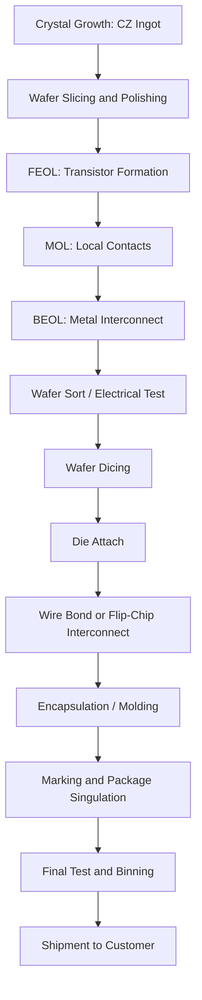
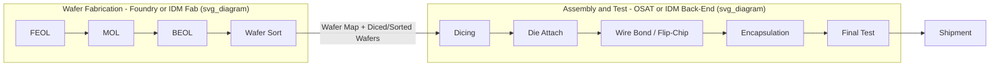

## The Complete Process Flow from Wafer to Package

### Overview

The journey from a raw silicon wafer to a finished, packaged semiconductor chip spans two major manufacturing domains — **wafer fabrication** (often called "front-end" manufacturing in the whole-flow sense) and **assembly, packaging, and test** (often called "back-end" manufacturing) — encompassing hundreds of individual process steps across crystal growth, lithography, deposition, etch, doping, metallization, wafer test, die singulation, packaging, and final test. This entry provides an end-to-end sequential map of that flow, tying together the FEOL/MOL/BEOL wafer-fab stages with the downstream assembly and packaging stages, and situating each stage within the IDM/foundry/OSAT business-model structure covered elsewhere in this syllabus.

### Stage 1: Crystal Growth and Wafer Preparation

**Key Points**

- **Polysilicon production**: Raw silicon (from purified quartz/silica) is converted to ultra-high-purity electronic-grade polysilicon via chemical refining processes (e.g., the Siemens process).
- **Single-crystal ingot growth**: The dominant method is the **Czochralski (CZ) process**, in which a seed crystal is dipped into molten polysilicon and slowly withdrawn while rotating, pulling a single-crystal cylindrical ingot with controlled crystallographic orientation. Float-zone (FZ) growth is used for specialty high-purity applications (e.g., power devices) where CZ's crucible-related oxygen contamination is undesirable.
- **Ingot slicing and wafer shaping**: The cylindrical ingot is sliced into thin wafers using a wire saw, followed by edge rounding (to reduce chipping), lapping, etching (to remove saw damage), and polishing (chemical-mechanical polishing to achieve an atomically smooth, defect-free surface).
- **Epitaxial layer growth (optional)**: For many advanced processes, a thin, high-purity epitaxial silicon layer is grown on top of the polished wafer to provide a defect-free surface for device fabrication, distinct from the bulk substrate below it.
- Output of this stage: a polished, characterized bare silicon wafer (or SOI wafer, for FD-SOI processes, involving additional bonding/layer-transfer steps as covered under FD-SOI) ready to enter the fab.

### Stage 2: Front-End of Line (FEOL) — Transistor Formation

**Key Points**

This stage builds the active transistor devices, as detailed in the "Front End versus Back End Processing" entry. Summarized sequence:

1. Shallow Trench Isolation (STI) formation to electrically separate active device areas.
2. Well formation (n-well/p-well implants) to define nFET and pFET regions.
3. Channel/threshold-voltage adjustment implants (where applicable to the chosen transistor architecture).
4. Gate stack formation (high-k dielectric + metal gate), often via a replacement-metal-gate flow.
5. Source/drain formation via implantation or selective epitaxial growth, followed by activation annealing.
6. Silicide formation at source/drain/gate contact areas to reduce resistance.

This stage is where the specific transistor architecture — planar, FinFET, nanosheet/GAA, CFET, FD-SOI, or steep-slope devices like TFET/NCFET — is physically realized.

### Stage 3: Middle-of-Line (MOL) — Local Contacts

**Key Points**

- Contact holes are etched through the interlayer dielectric down to the silicided source, drain, and gate regions.
- Contact metal (traditionally tungsten; cobalt/ruthenium explored at advanced nodes) is deposited to fill these contacts, following a barrier/liner deposition step.
- Local interconnect structures may be added in some process flows to relieve routing congestion before reaching the full BEOL metal stack.

### Stage 4: Back-End of Line (BEOL) — Interconnect

**Key Points**

- Multiple layers of metal interconnect (typically 10+ layers in modern advanced logic) are built up using damascene patterning: dielectric deposition, trench/via etch, barrier/liner deposition, copper (or alternative metal) electroplating, and chemical-mechanical polishing, repeated layer by layer.
- Lower metal layers use tight pitches for local routing; upper layers are wider and thicker for global routing and power distribution.
- Final passivation layers and bond pads are formed, marking the completion of wafer-level processing.
- Advanced flows may incorporate backside power delivery, requiring wafer thinning and backside processing after front-side BEOL completion (or, in some integration schemes, processed via wafer flip/bonding steps).

### Stage 5: Wafer (Electrical) Test / Wafer Sort

**Key Points**

- Before dicing, the completed wafer undergoes **wafer sort** (also called wafer probe or wafer test): an automated test system uses fine probe needles/probe cards to make electrical contact with each individual die's bond pads directly on the wafer, running functional and parametric tests.
- Purpose: identify which dies are functional ("good die") versus defective, before investing further cost in packaging a defective die.
- Test results are typically recorded in a **wafer map**, marking each die's pass/fail (and sometimes performance bin) status, which downstream assembly steps use to select only known-good die for packaging.
- Parametric testing at this stage may also measure device electrical characteristics (threshold voltage, drive current, leakage) used for process monitoring and, in some flows, for speed/power binning.

### Stage 6: Wafer Dicing (Singulation)

**Key Points**

- The wafer is mechanically or laser-diced along pre-defined scribe lines (narrow regions between adjacent die left free of active circuitry) to separate it into individual dies.
- Common methods: mechanical blade sawing, or laser-based stealth dicing/laser grooving followed by mechanical breaking, chosen based on wafer thickness, material, and die size considerations. [Inference] The specific dicing method used for a given product is a process-engineering choice balancing throughput, kerf loss, and edge-chipping risk, and varies by fab/OSAT.
- Prior to dicing, the wafer is typically mounted on a dicing tape/frame to hold individual die in place post-singulation.

### Stage 7: Die Attach

**Key Points**

- Known-good die (per the wafer map from Stage 5) are picked from the diced wafer ("pick and place") and attached to a package substrate or leadframe using a die-attach adhesive (epoxy) or, in some flows, solder or direct copper bonding for advanced packages.
- This step establishes the mechanical foundation for the package and, in flip-chip approaches (see below), may coincide with the electrical interconnection step rather than being purely mechanical.

### Stage 8: Electrical Interconnection (Wire Bond or Flip-Chip)

**Key Points**

- **Wire bonding**: Fine gold, copper, or aluminum wires are bonded from the die's bond pads to corresponding pads on the package substrate/leadframe, typically using thermosonic or ultrasonic bonding techniques. This is the traditional, lower-cost interconnection method, historically dominant for a broad range of packages.
- **Flip-chip (Controlled Collapse Chip Connection, C4)**: Solder bumps or copper pillars are formed directly on the die's bond pads (during wafer-level bumping, sometimes considered part of an advanced back-end-of-fab step), and the die is flipped face-down and reflow-soldered directly onto the package substrate, eliminating wire bonds. Flip-chip offers shorter electrical paths, higher I/O density, and better electrical/thermal performance, and is standard for high-performance and high-pin-count devices.
- The choice between wire bond and flip-chip (or, at the most advanced level, hybrid/copper-to-copper bonding for chiplet integration) depends on performance requirements, I/O count, cost targets, and thermal considerations.

### Stage 9: Encapsulation / Molding

**Key Points**

- The die and its interconnections are protected with an encapsulant, most commonly an epoxy molding compound applied via transfer molding, which forms the protective body of common package types (e.g., plastic QFN, BGA packages).
- For some advanced or hermetic applications, ceramic packages or metal lids/caps are used instead of plastic molding compound.
- This stage provides mechanical protection, moisture/contamination barrier properties, and thermal/electrical stability for the finished package.

### Stage 10: Marking, Singulation (Package-Level), and Final Test

**Key Points**

- **Marking**: Package surfaces are laser-marked with part numbers, lot codes, date codes, and manufacturer branding for identification and traceability.
- **Package singulation**: For packages built on a shared substrate strip/panel (common in leadframe or substrate-strip processes), individual packages are separated (sawn or punched) from the panel.
- **Final test**: Each completed, packaged unit undergoes comprehensive electrical, functional, and often burn-in/reliability testing to verify it meets specification before shipment — a more thorough test than wafer sort, since full package parasitics and final I/O characteristics can now be measured.
- **Binning**: Based on final test results, parts may be sorted ("binned") into different speed/power/quality grades, sold as different product SKUs (a common practice for products like CPUs where the same underlying die design yields a distribution of performance characteristics).

### End-to-End Flow Diagram

### Flow Diagram: Business-Model Handoff Points

### Stage Summary Table

| Stage | Domain | Primary Output | Typical Performer |
| --- | --- | --- | --- |
| Crystal growth & wafer prep | Substrate manufacturing | Polished bare wafer | Wafer supplier (often separate from fab) |
| FEOL | Wafer fab (front-end) | Completed transistors | IDM or foundry fab |
| MOL | Wafer fab (front-end) | Local contacts | IDM or foundry fab |
| BEOL | Wafer fab (front-end) | Wired interconnect stack | IDM or foundry fab |
| Wafer sort | Wafer fab (front-end) | Wafer map (good/bad die) | IDM or foundry fab (or dedicated test house) |
| Dicing through final test | Assembly/packaging (back-end) | Packaged, tested chip | IDM or OSAT |

### Example: Flow for a Fabless Company's Product

**Example**

A fabless company designing a mobile SoC contracts a merchant foundry for Stages 2–5 (FEOL through wafer sort), receiving back diced, known-good die or full wafers with an accompanying wafer map. The fabless company (or the foundry, depending on contract terms) then routes those die to an OSAT partner for Stages 6–10 (dicing through final test and binning), after which finished, tested, packaged chips are shipped either directly to the fabless company's customers or to a contract manufacturer for board-level assembly into an end product. This illustrates how the wafer-to-package flow commonly spans multiple companies under the fabless/foundry/OSAT business-model structure rather than occurring entirely within one organization.

### Conclusion

The complete wafer-to-package flow represents dozens of distinct unit processes organized into two broad domains — wafer fabrication (crystal growth through wafer sort) and assembly/packaging (dicing through final test) — each of which may be performed by different companies depending on the IDM, foundry, fabless, and OSAT business-model structure of the industry. Understanding this end-to-end sequence provides the organizing framework for locating where any specific process technology (a transistor architecture, an interconnect material, a packaging technique) fits within the overall manufacturing pipeline from raw silicon to a finished, shippable chip.

**Related Topics**

- Front-end versus back-end processing (FEOL/MOL/BEOL detail)
- IDM, foundry, and fabless business models
- Czochralski crystal growth process
- Wafer-level packaging and advanced 2.5D/3D integration
- Chiplet architectures and heterogeneous integration
- Semiconductor test methodologies and binning strategies
- Outsourced Semiconductor Assembly and Test (OSAT) industry structure
- Photolithography fundamentals