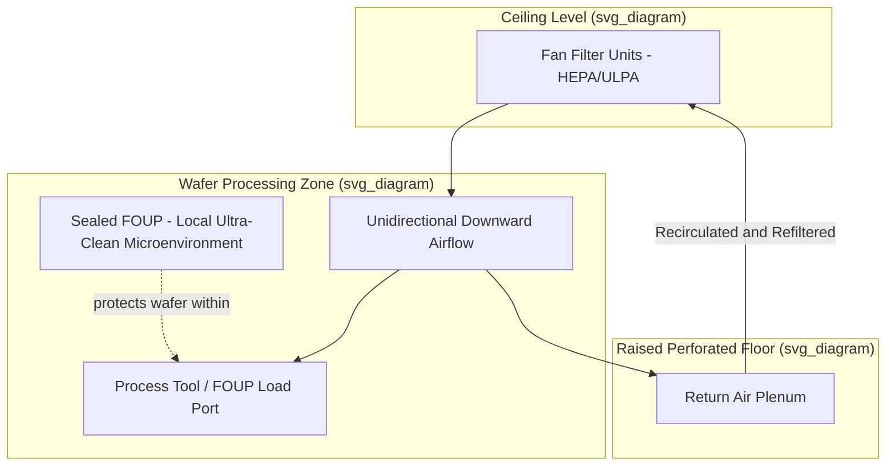

## Cleanroom Classifications and Contamination Control

### Overview

Semiconductor fabrication requires environments with particle, chemical, and other contamination levels many orders of magnitude cleaner than typical indoor or even hospital settings, because device feature sizes at advanced nodes are smaller than a single airborne dust particle, meaning even microscopic contamination can cause catastrophic yield-killing defects. Cleanroom classification systems provide standardized ways to specify, measure, and maintain the required particle cleanliness levels, while broader contamination control encompasses not just airborne particles but also chemical contamination, metallic ion contamination, electrostatic discharge (ESD), and personnel/material-handling protocols.

### Why Contamination Control Matters at Advanced Nodes

**Key Points**

- A single particle landing on a wafer during a critical lithography, etch, or deposition step can cause a **killer defect**: a short circuit, open circuit, or pattern distortion that renders one or more die non-functional.
- As transistor gate lengths and interconnect pitches have shrunk into the single-digit-nanometer to low-tens-of-nanometer range, particles that would have been electrically harmless at older, larger nodes have become fatal at advanced nodes, since the "killer particle size" is generally considered to be roughly on the order of a fraction of the critical feature dimension.
- Yield — the percentage of functional die per wafer — is directly and often nonlinearly sensitive to defect density, making contamination control one of the most economically critical aspects of fab operation; even small improvements in particle count per unit area can substantially improve profitability at high production volumes. [Inference] The precise quantitative yield-defect-density relationship depends on the specific process, die size, and defect type, and is typically modeled via yield models (e.g., Poisson or negative binomial yield models) rather than a single universal formula.

### Cleanroom Classification Standards

**Key Points**

- **ISO 14644-1** is the primary modern international standard for cleanroom classification, defining classes based on the maximum permitted concentration of airborne particles of specified sizes per cubic meter of air.
- The ISO classification number relates to allowable particle concentration through a defined formula in the standard: lower ISO class numbers correspond to cleaner environments (fewer permitted particles).
- **Federal Standard 209E** (U.S., now superseded/withdrawn in favor of ISO 14644-1 but still referenced informally in industry, particularly in legacy documentation) classified cleanrooms by the number of particles ≥0.5 micrometers permitted per cubic foot of air (e.g., "Class 1," "Class 10," "Class 100," "Class 1000" — informal shorthand still commonly used colloquially in the industry even though the formal standard has been superseded).
- **Approximate correspondence** between the two systems (commonly cited, though the standards use different measurement bases and are not perfectly equivalent):

| Fed. Std. 209E (informal) | Approximate ISO 14644-1 Class | Typical Fab Use |
| --- | --- | --- |
| Class 1 | ISO Class 3 | Critical lithography bays, leading-edge process zones |
| Class 10 | ISO Class 4 | Core wafer processing areas |
| Class 100 | ISO Class 5 | General wafer fab processing areas |
| Class 1,000 | ISO Class 6 | Sub-fab support areas, some assembly areas |
| Class 10,000 | ISO Class 7 | Gowning areas, less-critical support spaces |
| Class 100,000 | ISO Class 8 | General building/support areas |

[Unverified] The exact numeric correspondence between Fed. Std. 209E classes and ISO 14644-1 classes should be verified against the current standards documentation, as informal industry shorthand does not always precisely match the formal conversion tables.

### Cleanroom Design and Airflow Architecture

**Key Points**

- **Unidirectional (laminar) airflow**: The cleanest fab zones use vertical, unidirectional airflow — air is pushed down uniformly from a fully perforated or grated ceiling (typically through High-Efficiency Particulate Air, HEPA, or Ultra-Low Penetration Air, ULPA, filters) through the entire room cross-section and exhausted through a raised, perforated floor, continuously sweeping any generated particles downward and away from the wafer surface rather than allowing them to disperse and settle.
- **HEPA filters** remove particles down to 0.3 micrometers with very high efficiency (commonly cited as ≥99.97%); **ULPA filters** provide even higher efficiency at smaller particle sizes (commonly cited around 0.12 micrometers), used in the most critical zones. [Inference] Specific efficiency percentages and particle-size thresholds are defined by filter standards and manufacturer specifications, and exact figures should be checked against current filter certification documentation.
- **Fan Filter Units (FFUs)**: Individual ceiling-mounted units, each containing a fan and HEPA/ULPA filter, are commonly used to modularly provide unidirectional airflow across large cleanroom ceiling areas, allowing flexible zoning of cleanliness levels across a fab floor.
- **Raised (grated/perforated) flooring**: Allows air to be continuously exhausted downward through the floor into a return air plenum below, completing the unidirectional airflow loop and enabling equipment/utility routing beneath the cleanroom floor (the "sub-fab").
- **Bay-and-chase (ballroom vs. bay-chase) layout**: Many advanced fabs use a "bay-and-chase" architecture, where the cleanest unidirectional-airflow "bays" house the actual wafer-processing tools, while adjacent "chase" areas (which can be maintained at a less stringent cleanliness level) house support equipment, reducing the total volume that must be held to the highest cleanliness class and improving cost efficiency.
- **Minienvironments / SMIF (Standard Mechanical Interface) and FOUP (Front Opening Unified Pod) systems**: Wafers are transported and stored in sealed pods (FOUPs) that maintain a local, extremely clean micro-environment around the wafer, allowing the wafer's immediate surroundings to be held to a far higher cleanliness standard than the general room air, while reducing the cleanliness burden on the larger fab volume — a key strategy enabling modern fabs to achieve ISO Class 1-2 equivalent conditions immediately around the wafer without requiring the entire building to meet that standard.

### Personnel Contamination Control

**Key Points**

- **Gowning protocols**: Personnel entering cleanroom areas wear specialized garments (bunny suits/coveralls, hoods, face masks, gloves, and cleanroom-rated boots/booties) designed to contain skin flakes, hair, fibers, and other particulate sources generated by the human body, which is itself one of the largest particle sources in a cleanroom environment.
- **Gowning room procedures**: Multi-stage gowning areas with progressively cleaner zones, air showers (which use high-velocity filtered air jets to dislodge loose particles from gowned personnel before entry), and strict sequential dressing procedures are used to minimize particle introduction.
- **Material and behavior restrictions**: Cleanrooms typically restrict cosmetics, certain paper products (replaced with cleanroom-rated paper), and specific behaviors (rapid movement, certain hand gestures) known to generate or disperse particles.
- **Training and discipline**: Consistent adherence to gowning and movement protocols by all personnel is critical, since a single breach (e.g., improperly sealed gown, exposed skin) can introduce contamination that airflow design alone cannot fully compensate for.

### Beyond Particles: Broader Contamination Control Categories

**Key Points**

- **Chemical contamination (AMCs — Airborne Molecular Contaminants)**: Gaseous chemical species (acids, bases, organics, dopants) present in trace amounts in cleanroom air can react with wafer surfaces or process chemicals, causing defects even without any particulate matter present. Controlled via chemical filtration (e.g., activated carbon or chemically impregnated filters) in addition to particulate HEPA/ULPA filtration.
- **Metallic ion contamination**: Trace metal ions (e.g., sodium, potassium, iron, copper) can diffuse into silicon and severely degrade transistor electrical characteristics (e.g., shifting threshold voltage, increasing leakage) even at extremely low concentrations, requiring ultra-pure process chemicals, water (see below), and materials specifically selected for low metallic ion content.
- **Ultra-Pure Water (UPW)**: Water used for wafer rinsing and chemical dilution throughout the fab must be purified to extraordinarily high standards (removal of particles, ions, organics, bacteria, and dissolved gases) via multi-stage treatment systems, since even trace contaminants in rinse water can be deposited directly onto wafer surfaces.
- **Electrostatic Discharge (ESD) control**: Static electricity buildup on personnel, equipment, or wafers can both attract particles (electrostatically) and directly damage sensitive gate dielectrics/devices via discharge events, requiring grounded/dissipative flooring, wrist straps, ionizers, and ESD-safe material handling procedures throughout the fab.
- **Vibration and acoustic control**: While not "contamination" in the traditional sense, cleanroom facilities (especially lithography bays) also require stringent vibration isolation and acoustic control, since mechanical vibration can degrade the nanometer-scale precision required for exposure/alignment steps — an environmental control consideration closely associated with cleanroom design.

### Cleanroom Airflow Diagram

### Cleanroom Zoning Cross-Section (Conceptual SVG)

<svg xmlns="http://www.w3.org/2000/svg" viewBox="0 0 640 380">
<text x="320" y="24" text-anchor="middle" font-size="16" font-weight="bold" fill="#222">Cleanroom Bay-and-Chase Zoning (svg_diagram)</text>

<rect x="60" y="60" width="520" height="20" fill="#4a90d9" />
<text x="320" y="74" text-anchor="middle" font-size="10" fill="#fff">Fan Filter Units (HEPA/ULPA) - Ceiling</text>

<rect x="60" y="80" width="320" height="220" fill="#a0d9a5" opacity="0.3" />
<text x="220" y="100" text-anchor="middle" font-size="11" fill="#222">Bay - ISO Class 3-5</text>

<line x1="120" y1="90" x2="120" y2="290" stroke="#2e7d32" stroke-width="2" marker-end="url(#arrowdown)" />
<line x1="220" y1="90" x2="220" y2="290" stroke="#2e7d32" stroke-width="2" marker-end="url(#arrowdown)" />
<line x1="320" y1="90" x2="320" y2="290" stroke="#2e7d32" stroke-width="2" marker-end="url(#arrowdown)" />

<rect x="150" y="180" width="140" height="60" fill="#666" />
<text x="220" y="215" text-anchor="middle" font-size="10" fill="#fff">Process Tool</text>

<rect x="170" y="160" width="40" height="20" fill="#c2543f" />
<text x="190" y="174" text-anchor="middle" font-size="7" fill="#fff">FOUP</text>

<rect x="400" y="80" width="180" height="220" fill="#c98a2b" opacity="0.3" />
<text x="490" y="100" text-anchor="middle" font-size="11" fill="#222">Chase - ISO Class 6-7</text>
<rect x="430" y="150" width="120" height="80" fill="#999" />
<text x="490" y="193" text-anchor="middle" font-size="9" fill="#fff">Support Equipment</text>

<rect x="60" y="300" width="520" height="20" fill="#999" stroke="#666" />
<text x="320" y="314" text-anchor="middle" font-size="10" fill="#222">Raised Perforated Floor</text>

<rect x="60" y="320" width="520" height="40" fill="#ccc" />
<text x="320" y="344" text-anchor="middle" font-size="10" fill="#222">Sub-Fab Return Air Plenum</text>
</svg>

### Example: Killer Particle Size Concept

**Example**

For a hypothetical process with a critical feature dimension (e.g., minimum interconnect line width) of approximately 20 nm, a commonly cited rule of thumb in defect engineering is that particles roughly half the critical dimension or larger (here, on the order of 10 nm) pose a significant risk of causing a killer defect if they land in a critical pattern area during a sensitive process step. This illustrates why cleanroom classifications and filtration requirements have tightened continuously alongside feature-size scaling — a particle size that would have been irrelevant at an older 130 nm node becomes potentially fatal at a modern sub-20 nm node. [Inference] The specific killer-particle-size ratio used varies by fab, process layer, and defect-engineering methodology, and this example is illustrative of the general scaling relationship rather than a fixed industry-wide figure.

### Conclusion

Cleanroom classification (via standards like ISO 14644-1) and broader contamination control (encompassing chemical, metallic ion, ESD, and vibration management alongside particulate control) form a foundational infrastructure layer underlying all semiconductor manufacturing, without which the nanometer-scale precision required by modern transistor and interconnect fabrication would be unachievable. As feature sizes have continued to shrink, fabs have responded not simply by uniformly increasing cleanliness everywhere, but by architecting layered contamination-control strategies — bay-and-chase zoning, FOUP-based wafer microenvironments, and multi-category contamination management — that concentrate the most stringent (and expensive) cleanliness levels precisely where the wafer is most vulnerable, while managing cost across the broader facility.

**Related Topics**

- Yield models and defect density analysis
- Ultra-Pure Water (UPW) treatment systems
- Photolithography fundamentals and vibration isolation requirements
- FOUP and wafer transport automation (AMHS)
- Electrostatic discharge (ESD) protection in semiconductor manufacturing
- HEPA/ULPA filtration technology
- Metallic ion contamination and gettering techniques
- Fab facility design and sub-fab utility infrastructure