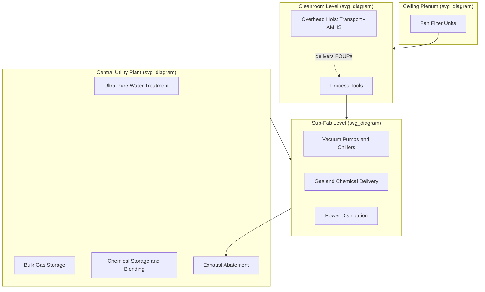

## Wafer Size Standards and Fab Infrastructure

### Overview

Wafer size — the diameter of the circular silicon substrate on which chips are fabricated — is a foundational standardization axis in semiconductor manufacturing, directly influencing die output per wafer, fab equipment design, capital cost, and industry-wide economies of scale. Alongside wafer size, the broader physical and utility infrastructure of a fab (cleanroom shell, sub-fab, gas/chemical delivery, ultra-pure water, power, and automated material handling) must be engineered as an integrated system to support high-volume, high-yield wafer processing. This entry covers both the historical progression of wafer size standards and the major categories of supporting fab infrastructure.

### Historical Progression of Wafer Size Standards

**Key Points**

- The semiconductor industry has migrated to progressively larger wafer diameters over successive decades, because larger wafers allow more die to be produced per wafer (reducing per-die processing cost, since most process steps have a largely fixed cost per wafer regardless of wafer size) and improve edge-die yield loss as a smaller fraction of total wafer area is lost to unusable edge regions.
- **Common historical and current wafer diameters**: 50 mm (2-inch), 75 mm (3-inch), 100 mm (4-inch), 125 mm (5-inch), 150 mm (6-inch), 200 mm (8-inch), and 300 mm (12-inch) — each transition historically required a substantial industry-wide retooling of fab equipment, wafer handling systems, and cleanroom infrastructure to accommodate the new size.
- **300 mm (12-inch)** has been the standard wafer size for leading-edge, high-volume logic and memory fabrication since its industry-wide adoption began in the early 2000s, and remains the dominant wafer size for advanced-node manufacturing. [Inference] The specific timeline of 300 mm adoption varied by company and region; broad industry-wide transition is commonly dated to roughly the early-to-mid 2000s.
- **200 mm (8-inch)** fabs remain in active, significant use for many mature-node, analog, power, MEMS, and specialty device applications where the cost of migrating to 300 mm tooling is not justified by the production volumes or technical requirements involved.
- **450 mm (18-inch)** was explored by parts of the industry as a potential next wafer-size transition (aiming for further per-die cost reduction), but this transition was not broadly adopted industry-wide; 300 mm has instead remained the leading-edge standard, with per-die cost reduction increasingly pursued through other means (advanced node scaling, EUV lithography, advanced packaging/chiplets) rather than a wafer-size increase. [Unverified] The current industry consensus and status of any renewed 450 mm discussion should be verified against up-to-date industry reporting, as capital equipment strategy in this area can shift.

### Why Wafer Size Matters Economically

**Key Points**

- **Die-per-wafer scaling**: Wafer area scales with the square of radius, so moving from 200 mm to 300 mm diameter (a 1.5x diameter increase) yields approximately 2.25x more usable area, translating into substantially more die output per wafer for a given die size — since many process steps (a lithography exposure sequence, a deposition run, a wafer clean) have processing costs that do not scale linearly with wafer area, larger wafers meaningfully reduce cost-per-die.
- **Edge exclusion effects**: A fixed-width unusable edge region (where process uniformity degrades near the wafer perimeter) represents a smaller *proportion* of total wafer area on a larger wafer, further improving effective yield efficiency at larger diameters.
- **Capital equipment cost trade-off**: Larger-wafer-capable process tools are more expensive and more complex (larger chambers, more stringent uniformity requirements across a wider area, heavier wafer handling robotics), so the decision to build a fab around a given wafer size involves balancing tool capital cost against the per-die cost benefits of larger wafer area — a major reason 200 mm fabs remain economically viable for many product categories rather than universally converting to 300 mm.

### Wafer Size Comparison Table

| Wafer Diameter | Common Name | Typical Era of Introduction | Primary Current Use |
| --- | --- | --- | --- |
| 150 mm | 6-inch | 1980s | Legacy/specialty, some MEMS |
| 200 mm | 8-inch | 1990s | Mature-node logic, analog, power, MEMS, specialty |
| 300 mm | 12-inch | Early 2000s | Leading-edge logic and memory (current dominant standard) |
| 450 mm | 18-inch | Explored, not broadly adopted | N/A — largely not commercialized industry-wide |

### Fab Building Infrastructure: The Cleanroom Shell and Sub-Fab

**Key Points**

- **Cleanroom (fab) level**: The elevated main processing floor, engineered per the cleanliness classification standards and unidirectional airflow architecture (bay-and-chase layout, raised perforated flooring) discussed in cleanroom contamination control, houses the actual wafer-processing tools.
- **Sub-fab level**: Located directly beneath the cleanroom floor, the sub-fab houses the majority of each process tool's support equipment — vacuum pumps, chillers, power supplies, gas/chemical delivery sub-systems, and exhaust abatement equipment — which is deliberately located below (rather than within) the cleanroom to minimize heat, vibration, and particle generation within the ultra-clean processing environment itself.
- **Structural vibration isolation**: Because lithography and other nanometer-precision steps are highly sensitive to mechanical vibration, fab buildings (especially the cleanroom floor slab) are typically engineered with massive, vibration-damped structural foundations, sometimes physically isolated from surrounding building structures and traffic-induced ground vibration.
- **Ceiling plenum**: Above the cleanroom floor, a ceiling-level air-handling plenum houses the fan filter units (FFUs) and associated ductwork that supply the unidirectional filtered airflow down into the cleanroom.

### Facility Utility Systems

**Key Points**

- **Ultra-Pure Water (UPW) system**: A large, multi-stage water treatment plant (reverse osmosis, deionization, UV treatment, filtration) produces the extraordinarily pure water required for wafer rinsing and chemical dilution throughout the fab, typically requiring its own dedicated building/plant area given the scale of water volume and treatment equipment involved.
- **Bulk and specialty gas delivery**: Fabs require an extensive gas distribution infrastructure delivering both bulk gases (nitrogen for purging/inerting, compressed dry air, oxygen) and highly specialized process gases (silane, various dopant gases, etch/deposition precursor gases) — many of which are hazardous (pyrophoric, toxic, or corrosive) and require dedicated gas cabinets, leak detection, and safety exhaust/abatement systems.
- **Chemical distribution**: Wet-process chemicals (acids, bases, solvents used in cleaning, etching, and CMP) are distributed via a Chemical Mechanical Distribution (CMD) system from a central chemical storage/blending area to point-of-use locations throughout the fab, engineered with materials compatible with highly corrosive chemistries and designed for leak containment.
- **Power infrastructure**: Semiconductor fabs are extremely power-intensive facilities (driven by process tool power draw, cleanroom HVAC/air-handling loads, and UPW/chemical system operation), typically requiring dedicated substation-level electrical infrastructure and often backup/uninterruptible power provisions for process continuity, since power interruptions during critical process steps can destroy in-process wafers.
- **Exhaust and abatement systems**: Process tool exhaust streams (containing hazardous or environmentally regulated byproducts from etch, deposition, and cleaning processes) must be treated by dedicated abatement equipment (thermal, wet scrubber, or plasma-based abatement systems) before release, to meet environmental and safety regulations.
- **Facility Monitoring and Control System (FMCS)**: An integrated building/facility automation system continuously monitors and controls environmental parameters (temperature, humidity, particle counts, gas/chemical delivery status, power quality) across the fab, since maintaining tight environmental tolerances is essential to consistent process yield.

### Automated Material Handling System (AMHS)

**Key Points**

- Modern 300 mm fabs rely heavily on **Automated Material Handling Systems (AMHS)** to transport wafers (in sealed FOUPs) between process tools, since manual wafer handling at 300 mm scale is both physically demanding (heavier, larger FOUPs) and introduces greater contamination/handling-error risk than at smaller wafer sizes.
- **Overhead Hoist Transport (OHT)** systems are the dominant AMHS architecture in modern 300 mm fabs: automated vehicles run along an overhead rail network suspended from the cleanroom ceiling, picking up and delivering FOUPs directly to tool load ports without requiring floor-level transport paths that would otherwise consume valuable cleanroom floor space and cross cleanliness zones.
- AMHS integration with fab scheduling/dispatch software allows highly automated, "lights-out" (minimal direct human intervention) wafer transport and queueing between hundreds of process tools across a fab, which is essential for managing the complexity of modern process flows involving many hundreds of sequential steps and frequent tool routing decisions.

### Fab Infrastructure Layered Diagram

### Fab Cross-Section Diagram (Conceptual SVG)

<svg xmlns="http://www.w3.org/2000/svg" viewBox="0 0 640 420">
<text x="320" y="24" text-anchor="middle" font-size="16" font-weight="bold" fill="#222">Fab Vertical Infrastructure Cross-Section (svg_diagram)</text>

<rect x="60" y="50" width="520" height="40" fill="#4a90d9" opacity="0.4" />
<text x="320" y="74" text-anchor="middle" font-size="11" fill="#222">Ceiling Plenum - FFUs / HEPA-ULPA</text>

<rect x="60" y="90" width="520" height="140" fill="#a0d9a5" opacity="0.3" />
<text x="320" y="110" text-anchor="middle" font-size="12" fill="#222">Cleanroom Level - Process Tools</text>
<rect x="100" y="140" width="80" height="60" fill="#666" />
<rect x="220" y="140" width="80" height="60" fill="#666" />
<rect x="340" y="140" width="80" height="60" fill="#666" />
<rect x="460" y="140" width="80" height="60" fill="#666" />
<text x="140" y="175" text-anchor="middle" font-size="8" fill="#fff">Tool</text>
<text x="260" y="175" text-anchor="middle" font-size="8" fill="#fff">Tool</text>
<text x="380" y="175" text-anchor="middle" font-size="8" fill="#fff">Tool</text>
<text x="500" y="175" text-anchor="middle" font-size="8" fill="#fff">Tool</text>

<line x1="60" y1="120" x2="580" y2="120" stroke="#c9302c" stroke-width="3" />
<text x="565" y="112" text-anchor="end" font-size="8" fill="#c9302c">OHT Rail</text>

<rect x="60" y="230" width="520" height="15" fill="#999" />
<text x="320" y="242" text-anchor="middle" font-size="9" fill="#222">Raised Perforated Floor</text>

<rect x="60" y="245" width="520" height="90" fill="#c98a2b" opacity="0.3" />
<text x="320" y="265" text-anchor="middle" font-size="12" fill="#222">Sub-Fab - Pumps, Chillers, Gas/Chemical Delivery</text>
<rect x="120" y="285" width="60" height="40" fill="#b8860b" />
<rect x="280" y="285" width="60" height="40" fill="#b8860b" />
<rect x="440" y="285" width="60" height="40" fill="#b8860b" />
<text x="150" y="310" text-anchor="middle" font-size="7" fill="#fff">Pump</text>
<text x="310" y="310" text-anchor="middle" font-size="7" fill="#fff">Chiller</text>
<text x="470" y="310" text-anchor="middle" font-size="7" fill="#fff">Gas Cab.</text>

<rect x="60" y="340" width="520" height="60" fill="#c2543f" opacity="0.3" />
<text x="320" y="360" text-anchor="middle" font-size="12" fill="#222">Central Utility Plant</text>
<text x="320" y="380" text-anchor="middle" font-size="9" fill="#222">UPW Treatment | Bulk Gas Storage | Chemical Blending | Abatement</text>
</svg>

### Example: Impact of Wafer Size on a Fab Decision

**Example**

A company planning a new fab for a mature-node analog/power product line with moderate production volume may deliberately choose **200 mm** wafer processing over 300 mm, because:

- The die sizes and volumes involved do not require the maximum per-die cost efficiency that 300 mm provides, while 200 mm process tools carry substantially lower capital cost.
- A large installed base of existing 200 mm equipment (including refurbished/secondary-market tools) is available at lower cost than equivalent 300 mm leading-edge tooling.
- Many specialty processes (certain MEMS, power devices, RF) remain well-suited to and cost-effectively supported on 200 mm infrastructure, without requiring migration to advanced-node-scale wafer economics.

### Conclusion

Wafer size standardization and fab infrastructure design are deeply interlinked: each wafer-size generation (150 mm through 300 mm, with 450 mm remaining largely unadopted) has driven a corresponding generation of process tool design, cleanroom architecture, and automated material handling systems engineered specifically around that wafer's physical dimensions and handling requirements. Beyond the cleanroom itself, a modern fab is a tightly integrated system of sub-fab support equipment, central utility plants (ultra-pure water, bulk gas, chemical distribution, exhaust abatement), and automated transport (AMHS/OHT) — all engineered together to deliver the environmental stability and material purity required for high-yield semiconductor manufacturing at the wafer sizes and process nodes in current production use.

**Related Topics**

- Cleanroom classifications and contamination control
- Czochralski crystal growth and wafer slicing
- Automated Material Handling Systems (AMHS) and OHT design
- Ultra-Pure Water (UPW) treatment system architecture
- Yield models and die-per-wafer economics
- IDM, foundry, and fabless business models
- Fab capital expenditure and process node economics
- Exhaust gas abatement technologies in semiconductor manufacturing