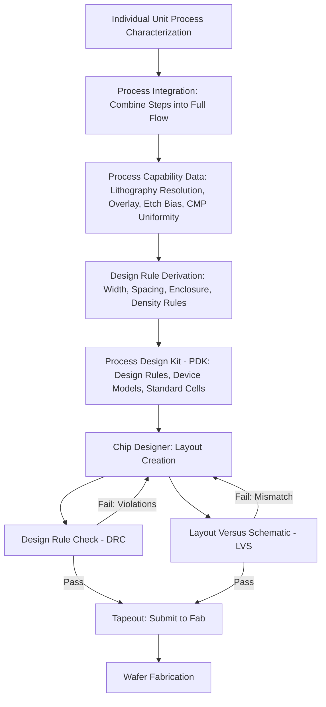

## Process Integration and Design Rules

### Overview

Process integration is the discipline of combining hundreds of individual unit processes — deposition, etch, implantation, lithography, and more — into a coherent, manufacturable sequence that produces functional, reliable devices at acceptable yield. Design rules are the codified set of geometric and electrical constraints derived from that integrated process flow, specifying the minimum dimensions, spacings, and other layout requirements that a chip design must obey to be manufacturable on a given process technology. Together, process integration and design rules form the critical interface between what a fab can physically build and what a circuit designer is permitted to draw — a boundary that every chip design must respect regardless of the underlying transistor architecture (planar, FinFET, nanosheet/GAA, CFET, FD-SOI) or business model (IDM, foundry, fabless) involved.

### What Process Integration Means

**Key Points**

- **Process integration** is the engineering task of determining the correct sequence, parameters, and interactions of individual unit process steps (each unit process — e.g., a specific etch or deposition recipe — may be independently well-characterized) such that the combined flow reliably produces working devices meeting target specifications (threshold voltage, drive current, leakage, reliability).
- This is fundamentally a **systems engineering problem**, not merely a list of steps: a change to one process step (e.g., a new gate dielectric material) can have cascading effects on subsequent steps (annealing temperature limits, contact formation compatibility, reliability characteristics), requiring integration engineers to co-optimize across the entire flow rather than each step in isolation.
- **Process integration teams** typically own the definition of the complete process flow (the sequence of FEOL, MOL, and BEOL steps as covered in "Front End versus Back End Processing"), working closely with individual module-process engineers (lithography, etch, deposition, implant specialists) and device engineers (who define target electrical specifications) to converge on a working, qualified process.
- **Process Design Kit (PDK) development** is a key output of process integration work: the PDK packages the qualified process's design rules, device models (SPICE models for transistors, capacitors, resistors), standard-cell libraries, and layout-versus-schematic (LVS) / design-rule-check (DRC) rule decks into a format that chip designers use to create manufacturable layouts.

### What Design Rules Are and Why They Exist

**Key Points**

- **Design rules** are a set of geometric constraints — minimum widths, minimum spacings, minimum overlaps, minimum enclosures, maximum densities, and similar geometric limits — that define what shapes and spacings are guaranteed to be manufacturable with acceptable yield on a specific process technology.
- Design rules exist because every physical process step has inherent limitations and variability: lithography has minimum resolvable feature size and overlay (alignment) tolerance; etch processes have minimum controllable trench/line dimensions; deposition and CMP have practical limits on how tightly adjacent structures can be packed without interacting (e.g., causing shorts, opens, or non-planarity).
- **Design Rule Manual (DRM)** or **Design Rule Guide**: The formal document (part of the PDK) specifying every design rule for a given process node, typically organized by layer (e.g., active area, poly/gate, each metal layer, via layers) and rule type (width, spacing, enclosure, density, etc.).
- Design rules are typically expressed as **absolute dimensions** (e.g., "minimum metal 1 width = X nanometers") in modern PDKs, though older methodologies sometimes used **lambda-based (scalable) design rules**, where all dimensions were expressed as multiples of a single scalable unit ($\lambda$) to allow a design to be more easily ported across process generations — a technique less common in modern advanced-node design due to the complexity and non-uniform scaling behavior of contemporary processes. [Inference] The degree to which lambda-based rules remain used in any specific context (e.g., academic teaching flows vs. commercial advanced-node design) varies and is generally limited to simplified/educational design methodologies at modern nodes.

### Common Categories of Design Rules

**Key Points**

- **Minimum width**: The smallest allowable dimension of a shape on a given layer (e.g., minimum gate length, minimum metal line width) — driven primarily by lithography resolution and etch process capability.
- **Minimum spacing**: The smallest allowable distance between two shapes on the same layer (e.g., space between adjacent metal lines) — driven by lithography resolution and the need to avoid unintended shorts or capacitive coupling.
- **Minimum enclosure**: The minimum required overlap of one layer around another (e.g., how much a contact must be enclosed by the underlying active area or metal layer) — accounts for lithographic overlay/alignment tolerance between layers, ensuring a via or contact remains fully landed even under worst-case misalignment.
- **Minimum/maximum density**: Rules constraining the fraction of a given area that must (or must not) be covered by a particular layer — often driven by CMP planarization requirements, since CMP performance depends on relatively uniform pattern density across a die to avoid dishing or erosion defects; "dummy fill" shapes are often inserted purely to satisfy density rules without serving an electrical function.
- **Antenna rules**: Constraints limiting the ratio of exposed conductor area (e.g., a long metal line) connected to a gate relative to the gate area itself, addressing a plasma-etch-induced charging phenomenon ("antenna effect") that can damage thin gate dielectrics during BEOL processing if not properly limited or relieved via protection diodes.
- **Latch-up prevention rules**: Spacing and guard-ring requirements between nFET and pFET regions (and around I/O structures) to prevent parasitic bipolar structures inherent to CMOS wells from triggering a destructive latch-up condition.
- **Electromigration (EM) and current-density rules**: Minimum metal widths (or maximum current) for a given interconnect segment based on its expected current-carrying requirement, to prevent long-term electromigration-induced interconnect failure — often provided as design guidance/checks (electrical rule checks, ERC) alongside pure geometric DRC.

### The Manufacturability-Density Trade-off

**Key Points**

- Design rules exist in fundamental tension with die area (cost): tighter (smaller) design rules allow denser layouts and smaller die (lower cost per die, more die per wafer), but tighter rules are only achievable if the process can reliably manufacture them at acceptable yield — pushing rules too aggressively relative to process capability increases defect rates and reduces yield, which can outweigh the area benefit.
- This trade-off is precisely why process integration and design-rule definition are tightly coupled activities: design rules are not chosen independently of process capability but are derived directly from characterized process capability data (lithography resolution/overlay measurements, etch bias characterization, CMP uniformity data) combined with a target yield/margin objective.
- **Design rule tightening over successive process generations** (a new node offering smaller minimum widths/spacings than its predecessor) is precisely what enables continued transistor/interconnect density scaling generation over generation, and is the direct output of process integration teams qualifying tighter process capability at each new node.

### Design Rule Checking (DRC) and Verification Flow

**Key Points**

- **Design Rule Check (DRC)**: An automated software verification step (part of the physical design/tapeout flow) that checks a completed chip layout against every rule in the process's DRM, flagging any violation before the design is submitted to the fab for manufacturing.
- **Layout Versus Schematic (LVS)**: A complementary verification step confirming that the physical layout's extracted connectivity matches the intended circuit schematic/netlist, ensuring the physical layout implements the intended circuit correctly (distinct from DRC, which checks manufacturability rather than functional correctness).
- **Design for Manufacturing (DFM)**: A broader category of guidance and checks (often "recommended" rather than strictly mandatory, unlike hard DRC rules) intended to further improve yield beyond the minimum manufacturable geometry — e.g., recommended (non-minimum) spacings in certain contexts, preferred via redundancy patterns, or preferred metal fill strategies — reflecting that "manufacturable" (passes hard DRC) and "high-yielding" are related but distinct goals.
- Tapeout (the final submission of a verified design to the foundry/fab for manufacturing) requires passing DRC and LVS (and often DFM sign-off) as a mandatory gate, since a design violating hard design rules may not be manufacturable at acceptable yield, or in some cases may not be physically producible at all.

### Process Integration and Design Rule Flow Diagram

### Design Rule Geometry Illustration (Conceptual SVG)

<svg xmlns="http://www.w3.org/2000/svg" viewBox="0 0 640 340">
<text x="320" y="24" text-anchor="middle" font-size="16" font-weight="bold" fill="#222">Common Design Rule Types (svg_diagram)</text>

<text x="100" y="60" font-size="11" fill="#222">Minimum Width</text>

<rect x="60" y="70" width="30" height="80" fill="`#4a90d9`" />

<line x1="60" y1="160" x2="90" y2="160" stroke="`#c9302c`" stroke-width="1" />

<line x1="60" y1="155" x2="60" y2="165" stroke="`#c9302c`" stroke-width="1" />

<line x1="90" y1="155" x2="90" y2="165" stroke="`#c9302c`" stroke-width="1" />

<text x="75" y="175" text-anchor="middle" font-size="9" fill="`#c9302c`">W_min</text>

<text x="230" y="60" font-size="11" fill="#222">Minimum Spacing</text>

<rect x="180" y="70" width="30" height="80" fill="`#4a90d9`" />

<rect x="245" y="70" width="30" height="80" fill="`#4a90d9`" />

<line x1="210" y1="115" x2="245" y2="115" stroke="`#c9302c`" stroke-width="1" />

<text x="227" y="105" text-anchor="middle" font-size="9" fill="`#c9302c`">S_min</text>

<text x="400" y="60" font-size="11" fill="#222">Minimum Enclosure</text>

<rect x="340" y="70" width="120" height="80" fill="`#a0d9a5`" />

<rect x="380" y="95" width="40" height="30" fill="`#c2543f`" />

<text x="400" y="115" text-anchor="middle" font-size="8" fill="#fff">Via</text>

<line x1="380" y1="95" x2="360" y2="75" stroke="`#2e7d32`" stroke-width="1" />

<text x="355" y="70" text-anchor="middle" font-size="8" fill="`#2e7d32`">Enclosure</text>

<text x="560" y="60" font-size="11" fill="#222">Density Fill</text>

<rect x="500" y="70" width="120" height="80" fill="#eee" stroke="#999" />

<rect x="510" y="80" width="15" height="15" fill="#999" />

<rect x="535" y="80" width="15" height="15" fill="#999" />

<rect x="560" y="80" width="15" height="15" fill="#999" />

<rect x="510" y="105" width="15" height="15" fill="#999" />

<rect x="535" y="105" width="15" height="15" fill="#999" />

<rect x="585" y="80" width="15" height="15" fill="#999" />

<text x="560" y="165" text-anchor="middle" font-size="8" fill="#222">Dummy fill for CMP uniformity</text>

</svg>

### Comparison: Design Rules vs. Process Capability vs. Yield Objective

| Element | Definition | Who Defines It | Primary Constraint Source |
| --- | --- | --- | --- |
| Process capability | What the fab can physically, repeatably manufacture | Process/module engineers | Equipment resolution, material physics |
| Design rules | Codified geometric limits designers must follow | Process integration/PDK team | Process capability + yield margin |
| DRC | Automated check of a layout against design rules | EDA tools, verification engineers | Design rule manual (DRM) |
| DFM guidance | Recommended (non-mandatory) practices beyond minimum rules | Process integration/DFM team | Yield optimization beyond bare manufacturability |

### Example: Why a Contact Enclosure Rule Exists

**Example**

Consider a contact via that must land on an underlying active area. If the lithography and etch steps used to pattern both the active area and the contact each have some worst-case overlay/alignment error (e.g., a few nanometers of possible misalignment between layers), the contact could, in the worst case, land partially off the active area if no margin is provided — potentially causing an open or high-resistance contact and a functional/reliability failure. The **minimum enclosure design rule** for that contact-to-active-area relationship is derived directly from the characterized overlay tolerance of the process (plus additional margin for yield), ensuring that even in a worst-case (but still process-capable) misalignment scenario, the contact remains fully landed on the active area. This illustrates the direct chain from measured process capability data to a specific, enforceable design rule.

### Conclusion

Process integration and design rules together form the essential bridge between raw process physics and manufacturable chip design: process integration engineers combine and qualify the full sequence of unit process steps into a working flow, characterize that flow's real-world capability and variability, and translate those capability limits into the geometric design rules that every chip layout must satisfy. This chain — from process characterization, through rule derivation, into automated DRC/LVS verification at tapeout — is what allows chip designers (whether within an IDM or as an external fabless customer using a foundry's PDK) to create complex, dense, high-yielding designs with confidence that their layout will be manufacturable on the target process, without needing to independently understand every underlying physical process limitation themselves.

**Related Topics**

- Process Design Kits (PDKs) and standard-cell library structure
- Design Rule Checking (DRC) and Layout Versus Schematic (LVS) verification
- Photolithography resolution and overlay tolerance
- Chemical-Mechanical Polishing (CMP) and pattern density effects
- Electromigration and interconnect reliability
- Latch-up in CMOS circuits
- Antenna effect and plasma-induced gate damage
- IDM, foundry, and fabless business models