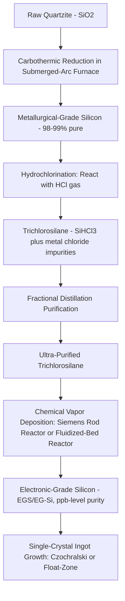

## Purification from Metallurgical to Electronic Grade Silicon

### Overview

The transformation of raw quartz into semiconductor-grade silicon proceeds through a sequence of purification stages, each removing impurities by many orders of magnitude, because the electrical properties of silicon devices are exquisitely sensitive to trace contamination. **Metallurgical-Grade Silicon (MGS)**, roughly 98–99% pure, is wholly unsuitable for semiconductor use; it must be refined to **Electronic-Grade Silicon (EGS)**, with impurity concentrations typically at the parts-per-billion level or below, before it can be used to grow single-crystal ingots for wafer fabrication. This entry covers the full purification chain from raw silica through EGS, the dominant industrial chemistry involved, and why such extreme purity is required.

### Why Extreme Purity Is Required

**Key Points**

- Silicon devices rely on precisely controlled, intentional doping (introducing specific dopant atoms at specific, engineered concentrations) to create p-type and n-type regions; uncontrolled trace impurities from the raw material would introduce unintended, uncontrolled doping and defect states that corrupt device electrical characteristics.
- **Metallic contaminants** (iron, copper, chromium, and others) are particularly damaging because many transition metals create deep-level trap states within the silicon bandgap, acting as recombination centers that degrade minority carrier lifetime and increase leakage current — effects that can occur at contamination levels far below what would be considered "pure" in most industrial materials contexts.
- The purity target for electronic-grade silicon is commonly cited as approaching **"nine-nines" (99.9999999%) purity or better** for the silicon feedstock used in semiconductor-grade crystal growth — meaning total impurity content on the order of parts per billion. [Inference] The exact purity specification varies somewhat by supplier, intended application (e.g., leading-edge logic vs. less-demanding applications), and evolving industry standards, so a specific numeric purity target should be treated as broadly representative rather than a single universal figure.
- This purity requirement is dramatically more stringent than metallurgical-grade silicon (used for applications like aluminum alloying and basic silicone chemical production), which is typically only around 98–99% pure — a difference of roughly seven to eight orders of magnitude in allowable impurity concentration between metallurgical and electronic grade.

### Stage 1: Metallurgical-Grade Silicon (MGS) Production

**Key Points**

- Raw material: high-purity quartzite or quartz (silicon dioxide, SiO$_2$) is combined with a carbon source (typically coal, coke, or wood chips) in a submerged-arc electric furnace.
- **Carbothermic reduction reaction**: at high temperature, carbon reduces silicon dioxide to elemental silicon, releasing carbon monoxide:

$$SiO_2 + 2C \rightarrow Si + 2CO\uparrow$$

- The product, **Metallurgical-Grade Silicon (MGS)**, is approximately 98–99% pure silicon, with the remaining 1–2% consisting of metallic and non-metallic impurities (iron, aluminum, calcium, and others) inherited from the raw quartzite and carbon reducing agents.
- MGS at this purity level is suitable for applications such as aluminum-silicon alloying and as a feedstock for silicone chemical products, but is entirely inadequate for semiconductor device fabrication.

### Stage 2: Conversion to Trichlorosilane (or Silane)

**Key Points**

- The dominant industrial process for further purification is the **Siemens process**, which begins by converting MGS into a volatile silicon-containing compound that can be purified far more effectively than solid silicon itself, since distillation of a liquid/gas compound achieves much higher purification efficiency per processing step than solid-state purification of silicon directly.
- **Hydrochlorination**: Powdered MGS reacts with hydrogen chloride gas (HCl) at elevated temperature, producing trichlorosilane (SiHCl$_3$) along with various metal chlorides (from the metallic impurities present in the MGS):

$$Si + 3HCl \rightarrow SiHCl_3 + H_2$$

- Trichlorosilane has a relatively low boiling point (approximately 31.8°C), making it well suited to purification via **fractional distillation**, since it can be repeatedly distilled to separate it from the various metal chloride impurity byproducts (which have different, distinguishable boiling points), achieving extremely high purity in the resulting distilled trichlorosilane.
- An alternative feedstock route produces **silane (SiH$_4$)** instead of trichlorosilane, which is used in some purification process variants (including certain fluidized-bed reactor approaches, discussed below) as the intermediate volatile compound.

### Stage 3: Chemical Vapor Deposition — Polysilicon Deposition

**Key Points**

- **Siemens process (rod reactor) method**: Purified trichlorosilane vapor, mixed with hydrogen gas, is introduced into a reactor chamber containing thin, electrically heated silicon "seed rods" (heated to roughly 1000°C via resistive/direct electrical heating). The trichlorosilane decomposes on the hot rod surface, depositing ultra-pure elemental silicon:

$$SiHCl_3 + H_2 \rightarrow Si + 3HCl$$

- Silicon deposits layer by layer onto the seed rods, gradually growing them into large-diameter polycrystalline silicon rods over the course of the deposition run (which can take many hours), after which the reactor is opened and the resulting **polysilicon rods** are harvested, later broken into chunks for downstream crystal growth.
- **Fluidized-bed reactor (FBR) method**: An alternative deposition approach in which silicon-containing gas (commonly silane) decomposes onto small silicon seed particles suspended (fluidized) in a heated gas stream within a reactor vessel, continuously growing the particles until they are large enough to be harvested as free-flowing polysilicon granules, rather than the large fixed rods produced by the Siemens process. FBR is generally associated with higher continuous throughput and different granular product handling characteristics compared to Siemens rod-reactor output. [Inference] Relative adoption, cost, and purity characteristics of FBR versus the traditional Siemens rod process vary by producer and continue to evolve; specific comparative figures should be sourced from current industry data.
- The output of this stage is **Electronic-Grade Silicon (EGS/EG-Si)**: high-purity polycrystalline silicon suitable for single-crystal ingot growth (via Czochralski or Float-Zone methods).

### Purification Chain Diagram

### Siemens Process Reactor Illustration (Conceptual SVG)

<svg xmlns="http://www.w3.org/2000/svg" viewBox="0 0 640 380">
<text x="320" y="24" text-anchor="middle" font-size="16" font-weight="bold" fill="#222">Siemens Process Rod Reactor (svg_diagram)</text>

<rect x="140" y="60" width="360" height="260" fill="none" stroke="#666" stroke-width="3" />
<text x="320" y="50" text-anchor="middle" font-size="11" fill="#222">Sealed Reactor Chamber</text>

<line x1="60" y1="120" x2="140" y2="120" stroke="#4a90d9" stroke-width="3" />
<text x="55" y="115" text-anchor="end" font-size="9" fill="#4a90d9">SiHCl3 + H2 In</text>

<line x1="500" y1="260" x2="580" y2="260" stroke="#c98a2b" stroke-width="3" />
<text x="585" y="255" text-anchor="start" font-size="9" fill="#c98a2b">HCl + Byproducts Out</text>

<line x1="220" y1="280" x2="220" y2="110" stroke="#c9302c" stroke-width="10" />
<line x1="220" y1="110" x2="420" y2="110" stroke="#c9302c" stroke-width="10" />
<line x1="420" y1="110" x2="420" y2="280" stroke="#c9302c" stroke-width="10" />
<text x="320" y="100" text-anchor="middle" font-size="10" fill="#c9302c">Heated Silicon Seed Rod (~1000°C)</text>

<rect x="200" y="280" width="40" height="20" fill="#666" />
<rect x="400" y="280" width="40" height="20" fill="#666" />
<text x="320" y="315" text-anchor="middle" font-size="9" fill="#222">Electrical Power Electrodes (Resistive Heating)</text>

<text x="320" y="150" text-anchor="middle" font-size="9" fill="`#2e7d32`">Si deposits and grows rod diameter over time</text>

</svg>

### Comparison: Metallurgical vs. Electronic Grade Silicon

| Property | Metallurgical-Grade Silicon (MGS) | Electronic-Grade Silicon (EGS) |
| --- | --- | --- |
| Typical purity | ~98–99% | ~99.9999999% (nine-nines) or better |
| Impurity level | Percent-level | Parts-per-billion level |
| Production method | Carbothermic reduction (furnace) | MGS + chlorination + distillation + CVD |
| Physical form | Solid metallurgical silicon | Polysilicon rods (Siemens) or granules (FBR) |
| Primary use | Aluminum alloying, silicone chemical feedstock | Single-crystal ingot growth for semiconductor wafers |
| Approximate impurity reduction vs. quartz | N/A (baseline refined product) | Roughly 7–8 orders of magnitude improvement over MGS |

### Example: Why Distillation, Not Direct Solid-State Purification, Is Used

**Example**

Directly purifying solid metallurgical-grade silicon to electronic-grade purity via solid-state techniques alone (e.g., zone refining directly on MGS) would be far less effective at removing the wide range of metallic impurities present, because solid-state purification techniques generally achieve more limited impurity segregation per pass compared to the separation achievable through fractional distillation of a volatile liquid compound. By first converting silicon into trichlorosilane — a compound whose boiling point differs sufficiently from the various metal-chloride impurity compounds formed during chlorination — fractional distillation can achieve extremely high single-pass and multi-pass purification efficiency, which is why the industry standard route deliberately introduces this intermediate chemical conversion step rather than attempting to purify solid silicon directly from MGS to EGS purity.

### Conclusion

The path from raw quartzite to electronic-grade silicon requires a deliberate, multi-stage purification strategy: carbothermic reduction first produces metallurgical-grade silicon at only modest purity, after which conversion to a volatile chlorosilane compound (typically via the Siemens process) enables highly effective fractional-distillation purification, followed by chemical vapor deposition to redeposit the purified silicon back into solid polysilicon form suitable for single-crystal ingot growth. This chain — furnace reduction, chlorination, distillation, and CVD redeposition — reflects the practical reality that achieving parts-per-billion-level purity requires exploiting the superior separation efficiency of liquid/gas-phase purification techniques rather than attempting to purify silicon directly in its solid form.

**Related Topics**

- Czochralski single-crystal ingot growth
- Float-zone (FZ) crystal growth for ultra-high-purity applications
- Fluidized-bed reactor polysilicon production
- Metallic ion contamination and gettering techniques
- Wafer slicing, lapping, and polishing
- Silicon dioxide (quartz) mining and raw material sourcing
- Dopant introduction and ion implantation fundamentals
- Cleanroom classifications and contamination control