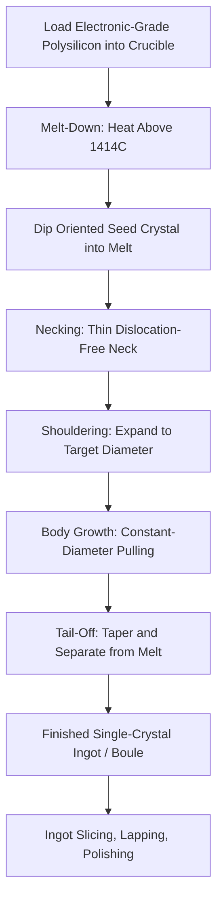

## Czochralski Crystal Growth

### Overview

The Czochralski (CZ) process is the dominant industrial method for growing large-diameter, single-crystal silicon ingots from molten electronic-grade polysilicon, forming the direct source material for the vast majority of wafers used in semiconductor manufacturing. Named after Polish chemist Jan Czochralski, who first developed the technique in 1916 (originally applied to metals, later adapted to semiconductor crystal growth), the process works by slowly pulling a rotating seed crystal from a pool of molten silicon, allowing the melt to solidify onto the seed in a continuous, single-crystal lattice.

### Physical Principle

**Key Points**

- A crucible containing electronic-grade polysilicon is heated above silicon's melting point (approximately 1414°C) inside a controlled-atmosphere furnace, typically under an inert gas (commonly argon) at reduced pressure to suppress unwanted oxidation and contamination.
- A small, precisely oriented single-crystal **seed crystal** is lowered until it just touches the surface of the molten silicon.
- The seed is slowly withdrawn (pulled upward) while simultaneously rotating, and the crucible is often counter-rotated as well; as the seed is withdrawn, molten silicon solidifies onto its bottom face, continuing the seed's single-crystal lattice structure and orientation as the growing ingot is drawn upward out of the melt.
- Careful control of pull rate, rotation rate, and melt temperature determines the diameter and quality of the growing ingot: a properly controlled pull produces a large-diameter, cylindrical, defect-minimized single crystal known as a **boule** or **ingot**.

### Process Stages of a CZ Growth Run

**Key Points**

1. **Melt-down**: Electronic-grade polysilicon chunks are loaded into a quartz crucible and heated until fully molten.
2. **Seeding**: The oriented seed crystal is lowered and dipped into the melt surface; surface tension and thermal matching allow the seed to bond with the melt without introducing crystal defects.
3. **Necking (dislocation-free neck growth)**: Immediately after seeding, the crystal is pulled rapidly to form a very thin neck (a technique developed by Dash), which allows any dislocations introduced during the initial seeding contact to grow out of the crystal (dislocations cannot easily propagate through the narrow neck), resulting in a dislocation-free crystal for the subsequent growth stages.
4. **Shouldering (crown growth)**: Pull rate is reduced and/or melt temperature adjusted to allow the crystal diameter to expand outward from the thin neck to the desired final ingot diameter, forming a cone-shaped transition region.
5. **Body growth**: Pull rate and temperature are held at steady-state conditions to grow the main cylindrical body of the ingot at constant target diameter — this is the longest stage of the run and produces the bulk of usable wafer material.
6. **Tail-off (end cone)**: Near the end of the melt, pull rate is increased to gradually taper the ingot diameter down to a point, allowing the crystal to be cleanly separated from the remaining melt without introducing thermal-shock-induced dislocations back into the finished body.

### Growth Process Diagram

### CZ Puller Apparatus Illustration (Conceptual SVG)

<svg xmlns="http://www.w3.org/2000/svg" viewBox="0 0 640 420">
<text x="320" y="24" text-anchor="middle" font-size="16" font-weight="bold" fill="#222">Czochralski Puller Apparatus (svg_diagram)</text>

<rect x="120" y="50" width="400" height="330" fill="none" stroke="#666" stroke-width="2" />
<text x="320" y="42" text-anchor="middle" font-size="10" fill="#222">Sealed Furnace Chamber - Inert Ar Atmosphere</text>

<rect x="300" y="60" width="40" height="20" fill="#666" />
<text x="320" y="55" text-anchor="middle" font-size="8" fill="#222">Pull/Rotation Mechanism</text>
<line x1="320" y1="80" x2="320" y2="150" stroke="#333" stroke-width="3" />

<rect x="312" y="150" width="16" height="30" fill="#c2543f" />
<text x="345" y="165" text-anchor="start" font-size="8" fill="#222">Seed Crystal</text>
<path d="M312,180 L306,210 L334,210 L328,180 Z" fill="#c2543f" />
<text x="345" y="195" text-anchor="start" font-size="8" fill="#222">Neck</text>

<path d="M306,210 L270,250 L370,250 L334,210 Z" fill="#4a90d9" />
<text x="380" y="230" text-anchor="start" font-size="8" fill="#222">Shoulder</text>
<rect x="270" y="250" width="100" height="80" fill="#4a90d9" />
<text x="385" y="290" text-anchor="start" font-size="8" fill="#222">Body (constant diameter)</text>

<path d="M180,330 L460,330 L440,370 L200,370 Z" fill="#999" />
<path d="M195,335 L445,335 L430,365 L210,365 Z" fill="#c98a2b" />
<text x="320" y="352" text-anchor="middle" font-size="9" fill="#222">Molten Silicon Melt</text>
<text x="320" y="385" text-anchor="middle" font-size="8" fill="#222">Quartz Crucible</text>

<rect x="150" y="325" width="20" height="50" fill="#c9302c" />
<rect x="470" y="325" width="20" height="50" fill="#c9302c" />
<text x="320" y="405" text-anchor="middle" font-size="8" fill="#c9302c">Resistive Heater Elements</text>

<text x="270" y="150" font-size="8" fill="`#2e7d32`">↻ Seed Rotation</text>

<text x="480" y="360" font-size="8" fill="`#2e7d32`">↺ Crucible Counter-Rotation</text>

</svg>

### Doping and the Segregation Coefficient

**Key Points**

- Intentional dopants (e.g., boron for p-type, phosphorus or arsenic for n-type) are commonly added to the melt during CZ growth to produce **doped substrate wafers** with a specified bulk resistivity, used as the starting substrate for subsequent device fabrication.
- Because different dopant species have different **segregation coefficients** ($k$, the ratio of dopant concentration in the solidifying crystal to that remaining in the melt at the solid-liquid interface), dopant concentration is not perfectly uniform along the length of a CZ-grown ingot — most dopants have $k < 1$, meaning the melt becomes progressively enriched in dopant as growth proceeds (since dopant preferentially remains in the liquid rather than incorporating into the solid), causing resistivity to gradually change from the seed end to the tail end of the ingot.
- This axial resistivity variation is a well-understood and characterized effect in CZ crystal growth, and wafer resistivity specifications account for the position along the original ingot from which a given wafer was sliced. [Inference] The specific magnitude of resistivity variation along an ingot depends on the dopant species, its segregation coefficient, melt volume, and growth parameters, and is typically characterized empirically for a given process rather than derived from a single universal figure.

### Characteristic CZ Contamination: Oxygen Incorporation

**Key Points**

- Because CZ growth uses a **quartz (fused silica, SiO$_2$) crucible** to hold the molten silicon, the melt continuously dissolves a measurable amount of oxygen from the crucible walls, resulting in CZ-grown silicon containing a characteristic background oxygen concentration incorporated into the crystal lattice as it solidifies — a defining difference from Float-Zone (FZ) growth, which uses no crucible and therefore produces much lower oxygen content.
- This dissolved oxygen is not purely undesirable: at controlled concentrations, interstitial oxygen can provide beneficial effects such as **internal gettering** (oxygen precipitates formed during subsequent thermal processing can trap and immobilize unwanted metallic impurities away from the active device region near the wafer surface) and can mechanically strengthen the wafer (oxygen impurities can impede dislocation motion, improving wafer resistance to warpage during high-temperature processing).
- However, excessive or poorly controlled oxygen content can also negatively affect device performance in certain contexts (e.g., contributing to certain defect formation mechanisms), so oxygen concentration is a carefully controlled and specified parameter of CZ-grown substrate material rather than simply an unavoidable contaminant to be minimized at all costs.

### Comparison: Czochralski vs. Float-Zone Growth

| Aspect | Czochralski (CZ) | Float-Zone (FZ) |
| --- | --- | --- |
| Crucible used | Yes (quartz) | No (crucible-free, molten zone floats via surface tension) |
| Oxygen content | Higher (crucible-derived) | Very low |
| Maximum practical diameter | Larger (well suited to 300 mm production) | Historically more limited |
| Dopant uniformity | Axial variation due to segregation | Can achieve more uniform doping via specific techniques |
| Typical application | Mainstream logic/memory substrate production | High-purity specialty applications (e.g., certain power devices) |
| Relative cost/throughput | Lower cost, higher throughput, industry-dominant | Higher cost, more specialized |

### Example: Necking's Role in Defect-Free Crystal Growth

**Example**

When the seed crystal first contacts the melt, the thermal shock and physical contact event almost inevitably introduces dislocations (crystal lattice defects) at the seed-melt interface. If growth proceeded directly from this point at full diameter, these dislocations would propagate upward through the entire ingot, resulting in a heavily defected crystal unsuitable for device fabrication. The **Dash necking technique** addresses this by pulling the crystal rapidly immediately after seeding, forming a very thin-diameter neck (often only a few millimeters in diameter); because dislocations propagate along specific crystallographic slip planes at an angle to the growth direction, a sufficiently thin and long neck causes the dislocations to grow outward and exit the crystal surface entirely before the diameter is expanded back to full size during shouldering — leaving the subsequent shoulder and body growth effectively dislocation-free. This technique is a foundational reason why large-diameter, high-quality single-crystal silicon ingots became practically manufacturable at industrial scale.

### Conclusion

The Czochralski process remains the industry-dominant method for growing the single-crystal silicon ingots that underlie the vast majority of semiconductor wafers, owing to its ability to reliably produce large-diameter (up to and including 300 mm-wafer-scale) crystals through a well-understood staged growth sequence — melt-down, seeding, necking, shouldering, body growth, and tail-off. Its key process signatures, including axial dopant segregation and crucible-derived oxygen incorporation, are well-characterized and, in the case of oxygen, can even be leveraged beneficially (via internal gettering) rather than being purely undesirable side effects, distinguishing CZ-grown material's characteristic properties from the crucible-free Float-Zone alternative used for more specialized ultra-high-purity applications.

**Related Topics**

- Float-Zone (FZ) crystal growth for ultra-high-purity applications
- Purification from metallurgical to electronic-grade silicon
- Wafer slicing, lapping, and polishing
- Internal gettering and metallic impurity control
- Dopant segregation coefficients and resistivity control
- Silicon-On-Insulator (SOI) wafer fabrication and layer transfer
- Epitaxial silicon layer growth
- Wafer size standards and fab infrastructure