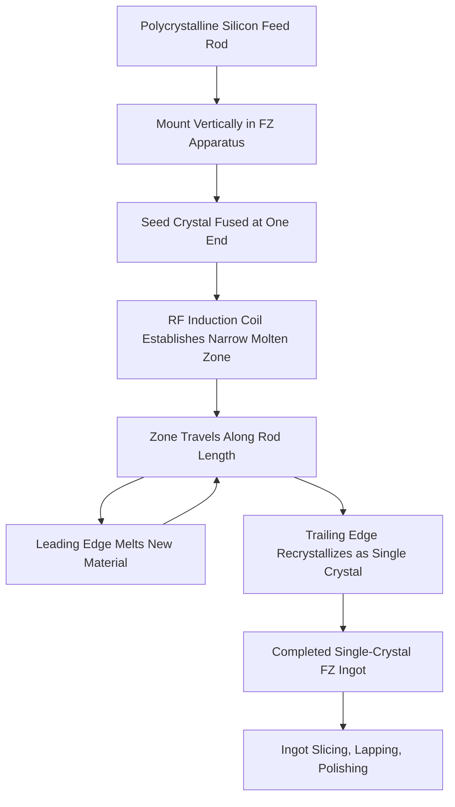

## Float Zone Crystal Growth

### Overview

Float-Zone (FZ) crystal growth is a crucible-free method for producing single-crystal silicon ingots, distinguished from the Czochralski (CZ) process by its avoidance of any physical container in contact with the molten silicon. Instead, a narrow molten zone is passed along a polycrystalline silicon rod, held in place purely by surface tension, and this molten zone progressively recrystallizes into a single crystal as it travels the length of the rod. Because no crucible ever contacts the melt, FZ-grown silicon achieves exceptionally low oxygen and carbon contamination compared to CZ material, making it the material of choice for applications demanding the highest achievable purity and highest resistivity, such as high-voltage power semiconductor devices and certain specialty/research applications.

### Physical Principle

**Key Points**

- A vertically oriented polycrystalline silicon rod (itself typically produced via the Siemens CVD process, as covered in silicon purification) is used as the starting feed material.
- A localized heating element — typically a radio-frequency (RF) induction coil — is positioned around a narrow section of the rod, melting only that thin cross-sectional "zone" while the rod material above and below remains solid.
- The molten zone is held in place entirely by the **surface tension** of the liquid silicon, without any crucible or container wall in contact with the melt — a critical distinction from CZ growth, where the melt sits within a quartz crucible.
- An oriented single-crystal seed is used at one end of the rod (similar in principle to CZ seeding), and as the RF heating coil is slowly moved along the length of the rod (or, equivalently, the rod is moved through a stationary coil), the molten zone travels with it: silicon melts at the leading edge of the zone and recrystallizes at the trailing edge, continuing the single-crystal lattice orientation established by the seed.
- Because the melt is never in contact with any foreign material (unlike CZ's quartz crucible), FZ crystals avoid the crucible-derived oxygen contamination characteristic of CZ-grown silicon, and generally achieve higher overall purity.

### Process Sequence

**Key Points**

1. **Feed rod preparation**: A high-purity polycrystalline silicon rod (from Siemens-process CVD deposition) is mounted vertically in the FZ growth apparatus.
2. **Seeding**: An oriented single-crystal seed is brought into contact with (or fused to) one end of the polycrystalline rod, and a narrow molten zone is established at the seed-rod interface using the RF induction coil.
3. **Necking (dislocation reduction)**: As in CZ growth, an initial thin-neck growth stage may be employed to allow dislocations introduced during seeding to grow out of the crystal before full diameter is established.
4. **Zone travel and crystallization**: The molten zone is progressively moved along the length of the polycrystalline feed rod (via relative motion between the rod and the RF coil), continuously melting new polycrystalline material at the leading edge and recrystallizing it as single crystal at the trailing edge behind the moving zone.
5. **Multiple pass refinement (optional)**: The floating-zone technique inherently provides a purification effect through **zone refining** — impurities with a segregation coefficient less than 1 preferentially remain in the liquid zone rather than incorporating into the solidifying crystal, so as the zone travels, impurities are effectively swept along with it toward one end of the rod; passing the molten zone through the rod multiple times can further concentrate impurities away from the bulk of the material, though for standard semiconductor-grade single-crystal growth a single well-controlled pass is generally used to establish the crystal, with the starting polysilicon feedstock already meeting electronic-grade purity from the CVD process.

### FZ Apparatus and Zone Travel Diagram

### FZ Growth Apparatus Illustration (Conceptual SVG)

<svg xmlns="http://www.w3.org/2000/svg" viewBox="0 0 640 420">
<text x="320" y="24" text-anchor="middle" font-size="16" font-weight="bold" fill="#222">Float-Zone Growth Apparatus (svg_diagram)</text>

<rect x="200" y="50" width="240" height="330" fill="none" stroke="#666" stroke-width="2" />
<text x="320" y="42" text-anchor="middle" font-size="10" fill="#222">Sealed Chamber - Inert or Vacuum Atmosphere</text>

<rect x="290" y="60" width="60" height="100" fill="#999" />
<text x="360" y="110" text-anchor="start" font-size="9" fill="#222">Polycrystalline Feed Rod</text>

<ellipse cx="320" cy="185" rx="55" ry="15" fill="none" stroke="#c9302c" stroke-width="4" />
<text x="385" y="190" text-anchor="start" font-size="9" fill="#c9302c">RF Induction Coil</text>

<rect x="295" y="175" width="50" height="20" fill="#ff8c42" />
<text x="385" y="180" text-anchor="start" font-size="9" fill="#ff8c42">Molten Zone (surface tension held)</text>

<rect x="290" y="200" width="60" height="160" fill="#4a90d9" />
<text x="360" y="280" text-anchor="start" font-size="9" fill="#222">Single-Crystal Ingot (solidified)</text>

<rect x="300" y="360" width="40" height="20" fill="#c2543f" />
<text x="360" y="375" text-anchor="start" font-size="8" fill="#222">Seed Crystal</text>

<text x="320" y="400" text-anchor="middle" font-size="10" fill="`#2e7d32`">No crucible — melt contacts only itself and ambient gas</text>

<line x1="230" y1="185" x2="230" y2="230" stroke="#333" stroke-width="1.5" />
<text x="225" y="215" text-anchor="end" font-size="8" fill="#333">Zone/coil moves downward</text>
</svg>

### Comparison: Float-Zone vs. Czochralski Growth

| Aspect | Float-Zone (FZ) | Czochralski (CZ) |
| --- | --- | --- |
| Crucible used | None (crucible-free) | Quartz crucible |
| Oxygen contamination | Very low | Higher (crucible-derived) |
| Carbon contamination | Very low | Higher (crucible/environment-derived) |
| Achievable resistivity | Very high (ultra-pure, low compensating impurities) | More limited by crucible-derived contamination |
| Maximum practical diameter | Historically more limited than CZ | Well suited to large diameters (including 300 mm) |
| Dopant uniformity control | Can use specialized techniques (e.g., neutron transmutation doping) for high uniformity | Axial variation due to segregation coefficient effects |
| Mechanical strength | Generally lower oxygen means less oxygen-hardening effect | Oxygen content can provide mechanical strengthening |
| Typical application | High-voltage power devices, ultra-high-purity/high-resistivity applications | Mainstream logic/memory substrate production |
| Relative production volume/cost | Lower volume, more specialized, generally higher cost per unit area | Industry-dominant, higher throughput, lower relative cost |

### Neutron Transmutation Doping (NTD) — A Complementary Technique

**Key Points**

- Because FZ growth is often used for high-voltage power semiconductor applications requiring extremely uniform resistivity across large-diameter wafers (uniformity requirements that are more demanding than typical logic/memory applications), FZ silicon is frequently combined with **Neutron Transmutation Doping (NTD)**, a post-growth doping technique distinct from in-melt dopant addition.
- In NTD, lightly doped or intrinsic FZ silicon ingots are irradiated with thermal neutrons in a nuclear reactor; a small fraction of the naturally occurring silicon-30 isotope captures a neutron and undergoes beta decay to become phosphorus-31, providing extremely uniform n-type doping throughout the volume of the ingot (since the doping is created by a nuclear reaction distributed uniformly by neutron flux, rather than by segregation-affected doping during crystal growth).
- This technique is generally only practical in combination with FZ (rather than CZ) material, since it requires starting from very lightly doped, high-purity silicon to achieve a precisely controlled final resistivity after the transmutation-induced doping is added. [Inference] The specific combination of FZ growth with NTD is standard practice for certain high-power device applications, though the exact scope of applications using this combination versus alternative doping approaches depends on device requirements and should be verified against current power-semiconductor manufacturing literature for specific cases.

### Example: Why FZ Is Chosen for High-Voltage Power Devices

**Example**

A high-voltage power rectifier or thyristor device requires a very thick, lightly doped, high-resistivity silicon region to support a large voltage blocking capability without breakdown. Because CZ-grown silicon's crucible-derived oxygen and carbon content can introduce unwanted deep-level defect states and limit achievable resistivity uniformity at the volumes involved, manufacturers of such high-voltage power devices commonly select **FZ-grown silicon**, often combined with NTD doping, specifically because the crucible-free growth process avoids these contamination sources and NTD provides the necessary doping uniformity across a large-diameter, thick wafer — a combination of purity and doping-uniformity requirements that FZ material is particularly well suited to meet, in contrast to the CZ material dominant in mainstream logic and memory manufacturing.

### Conclusion

Float-Zone crystal growth provides a crucible-free alternative to Czochralski growth, achieving substantially higher purity (particularly with respect to oxygen and carbon contamination) by holding the molten growth zone purely through surface tension rather than within a quartz crucible. While this comes at the cost of greater process complexity and historically more limited maximum diameter compared to CZ, FZ's purity and resistivity-uniformity advantages — often further enhanced through neutron transmutation doping — make it the material of choice for specialized applications such as high-voltage power semiconductor devices, where CZ's crucible-derived impurities and doping non-uniformity would be unacceptable, even though CZ remains the dominant, higher-throughput choice for mainstream logic and memory wafer production.

**Related Topics**

- Czochralski crystal growth
- Purification from metallurgical to electronic-grade silicon
- Zone refining and segregation coefficient principles
- Neutron Transmutation Doping (NTD) for power devices
- Wafer slicing, lapping, and polishing
- Power semiconductor device fundamentals
- Internal gettering and metallic impurity control
- Dopant segregation coefficients and resistivity control