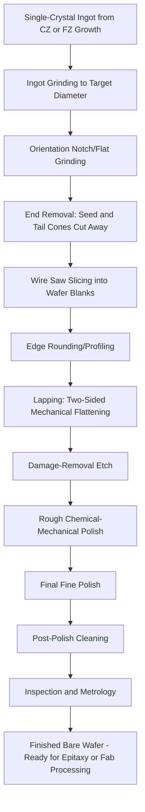

## Ingot Slicing, Lapping, and Polishing

### Overview

After a single-crystal silicon ingot has been grown (via Czochralski or Float-Zone methods), it must be transformed into individual, atomically smooth, dimensionally precise wafers before any device fabrication can begin. This transformation proceeds through a sequence of mechanical and chemical shaping operations — slicing, edge profiling, lapping, etching, and polishing — each removing damage or imperfection introduced by the previous step, ultimately producing a wafer surface flat and smooth enough to support nanometer-scale lithography and thin-film device structures.

### Stage 1: Ingot Preparation Prior to Slicing

**Key Points**

- **Ingot grinding/shaping**: The as-grown cylindrical ingot, which typically has a somewhat irregular diameter and surface from the growth process, is ground to a precise, uniform cylindrical diameter matching the target wafer size standard (e.g., exactly 300 mm).
- **Crystallographic orientation flat or notch**: A flat (older/smaller wafer sizes) or notch (standard for 200 mm and 300 mm wafers) is ground into the ingot to mark a specific crystallographic reference direction, which downstream lithography and device processing equipment use for wafer alignment and orientation tracking throughout the fab.
- **End removal**: The tapered seed and tail-end cone sections (from the necking and tail-off stages of crystal growth) are cut away, since only the constant-diameter body section of the ingot yields usable wafers.

### Stage 2: Ingot Slicing

**Key Points**

- The prepared cylindrical ingot is sliced into thin, individual wafer blanks using precision sawing equipment.
- **Wire sawing**: The dominant industrial method, in which a single continuous thin wire (typically steel), strung in a tightly spaced parallel-wire configuration across multiple guide rollers, is driven at high speed through the ingot while an abrasive slurry (or, in some processes, a fixed abrasive embedded directly in the wire) provides the cutting action, slicing many wafers simultaneously from a single ingot in one pass.
- This multi-wire slicing approach allows an entire ingot to be sliced into hundreds of wafers in a single operation, offering far higher throughput than sequential single-blade sawing methods used historically.
- **Kerf loss**: Slicing inherently removes and wastes a certain thickness of silicon as sawdust (kerf) between each cut; minimizing kerf loss (through thinner wire and optimized slicing parameters) is an ongoing area of process improvement, since kerf loss directly represents wasted, previously purified single-crystal silicon.
- The output of slicing is a stack of individual wafer blanks, each with a rough, saw-damaged surface and some thickness/flatness variation that must be corrected in subsequent steps.

### Stage 3: Edge Profiling (Edge Rounding)

**Key Points**

- The sharp, fragile edges of an as-sliced wafer (which has a simple flat-cut circular edge profile) are mechanically ground into a smooth, rounded profile using a shaped grinding wheel.
- **Purpose**: Sharp wafer edges are highly susceptible to chipping and cracking during subsequent handling, processing, and thermal cycling; edge rounding significantly reduces this risk, and also helps prevent unwanted material buildup (e.g., photoresist or deposited film accumulation) at the wafer edge during later fab processing, which could otherwise flake off and become a particle contamination source.

### Stage 4: Lapping

**Key Points**

- **Lapping** is a mechanical, two-sided abrasive flattening process performed after slicing to remove saw-blade damage (surface and subsurface microcracks introduced by the slicing operation) and to achieve precise, uniform wafer thickness and flatness across the entire wafer.
- Wafers are typically processed between two rotating lapping plates with an abrasive slurry (commonly containing alumina or similar hard abrasive particles) fed between the wafer and the plates, simultaneously flattening both sides of the wafer.
- Lapping removes a controlled amount of material (correcting for saw-induced thickness variation and bow/warp) but itself introduces a shallower layer of mechanical damage than the original saw damage, which must be removed by subsequent etching.
- [Inference] Specific lapping abrasive particle sizes and process parameters vary by wafer manufacturer and target wafer specification, and exact figures should be sourced from current wafer-supplier process documentation rather than treated as universally fixed.

### Stage 5: Etching (Damage Removal)

**Key Points**

- Following lapping, wafers undergo a chemical etching step (typically using an acidic or alkaline etchant solution) to remove the residual subsurface mechanical damage left by the lapping process, since polishing alone is generally insufficient to fully remove deeper mechanical damage without excessive material loss.
- This etch step is a **damage-removal etch** rather than a pattern-defining etch (unlike device-fabrication etch steps), uniformly removing a controlled thickness of material from both wafer surfaces to eliminate microcracks and dislocations introduced by prior mechanical processing.
- After etching, the wafer surface, while now free of significant mechanical damage, has a somewhat rough, matte (non-specular) finish that still requires final polishing to achieve the mirror-smooth surface required for device fabrication.

### Stage 6: Polishing

**Key Points**

- **Chemical-Mechanical Polishing (CMP)** at the wafer-preparation stage (distinct from, but related in principle to, the CMP process used repeatedly during BEOL interconnect fabrication) combines mechanical abrasion with a chemically reactive slurry to achieve an atomically smooth, highly planar, specular (mirror-like) wafer surface.
- **Rough polish**: An initial polishing pass using a coarser abrasive slurry rapidly removes the majority of the etched surface's remaining roughness and any residual thickness variation.
- **Final (fine) polish**: A subsequent polishing pass using an extremely fine abrasive slurry (commonly a colloidal silica-based slurry in an alkaline chemical solution) achieves the final, ultra-smooth, low-defect surface finish required for semiconductor device fabrication, typically performed on a soft polishing pad under controlled pressure and slurry flow conditions.
- **Single-side vs. double-side polishing**: While the device (front) side of the wafer always receives the final specular polish critical for lithography and device fabrication, many modern wafer specifications also call for polishing (though sometimes to a less stringent specification) of the backside, both for improved wafer flatness/handling characteristics and to reduce backside particle generation during fab handling.
- **Post-polish cleaning**: Following polishing, wafers undergo rigorous cleaning (removing residual slurry particles and any chemical/metallic contamination introduced during polishing) before final inspection and packaging for shipment to the fab.

### Complete Wafer Preparation Flow Diagram

### Wire Saw Slicing Illustration (Conceptual SVG)

<svg xmlns="http://www.w3.org/2000/svg" viewBox="0 0 640 380">
<text x="320" y="24" text-anchor="middle" font-size="16" font-weight="bold" fill="#222">Multi-Wire Saw Slicing (svg_diagram)</text>

<circle cx="100" cy="100" r="30" fill="#666" />
<circle cx="540" cy="100" r="30" fill="#666" />
<circle cx="100" cy="300" r="30" fill="#666" />
<circle cx="540" cy="300" r="30" fill="#666" />
<text x="100" y="70" text-anchor="middle" font-size="8" fill="#222">Guide Roller</text>

<g stroke="#c9302c" stroke-width="1">
<line x1="130" y1="100" x2="130" y2="300" />
<line x1="160" y1="100" x2="160" y2="300" />
<line x1="190" y1="100" x2="190" y2="300" />
<line x1="220" y1="100" x2="220" y2="300" />
<line x1="250" y1="100" x2="250" y2="300" />
<line x1="280" y1="100" x2="280" y2="300" />
<line x1="310" y1="100" x2="310" y2="300" />
<line x1="340" y1="100" x2="340" y2="300" />
<line x1="370" y1="100" x2="370" y2="300" />
<line x1="400" y1="100" x2="400" y2="300" />
<line x1="430" y1="100" x2="430" y2="300" />
<line x1="460" y1="100" x2="460" y2="300" />
<line x1="490" y1="100" x2="490" y2="300" />
</g>
<text x="530" y="130" text-anchor="start" font-size="9" fill="#c9302c">Wire Web (with abrasive slurry)</text>

<rect x="230" y="140" width="160" height="80" fill="#4a90d9" opacity="0.7" />
<text x="310" y="185" text-anchor="middle" font-size="10" fill="#fff">Silicon Ingot</text>

<line x1="310" y1="140" x2="310" y2="100" stroke="#2e7d32" stroke-width="2" marker-end="url(#arrowup)" />
<text x="310" y="90" text-anchor="middle" font-size="9" fill="#2e7d32">Ingot fed downward through wire web</text>
</svg>

### Process Stage Summary Table

| Stage | Primary Purpose | Material Removed | Resulting Surface Condition |
| --- | --- | --- | --- |
| Ingot grinding | Set precise cylindrical diameter | Outer irregular growth surface | Uniform cylindrical shape |
| Slicing | Separate ingot into wafer blanks | Kerf (saw width) between wafers | Rough, saw-damaged surface |
| Edge rounding | Reduce chipping/cracking risk | Sharp edge material | Smooth rounded edge profile |
| Lapping | Flatten and set thickness uniformity | Saw damage, thickness variation | Flat but matte, damaged subsurface |
| Etching | Remove subsurface mechanical damage | Damaged crystal layer | Rough, damage-free matte surface |
| Rough polish | Remove bulk surface roughness | Etched rough layer | Improved smoothness, some roughness remains |
| Fine polish | Achieve mirror-smooth device-ready surface | Minimal, ultra-fine removal | Atomically smooth, specular finish |

### Example: Why Etching Must Follow Lapping Before Polishing

**Example**

If polishing were attempted directly after lapping (skipping the damage-removal etch step), the polishing process would need to remove not only the visible surface roughness but also the full depth of subsurface microcracks and dislocations introduced by the lapping abrasive — a far greater and less controllable amount of material removal than polishing is designed for, risking non-uniform thickness, residual subsurface damage, and excessive processing time/cost. By inserting a chemical etch step between lapping and polishing, the bulk of the mechanical damage is removed through a fast, uniform chemical process (well suited to bulk damage removal), leaving only a comparatively thin, easily manageable layer of surface roughness for the polishing step to address — illustrating why this specific process sequence (mechanical lapping, then chemical etch, then mechanical-chemical polish) has become the industry-standard approach rather than combining or reordering these steps.

### Conclusion

Transforming a grown silicon ingot into a finished, fab-ready wafer requires a carefully sequenced combination of mechanical shaping (grinding, slicing, edge rounding, lapping) and chemical/mechanical refinement (damage-removal etching, rough and fine polishing), with each stage specifically designed to correct the type of imperfection introduced by the preceding step. The end result — a dimensionally precise, atomically smooth, defect-free single-crystal wafer — is the essential physical substrate onto which all subsequent front-end, middle-of-line, and back-end-of-line semiconductor device fabrication is built, making this preparation sequence as critical to final device yield as the crystal growth process itself.

**Related Topics**

- Czochralski crystal growth
- Float-Zone (FZ) crystal growth
- Epitaxial silicon layer growth
- Chemical-Mechanical Polishing (CMP) in BEOL interconnect fabrication
- Wafer size standards and fab infrastructure
- Wafer metrology and inspection techniques
- Silicon-On-Insulator (SOI) wafer fabrication and layer transfer
- Cleanroom classifications and contamination control