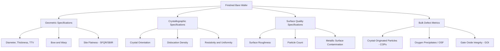

## Wafer Specifications and Defect Metrics

### Overview

A finished bare silicon wafer is characterized against a detailed set of specifications spanning geometric, electrical, crystallographic, and surface-quality parameters before it is accepted for use in device fabrication. These specifications, along with the defect metrics used to measure conformance to them, form the quality contract between wafer suppliers and semiconductor fabs (whether an IDM's internal wafer supply chain or a merchant wafer vendor supplying a foundry). This entry surveys the major categories of wafer specification and the metrology techniques used to verify them.

### Geometric Specifications

**Key Points**

- **Diameter**: The wafer's nominal diameter (e.g., 200 mm, 300 mm) must conform to the relevant industry standard within a tight tolerance, since downstream fab equipment (wafer handling robotics, process chambers, lithography steppers) is designed around exact standard dimensions.
- **Thickness**: Wafer thickness (commonly several hundred micrometers for standard 300 mm wafers) must fall within a specified tolerance band; thickness directly affects mechanical handling robustness, thermal mass during processing, and compatibility with automated handling equipment.
- **Total Thickness Variation (TTV)**: The difference between the maximum and minimum thickness measured across the wafer, indicating overall thickness uniformity — excessive TTV can cause focus/depth-of-field problems during lithography and non-uniform process results across the wafer.
- **Bow**: A measure of the wafer's overall concave or convex deformation (measured as the deviation of the wafer's median surface from a reference plane, typically with the wafer unconstrained/unclamped), reflecting global, gradual curvature across the entire wafer.
- **Warp**: A related but distinct measure capturing the overall shape deformation of the wafer, often characterized as the difference between the maximum and minimum deviations of the median surface from a reference plane, encompassing more complex (not purely bowl-shaped) deformation than bow alone.
- **Flatness (Site Flatness, e.g., SFQR)**: Rather than characterizing the whole-wafer shape, flatness metrics evaluate local flatness within small measurement "sites" across the wafer surface, since lithography exposure occurs across relatively small fields at a time and is sensitive primarily to local (not global) flatness within each exposure field.
  - **SFQR (Site Front-side least-sQuares Reference)**: A widely used site-flatness metric measuring the deviation of the wafer surface within a defined site from a least-squares reference plane fit to that site, expressed as the maximum positive or negative deviation.
  - Related metrics include SBIR (Site Back-side Ideal Range) and other site-based flatness parameters used across the industry, sometimes with vendor-specific or standard-body-specific naming conventions. [Inference] The precise set of flatness metrics referenced and their exact definitions can vary somewhat by industry standard body (e.g., SEMI standards) and specific application context; current SEMI standard documentation should be consulted for precise, up-to-date definitions.

### Crystallographic Specifications

**Key Points**

- **Crystal orientation**: The wafer surface's crystallographic plane orientation (commonly $(100)$ or $(111)$ for silicon, with $(100)$ dominant for most modern MOSFET fabrication due to its favorable interface characteristics with silicon dioxide/high-k gate dielectrics) must be controlled within a specified angular tolerance relative to the wafer surface.
- **Orientation notch/flat alignment**: The precision of the orientation notch or flat's angular alignment relative to the crystallographic reference direction is itself a specified parameter, since downstream lithography alignment systems rely on this reference.
- **Dislocation density**: For device-grade wafers, dislocation density is typically specified as essentially zero (dislocation-free), a direct consequence of the necking technique used during crystal growth; residual dislocations, if present, can propagate and cause localized device failures.
- **Resistivity and resistivity uniformity**: The bulk electrical resistivity of the wafer (determined by intentional dopant concentration introduced during crystal growth) must fall within a specified target range, with radial and axial uniformity specifications accounting for the segregation-coefficient-driven variation discussed in Czochralski crystal growth.

### Surface Quality and Particle Specifications

**Key Points**

- **Surface roughness**: Measured typically via atomic force microscopy (AFM) or optical interferometry, characterizing the microscopic surface texture remaining after final polishing; modern device-grade wafers require extremely low roughness (commonly specified at the sub-nanometer to low-nanometer RMS roughness level) to support the thin gate dielectrics and precise lithography of advanced device fabrication. [Inference] Specific roughness specification values vary by wafer grade, intended process node, and supplier, and should be sourced from current wafer specification documentation for a precise figure.
- **Particle count (surface particle contamination)**: The number of particles above a specified size threshold present on the wafer surface, measured via laser-scattering-based surface inspection systems; this is a critical yield-relevant specification, since surface particles present before device fabrication even begins can directly cause killer defects, as discussed in cleanroom contamination control.
- **Haze**: A measure of light scattering from the wafer surface caused by microscopic surface roughness or very fine, sub-detectable-size particle contamination not resolvable as discrete particle counts, providing an additional surface-quality indicator beyond discrete particle counting.
- **Metallic surface contamination**: Trace metal contamination on or near the wafer surface is specified and measured (commonly via techniques such as Total Reflection X-Ray Fluorescence, TXRF, or Vapor Phase Decomposition combined with Inductively Coupled Plasma Mass Spectrometry, VPD-ICP-MS) given the severe device-performance impact of metallic contamination discussed in the silicon purification entry.

### Bulk Defect Metrics

**Key Points**

- **Crystal-Originated Particles (COPs)**: Nanometer-scale voids or vacancy-agglomerate defects that form within the bulk crystal during growth and cooling (particularly associated with certain CZ growth conditions), which can intersect the wafer surface and act as defect sites affecting gate oxide integrity or other device characteristics; COP density and size distribution are specified and measured via specialized surface-inspection or bulk-defect-detection techniques.
- **Oxygen precipitates and Oxidation-Induced Stacking Faults (OSF)**: Because CZ-grown wafers contain characteristic interstitial oxygen (as discussed in Czochralski crystal growth), subsequent thermal processing can cause this oxygen to precipitate, potentially forming stacking-fault defects; oxygen precipitation behavior is characterized and, in some wafer specifications, deliberately engineered (e.g., via specific thermal pre-treatment of the wafer, sometimes called "magic denuded zone" processing) to keep precipitates confined to the wafer bulk (providing beneficial internal gettering) while maintaining a defect-free "denuded zone" near the surface where active devices will be built.
- **Gate Oxide Integrity (GOI)**: A bulk/near-surface crystal quality metric assessed by fabricating test gate-oxide capacitor structures on sample wafers and measuring the electrical breakdown characteristics and yield of those structures, serving as an indirect but device-relevant indicator of overall wafer crystal quality's impact on a critical device structure.

### Wafer Metrology Techniques Summary

| Parameter Category | Example Metric | Typical Measurement Technique |
| --- | --- | --- |
| Global shape | Bow, Warp | Optical interferometry, capacitive gauging |
| Local flatness | SFQR, SBIR | Site-based optical flatness scanning |
| Thickness | Thickness, TTV | Capacitive or optical thickness gauging |
| Surface particles | Particle count (by size bin) | Laser light-scattering surface scanners |
| Surface roughness | RMS roughness | Atomic Force Microscopy (AFM), optical interferometry |
| Metallic contamination | Surface metal concentration | TXRF, VPD-ICP-MS |
| Bulk crystal defects | COP density/size | Specialized defect-inspection systems (e.g., particle scanners tuned for COP detection) |
| Gate oxide quality | GOI yield/breakdown voltage | Test capacitor electrical characterization |
| Resistivity | Bulk resistivity | Four-point probe measurement |
| Crystal orientation | Orientation angle | X-ray diffraction |

### Wafer Specification Categories Diagram

### Wafer Cross-Section: Defect Zones (Conceptual SVG)

<svg xmlns="http://www.w3.org/2000/svg" viewBox="0 0 640 340">
<text x="320" y="24" text-anchor="middle" font-size="16" font-weight="bold" fill="#222">Wafer Cross-Section - Denuded Zone Concept (svg_diagram)</text>

<rect x="80" y="160" width="480" height="100" fill="#c98a2b" opacity="0.3" />
<text x="320" y="215" text-anchor="middle" font-size="11" fill="#222">Wafer Bulk - Engineered Oxygen Precipitates (Internal Gettering Sites)</text>

<rect x="80" y="120" width="480" height="40" fill="#a0d9a5" opacity="0.5" />
<text x="320" y="145" text-anchor="middle" font-size="10" fill="#222">Denuded Zone - Defect-Free, Device Layer</text>

<rect x="150" y="105" width="30" height="15" fill="#2e7d32" />
<rect x="300" y="105" width="30" height="15" fill="#2e7d32" />
<rect x="450" y="105" width="30" height="15" fill="#2e7d32" />
<text x="320" y="98" text-anchor="middle" font-size="9" fill="#222">Devices Built Here (must be defect-free)</text>

<circle cx="150" cy="190" r="4" fill="#c9302c" />
<circle cx="220" cy="220" r="4" fill="#c9302c" />
<circle cx="300" cy="195" r="4" fill="#c9302c" />
<circle cx="380" cy="230" r="4" fill="#c9302c" />
<circle cx="450" cy="200" r="4" fill="#c9302c" />
<circle cx="500" cy="220" r="4" fill="#c9302c" />
<text x="320" y="250" text-anchor="middle" font-size="9" fill="#c9302c">Oxygen precipitates trap metallic impurities (gettering)</text>

<rect x="80" y="260" width="480" height="20" fill="#999" />
<text x="320" y="274" text-anchor="middle" font-size="9" fill="#fff">Deep Bulk Substrate</text>
</svg>

### Example: How a Single Specification Failure Propagates

**Example**

Consider a wafer that passes all geometric and surface-particle specifications but has an elevated dislocation density near one edge (a crystal-quality defect not directly visible in a standard surface particle scan). When this wafer proceeds through device fabrication, transistors built directly over or near that dislocated region may exhibit anomalously high leakage current or premature electrical failure — a defect mode that would not be caught by geometric metrology (bow, warp, thickness) or surface particle counting alone, illustrating why wafer specification and inspection deliberately spans multiple independent categories (geometric, crystallographic, surface, and bulk defect metrics) rather than relying on any single measurement category to fully characterize wafer quality relevant to device yield.

### Conclusion

Wafer specifications and defect metrics collectively define the quality boundary between a raw, polished silicon wafer and a substrate genuinely suitable for advanced semiconductor device fabrication, spanning geometric precision (diameter, thickness, flatness), crystallographic quality (orientation, dislocation density, resistivity), surface cleanliness (particles, roughness, metallic contamination), and bulk crystal-defect characteristics (COPs, oxygen precipitation behavior, gate oxide integrity). Because different defect types affect device yield through entirely different physical mechanisms — a surface particle causing a lithographic pattern defect is a fundamentally different failure mode than a bulk dislocation causing localized leakage — comprehensive wafer qualification necessarily requires this full, multi-category metrology framework rather than any single summary metric, forming the quality foundation upon which all subsequent front-end device fabrication depends.

**Related Topics**

- Czochralski crystal growth
- Ingot slicing, lapping, and polishing
- Cleanroom classifications and contamination control
- Internal gettering and metallic impurity control
- Epitaxial silicon layer growth
- Yield models and defect density analysis
- Four-point probe resistivity measurement
- Process integration and design rules