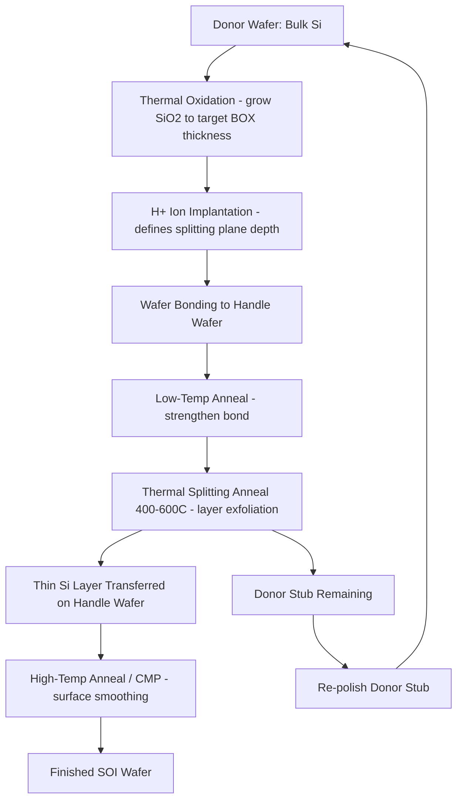

## Silicon on Insulator Wafer Fabrication

### Overview and Motivation

Silicon-on-Insulator (SOI) technology consists of a thin layer of monocrystalline silicon separated from a bulk silicon substrate (the "handle wafer") by a buried insulating layer, typically silicon dioxide (SiO₂), referred to as the Buried Oxide (BOX). This structure fundamentally alters the vertical device architecture compared to conventional bulk CMOS.

**Key Points**

- SOI eliminates parasitic substrate capacitance by isolating the active device layer from the bulk substrate
- Enables reduced junction capacitance, lower power consumption, and suppression of latch-up in CMOS circuits
- Widely used in high-performance microprocessors, RF/analog circuits, and fully depleted (FD-SOI) low-power logic
- The three principal layers are: top silicon (device layer), buried oxide (BOX), and handle substrate

### Structure Cross-Section (svg_diagram)

<svg xmlns="http://www.w3.org/2000/svg" viewBox="0 0 640 320">
<text x="320" y="24" font-size="16" font-family="sans-serif" text-anchor="middle" font-weight="bold">SOI Wafer Cross-Section (svg_diagram)</text>

<rect x="120" y="60" width="400" height="30" fill="#a8d5ba" stroke="#333" stroke-width="1.5" />
<text x="325" y="80" font-size="13" font-family="sans-serif" text-anchor="middle">Top Silicon (Device Layer, 5–100 nm typical)</text>

<rect x="120" y="90" width="400" height="50" fill="#f7d6a3" stroke="#333" stroke-width="1.5" />
<text x="325" y="120" font-size="13" font-family="sans-serif" text-anchor="middle">Buried Oxide (BOX), SiO2, 20–400 nm</text>

<rect x="120" y="140" width="400" height="120" fill="#c9c9c9" stroke="#333" stroke-width="1.5" />
<text x="325" y="205" font-size="13" font-family="sans-serif" text-anchor="middle">Handle Wafer (Bulk Silicon Substrate)</text>

<line x1="90" y1="60" x2="90" y2="90" stroke="#000" stroke-width="1" />
<line x1="90" y1="90" x2="90" y2="140" stroke="#000" stroke-width="1" />

<text x="60" y="80" font-size="11" font-family="sans-serif" text-anchor="middle">t_Si</text>

<text x="60" y="118" font-size="11" font-family="sans-serif" text-anchor="middle">t_BOX</text>

<line x1="120" y1="60" x2="520" y2="60" stroke="#000" stroke-width="2" />
<text x="325" y="50" font-size="11" font-family="sans-serif" text-anchor="middle" font-style="italic">Devices fabricated here (source/drain/channel)</text>
</svg>

### Primary Manufacturing Approaches

There are three dominant industrial methods for producing SOI substrates: SIMOX, Wafer Bonding (BESOI and Smart Cut), and Layer Transfer via Epitaxial techniques. Smart Cut (also marketed as UNIBOND) dominates modern high-volume production due to superior uniformity control and cost efficiency at scale.

#### 1. SIMOX (Separation by IMplantation of OXygen)

SIMOX was the earliest industrially viable SOI technique.

**Process Sequence:**

1. High-dose oxygen ions (typically ~10¹⁸ ions/cm²) are implanted into a bulk silicon wafer at energies around 150–200 keV
2. The implant depth is controlled by ion energy, placing the oxygen peak concentration at the desired BOX depth
3. A high-temperature anneal (1300–1350°C) in an inert or oxidizing ambient causes the implanted oxygen to react with silicon, forming a stoichiometric, buried SiO₂ layer
4. The anneal also repairs implantation-induced crystalline damage in the overlying silicon device layer

**Key Points**

- Historically limited by high defect densities (threading dislocations) in the device layer
- Requires very high implant doses, making it throughput-limited and costly for thick BOX layers
- Largely superseded by wafer bonding techniques for high-volume manufacturing, though still used in radiation-hardened and niche applications [Inference: modern SIMOX usage volume relative to bonding techniques is not precisely quantifiable without current fab-specific data]

#### 2. Wafer Bonding and Etch-Back (BESOI)

Bond-and-Etch-back SOI (BESOI) was an early bonding approach.

**Process Sequence:**

1. Two oxidized silicon wafers (a "device wafer" and a "handle wafer") are brought into intimate contact at room temperature, forming a weak Van der Waals bond
2. An anneal at elevated temperature (typically >1000°C) strengthens the bond into covalent Si–O–Si bridging
3. The device wafer is then thinned from its backside — originally hundreds of micrometers thick — down to the target device layer thickness
4. Thinning is achieved via mechanical grinding followed by chemical-mechanical polishing (CMP) or etch-back using an etch-stop layer

**Key Points**

- Etch-back is inherently difficult to control uniformly across a full wafer, since thinning removes material from an already-thick starting wafer
- Etch-stop techniques (e.g., heavily boron-doped stop layers with selective etch chemistries) improve uniformity but add process complexity
- Largely replaced in mainstream production by the Smart Cut process, which achieves far superior thickness uniformity

#### 3. Smart Cut Process (Layer Transfer via Hydrogen Implantation)

The Smart Cut process, developed at CEA-Leti and commercialized by SOITEC, is the dominant method for producing high-quality, thin, uniform SOI wafers, including engineered substrates for FD-SOI technology nodes.

**Process Sequence:**

1. **Oxidation**: A thermal oxide layer is grown on the donor wafer to the desired final BOX thickness
2. **Hydrogen (or H+/He) Implantation**: Hydrogen ions are implanted into the donor wafer through the oxide, at a dose and energy calculated to place a peak hydrogen concentration at the depth corresponding to the desired device layer thickness. This creates a buried, weakened "microcavity" plane
3. **Wafer Bonding**: The implanted donor wafer is bonded, oxide-side down, to a handle wafer at room temperature, again via Van der Waals forces followed by an initial low-temperature anneal to strengthen the bond
4. **Layer Splitting (Smart Cut/exfoliation)**: A moderate-temperature anneal (typically 400–600°C) causes the implanted hydrogen microcavities to coalesce and propagate, splitting/exfoliating the donor wafer precisely along the implant depth plane. This detaches a thin silicon layer, transferring it onto the handle wafer with the BOX now buried between them
5. **Surface Finishing**: The transferred layer surface (rough post-splitting) is smoothed via a high-temperature anneal (>1000°C) and/or CMP to achieve device-quality surface roughness
6. **Donor Wafer Reclamation**: The remaining donor wafer stub can be re-polished and reused for subsequent Smart Cut cycles, improving overall material economics

**Key Points**

- Achieves excellent device layer thickness uniformity (sub-nanometer level in advanced variants), critical for FD-SOI where channel thickness directly sets threshold voltage and electrostatics
- BOX thickness is set independently by the initial oxidation step, decoupling it from the implant/splitting parameters
- Donor wafer reuse substantially improves cost-effectiveness relative to BESOI
- Widely used to manufacture both Partially Depleted SOI (PD-SOI) and Fully Depleted SOI (FD-SOI) substrates

### Process Flow Diagram

### Device Layer and BOX Thickness Regimes

| SOI Type | Device Layer Thickness | Behavior |
| --- | --- | --- |
| PD-SOI (Partially Depleted) | ~50–100 nm | Depletion region does not extend through full film; floating-body effects present |
| FD-SOI (Fully Depleted) | ~5–20 nm | Depletion region spans entire film thickness; improved electrostatic control, reduced short-channel effects |
| SOI for RF/photonics | Varies widely, often thicker BOX (>1 μm) | Thick BOX minimizes substrate coupling losses and parasitic RF loss |

**Key Points**

- Thinner device layers in FD-SOI suppress floating-body effects that plague PD-SOI (e.g., kink effect, history-dependent threshold voltage)
- Thicker BOX layers reduce self-heating dissipation paths, since SiO₂ has much lower thermal conductivity than silicon (~1.4 W/m·K vs. ~150 W/m·K for bulk Si), so thermal design trade-offs must accompany electrical benefits [Behavior may vary depending on specific device architecture and back-end thermal design]

### Electrical Advantages Over Bulk Silicon

**Example**

For an NMOS transistor on bulk silicon, source/drain junctions form deep depletion regions extending into the substrate, contributing junction capacitance $C_j$ proportional to junction area and doping profile. On SOI, the BOX terminates the depletion region at the BOX interface, so:

$$C_j^{SOI} \ll C_j^{bulk}$$

This reduction in junction capacitance directly improves switching speed and reduces dynamic power dissipation, since dynamic power scales as:

$$P_{dynamic} = \alpha C V_{DD}^2 f$$

where a lower effective $C$ (including junction and substrate-coupled parasitic capacitance) reduces $P_{dynamic}$ at fixed switching activity $\alpha$, supply voltage $V_{DD}$, and frequency $f$.

**Key Points**

- Elimination of the parasitic bipolar path through the substrate suppresses CMOS latch-up
- Reduced source/drain junction area against the substrate lowers leakage current contributions from junction diodes
- Body-biasing in FD-SOI (via the ground plane beneath the BOX) enables dynamic threshold voltage tuning for power/performance trade-offs

### Common Defects and Metrology Considerations

**Key Points**

- **HF Defects/Blisters**: Incomplete or non-uniform hydrogen implantation in Smart Cut can cause localized blistering or incomplete layer transfer
- **Threading Dislocations**: More prevalent in SIMOX due to high-dose implant damage; density is a key quality metric
- **BOX Pinholes**: Localized defects in the buried oxide can cause electrical shorting between device layer and handle substrate, detected via techniques like photon emission microscopy or C-V mapping
- **Thickness Non-Uniformity**: Measured via spectroscopic ellipsometry across the wafer; critical for FD-SOI where device threshold voltage is highly sensitive to film thickness variation
- **Bond Voids**: Particle contamination during the room-temperature bonding step can create interfacial voids, detected via scanning acoustic microscopy (SAM)

### Applications in Advanced CMOS

**Key Points**

- **FD-SOI** (e.g., 28nm/22nm/12nm FD-SOI nodes from foundries such as GlobalFoundries and STMicroelectronics) is used for low-power IoT, automotive, and RF front-end integration due to strong body-bias tunability
- **RF-SOI** (high-resistivity handle substrates) is standard in smartphone RF switch and antenna tuner modules, minimizing substrate loss and harmonic distortion
- **Photonics-SOI** leverages the high refractive index contrast between the Si device layer and BOX to confine light in silicon photonic waveguides
- Historically, high-performance microprocessors (e.g., certain IBM and AMD product lines) used PD-SOI for clock frequency and power benefits over bulk CMOS at the same node [Unverified: specific current-generation product adoption should be confirmed against present foundry roadmaps]

### Comparison: SIMOX vs. Smart Cut

| Attribute | SIMOX | Smart Cut |
| --- | --- | --- |
| Mechanism | O+ implant + high-temp anneal (in-situ oxide formation) | H+ implant + wafer bonding + layer splitting |
| BOX thickness control | Coupled to implant dose/energy | Independently set by pre-bond thermal oxidation |
| Device layer uniformity | Moderate | Excellent (industry-leading) |
| Donor material reuse | No | Yes (donor stub reclaimed) |
| Defect density (historical) | Higher (threading dislocations) | Lower |
| Dominant use today | Niche/legacy, radiation-hard applications | Mainstream commercial SOI production |

### Next Steps

- **Fully Depleted SOI (FD-SOI) Device Architecture and Body Biasing**
- **Buried Oxide (BOX) Formation via Thermal Oxidation Kinetics (Deal-Grove Model)**
- **Ion Implantation Fundamentals: Range, Straggle, and Damage Profiles**
- **Chemical-Mechanical Polishing (CMP) for Surface Planarization**
- **Wafer Bonding Physics: Van der Waals to Covalent Bond Transition**
- **Strained Silicon on Insulator (sSOI) for Enhanced Carrier Mobility**
- **RF-SOI for Mobile Front-End Modules**
- **Silicon Photonics on SOI Platforms**