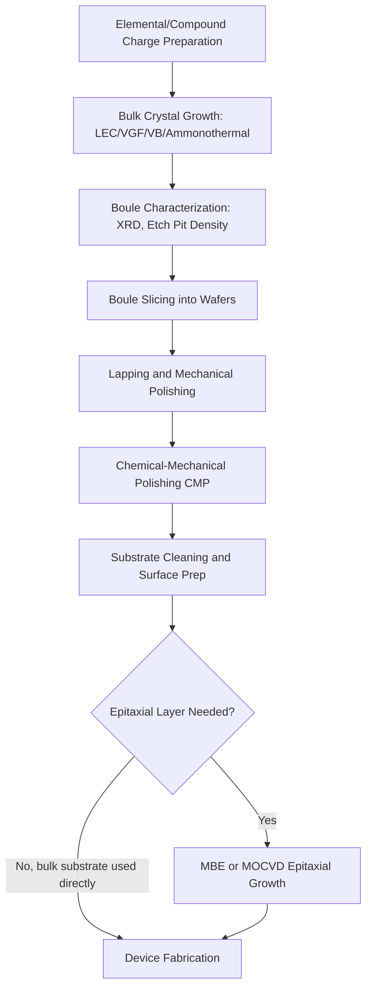

## Compound Semiconductor Substrate Growth

### Overview and Scope

Compound semiconductor substrates consist of binary, ternary, or quaternary crystalline materials formed from combinations of Group III–V elements (e.g., GaAs, InP, GaN, GaSb) or II–VI elements (e.g., CdTe, ZnSe). Unlike elemental silicon, compound semiconductor growth must maintain stoichiometric balance between constituent elements while managing significantly different vapor pressures, melting points, and thermal expansion behaviors.

**Key Points**

- Compound semiconductors offer direct bandgaps (enabling efficient light emission/absorption), higher electron mobility, and wider bandgap ranges than silicon
- Growth complexity exceeds silicon due to multi-element stoichiometry control, higher defect sensitivity, and often incongruent melting behavior
- Primary substrate materials: GaAs, InP, GaN, SiC (wide-bandgap), GaSb, and CdTe
- Applications span RF/microwave devices, LEDs, laser diodes, photovoltaics, power electronics, and infrared detectors

### Fundamental Growth Challenges vs. Silicon

**Key Points**

- **Stoichiometry control**: Maintaining exact 1:1 (or ratio-specific) atomic composition is critical; deviations create point defects (vacancies, antisites) that degrade electronic properties
- **Differential vapor pressure**: In III-V compounds like GaAs, arsenic has a much higher vapor pressure than gallium at the melting point, causing preferential As loss unless overpressure is controlled
- **Congruent vs. incongruent melting**: Many compounds do not melt congruently (i.e., the liquid composition differs from the solid), complicating melt-based growth techniques
- **Native substrate availability**: Some materials (notably GaN) lack large, low-defect-density native substrates, forcing heteroepitaxial growth on foreign substrates (sapphire, SiC, Si) with associated lattice/thermal mismatch defects

### Primary Bulk Growth Techniques

#### 1. Liquid Encapsulated Czochralski (LEC)

LEC is an adaptation of the standard Czochralski method specifically developed to grow III-V compounds with volatile constituents, most notably GaAs and InP.

**Process Sequence:**

1. Polycrystalline compound semiconductor charge (e.g., GaAs) is loaded into a crucible along with a layer of boric oxide (B₂O₃), the encapsulant
2. The charge is heated above its melting point (~1238°C for GaAs) under high inert gas pressure (typically several atmospheres)
3. The molten B₂O₃ encapsulant floats atop the melt, forming a liquid seal that suppresses arsenic sublimation by physically blocking its escape path
4. A seed crystal is dipped through the encapsulant layer into the melt and slowly withdrawn while rotating, per standard Czochralski pulling mechanics
5. Diameter control is achieved by adjusting pull rate and thermal gradients, analogous to silicon CZ growth

**Key Points**

- High ambient pressure (often 60+ atm of inert gas) is required to further suppress dissociation and volatilization
- LEC-grown GaAs historically exhibits higher dislocation densities (~10⁴–10⁵ cm⁻²) than silicon CZ crystals due to large thermal gradients needed to contain the encapsulant and suppress convection instabilities
- Largely used for semi-insulating GaAs substrates for RF/microwave device fabrication

#### 2. Vertical Gradient Freeze (VGF) and Vertical Bridgman (VB)

VGF and VB techniques grow crystals by directional solidification within a stationary crucible, offering lower thermal gradients and correspondingly lower dislocation densities than LEC.

**Process Sequence:**

1. A polycrystalline charge is melted within a crucible (often pyrolytic boron nitride, PBN) positioned within a furnace with a controlled axial temperature gradient
2. A seed crystal at the bottom (VB) or a shaped crucible tip (VGF) initiates single-crystal nucleation
3. The furnace temperature profile is progressively shifted (VB: by moving the crucible or furnace; VGF: by lowering furnace zone temperatures electronically without mechanical movement) such that the solidification front moves through the melt from the seed end
4. The controlled, low thermal gradient (compared to LEC) minimizes thermally-induced dislocation generation

**Key Points**

- VGF avoids mechanical crucible/furnace movement (unlike VB), improving crystal quality by minimizing vibration-induced defects
- Produces substrates with dislocation densities typically an order of magnitude lower than LEC-grown material
- Widely used for GaAs and InP substrates targeting optoelectronic and high-reliability RF applications
- Encapsulation (e.g., B₂O₃ layer) may still be used to control volatile element loss, though closed ampoule configurations are also common

#### 3. High-Pressure/High-Temperature Bulk Growth for GaN

Native GaN substrate growth remains exceptionally difficult due to GaN's extremely high melting point and dissociation pressure requirements.

**Key Points**

- **Ammonothermal growth**: Analogous to hydrothermal quartz growth, GaN is grown from a supercritical ammonia solvent under high pressure and moderate temperature, using seed crystals for nucleation
- **HVPE (Hydride Vapor Phase Epitaxy) thick-film growth**: GaN boules are grown via vapor-phase deposition to thicknesses of millimeters, then sliced into free-standing GaN wafers
- **Na-flux method**: GaN crystallization from a sodium-gallium melt under nitrogen overpressure, operating at lower pressures/temperatures than direct melt growth
- Native GaN substrates remain costly and limited in diameter (historically ≤2–4 inches for many high-quality variants), driving continued reliance on heteroepitaxial GaN-on-sapphire, GaN-on-SiC, and GaN-on-Si approaches for most commercial devices [Inference: exact current commercial diameter/cost figures require verification against present supplier data]

### Epitaxial Growth Techniques for Compound Semiconductor Layers

While the above techniques produce bulk substrates, most device-quality compound semiconductor material is grown as thin epitaxial layers atop a bulk (often lattice-matched) substrate.

#### Molecular Beam Epitaxy (MBE)

**Process Sequence:**

1. An ultra-high vacuum (UHV) chamber (typically <10⁻¹⁰ Torr base pressure) houses effusion cells (Knudsen cells) containing elemental sources (e.g., Ga, As, In, Al)
2. Sources are resistively heated to generate molecular/atomic beams directed at a heated substrate
3. Shutters in front of each effusion cell allow precise, rapid on/off control of individual elemental fluxes, enabling atomically abrupt composition and doping profile changes
4. Growth proceeds at rates on the order of 1 monolayer per second, with in-situ Reflection High-Energy Electron Diffraction (RHEED) monitoring surface reconstruction and growth rate in real time

**Key Points**

- Provides the highest achievable interface abruptness and thickness control among compound semiconductor epitaxy methods, critical for quantum well and superlattice structures
- Low throughput and high equipment cost relative to MOCVD, generally reserved for research and high-value RF/photonic device layers
- As beam flux (via effusion cell temperature) directly controls stoichiometry; substrate temperature governs surface migration and defect incorporation

#### Metal-Organic Chemical Vapor Deposition (MOCVD/MOVPE)

**Process Sequence:**

1. Metal-organic precursor gases (e.g., trimethylgallium (TMGa), trimethylindium (TMIn), trimethylaluminum (TMAl)) and hydride gases (e.g., arsine AsH₃, phosphine PH₃, ammonia NH₃ for nitrides) are introduced into a reactor chamber via carrier gas (typically H₂ or N₂)
2. The heated substrate (typically 500–1100°C depending on material system) induces pyrolytic decomposition of the precursors at the surface
3. Decomposed group III and group V (or nitride) species react and incorporate into the growing crystal lattice
4. Growth rate and composition are controlled via precursor partial pressures, flow rates, and susceptor temperature

**Key Points**

- Dominant industrial technique for high-volume compound semiconductor production, including LEDs, laser diodes, GaN power devices, and solar cell epitaxial stacks
- Higher throughput than MBE due to atmospheric or reduced-pressure (not UHV) operation and multi-wafer reactor configurations
- Precursor toxicity (arsine, phosphine are highly toxic gases) necessitates stringent safety and gas-handling infrastructure
- V/III ratio (ratio of group V to group III precursor flow) is a critical process parameter controlling stoichiometry and defect incorporation

### Lattice Matching and Heteroepitaxy Considerations

**Example**

For epitaxial growth of a layer with lattice constant $a_{epi}$ on a substrate with lattice constant $a_{sub}$, the lattice mismatch is defined as:

$$f = \frac{a_{epi} - a_{sub}}{a_{sub}}$$

When $f \neq 0$, the epitaxial layer accumulates strain energy as thickness increases. Beyond a **critical thickness** $h_c$, this strain is relieved through the introduction of misfit dislocations, which propagate as threading dislocations into the active device region and degrade performance (e.g., reduced minority carrier lifetime, increased leakage).

**Key Points**

- GaAs/AlGaAs is a near-ideal lattice-matched system (mismatch <0.1% across most compositions), enabling high-quality heterostructures widely used in HBTs and laser diodes
- GaN-on-sapphire exhibits substantial lattice mismatch (~16%) and thermal expansion mismatch, requiring low-temperature nucleation layers (AlN or GaN buffer layers) to accommodate strain and reduce threading dislocation density
- InGaAs/InP systems require careful indium composition control to maintain lattice match, since indium content directly shifts both bandgap and lattice constant

### Comparison of Substrate Growth Methods

| Technique | Primary Materials | Dislocation Density | Throughput | Typical Use |
| --- | --- | --- | --- | --- |
| LEC | GaAs, InP | Higher (~10⁴–10⁵ cm⁻²) | Moderate | Semi-insulating RF substrates |
| VGF/VB | GaAs, InP | Lower (~10³–10⁴ cm⁻²) | Moderate | Optoelectronics, high-reliability RF |
| Ammonothermal/HVPE/Na-flux | GaN | Low (native, when achievable) | Low, costly | High-power/high-frequency GaN devices |
| MBE | GaAs, InP, GaN, Sb-based | N/A (epitaxial, substrate-dependent) | Low | Quantum structures, research, RF HEMTs |
| MOCVD | GaAs, InP, GaN, GaP | N/A (epitaxial, substrate-dependent) | High | LEDs, laser diodes, power GaN, solar cells |

### Process Flow: Bulk Boule to Device-Ready Substrate

### Defect Characterization Methods

**Key Points**

- **Etch Pit Density (EPD)**: Chemical etching reveals dislocation termination points at the surface as visible pits, counted under microscopy to quantify dislocation density
- **X-Ray Diffraction (XRD)**: Rocking curve full-width-half-maximum (FWHM) indicates crystalline quality and mosaic spread; reciprocal space mapping quantifies strain and composition in heteroepitaxial layers
- **Photoluminescence (PL)**: Non-destructive optical technique correlating emission intensity/linewidth with defect density and compositional uniformity, particularly valuable for direct-bandgap materials
- **Transmission Electron Microscopy (TEM)**: Direct imaging of threading/misfit dislocations at heteroepitaxial interfaces, providing atomic-scale defect analysis

### Applications by Material System

**Key Points**

- **GaAs**: RF power amplifiers, HBTs, solar cells (space-grade multi-junction), historically dominant in mobile RF front-ends
- **InP**: High-speed photonic devices (1550 nm laser diodes, photodetectors for telecom), high-frequency HEMTs
- **GaN**: Power electronics (high breakdown field), RF power amplifiers for 5G infrastructure, blue/UV LEDs and laser diodes
- **SiC**: Though not III-V, frequently discussed alongside GaN as a wide-bandgap power substrate; also serves as a common heteroepitaxial substrate for GaN growth due to closer lattice/thermal match than sapphire
- **CdTe/II-VI materials**: Thin-film photovoltaics, infrared detector substrates (e.g., CdZnTe for HgCdTe epitaxy)

### Next Steps

- **Czochralski Silicon Growth (for comparative contrast with compound methods)**
- **Molecular Beam Epitaxy: RHEED Oscillations and Growth Rate Calibration**
- **MOCVD Reactor Design: Horizontal vs. Vertical vs. Close-Coupled Showerhead**
- **Heteroepitaxial Defect Engineering: Buffer Layers and Strain Relaxation**
- **Wide-Bandgap Semiconductor Power Device Fundamentals (GaN, SiC)**
- **Wafer Slicing, Lapping, and CMP for Compound Semiconductors**
- **Lattice-Matched vs. Pseudomorphic Heterostructure Design**
- **Semi-Insulating GaAs: Deep-Level Defects (EL2) and Charge Compensation**