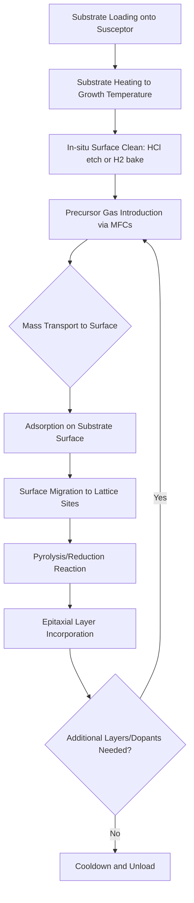

## Vapor Phase Epitaxy

### Overview and Fundamental Principle

Vapor Phase Epitaxy (VPE) is a family of thin-film growth techniques in which crystalline semiconductor layers are deposited onto a substrate from gaseous precursor species that undergo chemical reactions at or near a heated substrate surface. The deposited layer inherits the crystallographic orientation of the underlying substrate, forming an epitaxial (crystallographically aligned) film.

**Key Points**

- VPE encompasses multiple sub-techniques distinguished by precursor chemistry: Chloride VPE, Hydride VPE (HVPE), and Metal-Organic VPE (MOVPE/MOCVD)
- Growth occurs via mass transport of reactive species to the surface, adsorption, surface migration, chemical reaction/decomposition, and incorporation into the crystal lattice
- Widely used for silicon epitaxial layers in CMOS processing, III-V compound semiconductor device structures, and thick GaN boule growth
- Distinguished from Liquid Phase Epitaxy (LPE, growth from a saturated melt) and Molecular Beam Epitaxy (MBE, physical vapor deposition under ultra-high vacuum)

### General VPE Reactor Architecture

**Key Points**

- **Gas delivery system**: Mass flow controllers (MFCs) precisely meter carrier gases (H₂, N₂) and precursor gases/vapors into the reaction chamber
- **Reaction chamber**: Houses the substrate on a heated susceptor; geometry varies (horizontal, vertical, barrel, or showerhead configurations)
- **Susceptor/heating system**: Typically graphite susceptors heated via RF induction or resistive heating elements, maintaining substrate temperatures from ~500°C to over 1200°C depending on material system
- **Exhaust/scrubber system**: Removes reaction byproducts and unreacted toxic precursors (particularly critical for arsine, phosphine, and chlorosilane chemistries)
- **Temperature and pressure control**: Growth can occur at atmospheric pressure (APCVD-style) or reduced pressure (RPCVD), affecting boundary layer thickness and mass transport kinetics

### Silicon Vapor Phase Epitaxy (Chlorosilane Chemistry)

Silicon VPE is foundational to CMOS manufacturing, used to grow lightly doped epitaxial layers on heavily doped substrates for latch-up suppression, and to form defect-free active regions.

**Process Chemistry:**

The dominant industrial precursor is silicon tetrachloride (SiCl₄), trichlorosilane (SiHCl₃), dichlorosilane (SiH₂Cl₂), or silane (SiH₄), each offering different growth rate/temperature/purity trade-offs.

The overall reduction reaction for SiCl₄ with hydrogen is:

$$SiCl_4 + 2H_2 \rightarrow Si + 4HCl$$

For dichlorosilane, a common lower-temperature alternative:

$$SiH_2Cl_2 \rightarrow Si + 2HCl$$

**Process Sequence:**

1. Substrate wafers are loaded onto a graphite susceptor and heated to the target growth temperature (typically 900–1200°C for chlorosilane chemistries, lower for silane)
2. An in-situ HCl vapor etch step is commonly performed immediately prior to growth to remove native oxide and surface contamination, ensuring a pristine epitaxial nucleation surface
3. Precursor gas (e.g., SiCl₄ or SiH₂Cl₂) mixed with H₂ carrier gas flows over the heated substrate
4. Pyrolytic/reductive decomposition deposits silicon atoms, which migrate along the surface to lattice sites, extending the crystal structure of the substrate
5. Dopant gases (e.g., diborane B₂H₆ for p-type, phosphine PH₃ or arsine AsH₃ for n-type) are co-introduced to achieve in-situ doped epitaxial layers with controlled resistivity

**Key Points**

- Growth rate and layer quality are highly sensitive to the Cl/H ratio; excess HCl byproduct can etch the growing film if precursor concentration is too low relative to temperature
- Higher-chlorine-content precursors (SiCl₄) require higher deposition temperatures than lower-chlorine precursors (SiH₂Cl₄, SiH₄), offering a trade-off between growth rate, autodoping suppression, and thermal budget
- Autodoping (unwanted diffusion of dopants from the substrate into the growing epitaxial layer via vapor-phase transport) is a key defect mechanism, mitigated by lower growth temperatures and reduced-pressure operation

### Hydride Vapor Phase Epitaxy (HVPE)

HVPE is a high-growth-rate VPE variant primarily used for III-V and III-nitride materials, notably enabling thick, low-defect-density GaN boule/template growth.

**Process Chemistry (GaN example):**

1. Hydrogen chloride (HCl) gas is passed over a liquid gallium source at elevated temperature, forming gallium chloride (GaCl) in-situ:

$$2Ga(l) + 2HCl(g) \rightarrow 2GaCl(g) + H_2(g)$$

2. The GaCl vapor is then transported to the growth zone where it reacts with ammonia (NH₃):

$$GaCl(g) + NH_3(g) \rightarrow GaN(s) + HCl(g) + H_2(g)$$

**Key Points**

- HVPE achieves substantially higher growth rates (tens of μm/hour) than MOCVD or MBE, making it the preferred method for producing thick GaN templates and free-standing GaN substrates
- Two-zone reactor design is essential: a source zone for GaCl generation and a separate, cooler deposition zone for the GaN-forming reaction
- Also historically significant for early GaAs and GaAsP LED epitaxy prior to MOCVD dominance
- Growth is generally less suited to abrupt heterojunction formation compared to MOCVD or MBE, due to gas-phase transport lag between zones limiting rapid switching of composition

### Metal-Organic Vapor Phase Epitaxy (MOVPE/MOCVD)

MOVPE, more commonly termed MOCVD in industrial contexts, uses metal-organic precursors rather than halide or hydride sources, enabling lower growth temperatures and precise heterostructure control.

**Process Sequence:**

1. Metal-organic precursors (trimethylgallium, trimethylindium, trimethylaluminum) are held in bubblers at controlled temperature/pressure; carrier gas (H₂ or N₂) is bubbled through to entrain a controlled vapor partial pressure
2. Group V or nitride hydrides (arsine, phosphine, ammonia) are introduced separately to prevent premature gas-phase reaction (parasitic pre-reaction) before reaching the substrate
3. Gas streams combine just above the heated susceptor, where pyrolysis and surface reactions deposit the compound semiconductor layer
4. Precise, computer-controlled switching of precursor flows enables abrupt composition transitions for heterostructures, quantum wells, and superlattices

**Key Points**

- Operates at substrate temperatures generally lower than HVPE (500–1100°C depending on material), reducing thermal budget and interdiffusion
- The V/III ratio (relative flow of group V to group III precursors) is a critical parameter controlling surface stoichiometry, morphology, and point defect incorporation
- Dominant technique for commercial LED, laser diode, and RF/power GaN device epitaxy due to high throughput (multi-wafer planetary or close-coupled showerhead reactors) and compositional precision
- Susceptible to gas-phase parasitic reactions between group III and group V precursors upstream of the substrate if reactor geometry and flow dynamics are not carefully engineered

### Comparison of VPE Variants

| Technique | Typical Precursors | Growth Rate | Temperature Range | Primary Application |
| --- | --- | --- | --- | --- |
| Chloride/Silane Si-VPE | SiCl₄, SiH₂Cl₂, SiH₄ | Moderate (~0.1–5 μm/min) | 900–1200°C (chlorosilanes), lower for silane | CMOS epitaxial layers, latch-up suppression |
| HVPE | GaCl (from HCl+Ga), NH₃ | High (tens of μm/hr) | 900–1100°C | Thick GaN templates/boules, free-standing GaN substrates |
| MOVPE/MOCVD | TMGa, TMIn, TMAl, AsH₃, PH₃, NH₃ | Moderate (~μm/hr range) | 500–1100°C (material-dependent) | LEDs, laser diodes, HEMTs, power GaN, solar cells |

### Mass Transport and Growth Kinetics

VPE growth rate is governed by the interplay of gas-phase mass transport and surface reaction kinetics, typically described through a boundary layer model.

**Key Points**

- At low temperatures, growth is **reaction-rate limited**: the surface chemical reaction is the slowest step, and growth rate increases exponentially with temperature following Arrhenius-type behavior
- At high temperatures, growth becomes **mass-transport limited**: precursor diffusion through the boundary layer above the substrate becomes rate-limiting, and growth rate becomes largely temperature-insensitive but sensitive to gas flow velocity and reactor geometry
- The transition between these regimes defines the optimal process window for uniform, reproducible growth rates across a wafer or reactor batch
- Reduced-pressure operation increases the boundary layer diffusion coefficient, improving uniformity and reducing unwanted gas-phase reactions, at the cost of additional vacuum pumping infrastructure

### Process Flow Diagram

### Defect Mechanisms and Quality Control

**Key Points**

- **Autodoping**: Vapor-phase transport of dopants desorbing from the heavily doped substrate into the growing lightly doped epitaxial layer, degrading the intended doping profile abruptness
- **Stacking faults**: Nucleate at surface contamination sites (e.g., residual oxide particles) and propagate through the epitaxial layer; minimized via rigorous pre-growth surface cleaning
- **Haze and surface morphology defects**: Arise from parasitic gas-phase nucleation (homogeneous nucleation in the gas phase rather than at the substrate surface), particularly problematic in MOCVD at high precursor partial pressures
- **Pattern shift/pattern distortion**: In selective epitaxial growth (SEG) processes, lateral diffusion during growth can distort pre-existing surface patterns, relevant to advanced CMOS source/drain epitaxial engineering
- Characterization techniques include secondary ion mass spectrometry (SIMS) for dopant profiling, spreading resistance profiling, cross-sectional TEM, and X-ray diffraction rocking curves for crystalline quality

### Applications Summary

**Key Points**

- **CMOS logic**: Lightly doped epitaxial silicon layers grown on heavily doped substrates to suppress latch-up and control threshold voltage uniformity
- **Advanced source/drain engineering**: Selective epitaxial growth of strained SiGe (compressive, for PMOS) or Si:C (tensile, for NMOS) to enhance carrier mobility
- **Power/RF GaN devices**: MOCVD-grown AlGaN/GaN heterostructures on SiC or Si substrates for HEMT fabrication
- **LEDs and laser diodes**: MOCVD-grown multi-quantum-well active regions in InGaN/GaN (visible) and InGaAsP/InP (telecom) systems
- **Bulk GaN substrate production**: HVPE-grown thick GaN layers, subsequently separated from the growth substrate to yield free-standing GaN wafers

### Next Steps

- **Selective Epitaxial Growth (SEG) for Strained Source/Drain Engineering**
- **Metal-Organic Chemical Vapor Deposition Reactor Design**
- **Molecular Beam Epitaxy vs. VPE: Growth Mechanism Comparison**
- **Autodoping and Dopant Diffusion Control in Epitaxial Layers**
- **HVPE-Grown Free-Standing GaN Substrate Fabrication**
- **Boundary Layer Theory and Mass Transport in CVD Reactors**
- **In-Situ Surface Preparation: HCl Vapor Etch and H2 Bake**
- **Heteroepitaxial Strain Relaxation and Critical Thickness**