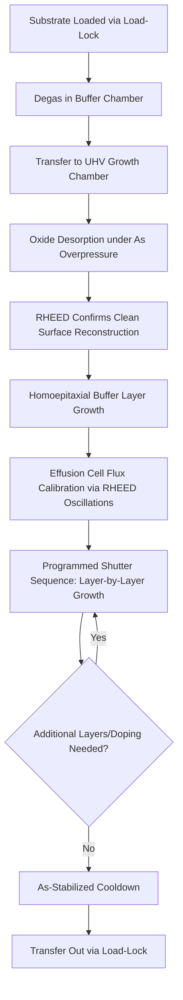

## Molecular Beam Epitaxy

### Overview and Fundamental Principle

Molecular Beam Epitaxy (MBE) is an ultra-high vacuum (UHV) physical vapor deposition technique in which crystalline epitaxial layers are grown by directing thermally generated beams of atoms or molecules onto a heated crystalline substrate. Unlike vapor phase epitaxy, MBE growth occurs through physical condensation and surface reaction rather than gas-phase chemical decomposition of precursor compounds, enabling exceptional control over layer thickness, composition, and doping at near-atomic precision.

**Key Points**

- Operates under UHV conditions (base pressure typically <10⁻¹⁰ Torr), ensuring long mean free paths so that emitted species travel in straight, collision-free "molecular beams" to the substrate
- Provides the highest achievable abruptness of composition and doping profiles among epitaxial techniques, critical for quantum wells, superlattices, and heterojunction devices
- Growth rates are slow (typically ~1 monolayer per second, or roughly 0.1–1 μm/hour), favoring precision over throughput
- Widely used for III-V compound semiconductors (GaAs, AlGaAs, InP, InGaAs, GaN), II-VI materials, and increasingly for silicon-based heterostructures (SiGe)

### MBE System Architecture

**Key Points**

- **Growth chamber**: The central UHV chamber housing the substrate manipulator, effusion cells, and in-situ diagnostic equipment
- **Effusion cells (Knudsen cells)**: Resistively heated crucibles containing high-purity elemental solid or liquid sources (Ga, Al, In, As, Sb, dopants); heating generates a controlled vapor flux directed toward the substrate
- **Shutters**: Mechanical shutters positioned in front of each effusion cell orifice allow near-instantaneous (sub-second) on/off control of individual elemental beams, enabling atomically abrupt interfaces
- **Substrate manipulator/heater**: Rotates the substrate for uniformity and maintains precise substrate temperature control (typically 400–700°C depending on material system)
- **Cryopanels/cryoshrouds**: Liquid-nitrogen-cooled panels surrounding the growth zone act as cryopumps, adsorbing residual gas molecules and reducing background impurity incorporation
- **Load-lock and buffer chambers**: Separate vacuum stages allow substrate introduction and transfer without breaking the UHV integrity of the main growth chamber
- **In-situ RHEED system**: Reflection High-Energy Electron Diffraction gun and phosphor screen positioned at grazing incidence to the substrate surface for real-time growth monitoring

### System Architecture Diagram (svg_diagram)

<svg xmlns="http://www.w3.org/2000/svg" viewBox="0 0 640 380">
<text x="320" y="24" font-size="16" font-family="sans-serif" text-anchor="middle" font-weight="bold">MBE Growth Chamber Schematic (svg_diagram)</text>

<ellipse cx="320" cy="210" rx="260" ry="150" fill="none" stroke="#333" stroke-width="2" />

<rect x="290" y="150" width="60" height="12" fill="#888" stroke="#000" />
<text x="320" y="140" font-size="11" text-anchor="middle" font-family="sans-serif">Substrate (heated, rotating)</text>

<rect x="120" y="260" width="40" height="60" fill="#f0c987" stroke="#000" />
<text x="140" y="335" font-size="10" text-anchor="middle" font-family="sans-serif">Ga cell</text>
<rect x="200" y="280" width="40" height="60" fill="#f0c987" stroke="#000" />
<text x="220" y="355" font-size="10" text-anchor="middle" font-family="sans-serif">Al cell</text>
<rect x="400" y="280" width="40" height="60" fill="#f0c987" stroke="#000" />
<text x="420" y="355" font-size="10" text-anchor="middle" font-family="sans-serif">As cell</text>
<rect x="480" y="260" width="40" height="60" fill="#f0c987" stroke="#000" />
<text x="500" y="335" font-size="10" text-anchor="middle" font-family="sans-serif">Dopant cell</text>

<line x1="140" y1="260" x2="300" y2="162" stroke="#c0392b" stroke-width="1.5" stroke-dasharray="4,2" />
<line x1="220" y1="280" x2="308" y2="162" stroke="#c0392b" stroke-width="1.5" stroke-dasharray="4,2" />
<line x1="420" y1="280" x2="332" y2="162" stroke="#c0392b" stroke-width="1.5" stroke-dasharray="4,2" />
<line x1="500" y1="260" x2="340" y2="162" stroke="#c0392b" stroke-width="1.5" stroke-dasharray="4,2" />

<rect x="175" y="245" width="6" height="20" fill="#333" transform="rotate(35 178 255)" />
<rect x="255" y="255" width="6" height="20" fill="#333" transform="rotate(20 258 265)" />

<line x1="80" y1="180" x2="290" y2="158" stroke="#2980b9" stroke-width="2" />
<text x="90" y="170" font-size="10" font-family="sans-serif">RHEED gun (e-beam)</text>
<line x1="350" y1="158" x2="560" y2="180" stroke="#2980b9" stroke-width="1" stroke-dasharray="2,2" />
<rect x="555" y="170" width="15" height="30" fill="#333" />
<text x="562" y="215" font-size="10" text-anchor="middle" font-family="sans-serif">RHEED screen</text>

<ellipse cx="320" cy="210" rx="230" ry="130" fill="none" stroke="#3498db" stroke-width="1" stroke-dasharray="6,3" />
<text x="320" y="60" font-size="10" text-anchor="middle" font-family="sans-serif" fill="#3498db">Cryopanel (LN2-cooled)</text>
</svg>

### Growth Process Sequence

**Process Sequence:**

1. **Substrate preparation**: The substrate is degassed in a buffer chamber to remove volatile surface contaminants before transfer into the main growth chamber
2. **Oxide desorption**: The substrate is heated (e.g., ~580–620°C for GaAs under an As overpressure) to thermally desorb the native oxide layer, monitored via a characteristic transition in the RHEED pattern
3. **Buffer layer growth**: A homoepitaxial buffer layer (e.g., undoped GaAs on a GaAs substrate) is grown to bury residual surface defects and provide an atomically smooth starting surface
4. **Effusion cell flux calibration**: Beam equivalent pressures (BEP) from each cell are calibrated using an ion gauge or RHEED oscillation measurements to establish precise growth rates and, for compounds, the correct III/V flux ratio
5. **Layer-by-layer growth**: Shutters open/close in programmed sequences to deposit the desired layer structure, with substrate temperature and flux ratios tuned per layer to control composition, doping, and morphology
6. **In-situ monitoring**: RHEED intensity oscillations are tracked throughout growth to confirm layer-by-layer (Frank-van der Merwe) growth mode and precisely count deposited monolayers
7. **Cooldown and unload**: After growth, the substrate is cooled under an appropriate overpressure (e.g., As-stabilized cooldown for GaAs) to prevent surface decomposition, then transferred back through the load-lock

### RHEED Monitoring and Growth Rate Calibration

RHEED is the defining in-situ diagnostic of MBE, providing real-time structural and kinetic feedback unavailable in most other epitaxial techniques.

**Key Points**

- A grazing-incidence high-energy electron beam (typically 10–20 keV) diffracts off the topmost atomic layers of the growing surface, producing a diffraction pattern on a phosphor screen
- **Streaky patterns** indicate smooth, two-dimensional (layer-by-layer) growth; **spotty patterns** indicate three-dimensional, rough, or islanded growth
- **RHEED intensity oscillations**: During layer-by-layer growth, the specular beam intensity oscillates periodically, with each oscillation period corresponding to the deposition of exactly one atomic monolayer, providing a direct, real-time growth rate calibration independent of external metrology
- Surface reconstructions (e.g., the As-rich $c(4\times4)$ or Ga-rich $(4\times2)$ reconstructions on GaAs(001)) are directly observable via RHEED pattern periodicity and used to identify surface stoichiometry conditions

### Stoichiometry and III/V Flux Ratio Control

**Example**

For GaAs growth, the group III species (Ga) has a sticking coefficient near unity across typical growth temperatures, meaning essentially all incident Ga atoms incorporate into the crystal. Arsenic, in contrast, exhibits temperature- and surface-stoichiometry-dependent sticking behavior. Consequently, growth is typically performed under **As-rich conditions** (III/V beam flux ratio less than 1, i.e., excess As overpressure relative to Ga), since:

$$Growth\ rate \approx f(Ga\ flux)$$

under As-stabilized conditions, meaning the group III (Ga) flux alone determines the growth rate, while excess As simply re-evaporates from the surface without incorporating beyond the stoichiometric GaAs requirement. This decouples growth rate control from arsenic flux precision, simplifying process control.

**Key Points**

- Operating with insufficient As overpressure (Ga-rich conditions) leads to gallium droplet formation on the surface, a well-known defect mode
- For alloys such as AlGaAs or InGaAs, individual group III cell temperatures set the relative composition, since all group III species incorporate with near-unity sticking coefficient
- Substrate temperature strongly affects surface migration length, influencing island nucleation density, surface roughness, and dopant incorporation efficiency

### Doping in MBE

**Key Points**

- **n-type dopants**: Silicon (Si) is the standard n-type dopant for GaAs-based MBE, incorporating substitutionally on Ga sites; however, Si is amphoteric and can occupy As sites under certain growth conditions (high temperature, low growth rate), leading to compensation
- **p-type dopants**: Beryllium (Be) was historically standard for p-type III-V MBE due to low diffusivity and high electrical activation, though carbon (C) has become preferred in many modern processes due to superior diffusion stability at high doping concentrations
- Dopant flux is controlled via dedicated low-temperature effusion cells, independent of the main group III/V beams, allowing abrupt doping profile transitions synchronized with shutter operation
- Delta-doping (deposition of a dopant species with the growth momentarily paused) allows extremely narrow, sheet-like doping profiles for specific device architectures (e.g., HEMT modulation doping)

### Gas-Source and Metal-Organic MBE Variants

**Key Points**

- **Gas-Source MBE (GSMBE)**: Replaces solid group V effusion cells with gaseous hydride sources (e.g., arsine, phosphine) cracked in a high-temperature cracker cell before reaching the substrate, improving group V flux stability and enabling easier composition grading
- **Metal-Organic MBE (MOMBE)**: Uses metal-organic precursors (as in MOCVD) for group III species delivered under UHV rather than atmospheric/reduced-pressure conditions, combining MBE's UHV cleanliness with MOCVD-style precursor chemistry
- **Chemical Beam Epitaxy (CBE)**: Uses gaseous sources for both group III and group V species under UHV, representing a hybrid between pure MBE and gas-source approaches
- These variants were developed primarily to overcome solid-source limitations such as flux transients and to enable more industrially practical precursor handling

### Comparison: MBE vs. MOCVD

| Attribute | MBE | MOCVD |
| --- | --- | --- |
| Vacuum environment | Ultra-high vacuum (<10⁻¹⁰ Torr) | Atmospheric or reduced pressure |
| Precursor type | Elemental solid/liquid sources | Metal-organic and hydride gases |
| Growth rate | Slow (~1 ML/s) | Moderate (μm/hr range) |
| Interface abruptness | Excellent (sub-monolayer) | Very good, but generally less abrupt than MBE |
| In-situ monitoring | RHEED (real-time structural feedback) | Limited in-situ diagnostics typically |
| Throughput/cost | Low throughput, high capital cost | Higher throughput, more industrially scalable |
| Typical use case | Quantum structures, HEMTs, research, precision RF devices | High-volume LEDs, laser diodes, power GaN, solar cells |

### Process Flow Diagram

### Common Defects and Growth Mode Considerations

**Key Points**

- **Oval defects**: Surface morphological defects in GaAs MBE often traced to Ga source spitting (ejection of liquid Ga droplets from the effusion cell) or substrate surface contamination
- **Growth mode transitions**: Layer-by-layer (Frank-van der Merwe), island (Volmer-Weber), and layer-plus-island (Stranski-Krastanov) growth modes are distinguished by lattice mismatch and surface/interface energetics; Stranski-Krastanov growth is deliberately exploited for self-assembled quantum dot formation (e.g., InAs/GaAs quantum dots)
- **Background impurity incorporation**: Residual gas species (carbon, oxygen) from imperfect UHV can incorporate unintentionally; cryopanel cooling and chamber bakeout minimize this
- **Arsenic flux transients**: Solid As effusion cells exhibit flux drift over time as source material depletes and cell geometry changes, requiring periodic recalibration via RHEED oscillation measurement

### Applications

**Key Points**

- **High Electron Mobility Transistors (HEMTs)**: AlGaAs/GaAs and AlGaN/GaN heterostructures for RF and mmWave amplifiers, leveraging MBE's abrupt heterointerfaces for precise two-dimensional electron gas (2DEG) formation
- **Quantum well lasers**: Precise well/barrier thickness control in InGaAs/GaAs or InGaAsP/InP systems for telecom and datacom laser diodes
- **Self-assembled quantum dots**: InAs/GaAs Stranski-Krastanov growth for single-photon sources and quantum dot lasers
- **Dilute magnetic semiconductors and topological materials**: Research-grade MBE growth of materials such as GaMnAs or topological insulator thin films, leveraging precise composition and interface control
- **Silicon-based heterostructures**: Si/SiGe MBE for strained-layer heterojunction bipolar transistors and high-mobility channel research

### Next Steps

- **RHEED Pattern Interpretation and Surface Reconstruction Analysis**
- **HEMT Device Physics and 2DEG Formation**
- **Self-Assembled Quantum Dot Growth via Stranski-Krastanov Mode**
- **Gas-Source and Chemical Beam Epitaxy Architectures**
- **Doping Mechanisms in III-V MBE: Amphoteric Behavior and Compensation**
- **Comparison of Epitaxial Techniques: MBE vs. MOCVD vs. HVPE**
- **UHV System Design: Cryopumping and Chamber Bakeout Procedures**
- **Heterostructure Band Engineering for RF and Photonic Devices**