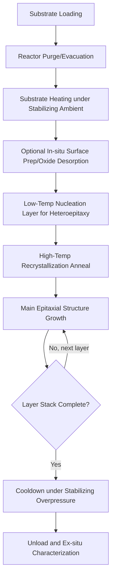

## Metal Organic Chemical Vapor Deposition

### Overview and Fundamental Principle

Metal Organic Chemical Vapor Deposition (MOCVD), also referred to as Metal-Organic Vapor Phase Epitaxy (MOVPE), is a chemical vapor deposition technique in which volatile metal-organic compounds and hydride gases react and decompose at a heated substrate surface to grow single-crystal compound semiconductor epitaxial layers. MOCVD is the dominant industrial method for high-volume production of III-V and III-nitride optoelectronic and RF/power devices.

**Key Points**

- Uses metal-organic precursors (e.g., trimethylgallium, trimethylindium, trimethylaluminum) as group III sources rather than elemental effusion cells (MBE) or halide chemistry (HVPE)
- Operates at atmospheric or reduced pressure, avoiding the ultra-high vacuum infrastructure required by MBE
- Offers high throughput via multi-wafer reactor configurations, making it the industrial workhorse for LEDs, laser diodes, GaN power/RF devices, and solar cell epitaxial stacks
- Achieves compositional and doping abruptness sufficient for quantum well and heterostructure devices, though generally somewhat less atomically abrupt than MBE

### Precursor Chemistry

**Key Points**

- **Group III metal-organic precursors**: Trimethylgallium (TMGa), triethylgallium (TEGa), trimethylindium (TMIn), trimethylaluminum (TMAl) — liquid or low-melting-point solid compounds with sufficient vapor pressure for controlled delivery via bubblers
- **Group V/nitride hydride precursors**: Arsine (AsH₃), phosphine (PH₃), ammonia (NH₃, for nitrides) — delivered as gases directly from cylinders, typically diluted for safety
- **Dopant precursors**: Silane (SiH₄) or disilane (Si₂H₆) for n-type doping; bis-cyclopentadienyl magnesium (Cp₂Mg) for p-type doping in nitrides; diethylzinc (DEZn) for p-type doping in arsenides/phosphides
- **Carrier gases**: Hydrogen (H₂) or nitrogen (N₂), selected based on material system (e.g., N₂ often preferred for nitride growth to reduce parasitic gas-phase reactions)

The overall pyrolytic decomposition reaction for GaAs growth from TMGa and arsine can be represented as:

$$Ga(CH_3)_3 + AsH_3 \rightarrow GaAs + 3CH_4$$

For GaN growth from TMGa and ammonia:

$$Ga(CH_3)_3 + NH_3 \rightarrow GaN + 3CH_4$$

### Precursor Delivery: The Bubbler System

**Process Sequence:**

1. Liquid or low-vapor-pressure solid metal-organic precursors are held in stainless steel bubbler vessels submerged in a temperature-controlled bath, fixing the precursor's equilibrium vapor pressure
2. A carrier gas (H₂ or N₂) is bubbled through (or passed over, for vapor-draw configurations) the liquid precursor, becoming saturated with precursor vapor at the bubbler's controlled temperature and pressure
3. A mass flow controller (MFC) on the carrier gas line, combined with a back-pressure regulator on the bubbler, precisely determines the entrained precursor molar flow rate delivered downstream
4. The precursor-laden carrier gas is combined with dilution gas and routed to the reactor injection manifold, where it is kept separate from group V/hydride lines until just before the substrate to prevent premature gas-phase reaction

**Key Points**

- Precursor delivery precision directly determines epitaxial layer composition and thickness reproducibility, making bubbler temperature/pressure stability a critical process control parameter
- Vapor pressure of each metal-organic precursor follows an Antoine-type temperature dependence, requiring precise thermal bath regulation (often ±0.1°C) for run-to-run reproducibility

### Reactor Architecture

**Key Points**

- **Horizontal reactors**: Gas flows horizontally over a tilted or rotating susceptor; historically common but subject to boundary layer thickness variation along the flow direction, requiring susceptor tilt or rotation compensation
- **Vertical/rotating-disk reactors**: Gas flows downward onto a rapidly rotating susceptor, using rotation-induced forced convection to create a highly uniform, thin boundary layer for improved composition and thickness uniformity
- **Close-coupled showerhead (CCS) reactors**: Precursor gases are injected through a closely spaced showerhead directly above the susceptor, minimizing gas-phase residence time and parasitic pre-reactions, widely used in high-volume nitride LED production
- **Planetary reactors**: Multiple wafers on individual rotating satellite susceptors within a larger rotating carrier disk, combining high wafer capacity with good run-to-run and within-wafer uniformity
- Susceptor material is typically SiC-coated graphite, chosen for high-temperature stability, chemical inertness to precursor gases, and efficient RF-induction or resistive heating coupling

### Reactor Configuration Diagram (svg_diagram)

<svg xmlns="http://www.w3.org/2000/svg" viewBox="0 0 640 340">
<text x="320" y="24" font-size="16" font-family="sans-serif" text-anchor="middle" font-weight="bold">Close-Coupled Showerhead MOCVD Reactor (svg_diagram)</text>

<rect x="140" y="50" width="360" height="250" fill="none" stroke="#333" stroke-width="2" />

<rect x="160" y="70" width="320" height="30" fill="#cfd8dc" stroke="#000" />
<text x="320" y="90" font-size="11" text-anchor="middle" font-family="sans-serif">Showerhead Injector (Group III / Group V separated)</text>

<line x1="200" y1="100" x2="200" y2="160" stroke="#c0392b" stroke-width="1" stroke-dasharray="3,2" />
<line x1="260" y1="100" x2="260" y2="160" stroke="#2980b9" stroke-width="1" stroke-dasharray="3,2" />
<line x1="320" y1="100" x2="320" y2="160" stroke="#c0392b" stroke-width="1" stroke-dasharray="3,2" />
<line x1="380" y1="100" x2="380" y2="160" stroke="#2980b9" stroke-width="1" stroke-dasharray="3,2" />
<line x1="440" y1="100" x2="440" y2="160" stroke="#c0392b" stroke-width="1" stroke-dasharray="3,2" />

<ellipse cx="320" cy="200" rx="150" ry="20" fill="#f0c987" stroke="#000" stroke-width="1.5" />
<text x="320" y="205" font-size="11" text-anchor="middle" font-family="sans-serif">Rotating Susceptor (SiC-coated graphite)</text>

<circle cx="250" cy="198" r="12" fill="#a8d5ba" stroke="#000" />
<circle cx="320" cy="196" r="12" fill="#a8d5ba" stroke="#000" />
<circle cx="390" cy="198" r="12" fill="#a8d5ba" stroke="#000" />

<path d="M 460 200 A 20 8 0 1 1 460 199" fill="none" stroke="#000" stroke-width="1.5" marker-end="url(#arrow)" />

<rect x="220" y="230" width="200" height="20" fill="#e74c3c" stroke="#000" />
<text x="320" y="245" font-size="10" text-anchor="middle" font-family="sans-serif" fill="#fff">RF Induction / Resistive Heater</text>

<line x1="140" y1="290" x2="80" y2="290" stroke="#333" stroke-width="2" />
<text x="80" y="280" font-size="10" font-family="sans-serif">To exhaust/scrubber</text>
</svg>

### Growth Process Sequence

**Process Sequence:**

1. Substrate is loaded and the reactor is purged/evacuated to remove ambient air and moisture
2. Substrate is heated under a stabilizing ambient (e.g., H₂ for arsenides, NH₃ overpressure for nitrides to prevent thermal decomposition) to the target growth temperature
3. Optional in-situ surface preparation: thermal desorption of native oxide or a brief vapor etch step
4. Nucleation/buffer layer growth: for heteroepitaxial systems (e.g., GaN-on-sapphire), a low-temperature nucleation layer (AlN or GaN, ~500–600°C) is deposited first to accommodate lattice/thermal mismatch, followed by a high-temperature (~1000–1100°C) recrystallization step
5. Main epitaxial structure growth: precursor flows are sequenced and modulated according to the target layer stack (composition, thickness, doping), with real-time flow/pressure control synchronized to layer transitions
6. Post-growth cooldown under an appropriate stabilizing overpressure to prevent surface/interface decomposition
7. Ex-situ characterization: photoluminescence, X-ray diffraction, and Hall measurements verify layer quality, composition, and electrical properties

### Critical Process Parameters

**Key Points**

- **V/III ratio**: The molar ratio of group V to group III precursor flow; controls surface stoichiometry, morphology, and point defect incorporation. Nitride growth typically requires very high V/III ratios (often >1000) due to relatively low NH₃ pyrolysis efficiency compared to arsine/phosphine
- **Growth temperature**: Determines precursor pyrolysis efficiency, surface adatom mobility, and dopant incorporation behavior; must balance decomposition completeness against thermal budget and interdiffusion concerns
- **Reactor pressure**: Atmospheric-pressure MOCVD (APMOCVD) offers simpler hardware; reduced-pressure MOCVD (RP-MOCVD) improves gas-phase uniformity and reduces parasitic pre-reactions, particularly important for nitride growth where gas-phase GaN/AlN particulate formation is a known concern
- **Precursor partial pressure and flow ratios**: Directly set ternary/quaternary alloy composition (e.g., indium content in InGaN, aluminum content in AlGaAs) via the relative flow rates of the respective metal-organic sources

### Growth Kinetics Regimes

**Key Points**

- At lower substrate temperatures, growth is **reaction-rate (kinetically) limited**: growth rate depends exponentially on temperature through precursor pyrolysis and surface reaction kinetics
- At higher substrate temperatures, growth becomes **mass-transport limited**: precursor diffusion through the boundary layer above the substrate governs growth rate, which becomes largely temperature-insensitive but sensitive to reactor gas flow dynamics and geometry
- Operating within the mass-transport-limited regime is generally preferred industrially, since growth rate uniformity becomes primarily a function of controllable flow/geometry parameters rather than more difficult-to-uniformly-control substrate temperature
- Excessively high temperatures can promote parasitic gas-phase nucleation (homogeneous reaction before reaching the substrate), producing particulates that degrade surface morphology

### Parasitic Reactions and Reactor Design Mitigation

**Key Points**

- Group III metal-organics and group V hydrides can react prematurely in the gas phase if mixed too early or held too long at elevated temperature before reaching the substrate, consuming precursor and generating particulates ("parasitic pre-reaction")
- Close-coupled showerhead designs minimize gas residence time between injection and the substrate surface, directly suppressing this effect
- Separate injection of group III and group V species (rather than pre-mixing) is a standard mitigation strategy across most modern reactor architectures
- For nitride growth, ammonia's relatively low cracking efficiency at typical growth temperatures necessitates very high NH₃ flow (high V/III ratio) to supply sufficient active nitrogen species at the growth surface

### Comparison of MOCVD Reactor Types

| Reactor Type | Uniformity Mechanism | Typical Wafer Capacity | Common Application |
| --- | --- | --- | --- |
| Horizontal | Susceptor tilt/rotation | Low–moderate | Legacy/research systems |
| Vertical rotating-disk | High-speed rotation-induced forced convection | Moderate | High-uniformity research and production |
| Close-coupled showerhead | Minimized gas residence time | Moderate–high | High-volume nitride LED/power device production |
| Planetary | Dual rotation (satellite + carrier) | High (many wafers per run) | High-volume commercial production |

### Applications by Device Type

**Key Points**

- **Visible and UV LEDs**: InGaN/GaN multi-quantum-well active regions grown on sapphire, SiC, or Si substrates, representing MOCVD's largest-volume commercial application
- **Laser diodes**: InGaAsP/InP for telecom wavelengths (1310/1550 nm) and InGaN/GaN for blue laser diodes (e.g., optical storage, projection displays)
- **RF and power GaN devices**: AlGaN/GaN HEMT epitaxial structures on SiC or Si substrates for 5G infrastructure and power conversion applications
- **Photovoltaics**: Multi-junction III-V solar cell epitaxial stacks (e.g., GaInP/GaAs/Ge) for space and concentrator photovoltaic applications
- **Advanced CMOS**: Selective epitaxial growth for compound semiconductor integration and III-V-on-silicon research for future logic/photonic co-integration

### Process Flow Diagram

### Common Defects and Characterization

**Key Points**

- **Threading dislocations**: Particularly prevalent in heteroepitaxial nitride-on-foreign-substrate growth due to large lattice/thermal mismatch; quantified via etch pit density or cross-sectional TEM
- **Surface morphology defects (pits, hillocks)**: Arise from non-optimal V/III ratio, temperature non-uniformity, or particulate contamination from parasitic gas-phase reactions
- **Compositional non-uniformity**: Wafer-to-wafer or within-wafer variation in ternary alloy composition, detected via photoluminescence mapping or X-ray diffraction reciprocal space mapping
- **Carbon and oxygen incorporation**: Unintentional impurity incorporation from incomplete methyl group (CH₃) desorption or ambient contamination, affecting background doping and compensation
- Standard characterization suite: photoluminescence (PL) for optical/compositional uniformity, high-resolution XRD for strain and composition, Hall effect measurements for electrical properties, and atomic force microscopy (AFM) for surface morphology

### Next Steps

- **III-Nitride Nucleation Layer Engineering for Heteroepitaxy**
- **Reactor Design Optimization: Boundary Layer Theory in Rotating-Disk Systems**
- **Multi-Quantum-Well LED Active Region Design**
- **AlGaN/GaN HEMT Epitaxial Structure and 2DEG Formation**
- **Comparison of Epitaxial Techniques: MOCVD vs. MBE vs. HVPE**
- **Multi-Junction III-V Solar Cell Epitaxial Stack Design**
- **In-Situ Metrology for MOCVD: Reflectometry and Pyrometry**
- **Selective Area Epitaxy and Pattern-Dependent Growth Effects**