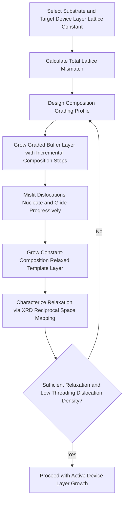

## Strained and Relaxed Epitaxial Layers

### Overview and Fundamental Principle

When a crystalline epitaxial layer is grown atop a substrate with a different natural lattice constant, the deposited layer initially adopts the in-plane lattice constant of the substrate rather than its own equilibrium value. This forced lattice distortion stores elastic strain energy within the film. Depending on layer thickness, lattice mismatch magnitude, and growth conditions, this strain either remains fully accommodated elastically (**pseudomorphic/strained** growth) or is partially released through the introduction of misfit dislocations (**relaxed** growth). Both regimes are deliberately engineered in modern semiconductor devices to tailor electronic and optical properties.

**Key Points**

- Strain engineering directly modifies band structure, carrier mobility, and effective mass, making it a core tool in advanced CMOS and compound semiconductor device design
- The degree of strain relaxation is governed by the interplay between elastic strain energy accumulation and the energetic cost of dislocation formation
- Applications span strained-Si/SiGe CMOS channels, pseudomorphic HEMT structures, and metamorphic buffer layers for lattice-mismatched device integration

### Lattice Mismatch and Strain Fundamentals

**Key Points**

- Lattice mismatch $f$ between an epitaxial layer (lattice constant $a_{epi}$) and substrate (lattice constant $a_{sub}$) is defined as:

$$f = \frac{a_{epi} - a_{sub}}{a_{sub}}$$

- When $f > 0$ (epitaxial material has a larger natural lattice constant, e.g., Ge on Si), the constrained film experiences **in-plane compressive strain**
- When $f < 0$ (epitaxial material has a smaller natural lattice constant), the film experiences **in-plane tensile strain**
- For thin pseudomorphic films, the in-plane strain $\varepsilon_{\parallel}$ equals the lattice mismatch magnitude, while the out-of-plane lattice constant distorts according to Poisson's ratio $\nu$ of the material via tetragonal distortion:

$$\varepsilon_{\perp} = -\frac{2\nu}{1-\nu}\varepsilon_{\parallel}$$

- This tetragonal distortion (in-plane and out-of-plane lattice constants differing) is directly measurable via high-resolution X-ray diffraction reciprocal space mapping

### Pseudomorphic (Strained) Growth Regime

**Key Points**

- Below a critical thickness $h_c$, the epitaxial layer accommodates the full lattice mismatch through elastic (coherent) strain, with no misfit dislocations at the interface
- The film's in-plane lattice constant matches the substrate exactly; all mismatch strain energy is stored as elastic energy within the crystal lattice
- Pseudomorphic layers exhibit no dislocation-related defects, provided growth remains below $h_c$, making this regime highly desirable for active device layers requiring low defect density
- As thickness increases toward $h_c$, accumulated strain energy per unit area grows linearly with thickness, eventually favoring dislocation nucleation as the energetically lower-cost strain relief mechanism

### Critical Thickness Models

**Key Points**

- **Matthews-Blakeslee model**: Based on mechanical equilibrium of a threading dislocation under the combined force of misfit strain and dislocation line tension; predicts the thickness at which existing threading dislocations become energetically favorable to glide and deposit misfit segments
- **People-Bean model**: Based on energy balance between accumulated strain energy and the self-energy of an isolated misfit dislocation; tends to predict a somewhat larger critical thickness than Matthews-Blakeslee for a given mismatch
- Both models predict that critical thickness decreases sharply (roughly inversely) as lattice mismatch increases, meaning highly mismatched systems (e.g., Ge on Si, ~4% mismatch) support only very thin pseudomorphic layers, while near-lattice-matched systems (e.g., AlGaAs on GaAs) can remain pseudomorphic to much greater thicknesses
- Real critical thickness values observed experimentally often exceed theoretical equilibrium predictions due to kinetic barriers to dislocation nucleation and glide at typical growth temperatures, meaning metastable strained layers can persist beyond the equilibrium-predicted $h_c$ [Inference: the degree of kinetic metastability is process- and temperature-dependent and cannot be generalized to a fixed factor across material systems]

### Relaxed (Metamorphic) Growth Regime

**Process Sequence (Metamorphic Buffer Approach):**

1. Beyond the critical thickness, continued growth results in the nucleation of **misfit dislocations** at the epitaxial layer/substrate interface, which glide to relieve accumulated strain
2. In deliberately engineered metamorphic buffers, composition is graded gradually (e.g., linearly increasing indium content in InGaAs on GaAs) over a thick buffer layer, distributing the total mismatch across a gradual composition ramp rather than an abrupt interface
3. Gradual grading spreads dislocation nucleation over a greater growth thickness and reduces the density of dislocations that thread vertically into the active device region above the buffer
4. A final constant-composition "relaxed" template layer, matched to the desired device layer's target lattice constant, is grown atop the graded buffer, providing a fully relaxed platform for subsequent device layer growth

**Key Points**

- Threading dislocation density in relaxed layers is a critical quality metric, since dislocations act as non-radiative recombination centers (degrading optoelectronic device performance) and scattering centers (degrading carrier mobility)
- Compositionally graded buffers ("metamorphic buffers") are the standard industrial approach to achieve low-threading-dislocation-density relaxed templates for lattice-mismatched device integration
- Relaxation is rarely 100% complete in practice; **residual strain** typically remains and must be characterized (e.g., via XRD reciprocal space mapping) to quantify effective relaxed lattice constant

### Strain Engineering Diagram (svg_diagram)

<svg xmlns="http://www.w3.org/2000/svg" viewBox="0 0 640 380">
<text x="320" y="24" font-size="15" font-family="sans-serif" text-anchor="middle" font-weight="bold">Pseudomorphic vs. Relaxed Epitaxy (svg_diagram)</text>

<text x="150" y="55" font-size="13" text-anchor="middle" font-family="sans-serif" font-weight="bold">Pseudomorphic (below h_c)</text>

<rect x="60" y="70" width="180" height="60" fill="`#f7d6a3`" stroke="#000" />

<text x="150" y="105" font-size="10" text-anchor="middle" font-family="sans-serif">Epitaxial Layer (strained, coherent)</text>

<rect x="60" y="130" width="180" height="80" fill="`#c9c9c9`" stroke="#000" />

<text x="150" y="175" font-size="10" text-anchor="middle" font-family="sans-serif">Substrate</text>

<line x1="60" y1="130" x2="240" y2="130" stroke="#000" stroke-width="2.5" />

<text x="150" y="225" font-size="9" text-anchor="middle" font-family="sans-serif" font-style="italic">No misfit dislocations at interface</text>

<text x="480" y="55" font-size="13" text-anchor="middle" font-family="sans-serif" font-weight="bold">Relaxed (above h_c)</text>

<rect x="390" y="70" width="180" height="60" fill="`#a8d5ba`" stroke="#000" />

<text x="480" y="105" font-size="10" text-anchor="middle" font-family="sans-serif">Relaxed Device Layer</text>

<rect x="390" y="130" width="180" height="50" fill="`#f0c987`" stroke="#000" />

<text x="480" y="150" font-size="9" text-anchor="middle" font-family="sans-serif">Graded/Metamorphic Buffer</text>

<rect x="390" y="180" width="180" height="30" fill="`#c9c9c9`" stroke="#000" />

<text x="480" y="200" font-size="10" text-anchor="middle" font-family="sans-serif">Substrate</text>

<line x1="410" y1="130" x2="420" y2="120" stroke="#c0392b" stroke-width="2" />
<line x1="450" y1="150" x2="460" y2="140" stroke="#c0392b" stroke-width="2" />
<line x1="500" y1="145" x2="510" y2="135" stroke="#c0392b" stroke-width="2" />
<line x1="540" y1="130" x2="550" y2="120" stroke="#c0392b" stroke-width="2" />
<text x="480" y="225" font-size="9" text-anchor="middle" font-family="sans-serif" font-style="italic">Misfit dislocations relieve strain</text>
</svg>

### Strain Effects on Band Structure and Carrier Transport

**Example**

For strained silicon grown pseudomorphically on relaxed SiGe, the biaxial tensile strain lifts the six-fold degeneracy of the silicon conduction band valleys, splitting them into two lower-energy out-of-plane valleys ($\Delta_2$) and four higher-energy in-plane valleys ($\Delta_4$). This splitting:

- Reduces intervalley phonon scattering (since fewer degenerate valleys are available for electrons to scatter between)
- Reduces the conductivity effective mass in the transport direction for the populated valleys

The combined effect is enhanced electron mobility, historically exploited in strained-silicon CMOS technology nodes to boost NMOS drive current without geometric scaling.

**Key Points**

- Compressive strain (e.g., from SiGe source/drain stressors) enhances hole mobility in PMOS by similarly modifying the valence band light-hole/heavy-hole degeneracy and warping
- Biaxial (global) strain from a relaxed SiGe virtual substrate historically enabled strained-Si CMOS; uniaxial (local) strain from embedded source/drain SiGe or SiC stressors is dominant in modern advanced-node CMOS due to superior scalability and reduced impact on short-channel behavior
- Strain magnitude and direction (biaxial vs. uniaxial, tensile vs. compressive) must be tailored independently for NMOS (tensile preferred) and PMOS (compressive preferred), driving dual-stressor CMOS integration schemes

### Pseudomorphic HEMT (pHEMT) Structures

**Key Points**

- Pseudomorphic High Electron Mobility Transistors deliberately grow a thin, strained InGaAs channel layer (indium content beyond what would be lattice-matched to GaAs) between GaAs or AlGaAs barrier layers
- The strained InGaAs channel, kept below its critical thickness, offers a narrower bandgap and superior electron transport properties compared to lattice-matched GaAs or AlGaAs channels
- Higher indium content improves electron mobility and saturation velocity but reduces the achievable channel thickness before strain relaxation, creating a design trade-off between channel conductivity and reliability against dislocation formation
- pHEMTs are widely used in RF power amplifiers and low-noise amplifiers for wireless communication and satellite systems

### Strain Characterization Techniques

**Key Points**

- **High-resolution X-ray diffraction (HRXRD) reciprocal space mapping**: Directly measures both in-plane and out-of-plane lattice constants, distinguishing fully strained (pseudomorphic), partially relaxed, and fully relaxed layers, and quantifying percent relaxation
- **Raman spectroscopy**: Phonon peak position shifts correlate with strain state, providing a rapid, non-destructive strain assessment technique, particularly common for strained-Si/SiGe characterization
- **Transmission electron microscopy (TEM)**: Direct imaging of misfit and threading dislocations at heteroepitaxial interfaces, providing direct dislocation density and distribution data
- **Etch pit density (EPD)**: Chemical decoration of dislocation termination points at the surface, providing a statistical measure of threading dislocation density across a wafer

### Comparison: Pseudomorphic vs. Relaxed (Metamorphic) Approaches

| Attribute | Pseudomorphic (Strained) | Relaxed (Metamorphic) |
| --- | --- | --- |
| Thickness regime | Below critical thickness $h_c$ | Above $h_c$, with engineered relaxation |
| Dislocation density | None (ideally) at interface | Present; minimized via graded buffers |
| Lattice constant | Matches substrate (constrained) | Approaches native/target value |
| Primary purpose | Band structure engineering, mobility enhancement | Enabling lattice-mismatched device integration |
| Example application | Strained-Si CMOS channels, pHEMT channels | Metamorphic HEMTs, III-V-on-Si buffers |

### Process Flow: Metamorphic Buffer Design

### Applications Summary

**Key Points**

- **Strained-Si/SiGe CMOS**: Global strain via relaxed SiGe virtual substrates (historically) and local uniaxial stressors (modern advanced nodes) to enhance carrier mobility without geometric scaling
- **Pseudomorphic HEMTs**: Strained InGaAs channels for high-mobility RF power and low-noise amplifier devices
- **Metamorphic HEMTs (mHEMTs)**: Relaxed InGaAs/InAlAs buffers on GaAs substrates achieving InP-like channel properties without requiring costly InP substrates
- **III-V-on-Silicon integration**: Metamorphic and strain-engineered buffer layers enabling compound semiconductor device integration on low-cost, large-diameter silicon substrates for future photonic and RF co-integration
- **Quantum dot and quantum well lasers**: Strained active regions to fine-tune emission wavelength and gain characteristics beyond what lattice-matched compositions alone permit

### Next Steps

- **Matthews-Blakeslee and People-Bean Critical Thickness Models in Depth**
- **Selective Epitaxial Growth for Local Strain Engineering in CMOS**
- **Metamorphic Buffer Layer Design for III-V-on-Si Integration**
- **Pseudomorphic and Metamorphic HEMT Device Architectures**
- **X-Ray Diffraction Reciprocal Space Mapping Methodology**
- **Band Structure Modification under Biaxial and Uniaxial Strain**
- **Self-Assembled Quantum Dot Formation via Strain-Driven Growth Modes**
- **Dislocation Dynamics: Nucleation, Glide, and Multiplication Mechanisms**