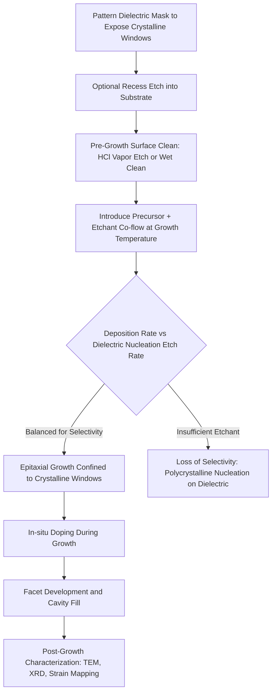

## Selective Epitaxial Growth

### Overview and Fundamental Principle

Selective Epitaxial Growth (SEG) is an epitaxial deposition process in which crystalline semiconductor material is deposited exclusively on exposed single-crystal substrate regions, while remaining absent from adjacent dielectric-masked areas (typically SiO₂ or Si₃N₄). This selectivity is achieved by exploiting the difference in nucleation behavior between crystalline silicon/compound semiconductor surfaces and amorphous dielectric surfaces under carefully controlled process chemistry.

**Key Points**

- Selectivity arises from balancing deposition and etching reactions such that net growth occurs only on crystalline windows, while any nucleation on dielectric surfaces is continuously etched away before it can form a stable film
- Enables localized, three-dimensional epitaxial structures without blanket deposition and subsequent patterning/etching, avoiding etch-induced surface damage in the active device region
- Central to modern advanced CMOS source/drain engineering, elevated source/drain structures, and compound semiconductor device fabrication requiring localized crystal growth
- Distinguished from blanket (non-selective) epitaxy, which deposits uniformly regardless of underlying surface crystallinity

### Selectivity Mechanism

**Key Points**

- Most SEG processes use chlorine-containing precursor chemistry (e.g., dichlorosilane SiH₂Cl₂, or the addition of HCl gas to a silane/germane process) where the chlorine byproduct or co-flowed HCl preferentially etches silicon nuclei that form on the amorphous dielectric surface
- On the crystalline substrate window, epitaxial silicon incorporates into the existing lattice and is comparatively resistant to the same etching chemistry, since it is not present as isolated, weakly bonded nuclei but as an extension of the ordered crystal
- The process window for selectivity is bounded by temperature, pressure, and the ratio of deposition precursor to etchant (HCl) flow: insufficient HCl allows polycrystalline/amorphous nucleation on the dielectric ("loss of selectivity"), while excessive HCl can etch the epitaxial film itself or slow growth rate excessively
- Selectivity is generally easier to maintain at higher temperatures (favoring higher etch rates on dielectric nuclei) but must be balanced against thermal budget constraints in advanced device processing

### Process Chemistry Example

For silicon SEG using dichlorosilane with HCl addition, the net reactions occurring simultaneously are:

**Deposition (occurs preferentially on crystalline Si):**

$$SiH_2Cl_2 \rightarrow Si + 2HCl$$

**Etching (removes nucleation on dielectric and controls net growth):**

$$Si + 2HCl \rightarrow SiCl_2 + H_2$$

The net selective growth condition is achieved when the deposition rate on crystalline silicon exceeds the etch rate, while on the dielectric surface, any nucleated silicon is etched at a rate exceeding its (much slower) nucleation-limited deposition rate.

**Key Points**

- Germane (GeH₄) addition for SiGe SEG requires re-balancing the HCl/precursor ratio, since germanium incorporation alters both nucleation behavior and etch kinetics relative to pure silicon
- Carbon-doped silicon (Si:C) SEG for tensile-strain NMOS engineering similarly requires precursor and etchant balance re-optimization due to the distinct surface chemistry of carbon incorporation

### Facet Formation and Crystallographic Growth Behavior

**Key Points**

- SEG growth rate and resulting morphology are strongly crystallographic-orientation-dependent, since different lattice planes exhibit different surface energies and reaction kinetics
- Growth within a recessed or patterned opening on a (001) silicon substrate commonly develops {111} facets at the edges of the growth window, as these facets often exhibit the lowest growth rate and become growth-rate-limiting exposed surfaces
- Facet formation is both a challenge (potentially reducing usable volume fill in a recessed source/drain cavity, causing "diamond-shaped" cross-sections in SiGe source/drain epitaxy) and a deliberate design tool (some device architectures use faceting to engineer specific proximity and strain-transfer geometries)
- Loading effects (local pattern density dependence of growth rate) arise because reactant consumption and byproduct desorption rates depend on the local density of exposed growth windows, requiring careful reactor and layout-aware process design to maintain uniformity across a chip

### SEG for Strained Source/Drain Engineering

**Process Sequence (Recessed Source/Drain SEG):**

1. Following gate stack formation, source/drain regions are selectively etched (recessed) into the silicon substrate adjacent to the gate, using the gate spacer as a self-aligned mask
2. The wafer surface is prepared with an in-situ or ex-situ clean (e.g., HCl vapor etch or dilute HF) to remove native oxide and residual etch damage from the recessed cavity
3. Selective epitaxial growth deposits a strain-inducing material directly into the recessed cavity: compressively strained SiGe for PMOS (larger lattice constant than Si) or tensile-strained Si:C for NMOS (smaller lattice constant than Si, since carbon is a smaller atom than silicon)
4. In-situ boron doping (for SiGe PMOS source/drain) or in-situ phosphorus/arsenic doping (for Si:C NMOS source/drain) is co-incorporated during growth, reducing subsequent implant/anneal thermal budget requirements
5. The lattice mismatch between the epitaxially grown source/drain material and the channel region transmits compressive (PMOS) or tensile (NMOS) uniaxial strain into the adjacent transistor channel, enhancing carrier mobility

**Key Points**

- This uniaxial, locally applied strain approach has largely supplanted earlier global/biaxial strained-silicon-on-relaxed-SiGe approaches in advanced CMOS nodes, due to superior scalability with continued gate length reduction
- In-situ doping during SEG reduces reliance on high-energy ion implantation into the source/drain region, mitigating implant damage and enabling more abrupt, higher-activation doping profiles
- The recessed cavity depth, facet geometry, and germanium/carbon content are all co-optimized to maximize strain transfer efficiency to the channel while maintaining adequate source/drain series resistance and junction leakage characteristics

### SEG Cross-Section Diagram (svg_diagram)

<svg xmlns="http://www.w3.org/2000/svg" viewBox="0 0 640 340">
<text x="320" y="24" font-size="15" font-family="sans-serif" text-anchor="middle" font-weight="bold">Recessed Source/Drain SEG (svg_diagram)</text>

<rect x="80" y="150" width="480" height="120" fill="#c9c9c9" stroke="#000" stroke-width="1.5" />
<text x="320" y="260" font-size="11" text-anchor="middle" font-family="sans-serif">Silicon Substrate</text>

<rect x="80" y="120" width="140" height="30" fill="#cfd8dc" stroke="#000" />
<rect x="420" y="120" width="140" height="30" fill="#cfd8dc" stroke="#000" />
<text x="150" y="140" font-size="9" text-anchor="middle" font-family="sans-serif">Dielectric Mask</text>
<text x="490" y="140" font-size="9" text-anchor="middle" font-family="sans-serif">Dielectric Mask</text>

<rect x="270" y="90" width="100" height="60" fill="#e0e0e0" stroke="#000" stroke-width="1.5" />
<text x="320" y="120" font-size="10" text-anchor="middle" font-family="sans-serif">Gate</text>
<rect x="255" y="120" width="15" height="30" fill="#cfd8dc" stroke="#000" />
<rect x="370" y="120" width="15" height="30" fill="#cfd8dc" stroke="#000" />

<path d="M 220 150 L 255 150 L 260 130 L 220 130 Z" fill="none" stroke="#999" stroke-width="1" stroke-dasharray="2,2" />

<path d="M 90 150 L 220 150 L 240 115 L 260 150 Z" fill="#a8d5ba" stroke="#000" stroke-width="1.5" />
<path d="M 380 150 L 400 115 L 420 150 L 550 150 Z" fill="#a8d5ba" stroke="#000" stroke-width="1.5" />
<text x="150" y="200" font-size="9" text-anchor="middle" font-family="sans-serif">SiGe or Si:C</text>
<text x="150" y="215" font-size="9" text-anchor="middle" font-family="sans-serif">(faceted SEG,</text>
<text x="150" y="230" font-size="9" text-anchor="middle" font-family="sans-serif">in-situ doped)</text>

<text x="230" y="110" font-size="8" text-anchor="middle" font-family="sans-serif" font-style="italic">{111} facet</text>

<text x="410" y="110" font-size="8" text-anchor="middle" font-family="sans-serif" font-style="italic">{111} facet</text>

<line x1="260" y1="180" x2="290" y2="180" stroke="#c0392b" stroke-width="2" marker-end="url(#arrow2)" />
<line x1="380" y1="180" x2="350" y2="180" stroke="#c0392b" stroke-width="2" marker-end="url(#arrow2)" />
<text x="320" y="195" font-size="9" text-anchor="middle" font-family="sans-serif" fill="#c0392b">Strain transfer to channel</text>
</svg>

### Loading Effects and Pattern Dependence

**Key Points**

- SEG growth rate at a given location depends on the local density of exposed active area within a characteristic diffusion length of reactive species, since precursor consumption by neighboring growth windows depletes local reactant concentration ("micro-loading")
- Isolated active area windows surrounded by wide dielectric fields tend to exhibit different growth rates than densely packed active area windows, due to differing reactant/byproduct transport conditions at each pattern density
- Compensating for loading effects requires either layout-aware process calibration, dummy fill pattern insertion to homogenize local pattern density, or reactor-level process tuning (temperature, pressure, precursor ratio adjustments)
- Uncontrolled loading effects can produce systematic within-die or within-wafer variation in strain magnitude, source/drain resistance, and junction depth across different circuit regions

### SEG in Compound Semiconductor Fabrication

**Key Points**

- SEG techniques extend to III-V compound semiconductor integration, notably for selective-area growth of III-V materials directly on patterned silicon substrates for photonic and RF co-integration research
- Selective growth in compound semiconductor systems can additionally serve to laterally confine and reduce threading dislocation density via epitaxial lateral overgrowth (ELOG/ELO), where growth initiates in narrow open-substrate stripes and subsequently grows laterally over adjacent dielectric masks, bending propagating threading dislocations away from the vertical growth direction
- ELOG is a key technique historically used to reduce dislocation density in GaN-on-sapphire heteroepitaxy for improved laser diode reliability

### Comparison: Selective vs. Blanket (Non-Selective) Epitaxy

| Attribute | Selective Epitaxial Growth (SEG) | Blanket Epitaxy |
| --- | --- | --- |
| Deposition location | Only on exposed crystalline windows | Uniformly across entire wafer surface |
| Post-growth patterning | Not required (self-aligned to mask) | Requires subsequent lithography/etch |
| Etch-induced damage risk | Avoided in active regions | Present if post-growth etch is needed |
| Precursor chemistry | Requires etchant co-flow (e.g., HCl) for selectivity | Standard deposition chemistry, no selectivity requirement |
| Primary application | Recessed source/drain, elevated source/drain, ELOG | Continuous epitaxial layers, blanket doped layers |

### Process Flow Diagram

### Characterization and Process Control

**Key Points**

- **Cross-sectional TEM**: Directly images facet geometry, cavity fill quality, and interface abruptness between the SEG material and surrounding substrate/dielectric
- **X-ray diffraction (XRD)**: Quantifies germanium or carbon content and strain state within the SEG film relative to the substrate
- **Secondary ion mass spectrometry (SIMS)**: Profiles in-situ dopant concentration and abruptness through the grown layer
- **Scanning electron microscopy (SEM)**: Monitors selectivity loss (visible as polycrystalline nucleation/roughness on dielectric-masked regions) and overall growth morphology across process development

### Applications Summary

**Key Points**

- **Advanced CMOS strained source/drain**: SiGe (PMOS) and Si:C (NMOS) recessed source/drain epitaxy for uniaxial channel strain engineering, standard since the 90nm–65nm CMOS technology generations and continuing through FinFET and gate-all-around architectures
- **Elevated source/drain**: SEG used to raise source/drain regions above the original substrate surface, reducing parasitic series resistance in scaled devices with shallow junctions
- **Epitaxial lateral overgrowth (ELOG)**: Dislocation density reduction technique for heteroepitaxial compound semiconductor growth, notably GaN-on-sapphire
- **III-V-on-silicon selective area integration**: Localized compound semiconductor growth on patterned silicon for photonic and RF device co-integration research
- **Bipolar transistor base/emitter formation**: Selective epitaxial base layers in advanced heterojunction bipolar transistor (HBT) processes

### Next Steps

- **Recessed Source/Drain Strain Engineering Process Flow**
- **Epitaxial Lateral Overgrowth (ELOG) for Dislocation Density Reduction**
- **In-Situ Doping Techniques During Epitaxial Growth**
- **Facet Engineering and Crystallographic Growth Rate Anisotropy**
- **Loading Effects and Layout-Aware Process Design**
- **FinFET and Gate-All-Around Source/Drain Epitaxy Considerations**
- **Heterojunction Bipolar Transistor (HBT) Base Epitaxy**
- **Strain Characterization via TEM and XRD Reciprocal Space Mapping**